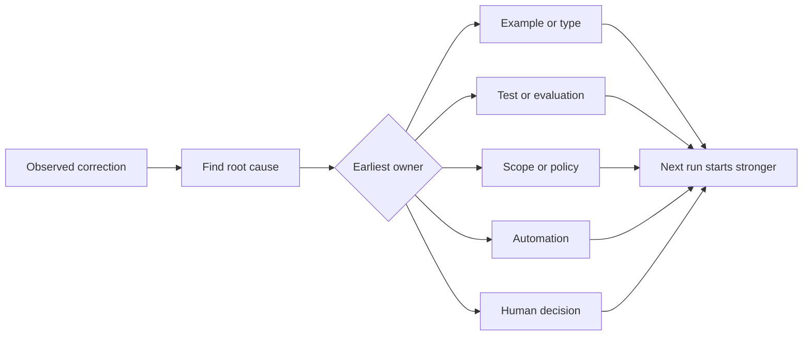

# प्रत्येक एजेंट सुधार को सिस्टम सुधार में बदलें

> एक सुधार जो केवल चैट में रहता है, एक रन को ठीक करता है। एक सुधार को एक परीक्षण, सीमा, उदाहरण या उपकरण में बढ़ावा दिया जाता है, प्रत्येक बाद में रन में सुधार होता है।

**Type:** Learn + Build
**Languages:** Python (stdlib)
**Prerequisites:** Phase 14 lessons 37 to 41
**Time:** ~65 minutes

## सीखने के लक्ष्य

- एजेंट सुधारों को टिकाऊ नियंत्रण में परिवर्तित करें।
- प्रत्येक नियंत्रण को सबसे पहले परत पर रखें जो पुनरावृत्ति को रोक सकता है।
- स्थिर फिंगरप्रिंट के साथ दोहराए गए पाठों को दोहराएं।
- नियंत्रणों को रिटायर करें जो अब वास्तविक जोखिम की रक्षा नहीं करते हैं।

## सुधार सबूत हैं

जब आप किसी एजेंट को ऐसी फ़ाइल को संपादित न करें कहते हैं, तो आपने सीखा है कि दायरे की सीमा निष्पादित नहीं की जा सकती है। जब आप कहते हैं यह आउटपुट आकार गलत है, तो आपने सीखा है कि एक उदाहरण या परीक्षण गायब था। जब सेटअप फिर से विफल होता है, तो आपने सीखा है कि पर्यावरण ज्ञान स्वचालन में आता है।

सुधार को कार्य प्रणाली के बारे में एक टिप्पणी के रूप में देखें, न कि शीघ्र लिखित विफलता के रूप में।

## सबसे पहले प्रभावी परत तक पहुंचें

इस क्रम का प्रयोग करेंः

| Recurring failure | Durable destination |
|---|---|
| Wrong result or regression | Test or evaluation |
| Off-scope or unsafe action | Scope or permission policy |
| Repeated setup or command mistake | Automation or tool |
| Repeated output-format mistake | Canonical example plus validator |
| Ambiguous local convention | Instruction with a scenario check |
| Product disagreement | Human decision record |

पहले के नियंत्रण सस्ते होते हैं। एक प्रकार जो अमान्य स्थिति को रोकता है, वह समीक्षा टिप्पणी से अधिक मजबूत होता है जो बाद में इसे पकड़ लेता है। एक केंद्रित परीक्षण पैराग्राफ से अधिक मजबूत होता है जो एजेंट को याद करने के लिए कहता है।



## रचेट रिकॉर्ड

पकड़ः

- लक्षण;
- मूल कारण;
- परिणाम;
- पुनरावृत्ति संख्या;
- चयनित नियंत्रण;
- नियंत्रण के लिए सत्यापन;
- मालिक;
- इसकी समीक्षा या रिटायरमेंट की तारीख।

प्रत्येक एक बार की प्राथमिकता को बढ़ावा न दें, बल्कि सुधार को बढ़ावा दें जब पुनरावृत्ति या परिणाम स्थायी जटिलता को उचित ठहराता है।

## लक्षण से अलग कारण

README में सम्पादित एजेंट एक लक्षण है। संभावित कारणों में शामिल हैंः

- कार्य ने भंडारण रूट की अनुमति दी;
- डॉक्स को अप्रत्यक्ष रूप से सुरक्षित माना गया था;
- योजना के बंडल कार्यान्वयन और प्रलेखन;
- दो श्रमिकों के स्वामित्व में ओवरलैप था।

प्रत्येक कारण एक अलग नियंत्रण से संबंधित है। एक नियम जो केवल लक्षण को दोहराता है, अगले थोड़ा अलग मामले में विफल हो जाएगा।

## नियंत्रण भी बिगड़ रहा है

पुराने नियंत्रण संघर्ष कर सकते हैं, संदर्भ को फुला सकते हैं, और एक प्रणाली को एन्कोड कर सकते हैं जो अब मौजूद नहीं है। प्रत्येक प्रचारित नियम को एक सेवानिवृत्ति जांच की आवश्यकता होती है। जबः

- अंतर्निहित वास्तुकला बदल गई है;
- इसे एक मजबूत निष्पादन योग्य नियंत्रण द्वारा प्रतिस्थापित किया गया है;
- विफलता एक सार्थक विंडो के माध्यम से दोहराया नहीं गया है;
- नियंत्रण इससे होने वाले जोखिम से अधिक घर्षण पैदा करता है।

लक्ष्य सबसे लंबी निर्देश फ़ाइल नहीं है, यह सबसे छोटी प्रणाली है जो कठिन से प्राप्त निर्णय को संरक्षित करती है।

## इसे बनाओ

प्रयोगशाला सुधारों को वर्गीकृत करती है, उन्हें नियंत्रण में बढ़ावा देती है, फिंगरप्रिंट डुप्लिकेट करती है, और लिखती है `outputs/feedback-ratchet.json`. .

दौड़ें:

```bash
python3 code/main.py
python3 -m unittest discover code/tests -v
```

एक ही कारण के साथ दो अलग-अलग रूपों में सुधार जोड़ें। एक ही नियंत्रण में बिना किसी असंगत विफलता के गिरने तक सामान्यीकरण में सुधार करें।

## व्यायाम

1. हाल ही में एक कोडिंग सत्र से पांच सुधार लें और उनके वास्तविक मालिकों को वर्गीकृत करें।
2. एक प्रोजा नियम को निष्पादित करने योग्य परीक्षण से प्रतिस्थापित करें।
3. परिणाम भार जोड़ें ताकि गंभीर पहली घटना को तुरंत बढ़ावा दिया जा सके।
4. प्रयोगशाला आउटपुट में एक मालिक और सेवानिवृत्ति की तारीख जोड़ें।
5. एक मौजूदा एजेंट निर्देश की समीक्षा करें और इसे केवल मजबूत नियंत्रण के अस्तित्व को साबित करने के बाद हटा दें।

## आगे पढ़ना

- [Basili, Caldiera, and Rombach, The Goal Question Metric Approach](https://www.cs.toronto.edu/~sme/CSC444F/handouts/GQM-paper.pdf), उद्देश्यों को प्रश्नों और परिचालन मापों में बदलने के लिए।
- [Shinn et al., Reflexion](https://arxiv.org/abs/2303.11366), मॉडल वजन को बदलने के बिना बाद के निर्णयों को बेहतर बनाने के लिए प्रतिक्रिया के निशान का उपयोग करने के लिए।
- [Madaan et al., Self-Refine](https://arxiv.org/abs/2303.17651), कार्य लूप के भीतर पुनरावृत्ति प्रतिक्रिया और संशोधन के लिए।

## जो आप रखते हैं

रखो`outputs/feedback-ratchet.json`यह एजेंट-एस्पिड्ड इंजीनियरिंग पथ का स्थायी अंत और भविष्य के कार्यक्षेत्र परिवर्तनों के लिए इनपुट है।
