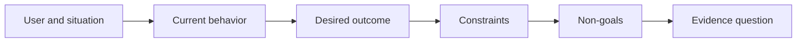

# आउटपुट चुनने से पहले परिणाम को परिभाषित करें

> जल्दी से लागू करने से गलत समस्या चुनने पर जुर्माना बढ़ जाता है। पहले परिणाम को आकार दें ताकि सही दिशा में गति इंगित की जा सके।

**Type:** Learn + Build
**Languages:** Python (stdlib)
**Prerequisites:** None
**Time:** ~60 minutes

## सीखने के लक्ष्य

- समाधान का नाम दिए बिना परिणाम फ्रेम लिखें।
- उपयोगकर्ता, स्थिति, वर्तमान व्यवहार और वांछित परिवर्तन की पहचान करें।
- प्रतिबंध और गैर-लक्ष्य स्पष्ट करें।
- समाधान को कठोर करने से पहले समाधान के रिसाव का पता लगाएं।

## परिणाम परिणाम नहीं है

एक घटना सहायक का निर्माण करेंआउटपुट का नाम देता है। यह नहीं कहता है कि इसकी आवश्यकता किसके लिए है, क्या बेहतर हो जाता है, या क्या सुरक्षित रहना चाहिए।

एक परिणाम फ्रेम कहता हैः

> जब उत्पादन अलर्ट आता है, तो कॉल पर इंजीनियर विफल सेवा और एक सुरक्षित अगली कार्रवाई की पहचान दो मिनट के भीतर करता है, जबकि निदान केवल पढ़ने और ऑडिट करने योग्य रहता है।

उस वाक्य को सॉफ्टवेयर, रनबुक, डेटा मरम्मत या छोटे इंटरफेस परिवर्तन से संतुष्ट किया जा सकता है। यह टीम को किसी ने कल्पना की पहली कलाकृतियों की बजाय परिणाम से जुड़ा रखता है।

## छठ भागों का फ्रेम

| Part | Question |
|---|---|
| User | Who experiences the problem directly? |
| Situation | When and where does it occur? |
| Current behavior | What happens today, including workarounds? |
| Desired outcome | What observable state should improve? |
| Constraints | Which safety, policy, cost, or compatibility limits are fixed? |
| Non-goals | What tempting adjacent work is excluded? |



## समाधान लीक ढूंढें

परिणाम कथन समाधान लीक करते हैं जब उनमें उत्पाद रूप, इंटरफ़ेस, मॉडल विकल्प, ढांचा या वास्तुकला होता है जो सबूतों से प्राप्त नहीं किया गया है।

- उपयोगकर्ताओं को साप्ताहिक एआई सारांश मिलता है सारांश और कैडेन्स लीक होता है।
- उपयोगकर्ता खाता परिवर्तनों को मंजूरी से पहले समझते हैं परिणाम का उल्लेख करते हैं।
- वेक्टर डेटाबेस को तैनात करें बुनियादी ढांचे का लीक।
- परीक्षण के दौरान प्रासंगिक नीतिगत साक्ष्य उपलब्ध हैं क्षमता का उल्लेख करता है।

जब संगतता वास्तव में इसे ठीक करती है तो प्रतिबंध प्रौद्योगिकी का नाम ले सकते हैं।

## बाधाएं परिणाम की रक्षा करती हैं

प्रतिबंध कार्यान्वयन विवरण नहीं हैं वे वास्तविक दुनिया के लक्ष्य का हिस्सा हैंः

- निदान के दौरान कोई उत्पादन नहीं लिखता है;
- घटना समय के बजट के भीतर प्रतिक्रिया;
- मौजूदा लेखा परीक्षा कार्यक्रम प्रामाणिक रहते हैं;
- कोई नई रनटाइम निर्भरता नहीं;
- पहुंच व्यवहार बरकरार रहता है।

एक निर्माण जो किसी प्रतिबन्ध का उल्लंघन करके परिणाम तक पहुंचता है, परिणाम तक नहीं पहुंचता है।

## गैर-उद्देश्य सीमाएँ निर्धारित करते हैं

गैर-लक्ष्य एक उपयोगी स्लाइस को मंच में बदलने से रोकते हैं। अच्छे गैर-लक्ष्य कार्य को अस्वीकार करने के लिए पर्याप्त ठोस होते हैंः

- कोई स्वचालित उपचार नहीं;
- कोई नया अलर्ट-रूटिंग सिस्टम नहीं;
- घटना के कमांडर का प्रतिस्थापन नहीं किया गया;
- इस स्लाइस में कोई ऐतिहासिक विश्लेषण नहीं है।

## इसे बनाओ

प्रयोगशाला एक वैधता प्रदान करती है`OutcomeFrame`और लिखता है `outputs/outcome-frame.json`. .

```bash
python3 code/main.py
python3 -m unittest discover code/tests -v
```

वांछित परिणाम को इंसेंट असिस्टेंट का उपयोग करके बदलें। सत्यापितकर्ता को यह चिह्नित करना चाहिए कि प्रस्तावित आउटपुट परिणाम में लीक हो गया है।

## व्यायाम

1. अपने बैकलॉग से एक फीचर अनुरोध को परिणाम फ्रेम के रूप में फिर से लिखें।
2. एक प्रतिबंध जोड़े जो परिवर्तन करता है कि कौन से समाधान संभव हैं।
3. दो गैर-गोल जोड़ें जो पहले स्लाइस को छोटा बनाए रखें।
4. वांछित परिणाम को खंडन करने वाली सबसे शुरुआती अवलोकन की पहचान करें।
5. तीन अलग-अलग आउटपुट लिखें जो एक ही परिणाम को संतुष्ट कर सकते हैं।

## आगे पढ़ना

- [Nuseibeh and Easterbrook, Requirements Engineering: A Roadmap](https://www.cs.toronto.edu/~sme/papers/2000/ICSE2000.pdf), वास्तविक दुनिया के लक्ष्यों को सॉफ्टवेयर काम के लिए एंकर के रूप में इलाज के लिए.
- [Dardenne, van Lamsweerde, and Fickas, Goal-Directed Requirements Acquisition](https://doi.org/10.1016/0167-6423(93)90021-जी), उच्च स्तरीय लक्ष्यों को प्रतिबंधों और परिचालन आवश्यकताओं में परिष्कृत करने के लिए।

## जो आप रखते हैं

रखो`outputs/outcome-frame.json`. अगले पाठ में यह लोगों के कार्यप्रवाह के साथ परीक्षण करता है वास्तव में प्रदर्शन.
