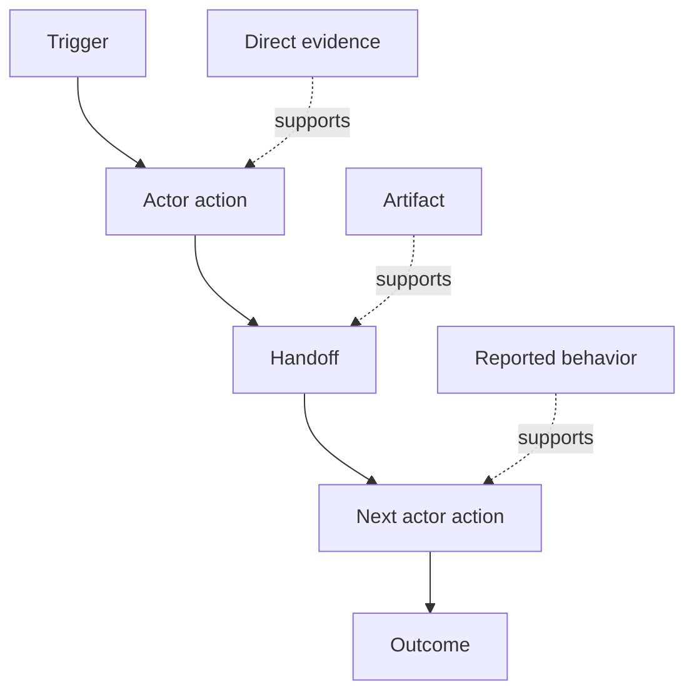

# पता लगाएं कि लोग वास्तव में किस कार्यप्रवाह को करते हैं

> आवश्यकताएं बैठक में एकत्रित होने के लिए इंतजार नहीं कर रही हैं, वे कार्यों, समाधानों, रिकॉर्ड और असहमति के बीच बिखरे हुए हैं।

**Type:** Learn + Build
**Languages:** Python (stdlib)
**Prerequisites:** Phase 14 lesson 47
**Time:** ~70 minutes

## सीखने के लक्ष्य

- वर्तमान कार्यप्रवाह को साक्ष्य के साथ आदेशित कार्यों के रूप में मॉडल करें।
- रिपोर्ट या अनुमानित व्यवहार से प्रत्यक्ष अवलोकन को अलग करें।
- घर्षण, हस्तान्तरण, अधिकार और छिपे हुए राज्य का पता लगाएं।
- अनिश्चित दावे को आवश्यकताओं में बदलने के बजाय दृश्यमान रखें।

## वर्तमान प्रणाली से शुरुआत करें

लोगों को क्या चाहिए, यह पूछकर मत शुरू करो, बल्कि अब जो हो रहा है उसे फिर से बनाकर शुरू करो।

प्रत्येक चरण के लिए, रिकॉर्ड करेंः

| Field | Example |
|---|---|
| Actor | On-call engineer |
| Trigger | Production alert arrives |
| Action | Opens alert, then searches dashboards |
| Input | Alert payload and deployment record |
| Output | Candidate service and owner |
| Friction | Context switching across three tools |
| Authority | Incident commander approves a write |
| Evidence | Screen recording, incident log, runbook |

कार्यप्रवाह स्क्रीन से बड़ा है इसमें प्रतीक्षा, कॉपी-पेस्ट, साइड चैनल, अनुमोदन, त्रुटि रिकवरी और ऐसे कदम शामिल हैं जिन्हें लोग ध्यान नहीं देते हैं।

## साक्ष्य मज़बूत हैं

एक सरल सबूत सीढ़ी का उपयोग करेंः

1. **Direct behavior:**अवलोकन, पता लगाना, रिकॉर्ड करना या सिस्टम घटना।
2. **Artifact:**टिकट, रनबुक, लॉग, फॉर्म या पूरा आउटपुट।
3. **Reported behavior:**एक व्यक्ति बताता है कि वह क्या करता है।
4. **Inference:**टीम निष्कर्ष निकालेगा कि क्या हो सकता है।

चारो ही उपयोगी हो सकते हैं. केवल पहले दो ही वर्तमान व्यवहार को सीधे साबित करते हैं. बाकी को लेबल करें ताकि आत्मविश्वास चुपचाप नहीं बढ़ता है।



## चार चीज़ों की खोज करें

- **Friction:**दोहराए गए प्रयास, देरी, पुनः प्रवेश, या पुनर्प्राप्ति।
- **Hidden state:**स्मृति, चैट या व्यक्तिगत नोट्स में ले जाने वाले तथ्यों।
- **Authority:**व्यक्ति या प्रणाली को परिणाम स्वरूप परिवर्तन करने की अनुमति दी गई।
- **Exceptions:**ऐसा मामला जहां सामान्य कार्यप्रवाह सामान्य नहीं होता है।

एआई सुविधाएं अक्सर हस्तान्तरण और अपवादों में विफल रहती हैं क्योंकि खुश पथ एकमात्र पथ आकार दिया गया था।

## मतभेदों को दूर न करें

दो उपयोगकर्ता अच्छे कारणों से अलग-अलग वर्कफ़्लो कर सकते हैं। जब तक आप समझ नहीं लेते कि वे प्रतिनिधित्व करते हैंः

- विभिन्न भूमिकाएँ;
- विभिन्न जोखिम स्तर;
- विरासत और वर्तमान प्रक्रिया;
- विशेषज्ञता में अंतर;
- एक वास्तविक नीतिगत असहमति।

एक औसत कार्यप्रवाह किसी को भी वर्णन नहीं कर सकता है।

## इसे बनाओ

प्रयोगशाला कार्यप्रवाह के प्रत्येक चरण पर साक्ष्य संग्रहीत करती है, आदेश और विश्वास को मान्य करती है, प्रत्यक्ष-सबूत अनुपात की गणना करती है, और लिखती है `outputs/workflow-evidence.json`. .

```bash
python3 code/main.py
python3 -m unittest discover code/tests -v
```

एक अपवाद पथ जोड़ा जाए जिसमें तैनाती रिकॉर्ड गायब हो जाए। मुख्य क्रम को बरकरार रखें और शाखा की शुरुआत कहां से हो।

## व्यायाम

1. किसी से साक्षात्कार किए बिना एक लॉग से एक कार्यप्रवाह को पुनर्निर्माण करें।
2. किसी उपयोगकर्ता से साक्षात्कार करें और उन सभी दावों को चिह्नित करें, जिनके लिए अभी भी प्रत्यक्ष सबूत नहीं हैं।
3. एक प्राधिकरण सीमा और एक विफलता रिकवरी कदम जोड़ें।
4. उन्हें मिलाए बिना दो वर्कफ़्लो वेरिएंट मॉडल।
5. एक प्रस्तावित विशेषता की पहचान करें जो एक दिखाई देने वाले कदम को हटाता है लेकिन छिपे हुए काम को छुपा नहीं रखता है।

## आगे पढ़ना

- [Nuseibeh and Easterbrook, Requirements Engineering: A Roadmap](https://www.cs.toronto.edu/~sme/papers/2000/ICSE2000.pdf), विशेष रूप से इसकी व्याख्या, मॉडलिंग और सत्यापन के रूप में उत्प्रेरणा के उपचार के बजाय सरल कब्जा।
- [Gotel and Finkelstein, An Analysis of the Requirements Traceability Problem](https://doi.org/10.1109/ICRE.1994.292398), आवश्यकताओं और उनके स्रोतों के बीच संबंध बनाए रखने की कठिनाई के लिए।

## जो आप रखते हैं

रखो`outputs/workflow-evidence.json`यह अवलोकन घर्षण और अनिश्चितता को अगले पाठ में एक मानदंड मानचित्र में बदल देता है।
