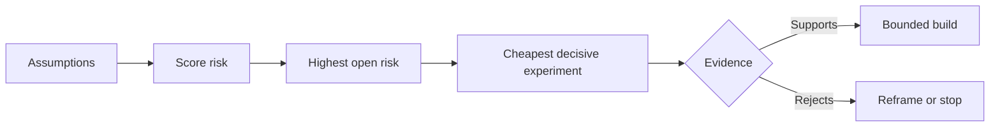

# मानदंडों का नक्शा बनाएं और सबसे जोखिम भरा पहले हल करें

> एक रोडमैप में पहलुओं के अंदर अनिश्चितता छिपी रहती है। एक परिकल्पना नक्शा में उन पहलुओं के अस्तित्व के लायक होने से पहले क्या सच होना चाहिए, इसका खुलासा होता है।

**Type:** Learn + Build
**Languages:** Python (stdlib)
**Prerequisites:** Phase 14 lesson 48
**Time:** ~65 minutes

## सीखने के लक्ष्य

- प्रस्तावित कार्य को स्पष्ट धारणाओं में परिवर्तित करें।
- स्कोर प्रभाव, अनिश्चितता और अपरिवर्तनीयता को अलग से।
- जोखिम के आधार पर अगला प्रयोग चुनें, उत्साह के आधार पर नहीं।
- परीक्षण किए गए अनुमानों को साक्ष्य और निर्णयों से प्रतिस्थापित करें।

## हर बिल्डिंग में सट्टेबाजी होती है

एक घटना उपकरण इस बात पर निर्भर हो सकता है कि ये सभी सच हैंः

- चेतावनी संदर्भ में सेवा की पहचान के लिए पर्याप्त जानकारी है;
- इंजीनियरों को एक सिफारिश पर भरोसा है जिसे उन्होंने स्वयं प्राप्त नहीं किया है;
- वांछित प्रतिक्रिया समय परिचालन के हिसाब से महत्वपूर्ण है;
- आवश्यक डेटा को असुरक्षित प्राधिकरण के बिना एक्सेस किया जा सकता है;
- कार्यप्रवाह रखरखाव को उचित ठहराने के लिए पर्याप्त बार होता है।

ये कार्यान्वयन कार्य नहीं हैं, बल्कि निर्माण के लिए मूल्यवान, उपयोग करने योग्य, व्यवहार्य और सुरक्षित होने की शर्तें हैं।

## अनुमान वर्ग

| Class | Question |
|---|---|
| Value | Will the outcome matter enough? |
| Usability | Can the user understand and act on it? |
| Feasibility | Can the system produce it with available data and constraints? |
| Viability | Can the organization sustain cost, ownership, and operation? |
| Safety | Can it fail without unacceptable consequence? |

यह सुविधा उपयोगी है इसका परीक्षण नहीं किया जा सकता है10 में से आठ ऑन कॉल इंजीनियर केवल पढ़ने के परिणाम के साथ सही सेवा को अधिक तेज़ी से पहचानते हैं।

## जोखिम एक संख्या नहीं है

प्रयोगशाला में एक से पांच तक तीन आयामों का उपयोग किया जाता हैः

- **Impact:**यदि यह धारणा गलत है तो क्षति।
- **Uncertainty:**वर्तमान साक्ष्य की कमजोरी।
- **Irreversibility:**प्रतिबद्धता के बाद सीखने की लागत।

उदाहरण स्कोर प्रभाव और अनिश्चितता को गुणा करता है, फिर अपरिवर्तनीयता जोड़ता है। सूत्र सार्वभौमिक नहीं है। इसका उद्देश्य टीम को यह बताने के लिए मजबूर करना है कि एक अज्ञात को दूसरे से पहले हल क्यों किया जाना चाहिए।



## एक प्रयोग बनाएं, पुष्टि की अनुष्ठान नहीं

एक उपयोगी परीक्षण में निम्नलिखित शामिल हैंः

- एक दावा जो गलत हो सकता है;
- एक जनसंख्या या यथार्थवादी नमूना;
- एक अवलोकन योग्य परिणाम;
- परिणाम से पहले तय की गई सीमा;
- पास, विफलता, और अस्पष्ट सबूत के लिए एक अगला निर्णय।

ऐसे परीक्षणों से बचें जो केवल यह साबित करें कि टीम विचार का निर्माण कर सकती है।

## पुनरावृत्ति क्रम में बदलाव करती है

उच्च परिणाम, अपरिवर्तनीय विकल्पों को पहले सबूत की आवश्यकता होती है। एक केवल-पढ़ने के पुनरावृत्ति उत्पादन एकीकरण से पहले हो सकती है। एक अस्थायी एडाप्टर डेटा माइग्रेशन से पहले हो सकता है। एक मानव-अनुमोदित सिफारिश स्वचालित कार्रवाई से पहले हो सकती है।

निर्माण का आकार अनिश्चितता के आकार का अनुसरण करना चाहिए।

## इसे बनाओ

प्रयोगशाला परिकल्पनाओं को रैंक करती है, खुली दावों से परीक्षण की गई अंतर करती है, उच्चतम खुली जोखिम का चयन करती है, और लिखती है `outputs/assumption-map.json`. .

```bash
python3 code/main.py
python3 -m unittest discover code/tests -v
```

उच्चतम जोखिम परिकल्पना पर साक्ष्य को बदलें और अगले प्रयोग में परिवर्तन कैसे होते हैं, उसका अवलोकन करें।

## व्यायाम

1. आप जिस फीचर को बनाना चाहते हैं उसके लिए पांच धारणाएँ लिखिए।
2. एक सुरक्षा धारणा जोड़ी जो आपकी विशेषता सूची में छोड़ दी गई है।
3. एक ऐसी सीमा निर्धारित करें जो आपको निर्माण को रोकने के लिए प्रेरित करेगी।
4. एक बड़े प्रयोग को सस्ता निर्णायक परीक्षण से प्रतिस्थापित करें।
5. जोखिम रैंकिंग को रोडमैप प्राथमिकता के साथ तुलना करें और असंगति की व्याख्या करें।

## आगे पढ़ना

- [Barry Boehm, A Spiral Model of Software Development and Enhancement](https://dl.acm.org/doi/10.1145/12944.12948), एक जोखिम-आधारित विकास चक्र के लिए जो गहन प्रतिबद्धता से पहले अनिश्चितता को दूर करता है।
- [Dardenne, van Lamsweerde, and Fickas, Goal-Directed Requirements Acquisition](https://doi.org/10.1016/0167-6423(93)90021-जी), बाधाओं और बाधाओं को खत्म करते हुए लक्ष्य को परिष्कृत करने के लिए।

## जो आप रखते हैं

रखो`outputs/assumption-map.json`. अगले पाठ में इसका उपयोग सबसे छोटा टुकड़ा चुनने के लिए किया जाता है जो निर्णायक सबूत पैदा कर सकता है.
