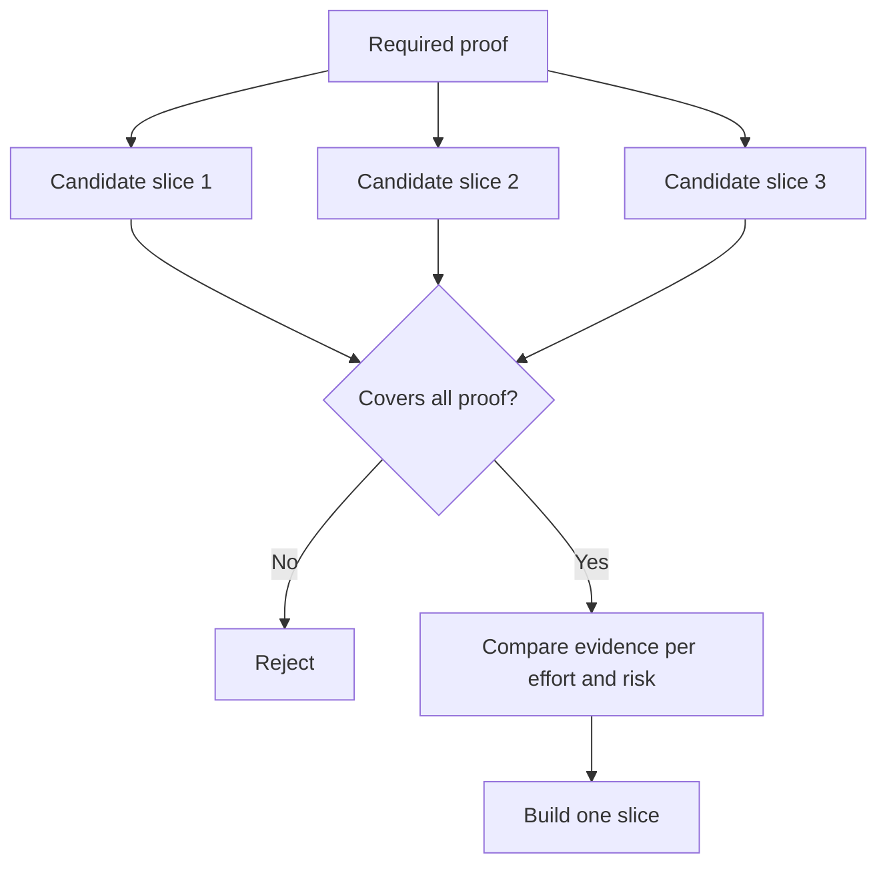

# निर्णय को बदलने वाला सबसे छोटा टुकड़ा चुनें

> एक छोटा सा निर्माण जो अगले निर्णय को नहीं बदल सकता है, केवल अधूरा है।

**Type:** Learn + Build
**Languages:** Python (stdlib)
**Prerequisites:** Phase 14 lesson 49
**Time:** ~65 minutes

## सीखने के लक्ष्य

- एक टुकड़ा को उसके सिद्ध होने वाली धारणाओं के आधार पर परिभाषित करें।
- परिणाम मूल्य, अनिश्चितता में कमी, प्रयास और परिणाम को संतुलित करें।
- समय से पहले उत्पादन प्रतिबद्धता से पहले प्रतिवर्ती साक्ष्य पसंद करते हैं।
- कार्यप्रवाह के जोखिमपूर्ण भाग को छोड़ने वाले स्लाइस को अस्वीकार करें।

## ऊर्ध्वाधर साधन साक्ष्य अंत से अंत तक

एक उपयोगी स्लाइस एक परिणाम का अवलोकन करने के लिए आवश्यक न्यूनतम वास्तविक कार्यप्रवाह को पार करती है। यह उपयोगकर्ताओं, डेटा, अवधि और क्षमता में संकीर्ण हो सकती है। यह सटीक अनिश्चितता को हटाकर संकीर्ण नहीं होना चाहिए जिसे आपको परीक्षण करने की आवश्यकता है।

उदाहरण:

- दस वास्तविक घटनाओं पर केवल पढ़ने के लिए एक पुनरावृत्ति सेवा की पहचान और ऑपरेटर के विश्वास का परीक्षण करता है।
- सिंथेटिक डेटा पर पॉलिश किए गए डैशबोर्ड से समझ की जांच हो सकती है लेकिन डेटा व्यवहार्यता नहीं।
- एक उत्पादन ऑटो-रिमेडिएटर एक ही समय में सब कुछ परीक्षण करता है अस्वीकार्य परिणाम के साथ।

## पहले आवश्यक प्रमाणों की परिभाषा करें

उच्चतम जोखिम वाले खुले परिकल्पनाओं को लें और उन्हें आवश्यक प्रमाण सेट में बदल दें। उम्मीदवार का टुकड़ा केवल तभी पात्र है जब वह उस सेट को कवर करता है।

फिर पात्र स्लाइसों की तुलना निम्नलिखित पर करेंः

| Dimension | Direction |
|---|---|
| Outcome value | More is better |
| Uncertainty reduced | More is better |
| Effort | Less is better |
| Consequence | Less is better |
| Reversibility | More is better |

प्रयोगशाला का स्कोर जानबूझकर सरल है। पात्रता गेट अंकगणित से अधिक मायने रखता है।



## आम झूठी न्यूनतम

- **The UI-only minimum:**डेटा और परिचालन अनिश्चितता को हटा देता है।
- **The infrastructure-only minimum:**उपयोगकर्ता मूल्य के बिना तकनीकी संभावना साबित करता है।
- **The happy-path minimum:**सबसे अधिक जोखिम पैदा करने वाले अपवाद को छोड़ देता है।
- **The demo minimum:**एक प्रभावशाली कलाकृतियों का उत्पादन करता है लेकिन कोई दोहराया जा सकता माप नहीं है।
- **The platform minimum:**एक कार्यप्रवाह से पहले पुनः प्रयोज्य मशीनरी का निर्माण करता है।

## एक रोक नियम जोड़ें

कार्यान्वयन से पहले, लिखें कि यदि स्लाइस विफल हो जाती है तो क्या होता हैः

- परिणाम को छोड़ना;
- लक्ष्य उपयोगकर्ता या स्थिति को बदलना;
- एक अलग तंत्र का परीक्षण करें;
- बेहतर सबूत एकत्र करना;
- और अधिक संकीर्ण अधिकार।

यदि प्रत्येक परिणाम  बनाए रखने के लिए नेतृत्व करता है,  स्लाइस एक प्रयोग नहीं है।

## इसे बनाओ

प्रयोगशाला उम्मीदवारों को आवश्यक प्रमाण के अनुसार फ़िल्टर करती है, पात्र स्लाइस को स्कोर करती है, और लिखती है `outputs/slice-decision.json`. .

```bash
python3 code/main.py
python3 -m unittest discover code/tests -v
```

एक सस्ता उम्मीदवार जो केवल एक आवश्यक धारणा साबित करता है, उसे जोड़ें।

## व्यायाम

1. एक ही परिणाम के लिए तीन स्लाइस डिजाइन करें, विभिन्न परिणाम स्तरों पर।
2. उन्हें स्कोर करने से पहले आवश्यक प्रमाण निर्धारित करें।
3. निर्णायक साक्ष्य को संरक्षित करते हुए एक क्षमता को हटा दें।
4. असफल पायलट के लिए एक रोक नियम जोड़ें।
5. एक पुनः प्रयोज्य मंच घटक की पहचान करें जिसे स्लाइस के बाद तक इंतजार करना चाहिए।

## आगे पढ़ना

- [Barry Boehm, A Spiral Model of Software Development and Enhancement](https://dl.acm.org/doi/10.1145/12944.12948), प्रत्येक विकास चक्र को उन जोखिमों से मेल खाने के लिए जो इसे हल करना चाहिए।
- [Lenarduzzi and Taibi, MVP Explained: A Systematic Mapping Study on the Definitions of Minimal Viable Product](https://arxiv.org/abs/1609.07592), सॉफ्टवेयर उत्पाद प्रथा में मिमिम  और लाभकारी  के बारे में अस्पष्टता के लिए।

## जो आप रखते हैं

रखो`outputs/slice-decision.json`यह रिकॉर्ड क्यों यह टुकड़ा सबसे छोटा है कि निर्णय को बदल सकता है.
