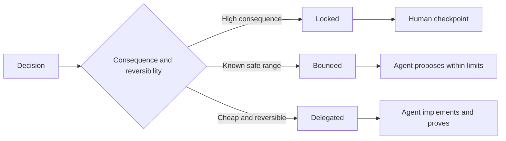

# निर्णायक विवरण लिखें

> एक उपयोगी विनिर्देश अपरिवर्तनीय और सबूतों को ठीक करता है जबकि प्रतिवर्ती कार्यान्वयन विकल्पों को खुला छोड़ता है। यह निर्णय सीमा है, एक पटकथा नहीं है।

**Type:** Learn + Build
**Languages:** Python (stdlib)
**Prerequisites:** Phase 14 lesson 50
**Time:** ~75 minutes

## सीखने के लक्ष्य

- अलग परिणाम, अपरिवर्तनीय, उदाहरण, गैर-लक्ष्य, और प्रमाण।
- निर्णयों को लॉक, लिमिटेड या डेलीगेटेड के रूप में चिह्नित करें।
- एजेंटों के निर्णय को बनाए रखें जहां विकल्प सस्ते और उलटनीय हैं।
- मानव चेकपोस्टों की आवश्यकता है जहां परिणाम या सार्वजनिक व्यवहार में परिवर्तन होता है।

## दो बुरी बातें

एक कम निर्दिष्ट कार्य एजेंट से सिस्टम का अनुमान लगाने के लिए कहता है। एक अधिक निर्दिष्ट कार्य उसे एक डिजाइन का प्रतिलिपि बनाने के लिए कहता है जो पहले से ही गलत हो सकता है।

उपयोगी मध्य एक निष्पादित अनुबंध हैः

| Surface | Purpose |
|---|---|
| Outcome | The observable result |
| Invariants | Conditions that must always remain true |
| Examples | Concrete cases that reveal intent |
| Non-goals | Adjacent behavior intentionally excluded |
| Decision policy | Which choices are locked, bounded, or delegated |
| Proof | Evidence required before completion |

## निर्णय लेने के तीन तरीके

- **Locked:**एजेंट को चुनना नहीं चाहिए। सार्वजनिक संगतता, प्राधिकरण, सुरक्षा, अपरिवर्तनीय लागत या उत्पाद प्रतिबद्धता के लिए उपयोग।
- **Bounded:**एजेंट स्पष्ट सीमाओं के भीतर चुन सकता है। खोज बजट, पुनः प्रयास गणना, अनुमत निर्भरता, या एक ज्ञात इंटरफ़ेस परिवार के लिए उपयोग।
- **Delegated:**स्थानीय संरचना, नाम, प्रतिवर्ती रेफैक्टर्स और कार्यान्वयन विवरण के लिए उपयोग।



## उदाहरणों के ज़रिए व्यवहार को स्पष्ट करें

उदाहरण विशेषणों की तुलना में इरादे को बेहतर ढंग से संपीड़ित करते हैं। उपयोगी,  मजबूत, और उत्पादन के लिए तैयार निष्पादित नहीं होते हैं। सामान्य, किनारे, विफलता और प्रतिबंधित उदाहरणों का एक छोटा सेट बिल्डर और सत्यापितकर्ता दोनों को कुछ ठोस देता है।

उदाहरण अपरिवर्तित वस्तुओं की जगह नहीं लेते हैं। एक गुजरता मामला सार्वभौमिक सुरक्षा नियम साबित नहीं कर सकता है।

## सबूत दावे से मेल खाए

- इकाई परीक्षण स्थानीय कार्य अनुबंध साबित करता है।
- एक तार परीक्षण क्रमबद्धता और परिवहन व्यवहार साबित करता है।
- ब्राउज़र यात्रा एक इंटरफ़ेस पथ साबित करता है।
- एक पुनरावृत्ति सेट प्रतिनिधि मामलों पर व्यवहार साबित करता है।
- लेखा परीक्षा लॉग से यह साबित होता है कि प्राधिकरण की सीमाएं बनी हुई हैं।

उच्चतर स्तर के दावे के प्रमाण के रूप में निचले स्तर को स्वीकार न करें।

## जानबूझकर अनजान चीज़ें रखें

एक विनिर्देश में कहा जा सकता है कि प्रदर्शन किसी भी समय-बजट के भीतर लौटने वाले केवल-पढ़ने वाले स्रोत को चुन सकता है। यह अस्पष्टता नहीं है। यह एक सीमा और प्रमाण के साथ एक जानबूझकर अधिकृत निर्णय है।

जब सबूत बदलते हैं तो विनिर्देशों में बदलाव होना चाहिए। लॉक और लिमिटेड विकल्पों के पीछे कारण को संरक्षित करें ताकि बाद की टीमें उन्हें पुरातात्विक विज्ञान के बिना संशोधित कर सकें।

## इसे बनाओ

प्रयोगशाला हर अनुबंध सतह को मान्य करती है, निर्णय मोड की जांच करती है, और लिखती है `outputs/executable-specification.json`. .

```bash
python3 code/main.py
python3 -m unittest discover code/tests -v
```

उत्पादन-लेखन निर्णय को लॉक से डेलिगेट में ले जाएं। समझाएं कि योजना मूल्य को क्यों स्वीकार करती है लेकिन उत्पाद जोखिम नहीं।

## व्यायाम

1. छह विनिर्देश सतहों में एक बैकलॉग टिकट परिवर्तित करें।
2. तीन कार्यान्वयन निर्देशों को एक अपरिवर्तनीय और दो उदाहरणों से प्रतिस्थापित करें।
3. प्रत्येक निर्णय को चिह्नित करें और प्रत्येक अवरुद्ध या सीमित विकल्प को सही ठहराते हैं।
4. प्रत्येक अपरिवर्तनीय के लिए एक प्रमाण रसीद जोड़ें।
5. किसी ऐसे प्रतिबंध को हटा दें जिसमें कोई सबूत या जोखिम तर्क न हो।

## आगे पढ़ना

- [Nuseibeh and Easterbrook, Requirements Engineering: A Roadmap](https://www.cs.toronto.edu/~sme/papers/2000/ICSE2000.pdf), लक्ष्य, सटीक विनिर्देशों, सत्यापन, सहमति और विकास के बीच संबंध के लिए।
- [Zave and Jackson, Four Dark Corners of Requirements Engineering](https://doi.org/10.1145/267895.267896), पर्यावरण परिकल्पनाओं, आवश्यकताओं और विनिर्देशों को अलग करने के लिए।
- [Gotel and Finkelstein, An Analysis of the Requirements Traceability Problem](https://doi.org/10.1109/ICRE.1994.292398), यह संरक्षित करने के लिए कि आवश्यकता क्यों मौजूद है और यह कहां से आई है।

## जो आप रखते हैं

रखो`outputs/executable-specification.json`यह अनुबंध बन जाता है जो कोडिंग एजेंटों और मानव समीक्षाओं साझा करते हैं।
