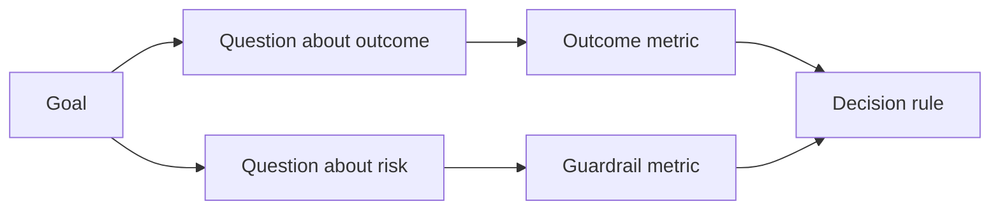

# परिणाम होने से पहले सफलता के मानकों का डिजाइन करें

> मापने से निर्णय का जवाब मिलना चाहिए, डैशबोर्ड को सजाना नहीं। लक्ष्य से शुरू करें, प्रश्न प्राप्त करें, फिर उन सबसे छोटे मापों का चयन करें जो उन्हें जवाब देते हैं।

**Type:** Learn + Build
**Languages:** Python (stdlib)
**Prerequisites:** Phase 14 lessons 47 and 51
**Time:** ~70 minutes

## सीखने के लक्ष्य

- परिणाम लक्ष्य से प्रश्न और माप प्राप्त करें।
- परिणामों का अवलोकन करने से पहले सीमाओं, खिड़कियों, स्रोतों और दिशाओं को परिभाषित करें।
- गार्डरेल्स और काउंटरमेट्रिक्स के साथ परिणाम मीट्रिक जोड़ी।
- निर्माण द्वारा समर्थित निर्णय के साथ मूल्यांकन साक्ष्य मेल खाते हैं।

## लक्ष्य, प्रश्न, माप

एक लक्ष्य से शुरू करें:

> असुरक्षित कार्यों को बढ़ाए बिना प्रभावित सेवा की पहचान करने के लिए समय को कम करें।

प्रश्न उत्पन्न करेंः

- सही सेवा कितनी जल्दी पहचान ली जाती है?
- कितनी बार पहचान सेवा सही है?
- क्या निदान केवल पढ़ने के लिए बना रहता है?
- क्या कार्यप्रवाह अलर्ट को खारिज करने या ऑपरेटर का कार्यभार बढ़ाता है?

फिर उन प्रश्नों को परिचालन करने वाले माप चुनें।



## एक मेट्रिक को अनुबंध की आवश्यकता होती है

प्रत्येक मीट्रिक आवश्यकताओंः

| Field | Example |
|---|---|
| Name | `median_identification_seconds` |
| Direction | at most |
| Threshold | 120 |
| Window | ten incident replays |
| Source | replay event log |
| Population | on-call engineers in the pilot |
| Kind | outcome or guardrail |

स्रोत और खिड़की के बिना, एक संख्या को पुनः प्रस्तुत नहीं किया जा सकता है। एक सीमा के बिना, यह निर्णय नहीं ले सकता है।

## परिणाम, गार्डरेल और काउंटरमेट्रिक

- **Outcome metric:**क्या वांछित स्थिति में सुधार हुआ?
- **Guardrail:**क्या एक निश्चित बाध्यता सही रही?
- **Counter-metric:**क्या स्थानीय सुधार की शिफ्ट की लागत या नुकसान कहीं और हुआ?

घटना के कार्यप्रवाह के लिए, गति पर्याप्त नहीं है। सटीकता, उत्पादन लेखन, ऑपरेटर कार्यभार और चूक सूचनाएं एक तेज़ लेकिन असुरक्षित परिणाम से बचती हैं।

## ऑनलाइन और ऑफलाइन साक्ष्य

ऑफ़लाइन रिप्ले दोहराव और किनारे कवरेज के लिए उपयोगी है। एक सीमाबद्ध पायलट वास्तविक व्यवहार, विश्वास और वर्कफ़्लो प्रभाव के लिए उपयोगी है। कोई भी दूसरे के प्रतिस्थापन नहीं करता है।

वर्तमान निर्णय का उत्तर देने के लिए सबसे सस्ता सबूत का उपयोग करें। केवल इसलिए वास्तविक उपयोगकर्ताओं को उजागर न करें क्योंकि कार्यान्वयन तैयार है।

## उपाय करने से पहले निर्णय लें

परिणाम देखने से पहले पास, विफलता और अस्पष्ट पथ लिखें। अन्यथा टीम निर्माण की रक्षा के लिए सीमा को स्थानांतरित करेगी।

उदाहरण:

- पासः सही सेवा दर कम से कम 0.9 और औसत समय अधिकतम 120 सेकंड;
- विफलताः उत्पादन लेखन या सुधार दर 0.75 से कम;
- अस्पष्टः व्यापक भिन्नता के साथ छोटा सुधार, एक बड़े पुनरावृत्ति सेट की आवश्यकता होती है।

## इसे बनाओ

प्रयोगशाला एक माप योजना को मान्य करती है, समावेशी सीमाओं का मूल्यांकन करती है, यादगार मानों को रिकॉर्ड करती है, और लिखती है `outputs/measurement-report.json`. .

```bash
python3 code/main.py
python3 -m unittest discover code/tests -v
```

गार्डरेल मेट्रिक्स को हटा दें और देखें कि योजना क्यों अमान्य हो जाती है, भले ही परिणाम मेट्रिक्स बने रहें।

## व्यायाम

1. एक परिणाम लक्ष्य से तीन प्रश्न निकालें।
2. एक काउंटरमेट्रिक जो एक अन्य भूमिका में स्थानांतरित लागत को पकड़ता है जोड़ें।
3. प्रत्येक मीट्रिक के लिए स्रोत, जनसंख्या और विंडो को परिभाषित करें।
4. मान उत्पन्न करने से पहले पास, असफल और अस्पष्ट निर्णय लिखें।
5. एक मीट्रिक की पहचान करें जो एकत्र करना आसान है लेकिन निर्णय को नहीं बदल सकता है। इसे हटा दें।

## आगे पढ़ना

- [Basili, Software Modeling and Measurement: The Goal/Question/Metric Paradigm](https://drum.lib.umd.edu/items/8119803a-362b-42ec-b6ce-2311713e7236), स्पष्ट लक्ष्यों से परिचालन माप प्राप्त करने के लिए।
- [Basili, Caldiera, and Rombach, The Goal Question Metric Approach](https://www.cs.toronto.edu/~sme/CSC444F/handouts/GQM-paper.pdf), विधि को प्रतिक्रिया और सुधार प्रणाली के रूप में लागू करने के लिए।

## जो आप रखते हैं

रखो`outputs/measurement-report.json`. यह प्रोटोटाइप, पायलट या उत्पादन चरण के लिए साक्ष्य गेट को परिभाषित करता है।
