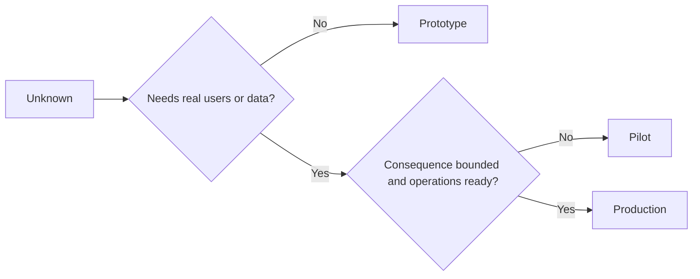

# प्रोटोटाइप, पायलट या उत्पादन जानबूझकर चुनें

> ये अलग-अलग सीखने के वातावरण हैं, पॉलिशिंग के स्तर नहीं। उस चरण का चयन करें जो वर्तमान अज्ञात का जवाब देता है, कम से कम अनावश्यक परिणाम के साथ।

**Type:** Learn + Build
**Languages:** Python (stdlib)
**Prerequisites:** Phase 14 lessons 50 to 52
**Time:** ~70 minutes

## सीखने के लक्ष्य

- अज्ञात, दर्शकों, डेटा, परिणाम और तत्परता से एक निर्माण चरण चुनें।
- चरण-विशिष्ट नियंत्रण और बाहर निकलने के मानदंडों को परिभाषित करें।
- प्रोटोटाइप को चुपचाप उत्पादन प्रणाली बनने से रोकें।
- वास्तविक प्राधिकरण को तब तक विलंबित करें जब तक कि सबूत और संचालन इसे सही न ठहराएं।

## तीन अलग-अलग प्रश्न

| Stage | Primary question |
|---|---|
| Prototype | Can this mechanism produce the evidence at all? |
| Pilot | Does it work safely with a bounded real audience and real conditions? |
| Production | Can we own it continuously at the promised reliability and risk level? |

एक प्रोटोटाइप तकनीकी रूप से पूरा हो सकता है और अभी भी डिस्पोजेबल हो सकता है। एक पायलट दर्शकों और प्राधिकरण में सीमित रहते हुए उत्पादन डेटा का उपयोग कर सकता है। उत्पादन तब शुरू होता है जब संगठन निरंतर जिम्मेदारी स्वीकार करता है।

## प्रोटोटाइप

प्रोटोटाइप का उपयोग करें जब अज्ञात को वास्तविक उपयोगकर्ताओं या वास्तविक डेटा की आवश्यकता नहीं होती है। इसे रखेंः

- डिस्कार्ड करने योग्य;
- अलग-अलग;
- व्यवहार में संकीर्ण;
- सीखने के प्रश्न के बारे में स्पष्ट रूप से;
- झूठी परिचालन गारंटी से मुक्त।

तंत्र को एक और चरण प्राप्त होने से पहले वास्तुकला को अनुकूलित न करें।

## पायलट

पायलट का उपयोग तब करें जब अज्ञात को वास्तविक व्यवहार, यथार्थवादी डेटा या वास्तविक वर्कफ़्लो की आवश्यकता होती है, लेकिन परिणाम या तत्परता अभी तक व्यापक रिलीज के साथ संगत नहीं है।

पायलट को आवश्यकता हैः

- एक नामित दर्शक;
- एक मानव मालिक;
- सीमित अवधि और अधिकार;
- लेखा परीक्षा और वापसी;
- आउटपुट और गार्डरेल की सीमाएं;
- विस्तार, संशोधन या रोक के लिए बाहर निकलने के मानदंड।

## उत्पादन

उत्पादन को तैनाती से अधिक की आवश्यकता हैः

- सेवा स्तर का उद्देश्य;
- कॉल पर और घटनाओं के मालिकाना अधिकार;
- सुरक्षा और गोपनीयता समीक्षा;
- लागत और क्षमता नियंत्रण;
- वापसी और पुनर्प्राप्ति;
- निरंतर निगरानी;
- एक सेवानिवृत्ति पथ।



## चरण विचलन

प्रोटोटाइप कोड खतरनाक हो जाता है जब यह उपयोगकर्ताओं, डेटा या प्राधिकरण को प्राप्त करता है, बिना स्वामित्व प्राप्त किए। कॉन्फ़िगरेशन, एक्सेस कंट्रोल, टेलीमेट्री और प्रलेखन में प्रोटोटाइप और पायलट सीमाओं को चिह्नित करें। चेतावनी बैनर पर्याप्त नहीं है।

इस चरण को सिस्टम से ही देखा जा सकता है।

## इसे बनाओ

प्रयोगशाला निर्णय संदर्भ से एक चरण चुनती है, आवश्यक नियंत्रण लौटाती है, और लिखती है `outputs/stage-decisions.json`. .

```bash
python3 code/main.py
python3 -m unittest discover code/tests -v
```

पायलट उदाहरण को कम परिणामी के साथ परिचालन की तत्परता में बदलें। यह समझाएं कि उत्पादन को सही ठहराने के लिए अतिरिक्त सबूत क्या हैं।

## व्यायाम

1. तीन वर्तमान परियोजनाओं को सीखने के चरण के अनुसार वर्गीकृत करें, न कि तैनाती की स्थिति के अनुसार।
2. पायलट के बाहर निकलने के मानदंड लिखें जिनमें स्टॉप निर्णय शामिल हो।
3. एक तकनीकी नियंत्रण जो एक प्रोटोटाइप को उत्पादन डेटा तक पहुंचने से रोकता है जोड़ें।
4. निर्माण उत्पादन को बनाने वाली पहली परिचालन जिम्मेदारी की पहचान करें।
5. सीमाबद्ध पायलट के लिए एक रोलबैक रसीद तैयार करें।

## आगे पढ़ना

- [Barry Boehm, A Spiral Model of Software Development and Enhancement](https://dl.acm.org/doi/10.1145/12944.12948), प्रत्येक पुनरावृत्ति के प्रति प्रतिबद्धता को हल किए गए जोखिम से मेल खाने के लिए।
- [Fagerholm et al., Building Blocks for Continuous Experimentation](https://doi.org/10.1145/2601248.2601276), प्रयोगों को निरंतर चलाने के लिए आवश्यक संगठनात्मक और तकनीकी परिस्थितियों के लिए।

## जो आप रखते हैं

रखो`outputs/stage-decisions.json`यह दर्शाता है कि प्रत्येक चरण क्यों उचित है और अगले चरण से पहले कौन से नियंत्रण मौजूद होना चाहिए।
