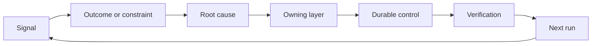

# स्वामित्व और सेवानिवृत्ति के साथ एक प्रतिक्रिया रैकट बनाएं

> शिपिंग एक निर्माण लूप बंद करता है और सीखने लूप खोलता है। सबूत प्रणाली को बदलना चाहिए या यह टेलीमेट्री बन जाता है किसी का भी मालिक नहीं है।

**Type:** Learn + Build
**Languages:** Python (stdlib)
**Prerequisites:** Phase 14 lessons 46 and 53
**Time:** ~75 minutes

## सीखने के लक्ष्य

- घटनाओं, मूल्यांकन, उपयोगकर्ता व्यवहार, और सुधारों को स्वामित्व वाली कार्रवाई में बदल दें।
- प्रत्येक संकेत को संदर्भ, मूल्यांकन, नीति, रनटाइम या बैकलॉग पर रूट करें।
- गंभीरता और आवृत्ति के अनुसार पुनरावृत्ति को प्राथमिकता दें।
- हर नियंत्रण को एक सेवानिवृत्ति की स्थिति दें।

## प्रतिक्रिया बुनियादी ढांचा है

एक टीम किसी भी घटना से सीखने के बिना निशान, मूल्यांकन, समर्थन टिकट और घटना लॉग एकत्र कर सकती है। गायब तंत्र प्रमोशन हैः एक मालिक और सबूत के साथ अवलोकन से स्थायी परिवर्तन के लिए एक परिभाषित पथ।

लूप हैः

1. एक ठोस संकेत का पालन करें;
2. इसे किसी परिणाम, बाध्यता या धारणा से जोड़ें;
3. सबसे पहले सिस्टम परत की पहचान करें जो कारण का मालिक है;
4. एक सीमित परिवर्तन पैदा करना;
5. यह सत्यापित करें कि पुनरावृत्ति कम होने की संभावना है;
6. जांच करें कि क्या नियंत्रण बरकरार रहना चाहिए।

## मालिकाना स्तर तक का मार्ग

| Signal | Destination |
|---|---|
| False positive, regression, wrong result | Evaluation or test |
| Missing context, duplicate work, stale fact | Context source or retrieval route |
| Unsafe action or authority gap | Policy or permission boundary |
| Timeout, retry storm, unavailable dependency | Runtime control |
| New product need or unresolved tradeoff | Shaped backlog item |

सबसे पहले प्रभावी परत पर कारण को ठीक करें। जब किसी परीक्षण या अनुमति से विफलता असंभव हो सकती है तो एक और शीघ्र पैराग्राफ न जोड़ें।



## स्वामित्व नियंत्रण का हिस्सा है

हर रश्श कार्रवाई की जरूरत हैः

- एक मालिक;
- परिणाम और पुनरावृत्ति पर आधारित प्राथमिकता;
- बदलने वाला कलाकृतियों;
- परिवर्तन का प्रमाण देने वाली सत्यापन;
- समीक्षा या समाप्ति विंडो;
- एक सेवानिवृत्ति की स्थिति।

एक अनपढ़ सुधार बेहतर स्वरूपण के साथ एक अवलोकन है।

## स्टेल कंट्रोल सेवानिवृत्त

प्रतिक्रिया प्रणाली नीति को जमा करती है। यह नीति विरोधाभासी और महंगी हो सकती है। समीक्षा नियंत्रण करती है जबः

- वास्तुकला या कार्यप्रवाह में परिवर्तन;
- एक निम्न स्तर की अपरिवर्तनीय उच्च स्तर की निर्देशों को बदल देती है;
- चयनित विंडो पर संरक्षित विफलता दिखाई नहीं दी है;
- नियंत्रण अधिक बार वैध कार्य को रोकता है इससे नुकसान नहीं होता है।

पेंशन लेने के लिए सबूत भी चाहिए।

## कनेक्ट बिल्ड और कोडिंग एजेंट प्रतिक्रिया

एक ही रच दोनों पटरियों पर सेवा करता हैः

- उत्पाद प्रमाण परिणाम फ्रेम, धारणा, स्लाइस या माप योजना को बदलता है।
- कोडिंग एजेंट सुधार परीक्षणों, संदर्भ, दायरे, स्वचालन या हस्तांतरण को बदलते हैं।
- घटनाएं उत्पाद सीमा और एजेंट कार्यक्षेत्र दोनों को बदल सकती हैं।

यही कारण है कि निर्माण को आकार देना एक ऐसा चरण नहीं है जो कोडिंग से पहले समाप्त होता है। यह प्रत्येक स्वीकार किए गए परिवर्तन के माध्यम से जारी रहता है।

## इसे बनाओ

प्रयोगशाला संकेतों को वर्गीकृत करती है, स्वामित्व वाली रचश क्रियाएँ बनाती है, उन्हें प्राथमिकता देती है, और लिखती है `outputs/feedback-backlog.json`. .

```bash
python3 code/main.py
python3 -m unittest discover code/tests -v
```

रनटाइम टाइमआउट सिग्नल जोड़ें और पुष्टि करें कि यह सामान्य बैकलॉग के बजाय रनटाइम पर रूट करता है।

## व्यायाम

1. एक घटना और एक उपयोगकर्ता शिकायत को एक रच कार्रवाई में बदल दें।
2. सबसे पहले जो परत हो सकती है उसे नाम दें जो प्रत्येक पुनरावृत्ति को रोक सकती है।
3. प्रयोगशाला आउटपुट में सत्यापन कमांड या अवलोकन जोड़ें।
4. पॉलिसी नियम के लिए सेवानिवृत्ति की शर्त को परिभाषित करें।
5. अगले कार्य फ्रेम में वापस अनुशरण एक स्वीकार सुधार।

## आगे पढ़ना

- [Basili, Caldiera, and Rombach, The Goal Question Metric Approach](https://www.cs.toronto.edu/~sme/CSC444F/handouts/GQM-paper.pdf), उद्देश्य उन्मुख माप के माध्यम से संगठनात्मक सीखने के लिए।
- [Fagerholm et al., Building Blocks for Continuous Experimentation](https://doi.org/10.1145/2601248.2601276), तकनीकी और संगठनात्मक लूप के लिए जो सबूतों को उत्पाद विकास के निरंतर विकास से जोड़ता है।
- [Nuseibeh and Easterbrook, Requirements Engineering: A Roadmap](https://www.cs.toronto.edu/~sme/papers/2000/ICSE2000.pdf), सिस्टम जीवन चक्र के दौरान विकसित आवश्यकताओं के साथ व्यवहार करने के लिए।

## जो आप रखते हैं

रखो`outputs/feedback-backlog.json`यह उत्पाद निर्णय और वितरण पथ का समापन आस्तीन है और अगले परिणाम फ्रेम में इनपुट है।
