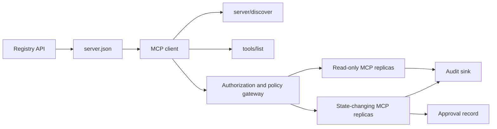

# कैपस्टोन 13: रजिस्ट्री और गवर्नेंस के साथ स्टेटलेस एमसीपी सर्वर

> उत्पादन एमसीपी एक सर्वर प्रक्रिया नहीं है। यह अनुबंधों की एक श्रृंखला हैः प्रकाशित मेटाडेटा, लाइव डिस्कवरी, एक राज्यहीन अनुरोध कूपन, प्राधिकरण, नीति, लेखा परीक्षा और तैनाती सबूत।

**Type:** Capstone
**Languages:** Python and TypeScript reference models; any production language
**Prerequisites:** Phase 11, Phase 13, Phase 14, Phase 17, and Phase 18
**Required MCP deep dives:** [Lesson 28: Tool Contracts](../../../13-tools-and-protocols/28-mcp-tool-contracts-and-content/docs/en.md),[Lesson 29: Reliability](../../../13-tools-and-protocols/29-mcp-reliability-cancellation-and-flow-control/docs/en.md),[Lesson 30: Registry Supply Chain](../../../13-tools-and-protocols/30-mcp-registry-supply-chain-and-drift/docs/en.md)और [Lesson 31: Conformance Operations](../../../13-tools-and-protocols/31-mcp-conformance-versioning-and-operations/docs/en.md)
**Protocol target:**एमसीपी `2026-07-28`
**Time:** ~25 hours

## सीखने के लक्ष्य

- राज्य रहित एमसीपी अनुरोध और परिणाम कूपन को लागू करें।
- रजिस्ट्री मेटाडेटा को लाइव प्रोटोकॉल डिस्कवरी से अलग रखें।
- निर्धारक, कैश-जागरूक उपकरण खोज निर्माण।
- प्रत्येक उपकरण कॉल के लिए जारीकर्ता, दर्शक, दायरा और अनुमोदन नीति को लागू करें।
- सत्र आत्मीयता के बिना Streamable HTTP को तैनात करें।
- वायर, प्राधिकरण, नीति, रजिस्ट्री और ऑडिट सीमाओं पर व्यवहार का प्रमाण दें।

## आवश्यक एमसीपी आवश्यक मार्ग

इस कपास्टोन को उत्पादन के लिए तैयार होने से पहले क्रमशः चार जुड़े चरण 13 पाठों को पूरा करेंः

1. [Lesson 28](../../../13-tools-and-protocols/28-mcp-tool-contracts-and-content/docs/en.md)यह सर्वर द्वारा प्रदर्शित किए जाने वाले उपकरण, स्कीम, सामग्री, पृष्ठीकरण, पूरा, रूटिंग और त्रुटि अनुबंध को परिभाषित करता है।
2. [Lesson 29](../../../13-tools-and-protocols/29-mcp-reliability-cancellation-and-flow-control/docs/en.md)रद्द दौड़, समय सीमा, अशक्तता, दबाव, पुनः प्रयास, और फिर से कनेक्ट व्यवहार को परिभाषित करता है।
3. [Lesson 30](../../../13-tools-and-protocols/30-mcp-registry-supply-chain-and-drift/docs/en.md)नामस्थान, उत्पत्ति, प्रवेश पिन, रजिस्ट्री स्थिति, बहाव, लेजर और रूलबैक प्रमाण को परिभाषित करता है।
4. [Lesson 31](../../../13-tools-and-protocols/31-mcp-conformance-versioning-and-operations/docs/en.md)स्वर्ण और नकारात्मक प्रतिलेखन, सख्त संस्करण युग, एसडीके अंतर जांच, प्रॉक्सी प्रूफ, संपादन, स्वास्थ्य और रिलीज गेटिंग को परिभाषित करता है।

कैपस्टोन उन कलाकृतियों को एकीकृत करता है. यह उन्हें एक खुश पथ एसडीके परीक्षण के साथ प्रतिस्थापित नहीं करता है.

## समस्या

एक आंतरिक मंच को केवल पढ़ने के लिए डेटा टूल और राज्य-बदलने वाले टूल का एक छोटा सेट चाहिए। डेवलपर्स को सर्वर की खोज करने, कैसे कनेक्ट करने, इसकी लाइव क्षमताओं का निरीक्षण करने और केवल उन ऑपरेशनों को कॉल करने में सक्षम होना चाहिए जिन्हें उन्हें उपयोग करने के लिए अधिकृत किया गया है।

मुश्किल हिस्सा एक फ़ंक्शन को पंजीकृत नहीं करना है मुश्किल हिस्सा छह अलग-अलग सत्यों को संरेखित करना हैः

1. `server.json`सर्वर स्थापित या पहुँचा जा सकता है जहां बताता है।
2. `server/discover`जो लाइव प्रक्रिया अब समर्थन करता है।
3. प्रत्येक अनुरोध बताता है कि प्रोटोकॉल संशोधन और ग्राहक क्षमताओं का उपयोग करता है।
4. प्राधिकरण एक कॉल करने वाले को सही जारीकर्ता, संसाधन और दायरे से बंधाता है।
5. नीति तय करती है कि क्या यह विशिष्ट कार्रवाई चल सकती है।
6. लेखा परीक्षा साक्ष्य रिकॉर्ड करता है कि सीमा पार क्या हुआ बिना रहस्य या संवेदनशील उपयोगिताओं के लीक किए।

यदि इनमें से कोई भी बहता है, तो प्लेटफ़ॉर्म एक सर्वर को सूचीबद्ध कर सकता है जो पहुंच नहीं सकता है, एक असंगत क्लाइंट को रूट कर सकता है, किसी अन्य संसाधन के लिए एक टोकन को स्वीकार कर सकता है, या अपेक्षित समीक्षा के बिना विनाशकारी कार्रवाई का खुलासा कर सकता है।

## दो खोज परतें

रजिस्ट्री और लाइव एमसीपी सर्वर अलग-अलग सवालों के जवाब देते हैं।

| Layer | Contract | Question it answers |
|---|---|---|
| Publication | `server.json` and Registry API | What is this server, where is its package or remote endpoint, and how is it configured? |
| Runtime | `server/discover` | Which protocol versions, capabilities, extensions, and server identity does this process support? |

आधिकारिक रजिस्ट्री में एक संस्करण का उपयोग किया जाता है `server.json`एक रिमोट प्रविष्टि एक Streamable HTTP URL का नाम दे सकती हैः

```json
{
  "$schema": "https://static.modelcontextprotocol.io/schemas/2025-12-11/server.schema.json",
  "name": "com.example/internal-readonly",
  "title": "Internal Read-Only Tools",
  "description": "Read-only incident and data lookup tools.",
  "version": "1.0.0",
  "remotes": [
    {
      "type": "streamable-http",
      "url": "https://mcp.internal.example.com/readonly"
    }
  ]
}
```

रजिस्ट्री स्कीम संस्करण और एमसीपी प्रोटोकॉल संशोधन स्वतंत्र हैं. एक तारीख को दूसरे से मेल खाने के लिए फिर से न लिखें. प्रत्येक दस्तावेज़ को अपने स्वयं के अनुबंध के अनुसार मान्य करें।

योजना वैधता नामस्थान स्वामित्व साबित नहीं करता है। एक प्रकाशक सत्यापित के लिए`example.com`रिवर्स DNS नाम स्थान का उपयोग करता है `com.example/*`रजिस्ट्री प्रमाणीकरण प्रवाह उस स्वामित्व साबित करता है. डोमेन लेबल को उनके सामान्य क्रम में नाम एक अलग नाम स्थान रखने.

स्टडीलिब मॉडल `validate_registry_document`कार्य एक आंशिक दूरस्थ प्रोफ़ाइल सत्यापनकर्ता है। यह आवश्यक अधिकारी की जांच करता है `name`,`description`और `version`फ़ील्ड; वैकल्पिक `title`; प्रकाशित नाम और लंबाई की सीमाएँ; ठोस संस्करण का आकार; और प्रत्येक `streamable-http`या `sse`रिमोट के HTTP(S) URL आकार. यह भी एक गैर-खाली आवश्यकता होती है `remotes`सूची क्योंकि इस capstone हमेशा एक रिमोट पर जीवित-सुनता।`validate_publisher_namespace`सत्यापित प्रकाशक डोमेन के साथ अलग से नाम की जांच करता है, जबकि `validate_runtime_alignment`प्रकाशन का नाम और संस्करण लाइव के साथ तुलना करता है `serverInfo`. आधिकारिक योजना केवल पैकेज रिकॉर्ड और अधिक दूरस्थ क्षेत्रों का समर्थन करती है. प्रकाशन से पहले, आधिकारिक JSON योजना या `mcp-publisher`; इस निर्भरता मुक्त उपसमूह को पूर्ण योजना सत्यापन के रूप में प्रस्तुत न करें।

सर्वर को लागू करना होगा `server/discover`; एक क्लाइंट इसे अन्य तरीकों से पहले कॉल कर सकता है. यह कैपस्टोन क्लाइंट अंत बिंदु को हल करने के बाद ऐसा करता है, और वर्तमान प्रोटोकॉल संशोधन और लाइव क्षमताओं को प्राप्त करता हैः

```json
{
  "resultType": "complete",
  "supportedVersions": ["2026-07-28"],
  "capabilities": {
    "tools": {
      "listChanged": false
    }
  },
  "_meta": {
    "io.modelcontextprotocol/serverInfo": {
      "name": "com.example/internal-readonly",
      "version": "1.0.0"
    }
  },
  "ttlMs": 3600000,
  "cacheScope": "public"
}
```

एक निजी कैटलॉग अतिरिक्त स्वामित्व, समीक्षा या जीवनचक्र डेटा को सूचकांकित कर सकता है, लेकिन उसे उन डेटा को एमसीपी वायर फ़ील्ड या रूट के रूप में आविष्कार नहीं करना चाहिए `server.json`जब सार्वजनिक कस्टम मेटाडेटा आवश्यक हो, तब रजिस्ट्री के `_meta.io.modelcontextprotocol.registry/publisher-provided`विस्तार और 4 केबी की सीमा के भीतर रहना।

## बिना नागरिकता वाले एमसीपी कोर

एमपीसी संशोधन `2026-07-28`प्रोटोकॉल सत्रों को हटा देता है और `initialize`/`notifications/initialized`यह भी हटा देता है`Mcp-Session-Id`. .

प्रत्येक अनुरोध में प्रोटोकॉल संदर्भ होता है `params._meta`:

```json
{
  "io.modelcontextprotocol/protocolVersion": "2026-07-28",
  "io.modelcontextprotocol/clientCapabilities": {},
  "io.modelcontextprotocol/clientInfo": {
    "name": "internal-platform-client",
    "version": "1.0.0"
  }
}
```

संस्करण और क्षमताएं अनुरोध तथ्य हैं, कनेक्शन तथ्य नहीं। एक लोड बैलेंसर विभिन्न स्वस्थ प्रतिकृतियों को लगातार अनुरोध भेज सकता है क्योंकि प्रतिलिपि संदेश से अनुरोध को मान्य कर सकती है।

सामान्य परिणामों में शामिल हैं `resultType: "complete"`. सर्वर को अपनी पहचान दर्ज करनी चाहिए `_meta.io.modelcontextprotocol/serverInfo`प्रत्येक परिणाम पर. एक गायब या गैर स्ट्रिंग प्रोटोकॉल संस्करण अमान्य पैरामीटर है `-32602`. त्रुटि `-32022`केवल एक आपूर्ति स्ट्रिंग के लिए है जो समर्थित नहीं है, के साथ ठीक `{"supported": ["2026-07-28"], "requested": "..."}`इसके आंकड़ों के रूप में।

### छिपाया जा सकता खोज

`tools/list`एक ही प्रभावी उपकरण सेट के लिए निर्धारक होना चाहिए। परिणाम में शामिल हैंः

- `ttlMs`, ग्राहक के लिए ताजापन संकेत;
- `cacheScope`, या `public`या `private`.
- एक स्थिर उपकरण क्रम ताकि समान सूचियों शीघ्र कैश का पुनः उपयोग कर सकें;
- `resultType: "complete"`और सर्वर पहचान मेटाडेटा।

प्रति उपयोगकर्ता प्राधिकरण को सामान्य रूप से उत्पन्न करना चाहिए `cacheScope: "private"`. साझा सार्वजनिक कैश के पीछे उपयोगकर्ता-विशिष्ट उपकरण दृश्यता न रखें।

## स्ट्रीम करने योग्य HTTP

एक नेटवर्क सर्वर एक MCP एंडपॉइंट को उजागर करता है जो POST स्वीकार करता है। प्रत्येक JSON-RPC अनुरोध या सूचना को अपना POST मिलता है।

एक अनुरोध के लिए, सर्वर या तो एक JSON वस्तु या उस अनुरोध के लिए स्कोप की SSE धारा लौटाता है। एक लंबे समय तक चलने वाला `subscriptions/listen`अनुरोध में परिवर्तन सूचनाएँ शामिल हैं। कोई स्टैंडअलोन GET स्ट्रीम, सत्र DELETE, सत्र हेडर या `Last-Event-ID`वर्तमान परिवहन में पुनः खेलें।

प्रत्येक अनुरोध में निम्नलिखित शामिल हैंः

- `MCP-Protocol-Version`, शरीर के मेटाडेटा से मेल लेना;
- `Mcp-Method`, JSON-RPC विधि से मेल खाती है;
- `Mcp-Name`के लिए`tools/call`,`resources/read`और `prompts/get`.
- `Accept: application/json, text/event-stream`. .

निर्दिष्ट के साथ असंगत दर्पण हेडर अस्वीकार `-32020`त्रुटि। मान्य करें `Origin`, स्थानीय विकास सर्वर को लूपबैक से बांधें, दूरस्थ क्लाइंट को प्रमाणित करें, और बंद अनुरोध-स्कोप एसएसई प्रतिक्रिया को रद्द के रूप में व्यवहार करें।



```figure
cf-mcp-gate
```

## प्राधिकरण और नीति

परिवहन मेटाडेटा प्राधिकरण नहीं है. प्रत्येक कॉल पर प्राधिकरण को मान्य करें.

दूरस्थ सर्वर के लिएः

1. संरक्षित संसाधन मेटाडेटा खोजें।
2. उस संसाधन के लिए प्राधिकरण सर्वर का चयन करें।
3. ग्राहक पंजीकरण के लिए क्लाइंट आईडी मेटाडेटा दस्तावेजों को प्राथमिकता दें. गतिशील क्लाइंट पंजीकरण को संगतता समर्थन के रूप में देखें।
4. प्राधिकरण के दौरान संसाधन संकेतक भेजें।
5. एक लौटा दी गई पुष्टि करें `iss`प्रवाह के लिए दर्ज किए गए प्राधिकरण सर्वर के प्रति मूल्य।
6. जारीकर्ता द्वारा प्रमुख ग्राहक क्रेडेंशियल। कभी भी जारीकर्ता के बीच पंजीकरण डेटा का पुनः उपयोग न करें।
7. MCP सर्वर पर टोकन जारीकर्ता, दर्शक या संसाधन, समाप्ति और दायरे को मान्य करें।
8. ठोस उपकरण और तर्क पर एक दूसरा नीतिगत निर्णय लागू करें।

उपकरण के रूप में टिप्पणी `readOnlyHint`और `destructiveHint`ग्राहकों को जोखिम में मदद करें। वे विश्वसनीय प्राधिकरण नियंत्रण नहीं हैं।

### अनुमोदन एक रिकॉर्ड है, एक जादुई दायरा नहीं

एक राज्य-बदलने वाले कॉल को अभिनेता, उपकरण, सामान्यीकृत तर्क या पाचन, लक्ष्य वातावरण, समाप्ति और एक बार या दोहराने वाले उपयोग नीति के लिए बाध्य अनुमोदन रिकॉर्ड की आवश्यकता होती है। अकेले चैट संदेश अनुमोदन का प्रमाण नहीं है।

पायथन मॉडल सॉर्ट की गई कुंजी के साथ कैनोनिक JSON हैश करता है, फिर टोकन विषय, उपकरण नाम, सर्वर URL और समाप्ति के साथ उस पचाने को बांधता है। हैंडलर चलाने से पहले एक भी तर्क बदलने के बाद रिकॉर्ड को फिर से खेलना विफल रहता है। अनुमोदन अलग सबूत है, न कि एक्सेस टोकन में जोड़ा गया दायरा।

उच्च जोखिम वाले उपकरण को एक अलग रूप से समीक्षा योग्य सतह पर रखें जब यह विस्फोट त्रिज्या को काफी कम करता है। यदि क्रेडेंशियल, नीति, तैनाती पहचान और ऑडिट नियंत्रण भी अलग हैं तो ही पृथक करना उपयोगी है।

## इसे बनाओ

### 1. प्रकाशन मॉडल मेटाडेटा

स्कीम बनाएँ और वैध करें `server.json`. प्रकाशक के लिए प्रमाणित नामस्थान के अंदर एक स्थिर नाम, प्लस संस्करण, विवरण, आधिकारिक `repository`या `packages`यदि लागू हो तो मेटाडेटा, और रिमोट या स्टूडियो ट्रांसपोर्ट। पर्यावरण-विभेद्य इनपुट के रूप में रहस्य बनाए रखें, कभी भी शाब्दिक मान नहीं।

### 2. प्रत्यक्ष खोज को लागू करें

कार्यान्वयन`server/discover`किसी भी सुविधा आरपीसी से पहले। समर्थित प्रोटोकॉल संस्करणों, क्षमताओं, एक्सटेंशन और सर्वर पहचान का विज्ञापन करें। `-32022`. .

### 3. देशहीन लिफाफा लागू करें

प्रत्येक अनुरोध में प्रोटोकॉल संस्करण और क्लाइंट क्षमताओं की आवश्यकता होती है।`resultType`प्रत्येक परिणाम में सर्वर की पहचान. प्रारंभ स्थिति, कनेक्शन-स्कैन क्षमता कैश, और सत्र पहचानकर्ताओं को हटा दें.

### 4. उपकरण सतह का निर्माण

दो केवल-पढ़ने के उपकरण और एक राज्य-बदलने के उपकरण के साथ शुरू करें। प्रत्येक को एक सीमित JSON योजना, सटीक विवरण, निर्धारात्मक परिणाम आकार और ईमानदार टिप्पणी दें। आउटपुट योजनाओं को जोड़ें जब ग्राहक संरचित परिणामों पर भरोसा करते हैं।

### 5. कैश- जागरूक सूची जोड़ें

 के साथ स्थिर क्रम में उपकरण वापस`ttlMs`और `cacheScope`. कैश समाप्ति और सूची परिवर्तन सूचना व्यवहार को अलग से अभ्यास करें।

### 6. प्राधिकरण और नीति जोड़ें

जारीकर्ता, दर्शकों, समाप्ति और दायरा को मान्य करें। प्रत्येक उपकरण कॉल के लिए नीति निर्णय चलाएं। उच्च जोखिम वाले कार्यों के लिए सटीक अनुमोदन को बाध्य करें। एक हैंडल को निष्पादित करने से पहले अनुपलब्ध या अप्रचलित अनुमोदनों को अस्वीकार करें।

### 7. अलग रजिस्टर और रनटाइम वैलिडेशन

स्थैतिक को मान्य करें `server.json`रिकॉर्ड, फिर दूरस्थ अंत बिंदु जांच के साथ `server/discover`. रिपोर्ट ड्रिफ्ट जब प्रकाशित रिमोट, पहचान, संस्करण या आवश्यक क्षमताएं लाइव प्रक्रिया से असहमत होती हैं।

### 8. लेखा परीक्षा प्रमाण जोड़ें

अभिनेता, जारीकर्ता, संसाधन, उपकरण, नीति निर्णय, अनुरोध पहचानकर्ता, ट्रैक संदर्भ, विलंबता और परिणाम रिकॉर्ड करें। दृढ़ता से पहले संवेदनशील तर्कों और परिणामों को पुनः लिखें या पचाने। मॉडल दृश्यमान संदर्भ से बाहर ऑडिट सिंक रखें।

### 9. क्षैतिज स्केलिंग का अभ्यास करें

लोड बैलेंसर के पीछे दो स्टेटलेस प्रतिकृतियां रखें। कम से कम 100 समवर्ती अनुरोध भेजें। यह प्रदर्शित करें कि सटीकता आत्मीयता पर निर्भर नहीं करती है। यदि किसी उपकरण को क्रॉस-कॉल की स्थिति की आवश्यकता है, तो एक स्पष्ट अस्पष्ट हैंडल का निर्माण करें और इसे साझा टिकाऊ प्रणाली में स्टोर करें।

### 10. असली तार पार

वास्तविक सर्वर बाइनरी के खिलाफ अनुरूपता जांच करें। केवल एसडीके ऑब्जेक्ट्स को नहीं, बल्कि अनुरोध हेडर और जेएसओएन निकायों को कैप्चर करें। गलत संस्करण, हेडर असंगतता, अनुपलब्ध दायरा, गलत दर्शक, गलत रूपरेखा वाले तर्क, हैंडल विफलता, रद्द करना और कैश समाप्ति का अभ्यास करें।

## आवश्यक साक्ष्य पैक

एक सबमिशन अपूर्ण है जब तक कि इसमें सभी पांच साक्ष्य वर्ग शामिल नहीं हैंः

| Evidence | Minimum proof | Source lesson |
|---|---|---|
| Wire | Redacted raw headers and JSON-RPC bodies for golden and negative cases, including metadata type failure, header mismatch, unsupported version, missing or unknown `resultType`, notification no-response, and response ID matching | [Lesson 31](../../../13-tools-and-protocols/31-mcp-conformance-versioning-and-operations/docs/en.md) |
| Proxy | The same stable case run directly and through the deployed intermediary, with ingress, origin, and egress status and body digests; prove protocol errors are not collapsed into generic 500 responses and streaming is not buffered | [Lessons 29](../../../13-tools-and-protocols/29-mcp-reliability-cancellation-and-flow-control/docs/en.md) and [31](../../../13-tools-and-protocols/31-mcp-conformance-versioning-and-operations/docs/en.md) |
| Admission | Verified publisher namespace, immutable Registry record digest, artifact or remote provenance, live `server/discover` identity and capability observation, descriptor pin, current Registry status, and admission-ledger event | [Lesson 30](../../../13-tools-and-protocols/30-mcp-registry-supply-chain-and-drift/docs/en.md) |
| Retry | A cancellation-versus-completion race, explicit timeout, safe read retry, mutation idempotency key, reconnect refetch, and proof that request cancellation cannot silently become durable task cancellation | [Lesson 29](../../../13-tools-and-protocols/29-mcp-reliability-cancellation-and-flow-control/docs/en.md) |
| Rollback | Exact previous version, admission and artifact digests, descriptor pin, active Registry status, current health window, route restoration result, and redacted decision evidence | [Lessons 30](../../../13-tools-and-protocols/30-mcp-registry-supply-chain-and-drift/docs/en.md) and [31](../../../13-tools-and-protocols/31-mcp-conformance-versioning-and-operations/docs/en.md) |

रिलीज़ के साथ संपादित पैक का एक डाइजेस्ट स्टोर करें। यदि कोई वर्ग गायब है, तो रिलीज़ को रखें। प्रक्रिया में डिस्पैचर से प्रॉक्सी व्यवहार का अनुमान न लगाएं, रजिस्ट्री उपस्थिति से प्रवेश न करें, एक नई JSON-RPC आईडी से सुरक्षा पुनः प्रयास करें, या पिछले तैनाती से रॉलबैक तैयारता न करें।

## स्थानीय संदर्भ मॉडल

पायथन मॉडल रजिस्ट्री मेटाडेटा, रिवर्स-डीएनएस प्रकाशक नामस्थान सत्यापन, प्रकाशन-टू-रनटाइम पहचान जांच, लाइव डिस्कवरी, निर्धारक उपकरण सूची, प्रति अनुरोध मेटाडेटा, विश्वसनीय-प्रदाता, दर्शक, समाप्ति और दायरा जांच, कार्रवाई-बाउंड अनुमोदन, एक दस्तावेजीकृत आंशिक रजिस्ट्री सत्यापन, नीति, और नेटवर्क सॉकेट खोले बिना लेखा परीक्षा प्रदर्शित करता हैः

```bash
cd phases/19-capstone-projects/13-mcp-server-with-registry
python3 code/main.py
python3 -m unittest discover -s code/tests -v
```

टाइपस्क्रिप्ट परियोजना एमसीपी एसडीके के बिना स्टूडियो पर स्टेटलेस जेएसओएन-आरपीसी आकार को उजागर करती है।`tools/call`पथ द्वारा विज्ञापित समान सीमांत इनपुट योजनाओं को लागू करता है `tools/list`; ज्ञात उपकरण के लिए अमान्य तर्क एक पूर्ण परिणाम देता है `isError: true`निष्पादक को बुलाए बिनाः

```bash
cd phases/19-capstone-projects/13-mcp-server-with-registry/code/ts
npm install
npm run typecheck
npm test
npm run demo
```

ये मॉडल स्थानीय अनुबंध तर्क साबित करते हैं। वे HTTP हेडर, OAuth एक्सचेंज, रजिस्ट्री प्रकाशन, OPA एकीकरण, लोड बैलेंसिंग या कलेक्टर रसीद को साबित नहीं करते हैं।

## तार उदाहरण

```http
POST /mcp HTTP/1.1
Host: mcp.internal.example.com
Content-Type: application/json
Accept: application/json, text/event-stream
MCP-Protocol-Version: 2026-07-28
Mcp-Method: tools/call
Mcp-Name: postgres.readonly
Authorization: Bearer REDACTED

{
  "jsonrpc": "2.0",
  "id": 42,
  "method": "tools/call",
  "params": {
    "name": "postgres.readonly",
    "arguments": {"sql": "SELECT 1"},
    "_meta": {
      "io.modelcontextprotocol/protocolVersion": "2026-07-28",
      "io.modelcontextprotocol/clientCapabilities": {},
      "io.modelcontextprotocol/clientInfo": {
        "name": "internal-platform-client",
        "version": "1.0.0"
      }
    }
  }
}
```

## इसे भेजें

एक भंडारण जहाज जिसमें शामिल हैंः

- एक योजना-मान्य `server.json`.
- केवल-पढ़ने और राज्य बदलने वाले सर्वर सतहें;
- `server/discover`, निर्धारक `tools/list`, और नीतिगत-गॉट`tools/call`.
- दो आदान-प्रदान योग्य प्रतिकृति के साथ एक स्ट्रीम करने योग्य HTTP तैनाती;
- प्राधिकरण और अनुमोदन को एकीकृत करना;
- रजिस्ट्री प्रकाशक या निजी रजिस्ट्री एपीआई एडाप्टर;
- नीतिगत परिभाषाएं और कार्रवाई-बंद अनुमोदन रिकॉर्ड;
- लेखा परीक्षा के आउटपुट और निशान प्रसार को संपादित किया गया;
- तार और प्रॉक्सी विफलता का प्रमाण;
- प्रवेश, पुनः परीक्षण, स्वास्थ्य, और रूलबैक सबूतों को संपादित पैक का एक पाचन के साथ।

| Weight | Criterion | Evidence |
|---:|---|---|
| 25 | Protocol correctness | Stateless request metadata, discovery, results, headers, and negative cases |
| 20 | Authorization | Issuer, audience, expiry, scope, and action-bound approval cases |
| 15 | Registry integrity | Valid `server.json`, publication record, live discovery probe, and drift report |
| 15 | Policy and safety | Allow, deny, malformed, stale approval, and sensitive-data cases |
| 15 | Scale and reliability | Two replicas, no affinity dependency, cancellation, timeout, and recovery |
| 10 | Auditability | Redacted receiver-side audit and trace evidence |

## व्यायाम

1. लाइव सर्वर को अपरिवर्तित छोड़ते हुए प्रकाशित रिमोट URL बदलें. रजिस्ट्री सत्यापन रिपोर्ट को सटीक बहाव बनाएं।
2. भेजें`tools/list`दो बार समान इनपुट के साथ और साबित बाइट-स्थिर उपकरण क्रम.`ttlMs`और ताज़ा.
3. एक वैध शरीर को एक अलग के साथ भेजें `MCP-Protocol-Version`हेडर. वापसी `-32020`और नीति या उपकरण का उपयोग न करें।
4. केवल-पढ़ने के लिए सर्वर के लिए एक टोकन मचाएं और इसे राज्य-बदलने वाले सर्वर को प्रस्तुत करें। प्रूफ ऑडियंस सत्यापन संचालक चलाने से पहले विफल हो जाता है।
5. एक सामान्य तर्क को एक सामान्य तर्क को एक सामान्य तर्क को एक सामान्य तर्क के साथ जोड़ें। एक फ़ील्ड को बदलें और पुष्टि करें कि अनुमोदन को दोहराया नहीं जा सकता है।
6. लगातार कॉल को बारी-बारी से प्रतिकृतियों पर रूट करें. जहां भी वर्कफ़्लो को निरंतरता की आवश्यकता होती है, वहां छिपे हुए प्रक्रिया मेमोरी को स्पष्ट साझा हैंडल से बदलें।
7. अनुरोध-स्कोप एसएसई कनेक्शन को तोड़ें और एक नई JSON-RPC अनुरोध आईडी के साथ पुनः प्रयास करें।`Last-Event-ID`पुनर्प्राप्ति पथ का उपयोग किया जाता है।

## प्रमुख शर्तें

| Term | What people say | What it actually means |
|---|---|---|
| Stateless MCP | "No state anywhere" | No protocol session; cross-call state is explicit and server-managed |
| `server.json` | "The tool manifest" | Registry metadata for naming, packaging, configuration, and transports |
| `server/discover` | "The handshake" | A normal mandatory RPC for live versions and capabilities, not a session initializer |
| Cache scope | "Can I cache it?" | Whether a cacheable result is safe for shared or private reuse |
| Policy decision | "The token allows it" | A separate decision over actor, tool, target, arguments, and context |
| Approval record | "A human clicked yes" | Evidence bound to one actor and consequential action under an expiry policy |
| Explicit handle | "A session ID" | Ordinary application data for named server-managed state, not protocol connection state |

## आगे पढ़ना

- [MCP 2026-07-28 key changes](https://modelcontextprotocol.io/specification/2026-07-28/changelog)
- [Streamable HTTP](https://modelcontextprotocol.io/specification/2026-07-28/basic/transports/streamable-http)
- [Server discovery](https://modelcontextprotocol.io/specification/2026-07-28/server/discover)
- [MCP authorization](https://modelcontextprotocol.io/specification/2026-07-28/basic/authorization)
- [Official Registry server.json requirements](https://github.com/modelcontextprotocol/registry/blob/main/docs/reference/server-json/official-registry-requirements.md)
- [Official Registry OpenAPI contract](https://registry.modelcontextprotocol.io/openapi.yaml)
