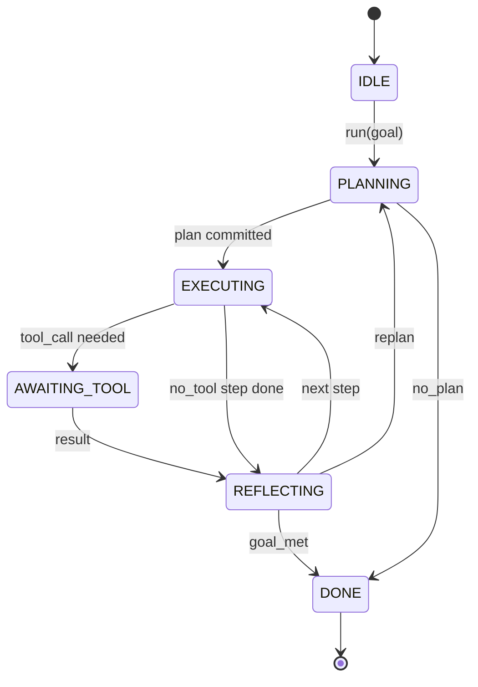

# एजेंट हर्नस लूप अनुबंध

> हर्नस एजेंट है, मॉडल एक सहसंसादक है, यह सबक लूप अनुबंध को फ्रीज करता है आप किसी भी मॉडल में तार कर सकते हैं.

**Type:** Build
**Languages:** Python
**Prerequisites:** Phase 13 lessons 01-07, Phase 14 lesson 01
**Time:** ~90 minutes

## सीखने के लक्ष्य
- स्पष्ट संक्रमणों के साथ एक निर्धारक राज्य मशीन के रूप में एक एजेंट हर्नस लूप निर्दिष्ट करें।
- जीवन चक्र हुक विषयों को लागू करें जो ऑपरेटरों के लिए नीति, दूरदर्शन और सुरक्षा पहियों में तार हैं।
- दो खींच बिंदुओं को परिभाषित करें जहां लूप कॉल करने वाले को नियंत्रण वापस देता है और एक नए इनपुट पर फिर से शुरू होता है।
- प्रति सत्र बजट (चक्र, उपकरण कॉल, दीवार घड़ी) को पार करने पर आंशिक स्थिति लीक किए बिना लागू करें।
- 11 घटना प्रकारों की एक टाइप स्ट्रीम जारी करें ताकि डाउनस्ट्रीम यूआई और ट्रैसर सीधे लूप की जांच किए बिना सदस्यता ले सकें।

```figure
cf-loop-contract
```

## फ्रेम

एक कोडिंग एजेंट जो चालीस बारी के लिए बिना पर्यवेक्षण चलाता है, वह चैट लूप नहीं है। यह एक राज्य मशीन है जिसका नोड्स ऑपरेटर इंटरसेप्ट कर सकता है और जिसका किनारे ऑपरेटर ऑडिट कर सकता है। एक बार जब आप अनुबंध लिख लेते हैं, तो मॉडल, उपकरण या नीतियों को स्विच करना एक रिफैक्टर नहीं होता है। यह एक पंजीकरण कॉल बन जाता है।

इस पाठ को उस अनुबंध का निर्माण करता है. हम छह राज्यों का नाम देते हैं, दस हुक विषय, दो पुल पॉइंट, 11 घटना प्रकार, और एक बजट लिफाफा। हर्नस में बाकी सब कुछ (टूल रजिस्ट्री, JSON-RPC परिवहन, डिस्पैचर, प्लानर) इस आकार में प्लग करता है।

## राज्यों

लूप में छह राज्य हैं, पांच सक्रिय हैं, एक टर्मिनल है।



`IDLE`यह एकमात्र कानूनी प्रवेश बिंदु है।`DONE`यह एकमात्र कानूनी मार्ग है।`AWAITING_TOOL`यह एकमात्र स्थिति है जो एक खींच बिंदु देता है. हर अन्य संक्रमण आंतरिक है.

राज्य मशीन निर्धारक है. एक ही घटना लॉग को देखते हुए, हर्नस उसी राज्य में वापस प्रवेश करता है। यह गुण आपको मॉडल को फिर से कॉल किए बिना डिबगिंग के लिए सत्रों को फिर से खेलने की अनुमति देता है।

## हुक विषय

हुक ऑपरेटर के लूप में सीव हैं। हर्नस दस विषयों को फायर करता है। प्रत्येक विषय किसी भी संख्या में ग्राहक स्वीकार करता है। ग्राहक पंजीकरण क्रम में फायर करते हैं। एक ग्राहक पेलोड को उत्परिवर्तन कर सकता है, बारी को रद्द करने के लिए बढ़ा सकता है, या अगले चरण को छोड़ने के लिए एक sentinel वापस कर सकता है।

```text
before_plan         after_plan
before_tool_call    after_tool_call
before_step         after_step
on_error
on_pause
on_budget_exceeded
on_complete
```

आकार क्लाउड कोड, कर्सर और ओपनकोड के मध्य 2025 तक जो भी मिला है, उसे दर्शाता है। नाम कार्यात्मक हैं, ब्रांड नहीं हैं। एक हुक जो ब्लॉक करता है।`rm -rf``before_tool_call`एक हुक जो एक ओपनटेलीमेट्री अवधि भेजता है में रहता है`after_step`एक हुक जो एक विराम सत्र पर फिर से शुरू होता है में रहता है`on_pause`. .

## खींचने के बिंदु

लूप दो बार नियंत्रण देता है.`AWAITING_TOOL`जब यह एक उपकरण परिणाम के बिना प्रगति नहीं कर सकता है।`on_pause`जब बजट समाप्त हो जाता है या एक हुक स्पष्ट रूप से मानव समीक्षा का अनुरोध करता है।

एक पुल बिंदु कोई अपवाद नहीं है, यह एक वापसी है. कॉल करने वाला हार्नेस की स्थिति की जांच करता है, जो भी हार्नेस ने पूछा है, उसे लाता है, और कॉल करता है।`resume(payload)`. हर्नस को वहीं उठाया जाता है जहां यह रुक गया है. यह एक पायथन जनरेटर के समान आकार है. पुल बिंदु पर परिवहन आपके विकल्प है. एक TUI में यह कुंजी दबाता है. एमसीपी पर यह है`tools/call`. एक कतार पर यह एक नौकरी सर्वेक्षण है.

## घटना प्रवाह

लूप अनुबंध में विशिष्ट बिंदुओं पर टाइप किए गए स्ट्रीम में घटनाओं को जोड़ता है। स्ट्रीम केवल जोड़ता है और ग्राहक किसी भी ऑफसेट से पुनः खेल सकते हैं। कार्यान्वयन किए गए इलेवन घटना प्रकार हैंः

- `session.start` एक बार जब `run(goal)`कहा जाता है
- `plan.draft` जब योजनाकार योजना का मसौदा वापस करता है तो जारी किया जाता है
- `plan.commit` सक्रिय योजना के रूप में मसौदा प्रतिबद्ध होने के बाद जारी किया गया
- `step.start` प्रत्येक निष्पादन चरण की शुरुआत में जारी किया गया
- `step.end` प्रत्येक निष्पादन चरण के अंत में जारी किया जाता है
- `tool.call` जब उपकरण-आवश्यक कदम कॉल करने वाले को नियंत्रण देता है
- `tool.result` एक उपकरण परिणाम के साथ रिज्यूमे पर जारी किया गया
- `tool.error` एक त्रुटि के साथ या जब एक हुक कॉल को समाप्त करता है
- `budget.warn` जब बजट की सीमा तक पहुंच जाती है तो जारी किया जाता है
- `session.pause` जब लूप एक विराम (बजट या हुक) पर उत्पन्न होता है
- `session.complete` लूप तक पहुंचने पर एक बार उत्सर्जित होता है `DONE`

घटनाओं हुक के उपयोगिता लोड दोहरा नहीं करते हैं। हुक अनिवार्य हैं (मुट, abort) । घटनाएं अवलोकन (रिकॉर्ड, जहाज) हैं। उन्हें orthogonal के रूप में व्यवहार करें।

## बजट के परिपत्र

एक सत्र में तीन सीमाएं होती हैं. टर्न काउंट, टूल कॉल काउंट, वॉल-क्लॉक सेकंड। प्रत्येक वॉल इनक्रिमेंट एक से बदल जाता है। प्रत्येक टूल कॉल इनक्रिमेंट टूल कॉल एक से। वॉल-क्लॉक हर स्टेट ट्रांजिशन पर चेक किया जाता है। जब कोई सीमा तक पहुंच जाती है, तो लूप फायर होता है।`on_budget_exceeded`, उत्सर्जन`budget.warn`, फिर संक्रमण करने के लिए `IDLE`अगले पुल बिंदु पर बजट से अधिक कारण के साथ।

बजट एक मार स्विच नहीं है, यह एक रिटर्न है, कॉल करने वाला तय करता है कि बजट का विस्तार और फिर से शुरू करना है या सत्र बंद करना है।

## यह सबक क्या नहीं करता

यह एक मॉडल नहीं कहता है। यह वास्तविक उपकरण नहीं पंजीकृत करता है। यह एक परिवहन नहीं करता है। ये अगले चार पाठ हैं। यह पाठ अनुबंध को नाखून देता है ताकि अगले चार इसे फिर से लिखने के बिना जोड़ सकें।

`main.py`यह एक हार्ड-कोड की योजना तीन चरणों, जिनमें से दो एक उपकरण परिणाम की आवश्यकता है लौटता है। बिंदु लूप है, योजना नहीं है।

## कोड कैसे पढ़ें

`HarnessLoop`यह राज्य, आग हुक, घटनाओं को प्रसारित करता है।`Budget`सीमाओं को ट्रैक करता है। `Event`धारा पर टाइप किए गए लिफाफे है। `HookRegistry`डिस्पैच टेबल है।`_transition`राज्य मशीन के अपरिवर्तित एक ही स्थान पर रहते हैं।

पढ़िए `main.py`ऊपर से नीचे तक. फिर पढ़ें.`code/tests/test_loop.py`परीक्षण प्रत्येक संक्रमण और हर हुक शूटिंग आदेश को चिह्नित करते हैं।

## आगे बढ़ना

उत्पादन में एक हार्नेस बनाने का सबसे कठिन हिस्सा राज्य मशीन नहीं है। यह अनुबंध को निष्पादित कर रहा है। अनुबंध को योजनाकार के गर्म रिलोड से बचना है। इसे एक उपकरण को जीवित रहना है जो गलत JSON लौटाता है। इसे एक हुक को जीवित रहना है जो में उठता है।`before_tool_call`इस पाठ में परीक्षण विफलता मोड का अभ्यास करते हैं उन्हें चलाने, उन्हें तोड़ने, मामलों को जोड़ने.

अगले पाठ में उपकरण रजिस्ट्री जोड़ा जाता है. उसके बाद, JSON-RPC परिवहन. उसके बाद, डिस्पैचर. पाठ चौबीस तक, इस फ़ाइल में लूप वास्तविक बजट लागू वास्तविक उपकरणों के खिलाफ एक वास्तविक योजना चला रहा होगा.
