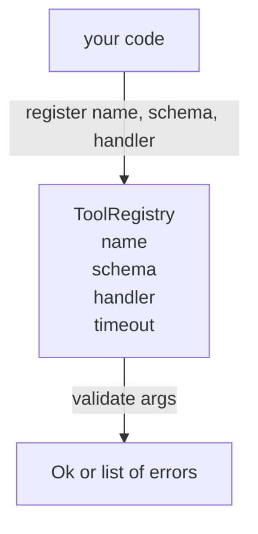

# योजना सत्यापन के साथ उपकरण रजिस्ट्री

> एक उपकरण एजेंट सत्यापित नहीं कर सकता है एक उपकरण एजेंट कॉल नहीं कर सकते हैं. आप उपकरण बनाने से पहले रजिस्ट्री और स्कीमा चेकर का निर्माण करें.

**Type:** Build
**Languages:** Python
**Prerequisites:** Phase 13 lessons 01-07, Phase 14 lesson 01
**Time:** ~90 minutes

## सीखने के लक्ष्य
- टूल नाम → schema → handler का टाइप किया गया रजिस्ट्री रखें जो डिस्पैचर एक बार पूछ सकता है और उसके बाद भरोसा कर सकता है।
- एक JSON Schema 2020-12 उपसमूह को लागू करें जो कि उपकरण कॉल के 90% की खोजशब्दों को कवर करता है।
- सटीक, json-pointer के रूप में त्रुटि पथ वापस करें ताकि मॉडल एक बार फिर से यात्रा में स्वयं को सुधार सकता है।
- स्पष्ट रूप से ओवरराइड किए बिना पुनः पंजीकरण को अस्वीकार करें, क्योंकि मौन ओवरराइट्स उत्पादन उपकरण कैटलॉग के लिए बहती हैं।
- सत्यापनकर्ता को शुद्ध रखें (कोई I/O, कोई समय, कोई ग्लोबल नहीं) ताकि इसे पुनः प्ले लॉग पर फिर से चलाया जा सके।

```figure
cf-registry-validate
```

## रजिस्ट्री उपकरण से पहले क्यों आती है

2026 में एक कोडिंग एजेंट में एक एकल संदर्भ विंडो में मॉडल फिट होने से अधिक पंजीकृत उपकरण हैं। एक गैर-नाज़ुक हर्नस दो सौ उपकरण दर्ज करेगा और किसी भी मोड़ पर दस से चालीस तक सतह को हटा देगा। रजिस्ट्री "कौन से उपकरण मौजूद हैं", "उनके तर्क किस आकार में हैं", और "मैं किस हैंडलर को कहता हूं।" एक बार इन तीनों उत्तरों को चिपका दिया गया है, शेष हर्नस अनुमान लगाना बंद कर सकता है।

हम जो गलती से बच रहे हैं वह है योजनाओं के बिना शिपिंग हैंडलर या सत्यापन के बिना शिपिंग योजनाएं। दोनों आम हैं। दोनों अगले स्तर (पाठ बीस-तीन में डिस्पैचर) को एक अनुमान लगाने के खेल में बदल देते हैं जहां एकमात्र विफलता मोड है।

## एक उपकरण रिकॉर्ड कैसा दिखता है

```text
ToolRecord
  name        : str          (unique, lowercase alphanumeric and underscore segments separated by dots, e.g., snake_case.segment.case)
  description : str          (one line, shown to the model)
  schema      : dict         (JSON Schema 2020-12 subset)
  handler     : Callable     (async or sync, returns Any)
  idempotent  : bool         (dispatcher uses this for retry decisions)
  timeout_ms  : int          (override per-tool dispatcher default)
```

स्कीमा एकमात्र क्षेत्र है जिसे सत्यापनकर्ता छूता है। हैंडलर इसके लिए अस्पष्ट है। हम उन्हें जानबूझकर अलग करते हैं। स्कीमा डेटा है। हैंडलर कोड है। उन्हें मिलाकर आपको हैंडलर के अंदर सत्यापन तर्क लगाने के लिए लुभाता है, जो हम रोक रहे हैं।

## JSON Schema 2020-12 उपसमूह

2020-12 के लिए पूर्ण विवरण एक पेपर है. हमें आठ कीवर्ड की आवश्यकता है.

```text
type           string / number / integer / boolean / object / array / null
properties     map of property name -> schema
required       list of property names
enum           list of allowed primitive values
minLength      integer, applies to strings
maxLength      integer, applies to strings
pattern        ECMA-262-compatible regex, applies to strings
items          schema applied to every array element
```

यह पर्याप्त है कि एक उपकरण एपीआई वास्तव में क्या जरूरत है कवर करने के लिए. हम जोड़े जा रहे हैं कीवर्ड (एकOf, किसीOf, allOf, $ref, सशर्त) उत्पादन योजनाओं में मान्य हैं, लेकिन हम एक रजिस्ट्री का निर्माण कर रहे हैं, एक JSON योजना इंजन नहीं.

## Json पॉइंटर त्रुटि पथ

जब सत्यापन विफल होता है, तो सत्यापनकर्ता त्रुटियों की एक सूची देता है। प्रत्येक त्रुटि में इनपुट में एक json-pointer पथ होता है। एक पॉइंटर गुण नामों और सरणी सूचकांक का एक स्लैश-प्रीफिक्स्ड अनुक्रम है।

```text
{"a": {"b": [1, 2, "x"]}}
                    ^
                    /a/b/2
```

मॉडल वाक्य पढ़ने की तुलना में त्रुटि पथ को बेहतर पढ़ता है। यदि एक योजना की आवश्यकता होती है `args.user.email`और मॉडल एक पूर्णांक पारित किया, त्रुटि होना चाहिए `/user/email`के साथ`expected_type: string`. मॉडल प्राकृतिक भाषा के बिना अगले कॉल में इसे ठीक करता है.

## पंजीकरण और ओवरराइड

`register(name, schema, handler, **opts)`डिफ़ॉल्ट रूप से पुनः पंजीकरण को अस्वीकार करता है।`override=True`यह परिचालन स्वच्छता है. कोडबेस के दो भागों को चुपचाप एक ही उपकरण नाम पंजीकृत है कि उत्पादन में खोजने के लिए एक सप्ताह लगता है की तरह कीड़े है.

रजिस्ट्री में तीन पढ़ने के तरीके बताए गए हैं।`get(name)`रिकॉर्ड लौटाता है या बढ़ाता है। `validate(name, args)`एक `Ok`या त्रुटियों की सूची।`names()`पंजीकरण क्रम में उपकरण नाम लौटाता है।

## वैधकर्ता क्या है और क्या नहीं है

यह एक ही स्कीमा पेड़ पर पास है, पुनरावर्ती है। यह शुद्ध है। यह हैंडलर नहीं बुलाता है। यह टाइप (एक स्ट्रिंग) को मजबूर नहीं करता है।`"42"`यह चुपचाप ट्रंक नहीं करता है।

यह सुरक्षा सीमा नहीं है. सत्यापन पास होने के बाद भी एक दुर्भावनापूर्ण हैंडलर गलत व्यवहार कर सकता है। पाठ 23 में डिस्पैचर टाइमआउट और सैंडबॉक्स परतें जोड़ता है। रजिस्ट्री आकार जोड़ता है।

## आकार



## कोड कैसे पढ़ें

`code/main.py`परिभाषित करता है `ToolRegistry`,`ToolRecord`,`ValidationError`, और आठ सत्यापनकर्ता कार्यों। सत्यापनकर्ता पर भेजता है`schema["type"]`(या एक योजना से निपटता है `enum`प्रत्येक प्रकार सत्यापनकर्ता या तो एक खाली सूची या एक सूची देता है `ValidationError`. शीर्ष स्तर के वॉकर त्रुटियों को जोड़ता है और नीचे जाने के रूप में पथ खंडों को पूर्वनिर्धारित करता है।

`code/tests/test_registry.py`पंजीकरण, ओवरराइड, सत्यापन सफलता, पथों के साथ सत्यापन विफलता और उपसमूह में प्रत्येक कीवर्ड को कवर करता है।

## आगे बढ़ना

दो विस्तार आप चाहते हैं एक बार इस सबक भूमि हैं`$ref`स्थानीय परिभाषा ब्लॉक के खिलाफ संकल्प, और `additionalProperties: false`दोनों छोटे हैं. दोनों को जोड़ने के लिए आम हैं क्योंकि उपकरण कैटलॉग पचास से अधिक उपकरण बढ़ता है. हम उन्हें एक पाठ के तहत फ़ाइल रखने के लिए पाठ से बाहर छोड़ दिया.

अगले पाठ (बीस-दो) JSON-RPC स्टूडियो परिवहन का निर्माण करता है जो इस रजिस्ट्री को मॉडल क्लाइंट के लिए सतह पर लाता है। पाठ के बाद (बीस-तीन) समय और पुनः प्रयासों के साथ डिस्पैचर के पीछे दोनों को लपेटता है।
