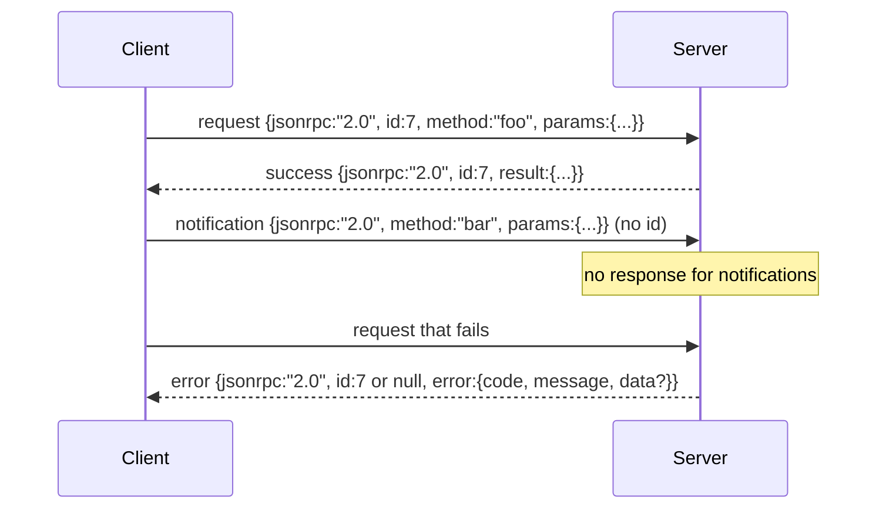

# JSON-RPC 2.0 Over Newline-Delimited Stdio

> एक मॉडल क्लाइंट और एक टूल सर्वर के बीच परिवहन स्टूडियो पर JSON-RPC है। इसे एक बार हाथ से रोल करने से आपको पता चलता है कि प्रत्येक फ्रेमिंग परत क्या भुगतान कर रही है।

**Type:** Build
**Languages:** Python
**Prerequisites:** Phase 13 lessons 01-07, Phase 14 lesson 01
**Time:** ~90 minutes

## सीखने के लक्ष्य
- JSON-RPC 2.0 को नई लाइन-सीमित JSON के रूप में ढाँचा में बोलें stdin और stdout पर।
- पांच मानक त्रुटि कोड (-32700, -32600, -32601, -32602, -32603) का नक्शा बनाएं और उन्हें सही अर्थशास्त्र के साथ सतह पर रखें।
- नए लिफाफे की कुंजी का आविष्कार किए बिना अनुरोधों, प्रतिक्रियाओं, सूचनाओं और बैचों को अलग करें।
- शेष धारा को जहर के बिना प्रति पंक्ति एक विश्लेषण त्रुटि को संभालें।
- io.BytesIO का उपयोग करके एक आत्म-समाप्त डेमो बनाएं ताकि पाठ बिना बच्चे की प्रक्रिया के चलाए।

```figure
cf-jsonrpc-frames
```

## JSON-RPC भाषा का रूप क्यों बने रहे

2026 में एक कोडिंग एजेंट एक सत्र में शायद बारह टूल सर्वर से बात करता है। प्रत्येक सर्वर एक अलग प्रक्रिया या दूरस्थ अंत बिंदु है। तार प्रारूप 2013 से समान है। JSON-RPC 2.0 दो पृष्ठों की विशिष्टता है। यह जीवित रहता है क्योंकि विकल्प (gRPC, HTTP प्रति कॉल, कस्टम बाइनरी) सभी एक व्यापार विनिमय लागू करते हैं JSON-RPC नहीं करता हैः वे या तो स्ट्रीमिंग या बैचिंग या परिवहन-संलग्नक चुनते हैं। JSON-RPC स्टूडियो, सॉकेट, वेब सॉकेट और HTTP के पार सममित है, और एक क्लाइंट एक सर्वर चला सकता है जिसे उसने कभी नहीं देखा है यदि दोनों विनिर्देशों का सम्मान करते हैं।

इस पाठ में स्टूडियो संस्करण का निर्माण किया गया है। न्यूलाइन-डेलीमिटेड JSON। प्रत्येक अनुरोध एक पंक्ति है। प्रत्येक प्रतिक्रिया एक पंक्ति है। परिवहन सीमा है `\n`. .

## तार का आकार

चार लिफाफे के आकार मौजूद हैं दो क्लाइंट द्वारा बोल रहे हैं दो सर्वर द्वारा बोल रहे हैं।



सूचना में कोई `id`. सर्वर को इसका जवाब नहीं देना चाहिए. यदि सर्वर एक सूचना के लिए प्रतिक्रिया देता है, तो क्लाइंट को इसे कॉल साइट से संलग्न करने का कोई तरीका नहीं है. यह एकल नियम फ्रेमिंग गणित सरल रखता है।

बैच अनुरोधों या सूचनाओं की एक JSON सरणी है। सर्वर किसी भी क्रम में प्रतिक्रियाओं की एक सरणी के साथ जवाब देता है, एक प्रति गैर-सूचना प्रविष्टि। यदि बैच में प्रत्येक प्रविष्टि एक सूचना है, तो सर्वर कुछ भी वापस नहीं भेजता है।

## पांच त्रुटि कोड

```text
-32700  Parse error      JSON could not be parsed
-32600  Invalid Request  Envelope shape is wrong
-32601  Method not found
-32602  Invalid params
-32603  Internal error
```

-32000 और -32099 के बीच के कोड सर्वर-परिभाषित त्रुटियों के लिए आरक्षित हैं। बाकी सब कुछ अनुप्रयोग-परिभाषित है। पाठ पांच पर चिपके रहता है। यदि आपका हैंडलर उठाता है, तो परिवहन इसे -32603 के रूप में लपेटता है।`data.exception`. .

एक विश्लेषण त्रुटि एक विशेष नियम है।`id`उत्तर में है `null`, क्योंकि अनुरोध कभी भी पहचान निकालने के लिए पर्याप्त विश्लेषण नहीं किया गया था।

## न्यूलाइन फ्रेमिंग और BytesIO डेमो

परिवहन एक समय में एक पंक्ति पढ़ता है। एक पंक्ति तक बाइट्स है और शामिल है `\n`यदि किसी पंक्ति का विश्लेषण नहीं किया जा सकता है, तो परिवहन एक -32700 प्रतिक्रिया लिखता है`id: null`और जारी है. धारा जहर नहीं है. अगले पंक्ति ताजा विश्लेषण किया जाता है.

पाठ के लिए हम एक को लपेटते हैं `io.BytesIO`सर्वर EOF तक अनुरोधों को पढ़ता है, प्रत्येक के लिए प्रतिक्रिया लिखता है, और वापस देता है। क्लाइंट प्रतिक्रियाओं को वापस पढ़ता है। कोई प्रक्रिया स्पैन नहीं। कोई टाइमआउट नहीं। परिवहन व्यवहार वास्तविक उपप्रक्रिया पाइप के समान है क्योंकि पायथन का `io`इंटरफ़ेस समान प्रस्तुत करता है `.readline()`और `.write()`अनुबंध।

## विधि भेजना

परिवहन नहीं जानता कि कौन से तरीके मौजूद हैं। यह एक कॉल करने के लिए हाथ देता है।`handler(method, params)`एक परिणाम वापस करता है या बढ़ता है। तीन अपवाद वर्ग सतह विशिष्ट कोड।

```text
MethodNotFound -> -32601
InvalidParams  -> -32602
Anything else  -> -32603 with exception name in data
```

परिवहन कभी भी एक उपकरण रजिस्ट्री नहीं देखता है. रजिस्ट्री हैंडलर के पीछे बैठता है. यह वह परत है जिसे हम चाहते हैं। परिवहन JSON-RPC बोलता है। रजिस्ट्री उपकरण के आकार बोलती है। डिस्पैचर (पाठ बीस-तीन) उन्हें एक साथ सिलाई करता है।

## त्रुटियों पर स्ट्रीम व्यवहार

```text
client writes              server reads             server writes
---------------            -----------              -------------
{...valid request...}      parses ok                {...response, id matches...}
{...broken json...         parse fails              {id:null, error: -32700}
{...valid request...}      parses ok                {...response, id matches...}
{...missing method...}     invalid envelope         {id:X, error: -32600}
```

एक टूटी हुई JSON लाइन लूप को नहीं रोकती। एक गायब `method`क्षेत्र लूप को नहीं रोकता है। एक हैंडर अपवाद लूप को नहीं रोकता है। परिवहन EOF तक पढ़ता रहता है।

## सूचनाएं और असंबद्ध प्रवाह

एक सूचना आग लगाना और भूलना है। हर्नस प्रगति की घटनाओं, रद्द करने के संकेतों और लॉग लाइनों के लिए सूचनाओं का उपयोग करता है। सूचनाएं यह है कि लंबे समय से चल रहे उपकरण प्रत्येक के लिए रेंड-ट्रिपिंग के बिना स्थिति अपडेट को कैसे स्ट्रीम कर सकते हैं।

पाठ एक आउटबाउंड सूचना सहायक को लागू करता है, `write_notification`. सर्वर इसका उपयोग एक अनुरोध उड़ान में होने के दौरान प्रगति को प्रसारित करने के लिए करता है। डेमो पैटर्न दिखाता हैः एक अनुरोध आता है, प्रबन्धक दो प्रगति सूचनाएं जारी करता है, फिर अंतिम प्रतिक्रिया लिखता है।

## कोड कैसे पढ़ें

`code/main.py`परिभाषित करता है `StdioTransport`, पार्स सहायक (`parse_request`), तीनों लेखकों (`write_response`,`write_error`,`write_notification`), और डिस्पैच लूप `serve`. त्रुटि कोड स्थिरांक मॉड्यूल दायरे पर रहते हैं.

`code/tests/test_transport.py`पांच त्रुटि कोड, सूचनाएं (कोई प्रतिक्रिया नहीं लिखी गई), बैच (आरे में, सरणी बाहर, सूचनाओं को छोड़ दिया गया), टूटने वाला JSON (संसर्जना त्रुटि फिर जारी है), और असंबद्ध प्रवाह जहां एक संसाधित कॉल के बीच सूचना लिखता है।

## आगे बढ़ना

इस परिवहन के लिए पर्याप्त है जो पाठ के लिए आगे है। उत्पादन परिवहन तीन बातें जोड़ते हैं। एक सहसंबंध आईडी क्षेत्र जो प्रेषण से बचता है (आपका`id`यह पहले से ही है, लेकिन एक जाल में आप एक बाहरी निशान आईडी की जरूरत है। एक रद्द करने चैनल (एक सूचना जैसे `$/cancelRequest`और एक सामग्री प्रकार के बातचीत हाथ पकड़ने के लिए ताकि एक ही सॉकेट JSON-RPC और Streamable HTTP बोल सकते हैं. उनमें से कोई भी तार को बदल नहीं है. वे मेटाडेटा जोड़ते हैं.
