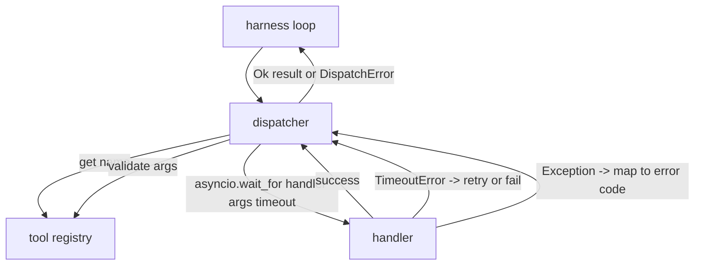
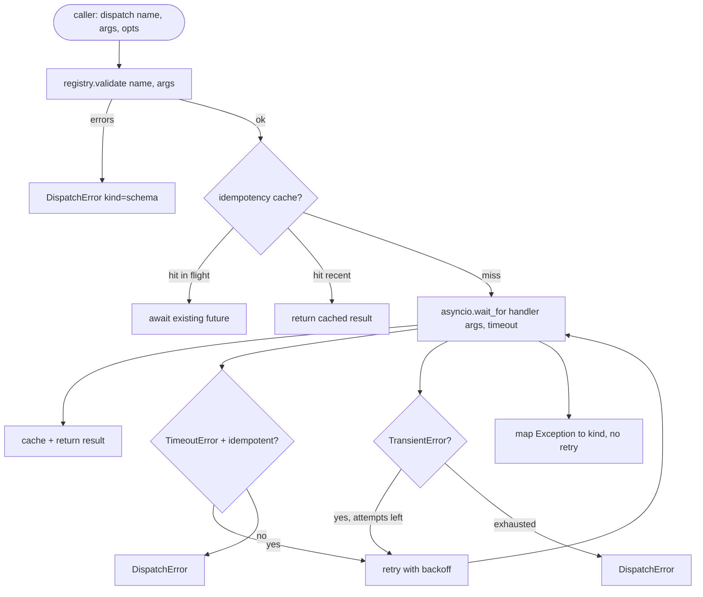

# फ़ंक्शन कॉल डिस्पेंसर

> डिस्पैचर है जहां हर्नस हर वादा के लिए भुगतान करता है योजना बनाया गया समय, पुनः प्रयास, dedupe, त्रुटि मैपिंग. सभी एक सीम पर.

**Type:** Build
**Languages:** Python
**Prerequisites:** Phase 13 lessons 01-07, Phase 14 lesson 01
**Time:** ~90 minutes

## सीखने के लक्ष्य
- एक टूल हैंडल को प्रति कॉल टाइमआउट में लपेटें जो लूप लटकाए जाने के बजाय टाइप की गई त्रुटि लौटाता है।
- जिक्र और अधिकतम प्रयास संख्या के साथ एक्सपोनेंशियल बैकऑफ पुनः प्रयास करें।
- एक idempotency कुंजी पर दोहराव दोहराव ताकि धीमी मूल के साथ दौड़ने वाला एक दोहराव दो बार नहीं चलाया जाए।
- मानचित्र हैंडल अपवाद और एक एकल त्रुटि के लिए परिवहन दोषों को कवर करना है जो कि हर्नस लूप पहले से ही समझता है।
- समवर्ती सीमा के साथ समानांतर डिस्पैचिंग को बंधी ताकि चालीस उपकरण कॉल का फैन आउट घटना लूप को समाप्त न करे।

```figure
cf-dispatch-retry
```

## जहां डिस्पेंचर बैठता है

हर्नस लूप (पाठ बीस) और टूल रजिस्ट्री (पाठ बीस एक) के बीच। परिवहन (पाठ बीस दो) लूप को खिलाता है। लूप डिस्पैचर को टूल कॉल देता है। डिस्पैचर रजिस्ट्री को कॉल करता है, हैंडलर चलाता है, और या तो एक परिणाम या JSON-RPC के आकार में त्रुटि कूप लौटाता है।



डिस्पैचर एकमात्र परत है जो टाइमर, रिट्रीट और आइडेम्पोटेंसी के बारे में जानती है. लूप नहीं जानता है. रजिस्ट्री नहीं करता है. हैंडलर नहीं करता है. यह अलगाव है।

## समय सीमा

प्रत्येक उपकरण में एक डिफ़ॉल्ट टाइमआउट है. रजिस्ट्री रिकॉर्ड में है `timeout_ms`डिस्पैचर एक कॉल पर ओवरराइड से इसे ओवरराइड करता है जब हार्नेस एक पारित करता है। हम उपयोग करते हैं`asyncio.wait_for`समय पर, प्रबन्धक कार्य रद्द कर दिया जाता है और डिस्पैचर वापस आ जाता है।`DispatchError(kind="timeout")`. .

समय-समय पर अक्षम उपकरण के लिए डिफ़ॉल्ट रूप से एक पुनः प्रयोज्य त्रुटि नहीं है।`db.write`एक बार फिर से प्रयास करने से लेखन दोहराया जाता है। डिस्पैचर सम्मान करता है`idempotent`रजिस्ट्री रिकॉर्ड से ध्वज. idempotent उपकरण पुनः प्रयास करें. nonidempotent उपकरण नहीं करते.

## एक्सपोनेंशियल बैकॉफ के साथ पुनः प्रयास

पुनः प्रयास नीति अधिकतम तीन प्रयास है। बैकऑफ झटका के साथ घातीय है।

```text
attempt 1  -> delay 0
attempt 2  -> delay 0.1s * (1 + random[0..0.5])
attempt 3  -> delay 0.4s * (1 + random[0..0.5])
```

केवल `timeout`और `transient`त्रुटि पुनः प्रयास करें।`schema`त्रुटि, एक `not_found`, या एक `internal`योजना त्रुटियां निर्धारक हैं। पुनः प्रयास परिणाम को नहीं बदलता और बजट को जलाता है।

पुनः प्रयास लूप हर्न से बजट का सम्मान करता है। यदि कॉल करने वाले के बजट में शून्य शेष उपकरण कॉल हैं, डिस्पैचर पहले प्रयास पर जल्दी विफल रहता है और वापस आता है `kind="budget_exceeded"`. .

## असमर्थता कुंजी का निर्णायक

एक पुनः प्रयास जो उड़ान में मूल अभी भी उड़ान में है एक वास्तविक उत्पादन बग है। पहला कॉल चार बिंदु नौ सेकंड (बस समय के अंतराल के नीचे) पर लटका हुआ है। पुनः प्रयास पांच सेकंड में फायर करता है। अब दो अनुरोध एक ही बैक-एंड के खिलाफ दौड़ते हैं। यदि उपकरण है`payments.charge`, तुम दो बार चार्ज किया है.

डिस्पैचर एक वैकल्पिक स्वीकार करता है `idempotency_key`यदि एक कॉल आने पर एक ही कुंजी उड़ान में है, तो डिस्पैचर उड़ान के दौरान भविष्य का इंतजार करता है और इसका परिणाम देता है। कैश में देर से पुनः प्रयासों को अवशोषित करने के लिए पूर्ण होने के बाद साठ सेकंड तक कुंजी होती है।

यह कुंजी कॉल करने वाले की जिम्मेदारी है। यह हर्नर इसे प्लानर से प्राप्त करता हैः`f"{step_id}:{tool_name}:{hash(args)}"`डिस्पैचर कुंजी का आविष्कार नहीं करता है, क्योंकि केवल तर्क से कुंजी निकालने से दो अर्थिक रूप से अलग-अलग कॉल एक जैसे दिखते हैं।

## त्रुटि लिफाफा

एक असफल डिस्पैच एक ही आकार वापस करता है।

```text
DispatchError
  kind        : "timeout" | "transient" | "schema" | "not_found" | "internal" | "budget_exceeded"
  message     : str
  attempts    : int
  jsonrpc_code: int   (one of -32601, -32602, -32603)
```

हर्नस लूप मानचित्र `kind`अगले राज्य में।`schema`और `not_found`जाओ `on_error`और एक रिप्लेन को ट्रिगर करें।`timeout`और `transient`जाओ `on_error`और प्रयासों के आधार पर पुनर्प्रणाली कर सकते हैं या नहीं कर सकते हैं। `budget_exceeded`ट्रिगर`on_budget_exceeded`. .

## फैन आउट पर मुद्रांकन सीमा

`gather(*calls)`एक ही समय में सभी कोरोटीन चलाता है। चालीस उपकरण कॉल के साथ, यह चालीस खुला सॉकेट या चालीस उपप्रक्रिया पाइप है। अधिकांश बैकेंड एक क्लाइंट से चालीस समानांतर कनेक्शन पसंद नहीं करते हैं।

डिस्पैचर लपेटता है `gather`एक सेमाफोर में। डिफ़ॉल्ट समवर्ती सीमा आठ है। प्रत्येक कॉल डिस्पैचिंग से पहले सेमाफोर प्राप्त करता है और पूरा होने पर रिलीज़ करता है। कॉल करने वाला देखता है `gather`-आकार का आउटपुट लेकिन वास्तविक शेड्यूलिंग सीमित है।

## एक कॉल के लिए प्रवाह



## कोड कैसे पढ़ें

`code/main.py`परिभाषित करता है `Dispatcher`,`DispatchError`और `TransientError`डिस्पैचर निर्माण पर एक रजिस्टर लेता है.`dispatch(name, args, ...)`प्रति प्रयास समय सीमाओं को इनलाइन अंदर लागू किया जाता है`_run_with_retries`उपयोग करना`asyncio.wait_for`. .`gather_bounded(calls)`समवर्ती सीमा के साथ कई डिस्पैच चलाता है।

`code/tests/test_dispatcher.py`समय सीमा निष्कासन, पारगमन पर पुनः प्रयास, स्कीम त्रुटि पर कोई पुनः प्रयास नहीं, निष्क्रियता dedupe (एक ही हैंडलर कॉल के लिए एक ही कुंजी को विफल करने वाले दो समवर्ती कॉल) और समवर्ती सीमा (कार्य में सेमेफोर) को कवर करता है।

परीक्षणों का उपयोग करें`asyncio.sleep(0)`और निर्धारक `Counter`-आधारित हैंडलर, इसलिए वे मिलीसेकंड में समाप्त होते हैं और दीवार घड़ी समय पर निर्भर नहीं करते हैं।

## आगे बढ़ना

दो विस्तार उत्पादन डिस्पैचर जोड़ते हैं. पहले, प्रत्येक संक्रमण पर संरचित लॉगिंग (जो लूप के घटना प्रवाह पहले से ही आपको देता है, लेकिन डिस्पैचर को भी उत्सर्जित करना चाहिए `dispatch.attempt`और `dispatch.retry`घटनाएं) दूसरा, सर्किट ब्रेकः एक खिड़की में N विफलताओं के बाद, एक उपकरण एक ठंडा अवधि प्राप्त करता है जहां डिस्पैच तुरंत वापस आते हैं `kind="circuit_open"`संचालक की कोशिश करने के बजाय दोनों इस डिस्पैचर के ऊपर फिट हुए बिना अनुबंध को बदल दिया।

पाठ 24 डिस्पैचर को एक योजना-और-कार्यकारी एजेंट के साथ चिपकाता है ताकि आप चारों टुकड़ों को गति में देखें।
