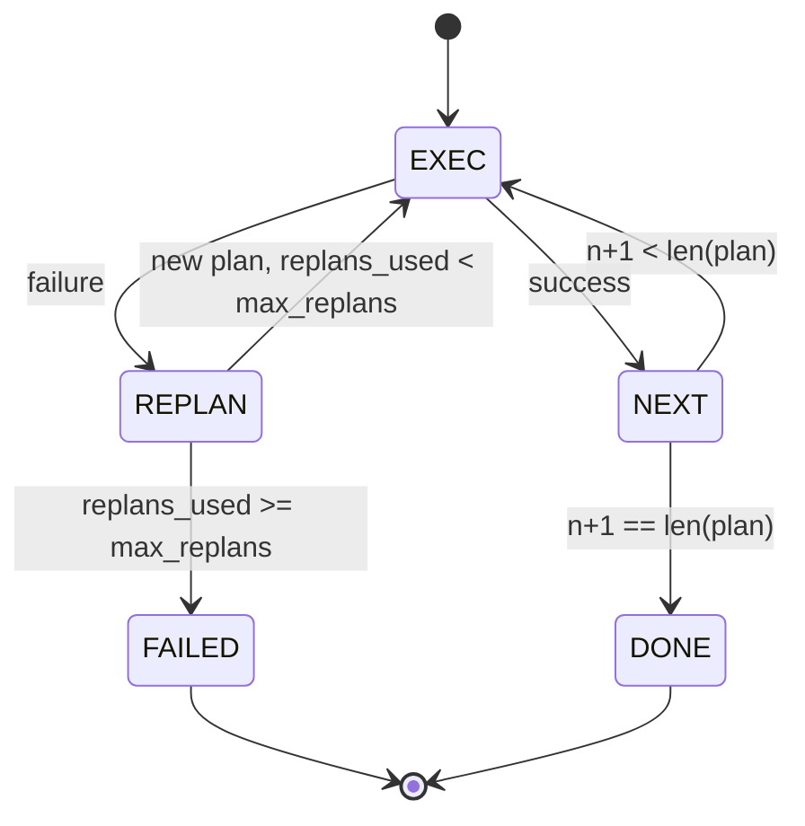

# नियोजन-कार्यकारी नियंत्रण प्रवाह

> एक योजना जो विफलता से नहीं बच सकती एक स्क्रिप्ट है एक स्क्रिप्ट जो पुनर्व्यवस्थित कर सकती है एक एजेंट है। पहले पुनर्व्यवस्थितकर्ता का निर्माण करें।

**Type:** Build
**Languages:** Python
**Prerequisites:** Phase 13 lessons 01-07, Phase 14 lesson 01
**Time:** ~90 minutes

## सीखने के लक्ष्य
- एक योजना को टाइप किए गए चरणों की एक क्रमबद्ध सूची के रूप में प्रस्तुत करें ताकि निष्पादक प्रगति और परिणाम के बारे में तर्क दे सके।
- नियोजक को नियंत्रित विफलता के साथ चरणों को क्रमशः निष्पादित करें।
- संदर्भ में पूर्व त्रुटि के साथ वर्तमान कर्सर से पुनःप्रकाशित करें ताकि अगली योजना सूचित हो सके।
- प्रत्येक संशोधन पर एक योजना भिन्नता जारी करें ताकि डाउनस्ट्रीम ट्रैकर या UI दिखा सके कि योजना क्यों बदल गई।
- दो बजट लागू करेंः एक कठिन कदम छत और एक कठिन रिप्लेन छत।

```figure
cg-plan-replan
```

## योजना और निष्पादन, विचार श्रृंखला नहीं

एक सोच श्रृंखला एजेंट टोकन जारी करता है और लूप को यह अनुमान लगाने देता है कि उपकरण कॉल कहां समाप्त होता है। एक योजना-और-कार्यकारी एजेंट पहले एक संरचित योजना जारी करता है, फिर प्रत्येक चरण को निर्धारात्मक रूप से निष्पादित करता है। योजना डेटा है जो हर्नस आत्म-दृष्टि कर सकता है। निष्पादन एक डिस्पैचर के माध्यम से उस डेटा को चलाने वाला हर्नस है।

एक योजनाकार जो एक योजना बनाता है, एक निष्पादक जो योजना चलाता है. दिलचस्प काम यह है कि क्या होता है जब निष्पादक विफलता का सामना करता है. तीन विकल्पः

```text
1. Abort         (return failed, surface the error)
2. Skip          (mark step failed, continue with the rest)
3. Replan        (hand the error to the planner, get a new plan from the cursor)
```

रिप्लेन वह है जो एक पटकथा को एक एजेंट में बदल देता है।

## चरण की आकृति

```text
Step
  id              : int           (monotonic within a plan revision)
  tool_name       : str
  args            : dict
  expected_outcome: str           (planner's stated success condition)
  result          : Any | None
  error           : str | None
```

`expected_outcome`यह एक छोटा वाक्य है जो योजनाकार चरण के साथ जारी करता है। इसे निष्पादक द्वारा लागू नहीं किया जाता है। यह दो चीजों के लिए हैः योजना को संशोधित करते समय इसे रीप्लानेर पढ़ता है; घटना प्रवाह इसे जारी करता है ताकि ट्रैसर दिखा सके "इस चरण को X करना था।"

## योजनाकार आकार

```python
def planner(goal: str, history: list[Step], last_error: str | None) -> list[Step]:
    ...
```

एक शुद्ध कार्य।`goal`उपयोगकर्ता का लक्ष्य है। `history`यह पहले से ही किए गए चरणों (परिणाम और त्रुटियों के साथ भर दिया गया है) है। `last_error`पहले कॉल पर कोई नहीं है और प्रत्येक बाद के कॉल पर नवीनतम विफलता संदेश। प्लानर कर्सर से शुरू होने वाली अगली योजना वापस करता है।

योजनाकार को निष्पादक के बारे में पता नहीं है, वह पुनः प्रयासों के बारे में नहीं जानता है, वह समय सीमा के बारे में नहीं जानता है, वह एक योजना बनाता है। यह सब है।

## निष्पादक

निष्पादक एक छोटी राज्य मशीन है. प्रत्येक कदम डिस्पैचर के माध्यम से चलता है। परिणाम तीन चीजों में से एक हैः सफलता, विफलता-पुनः योजना, विफलता-मौतिक। पुनरावृत्ति विफलताएं योजनाकार को वापस देती हैं। घातक विफलताएं (बजट से अधिक, पुनरावृत्ति छत मारा) एक रिटर्न देती हैं।`FAILED`सत्र का परिणाम।



## पुनरावलोकन पर योजना भिन्नता

जब योजनाकार विफलता के बाद एक नई योजना वापस करता है, तो निष्पादक एक `plan.diff`तीन क्षेत्रों के साथ घटना।

```text
removed: list of step ids that were in the old plan and are not in the new
added  : list of step ids in the new plan that were not in the old
revised: list of step ids whose tool_name or args changed
```

एक ट्रैसर या UI इसे हटाए गए चरणों पर एक स्ट्राइकट्रू और जोड़े गए चरणों पर एक हाइलाइट के रूप में प्रस्तुत कर सकता है। मुद्दा अंतर प्रारूप नहीं है। मुद्दा यह है कि संशोधन एक दृश्य घटना है, एक मौन पुनर्लेखन नहीं।

## दो बजट, दोनों कठिन

`max_steps`डिफ़ॉल्ट रूप से बारह है। एक रैखिक पांच-चरण योजना जो दो बार योजना बनाती है और प्रत्येक बार छह चरणों को जोड़ती है और बजट से अधिक हो जाएगी। निष्पादक रिप्लेन से इनकार करेगा और विफलता लौटाएगा।

`max_replans`एक योजनाकार जो एक ही टूटी योजना को लगातार पांच बार लौटाता है, अन्यथा तब तक लूप होगा जब तक कि चरण बजट इसे पकड़ नहीं लेता। कैपिंग रिप्लांस विफलता को तेज और कारण को स्पष्ट बनाता है।

## इस पाठ में निर्धारक नियोजक

हम इस पाठ में एक मॉडल नहीं कहते हैं। पाठ एक निर्धारक योजनाकार को भेजता है जो एक योजना का चयन करता है`last_error`. .

```text
last_error is None    -> emit a four-step plan
last_error matches X  -> emit a three-step plan that routes around X
last_error matches Y  -> emit a two-step plan that gives up gracefully
otherwise             -> return [] (signals nothing to replan)
```

यह प्रत्येक संक्रमण पथ पर निष्पादक के व्यवहार का परीक्षण करने के लिए पर्याप्त हैः सफलता, पुनः योजना-एक बार, पुनः योजना-दो बार, पुनः योजना-समाप्तता, और चरण-बजट-समाप्तता।

## परिणाम आकार

```text
SessionResult
  status      : "completed" | "failed"
  reason      : str     ("goal_met" | "step_budget" | "replan_budget" | "no_plan")
  history     : list[Step]
  revisions   : list[PlanDiff]
  events      : list[Event]
```

पाठ बीस से हर्नस लूप इसे सीधे पढ़ सकता है। पाठ बीस से डिस्पैचर प्रत्येक चरण को निष्पादित करता है। पाठ बीस से एक रजिस्ट्री प्रत्येक चरण के आरजी को मान्य करता है। पाठ बीस से दो परिवहन एक मॉडल क्लाइंट के लिए JSON-RPC पर इस पूरे प्रवाह को सतह पर लाएगा।

## कोड कैसे पढ़ें

`code/main.py`परिभाषित करता है `PlanExecuteAgent`,`Step`,`PlanDiff`,`SessionResult`, और निर्धारक नियोजक. निष्पादक एक एकल है`run(goal)`विधि जो एक `SessionResult`. योजना अंतर की तुलना चरण आईडी और `(tool_name, args)`टूपल्स.

`code/tests/test_agent.py`एक रैखिक सफलता, एक मध्य-योजना विफलता को कवर करता है जो एक बार पुनः योजना बनाती है, पुनः योजना बनाती है जो लौटती है `failed:replan_budget`, चरण-बजट समाप्ति, और योजना-विभेद घटना प्रारूप।

## आगे बढ़ना

एक बार जब आप इसे एक वास्तविक मॉडल में वायर करते हैं तो आपको दो एक्सटेंशन चाहिए। पहला, आंशिक योजना कैशिंगः जब छह चरणों में से पहले तीन चरणों के लिए एक योजना सफल होती है और फिर विफल होती है, तो आप पहले तीन को फिर से चलाना नहीं चाहते हैं। निष्पादक पहले से ही इतिहास रखता है; योजनाकार को इसे पढ़ना पड़ता है। दूसरा, समानांतर शाखाएंः वर्तमान निष्पादक सख्ती से अनुक्रमिक है। एक योजनाकार जो एक स्वतंत्र शाखा (`gather_step`इसके बजाय `next_step`) डिस्पैचर के माध्यम से दो उपकरण कॉल एक साथ चला सकते हैं।

दोनों ही वास्तविक जटिलता जोड़ते हैं. दोनों ही जोड़ना आसान है एक बार रैखिक निष्पादक को चिपका दिया गया है. यही इस सबक का काम है.
