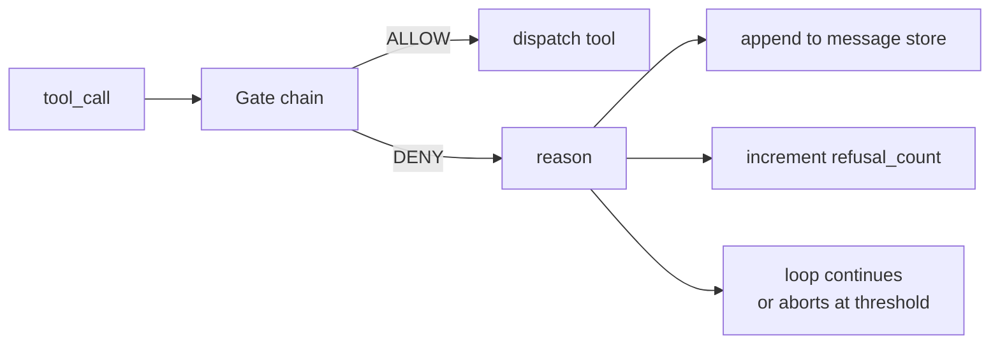
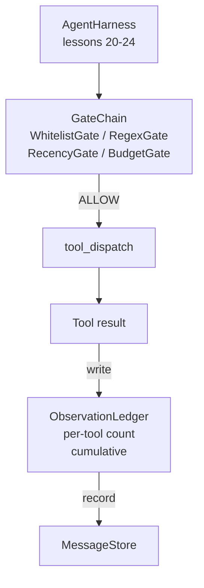

# कैपस्टोन पाठ 25: सत्यापन द्वार और अवलोकन बजट

> सत्यापन परत के बिना एक एजेंट हर्नस एक गड्ढे में इच्छा है। यह पाठ निर्धारक गेट चेन का निर्माण करता है जो तय करता है कि क्या एक उपकरण कॉल को फायर करने की अनुमति है, इसके आउटपुट का कितना एजेंट को देखने की अनुमति है, और जब लूप को रोकना है क्योंकि एजेंट ने बहुत अधिक पढ़ा है। श्रृंखला छोटे, नामित गेटों का एक कार्य है और एक अवलोकन पुस्तिका है जो मॉडल दिखाए गए प्रत्येक टोकन को ट्रैक करती है।

**Type:** Build
**Languages:** Python (stdlib)
**Prerequisites:** Phase 19 · 20-24 (Track A1: agent loop, tool registry, message store, prompt builder, model router), Phase 14 · 33 (instructions as constraints), Phase 14 · 36 (scope contracts), Phase 14 · 38 (verification gates)
**Time:** ~90 minutes

## सीखने के लक्ष्य

- एक बनाओ `VerificationGate`एक निर्धारक के साथ प्रोटोकॉल `evaluate(call)`विधि।
- बजट, हालिया, श्वेतसूची और रेगएक्स गेट को शॉर्ट सर्किट सेमेटिक के साथ एक श्रृंखला में मिलाएं।
- एक के माध्यम से प्रत्येक अवलोकन को ट्रैक करें`ObservationLedger`उपकरण द्वारा कुंजीकृत और बारी।
- संचयी अवलोकन बजट से अधिक होने पर उपकरण कॉल से इनकार करना।
- सतह एक संरचित `GateDecision`रिकॉर्ड करें कि डाउनस्ट्रीम अवलोकन क्षमता निगल सकती है।

## समस्या

जब एजेंट हर्नस मॉडल को उपकरण को स्वतंत्र रूप से कॉल करने देता है, तो वास्तविक उपयोग के पहले घंटे के भीतर बग के तीन वर्ग दिखाई देते हैं।

पहला है असीमित अवलोकन. 200K लाइन रेपो पर एक पकड़े जाने से अगले मोड़ में आधे मिलियन टोकन आउटपुट डंप हो जाते हैं। मॉडल प्रति किलोबाइट एक मैच देखता है और शेष संदर्भ बर्बाद हो जाता है। टोकन बिल बड़ा है और एजेंट अब काम पर बदतर है, बेहतर नहीं है।

दूसरा पुराने हाल ही में है। एक लंबे समय से चल रहे कार्य में पचास टूल कॉल जमा होते हैं। मॉडल पहले read_file को तीसरे मोड़ से फिर से पढ़ता है जैसे कि यह लाइव स्टेट था। मोड़ 47 पर किए गए संपादन कभी नहीं दिखाई देते हैं क्योंकि प्रॉम्प्ट बिल्डर ने सबसे पहले शुरुआती अवलोकनों को क्रमबद्ध किया।

तीसरा है विशेषाधिकार क्रैप. एक शोध कार्य कॉल से शुरू होता है`web_search`, फिर किसी तरह खत्म हो जाता है भागने के लिए`shell`क्योंकि मॉडल ने एक उपकरण नाम का आविष्कार किया और हर्नस डिफ़ॉल्ट रूप से अनुमतिक पर चला गया। जब तक कोई भी निशान पढ़ता है, एक जंक फ़ाइल / tmp में बैठी है और एक कर्ल एक निजी एपीआई के खिलाफ चला गया है।

सत्यापन गेट वह हर्नस घटक है जो कहता है नहीं। यह एक मॉडल नहीं है। यह एक न्यायाधीश नहीं है। यह एक निर्धारक समारोह है `(call, history, ledger)`एक कारण के साथ अनुमति या अस्वीकार देता है। कारण लॉग किया गया है। मॉडल बताया जाता है। लूप जारी है या गर्भपात।

## अवधारणा



एक गेट किसी भी चीज के साथ है`evaluate(call, ctx) -> GateDecision`विधि. श्रृंखला एक क्रमबद्ध सूची है. मूल्यांकन पहले इनकार पर शॉर्ट सर्किट. आदेश मायने रखता हैः सस्ते संरचनात्मक गेट महंगे टोकन-गणना गेट से पहले चलाते हैं.

इस पाठ में चार द्वार हैंः

- `WhitelistGate`अनुमति दी गई उपकरण नामों का एक स्पष्ट सेट है. बाहर की किसी भी चीज़ को अस्वीकार कर दिया जाता है. यह सबसे सस्ता गेट है और पहले चलाता है.
- `RegexGate`. उपकरण तर्क एक regex के साथ मेल खाते हैं. मददगार के साथ शेल कॉल से इनकार करने के लिए`rm -rf`इन में, या आंतरिक आईपी पर HTTP कॉल. कॉल के उपयोगिता भार पर शुद्ध.
- `RecencyGate`. मॉडल केवल पिछले N मोड़ से अवलोकन देखता है. पुराने अवलोकन छिपे हुए हैं. गेट एक उपकरण कॉल से इनकार करता है जिसका परिणाम एक अवलोकन खिड़की का विस्तार करेगा जो पहले से ही पुराना हो गया है।
- `BudgetGate`. मॉडलों ने सत्र के दौरान जो संचयी टोकन पढ़े हैं, उनके पास एक सीमा है. जब लेजर कहता है कि सीमा तक पहुंच गई है, तो प्रत्येक और उपकरण कॉल को अस्वीकार कर दिया जाता है।

अवलोकन लेजर लेखांकन है. प्रत्येक सफल उपकरण कॉल एक पंक्ति लिखता हैः उपकरण का नाम, बारी, जारी किए गए टोकन, संचयी। लेजर दो सवालों के जवाब देता हैः मॉडल ने कुल कितना देखा है, और उपकरण X के कितना देखा है। बजट गेट पहला पढ़ता है। एक उपकरण प्रति बजट गेट, जिसे आप एक अभ्यास के रूप में लिखेंगे, दूसरा पढ़ता है।

```figure
cg-gate-chain
```

## वास्तुकला



हर्नस श्रृंखला से पूछता है। श्रृंखला या तो घुमाता है या इनकार करता है। यदि यह घुमाता है, तो उपकरण चलता है, लेजर टिकता है, और परिणाम संदेश भंडार में संलग्न होता है। यदि यह इनकार करता है, तो मॉडल को सिस्टम संदेश के रूप में अस्वीकार दिया जाता है और लूप तय करता है कि फिर से प्रयास करना है या इसे रद्द करना है।

## आप क्या बना देंगे

कार्यान्वयन एक ही है `main.py`और परीक्षण।

1. `Observation`और `ToolCall`डेटाक्लास तारों के आकार को परिभाषित करते हैं।
2. `ObservationLedger`रिकॉर्ड `(turn, tool, tokens)`पंक्तियाँ और उत्तर `cumulative()`और `per_tool(name)`. .
3. `GateDecision`लेती है`(allow, reason, gate_name)`. .
4. `VerificationGate`प्रत्येक गेट कार्यान्वयन करता है`evaluate(call, ctx)`. .
5. `GateChain`यह प्रत्येक गेट को बुलाता है, पहले इनकार वापस करता है, या वापस अनुमति देता है अगर प्रत्येक गेट गुजरता है।
6. डेमो एक छोटे से सिंथेटिक एजेंट लूप चलाता है तीन मोड़, तीसरे मोड़ पर बजट गेट को ट्रिप करता है और लूप शून्य से अधिक अस्वीकार संख्या के साथ एक साफ अस्वीकार रिपोर्ट करता है।

टोकन काउंटर जानबूझकर एक मूर्खतापूर्ण है`len(text) // 4`इस सबक का मकसद गेट प्लंपिंग है, टोकनराइज़र नहीं. उत्पादन में एक असली टोकनराइज़र डालें.

## श्रृंखला क्रम क्यों मायने रखता है

अस्वीकार करने की अनुमति देने से सस्ता है।`WhitelistGate`O(1) हैश खोज में चलाता है। `RegexGate`O(पैटर्न * argv में चलता है। `RecencyGate`संदेश स्टोर का एक छोटा सा स्लाइस पढ़ता है। `BudgetGate`आप उन्हें कीमत बढ़कर आदेश तो एक इनकार कॉल महंगे काम करने से पहले शॉर्ट सर्किट करता है।

आप उन्हें विस्फोट त्रिज्या के अनुसार भी आदेश देते हैं। व्हाइटलिस्ट सबसे मजबूत दावा हैः यह उपकरण अनुबंध में नहीं है। रेजेक्स गेट अगला हैः यह तर्क अनुबंध में नहीं है। रिसेन्स के बाद आता हैः हार्नेस अभी भी परवाह करता है लेकिन कॉल संरचनात्मक रूप से कानूनी है। बजट अंतिम है क्योंकि, परिभाषा के अनुसार, यह केवल तब फायर करता है जब बाकी सब कुछ पारित हो गया है।

## यह ट्रैक ए के बाकी के साथ कैसे गठबंधन करता है

पिछले पाठों में आपको लूप, टूल रजिस्ट्री, मैसेज स्टोर, प्रॉम्प्ट बिल्डर और मॉडल राउटर दिया गया था। यह पाठ मॉडल और उपकरणों के बीच परत जोड़ता है। पाठ 26 रेत बॉक्स जहाज है कि डिस्पैचर उपकरण कॉल करने के लिए एक बार गेट श्रृंखला कहता है अनुमति देता है। पाठ 27 मूल्यांकन हर्नर जहाज है कि रिकॉर्ड अस्वीकार गुणवत्ता संकेत के रूप में गिना जाता है। पाठ 28 गेट निर्णयों को ओपनटेलीमेट्री के दायरे में तार करता है। पाठ 29 एक काम कर रहे कोडिंग एजेंट में बहुत सारे सिलाई करता है।

## इसे चलाना

```bash
cd phases/19-capstone-projects/25-verification-gates-observation-budget
python3 code/main.py
python3 -m pytest code/tests/ -v
```

डेमो प्रत्येक गेट निर्णय सहित एक बारी-बारी से ट्रैक प्रिंट करता है और शून्य से बाहर निकलता है। परीक्षणों में लेजर, प्रत्येक गेट को अलग से, श्रृंखला शॉर्ट सर्किट और सिंथेटिक लूप को अंत से अंत तक कवर किया जाता है।
