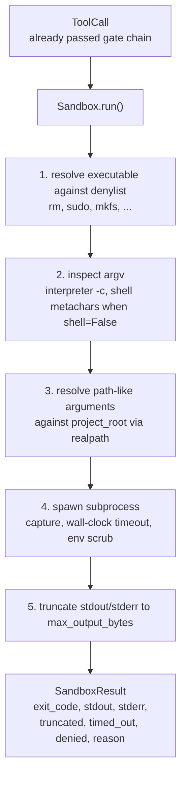
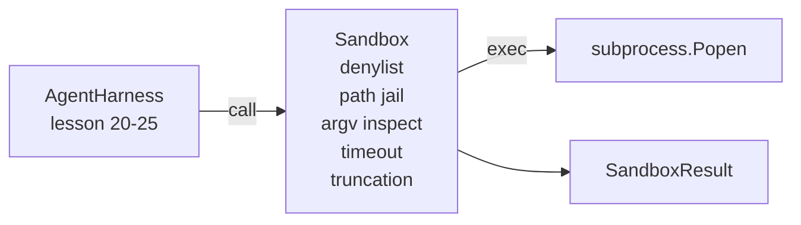

# कैपस्टोन पाठ 26: डेनिलिस्ट और पथ जेल के साथ सैंडबॉक्स रनर

> सत्यापन गेट तय करता है कि क्या एक उपकरण कॉल चलाना चाहिए। जब यह होता है तो सैंडबॉक्स तय करता है कि क्या होता है। यह सबक एक उपप्रक्रिया रनर जहाज जो खतरनाक निष्पादन करने से इनकार करता है, खतरनाक argv आकारों से इनकार करता है, परियोजना की जड़ के लिए प्रत्येक फ़ाइल पथ को बंद करता है, ओवरसाइज आउटपुट को छोटा करता है, और एक दीवार घड़ी समय पर भागने वाले प्रक्रियाओं को मारता है। यह दो परतों में से दूसरी है जो मॉडल और ऑपरेटिंग सिस्टम के बीच बैठती है।

**Type:** Build
**Languages:** Python (stdlib)
**Prerequisites:** Phase 19 · 25 (verification gates and observation budget), Phase 14 · 33 (instructions as constraints), Phase 14 · 38 (verification gates)
**Time:** ~90 minutes

## सीखने के लक्ष्य

- एक बनाओ `Sandbox`कक्षा के पैकिंग `subprocess.run`समय के साथ, पकड़, और ट्रंक.
- एक डेनिलिस्ट के खिलाफ नाम से और एक आरजीवी निरीक्षक के खिलाफ संरचना से एक आदेश से इनकार करें।
- किसी भी पथ तर्क को अस्वीकार करें जो घोषित परियोजना रूट के बाहर हल हो।
- खोल मोड बंद होने पर खोल मेटा वर्णों से इनकार करें।
- एक संरचित लौटाएँ `SandboxResult`कि डाउनस्ट्रीम अवलोकन और मूल्यांकन हर्नस निगल सकते हैं।

## समस्या

एक कोडिंग एजेंट जो खोल सकता है, बैकडोर स्थापित कर सकता है, कुंजी निकाल सकता है, डेवलपर लैपटॉप को ईंट बना सकता है, और एक ही मोड़ में क्लाउड बिल जमा कर सकता है। सबसे कम लागत वाली रक्षा यह है कि इसे खोल न दिया जाए। दूसरा सबसे कम लागत वाला एक सैंडबॉक्स है जो पैटर्न की एक सटीक सूची को नहीं कहता है।

एजेंट के निशान में विफलता के तीन वर्ग दोहराया जाता है।

पहला खतरनाक निष्पादित करने योग्य है. एक पथ समस्या को ठीक करने के लिए दबाव में मॉडल कोशिश करेंगे`sudo`,`chmod -R 777`,`rm -rf`,`mkfs`,`dd`इन में से कोई भी एजेंटों की दौड़ में नहीं आता है. Denylist उन्हें नाम और उपनाम से पकड़ता है.

दूसरा है argv ट्रिक्स. एक मॉडल जो कहा गया है कि कोई शेल नहीं होगा एक अनुवादक के माध्यम से एक हमले पाइपः`python3 -c "import os; os.system('rm -rf /')"`,`bash -c '...'`,`node -e '...'`,`perl -e '...'`रेत बॉक्स को यह जानना चाहिए कि कोई भी अनुवादक एक के साथ चलाता है`-c`- जैसे ध्वज सिर्फ एक शेल कॉल है अतिरिक्त कदम के साथ.

तीसरा मार्ग भागना है। मॉडल को पढ़ने के लिए कहा जाता है।`./src/main.py`और इसके बजाय पढ़ता है `../../etc/passwd`रेत बॉक्स इसे हल करके हर मार्ग विवाद को जेल में डालता है`os.path.realpath`और उपसर्ग का दावा करना।

सैंडबॉक्स ऑपरेटिंग सिस्टम के अर्थ में सुरक्षा सीमा नहीं है। कोड निष्पादन के साथ एक निश्चित हमलावर अभी भी टूट सकता है। सैंडबॉक्स एक विकास समय गार्डरेल हैः यह आम विफलता मोड को जोर से बनाता है और एजेंट को पूरी अक्षमता से नुकसान करने से रोकता है।

## अवधारणा



रेत बॉक्स में चार अस्वीकार अक्ष हैंः नाम, आरजीवी, पथ, संरचना। प्रत्येक अक्ष कॉल का शुद्ध कार्य है, अभी तक कोई उपप्रक्रिया नहीं है। प्रत्येक अक्ष पारित होने के बाद ही उपप्रक्रिया उत्पन्न होती है।

`SandboxResult`आउटपुट कोड पारंपरिक हैंः 0 सफलता, गैर-शून्य विफलता, प्लस तीन सेन्टीनेल कोड के लिए अस्वीकार (-100), समय_आउट (-101), और ट्रंक (एक्सिट कोड असली है, एक ध्वज सेट के साथ) । डाउनस्ट्रीम पाठ इस संरचित परिणाम को पढ़ते हैं बजाय पार्सिंग stderr।

```figure
cg-path-jail
```

## वास्तुकला



डेनिलिस एक निष्पादन योग्य बेसनामों का एक फ्रोज़ेट है।`/bin/rm`,`/usr/bin/rm`) सभी एक ही बेसनाम के लिए संकल्प करते हैं। argv निरीक्षक व्याख्याता के आकार को जानता हैः कोई भी argv जहां argv[0] एक व्याख्याता है और कोई भी बाद में arg से शुरू होता है `-c`या `-e`शेल मेटाक्यारेक्टर (`;`,`|`,`&`,`>`,`<`, पीठ के बल, `$()`) जब कॉल ने स्पष्ट रूप से एक खोल का अनुरोध नहीं किया है तो अस्वीकार का कारण बनता है।

रास्ता जेल सबसे सूक्ष्म टुकड़ा है। रेत बॉक्स एक स्वीकार करता है`project_root`निर्माण में। कोई भी तर्क जो पथ की तरह दिखता है (में शामिल है`/`या एक मौजूदा फ़ाइल से मेल खाती है) के माध्यम से सामान्यीकृत किया जाता है `os.path.realpath`यदि हल लक्ष्य रूट के नीचे नहीं है, तो अस्वीकार। सिम्लिंक भागने के प्रयास (प्रोजेक्ट रूट में एक सिम्लिंक जो बाहर इंगित करता है) को वास्तविक पथ की जांच करके अवरुद्ध किया जाता है, शाब्दिक पथ नहीं।

## आप क्या बना देंगे

कार्यान्वयन है `main.py`और एक परीक्षण dir.

1. `SandboxResult`dataclass: exit_code, stdout, stderr, truncated, timed_out, denied, reason, duration_ms।
2. `SandboxConfig`डेटाक्लासः project_root, max_output_bytes, timeout_seconds, denylist, interpreter_block।
3. `Sandbox`वर्ग: `run(argv, *, shell=False, cwd=None)`एक `SandboxResult`. .
4. आंतरिक अस्वीकार सहायक: `_check_executable_denylist`,`_check_argv_interpreter`,`_check_shell_metachars`,`_check_path_jail`. .
5. एक स्पष्ट के साथ आउटपुट ट्रंक`truncated`ध्वज और कब्जा किए गए धारा में एक मार्कर रेखा।
6. नीचे डेमोः वैध और विरोधी कॉल का एक अनुक्रम। प्रत्येक अपने परिणाम के साथ दिखाया गया है।

रेत बॉक्स का उपयोग करता है `subprocess.run`के साथ`shell=False`डिफ़ॉल्ट रूप से और `capture_output=True`दीवार घड़ी समय सीमा का उपयोग करता है `timeout`तर्क; पर `TimeoutExpired`, सैंडबॉक्स प्रक्रिया समूह को मारता है और एक सैंडबॉक्स रिजल्ट संश्लेषित करता है।

## यह असली रेत बॉक्स क्यों नहीं है

पाठ सैंडबॉक्स नाम स्थानों, cgroups, seccomp, gVisor, Firecracker, या किसी भी नाभिक स्तर के अलगाव का उपयोग नहीं करता है। सबप्रोसेस जो कुछ भी कर सकता है, सैंडबॉक्स कर सकता है। संरक्षण संरचनात्मक हैः एजेंट को सबसे आम खतरनाक कॉल से इनकार कर दिया जाता है, और जोरदार इनकार चुपचाप चलने के बजाय अवलोकन योग्य हो जाता है।

उत्पादन एजेंटों के लिए आप शीर्ष पर परत करते हैंः एक अनप privileged Docker कंटेनर के अंदर चलाएं, एक microVM के अंदर चलाएं, ड्रॉप क्षमताओं, परियोजना रूट केवल पढ़ने और एक खरोंच dir पढ़ने-लेखन को माउंट करें, मेमोरी और CPU पर सीमा सेट करें, पर्यावरण को एक ज्ञात सुरक्षित व्हाइटलिस्ट में स्क्रब करें। पाठ 29 कुछ ऐसा करता है। ऑपरेटिंग सिस्टम अलगाव इस पाठ के लिए दायरे से बाहर है।

## इसे चलाना

```bash
cd phases/19-capstone-projects/26-sandbox-runner-denylist
python3 code/main.py
python3 -m pytest code/tests/ -v
```

डेमो एक अस्थायी निर्देशिका बनाता है, इसमें एक साफ फ़ाइल छोड़ देता है, फिर कॉल की बैटरी चलाता है। कानूनी कॉल सफल होते हैं। अस्वीकृत कॉल वापस SandboxResult के साथ `denied=True`और एक कारण है. समय वापस आ गया है.`timed_out=True`. ट्रंकिंग सेट `truncated=True`. डेमो परिणामों की JSON तालिका प्रिंट करता है और शून्य से बाहर निकलता है.

## यह ट्रैक ए के बाकी के साथ कैसे गठबंधन करता है

पाठ 25 ने गेट चेन का उत्पादन किया। पाठ 26 वह निष्पादक है जो गेट ALLOW के बाद चलता है। पाठ 27 का मूल्यांकन हर्नस प्रति कार्य अपेक्षित निकास कोड के साथ सैंडबॉक्स परिणामों की तुलना करता है। पाठ 28 एक `gen_ai.tool.execution`प्रत्येक के चारों ओर स्पैन `Sandbox.run`पाठ 29 के अंत-से-अंत डेमो तारों दोनों परतों के माध्यम से एक असली कोडिंग एजेंट.
