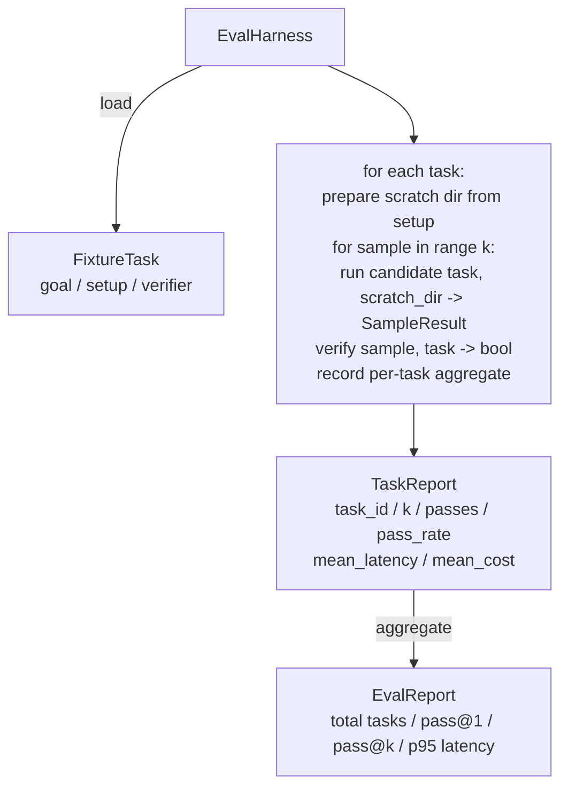

# कैपस्टोन पाठ 27: सम समकक्षता के साथ समकक्षता

> एक कोडिंग एजेंट केवल उतना ही अच्छा है जितना आप इसे मापने वाले कार्यों का सेट करते हैं। यह पाठ एक मूल्यांकन हर्नस बनाता है जो फिक्स्चर कार्यों का एक फ़ोल्डर लेता है, प्रत्येक उम्मीदवार एजेंट के माध्यम से चलाता है, स्कोर एक निर्धारक सत्यापनकर्ता के माध्यम से गुजरता है या विफल रहता है, और परिणामों को पास@1, पास@के, औसत विलंबता और औसत लागत में एकत्र करता है। हर्नस सत्य का स्रोत है जो आपको एक रिफैक्टर से एक प्रतिगमन को बताने की अनुमति देता है।

**Type:** Build
**Languages:** Python (stdlib)
**Prerequisites:** Phase 19 · 25 (verification gates), Phase 19 · 26 (sandbox runner), Phase 14 · 30 (eval-driven agent development), Phase 14 · 19 (SWE-bench and GAIA benchmarks)
**Time:** ~90 minutes

## सीखने के लक्ष्य

- लक्ष्य, सेटअप और सत्यापन के तीन गुना के रूप में एक फिक्स्चर कार्य को परिभाषित करें।
- प्रति कार्य कई नमूना रन स्कोर करें और पास@1 और पास@k गणना करें।
- औसत और 95वें प्रतिशत मेट्रिक्स में विलंबता और लागत को एकत्र करें।
- पुनः प्रयोज्य कार्यों में तार निर्धारक सत्यापन (फाइल अंतर, आउटपुट कोड, रेजेक्स मैच)
- एक संरचित JSON रिपोर्ट जारी करें जो एक regression-tracking script निगल सकता है।

## समस्या

तीन विफलता मोड प्लेग एजेंट बेंचमार्क एक मूल्यांकन हर्नस के बिना बनाया गया।

पहला है अप्रत्याशित पास. एजेंट का कहना है कि यह बग ठीक किया, मानव अंतर पर नज़र, सूट हरे रंग का चिह्नित है, और तीन सप्ताह बाद प्रतिगमन परीक्षण सतहों पर एक ही बग. एजेंट ने तर्कसंगत रूप से तर्क दिया था वास्तव में कुछ भी ठीक नहीं किया।

दूसरा है अनदेखा विघटन. शीघ्र टेम्पलेट में बदलाव एजेंट को जोरदार कार्य पर 4% बेहतर बनाता है और चुपके कार्य पर 14% बदतर बनाता है। बिना एक गोल्डसेट और प्रति कार्य स्कोर के, विघटन मुख्य में सवारी करता है और केवल तभी सतह पर आता है जब कोई ग्राहक शिकायत करता है।

तीसरा प्रति कार्य बहाव है. मूल्यांकन 100 कार्यों के साथ सोमवार को चलाया गया था और शुक्रवार को 95 के साथ, क्योंकि किसी ने पांच फिक्स्चर का नाम बदल दिया। पास दर 5% सुधार की तरह दिखता है। यह नहीं है।

हर्नस प्रोग्राम है जो इन विफलताओं को तथ्यों में बदल देता है। यह प्रत्येक फिक्स्ड, हर बार, एक पुनरावर्ती क्रम में, एक सत्यापनकर्ता के खिलाफ चलता है जो एक निर्धारक जांच पर सच या झूठा देता है।

## अवधारणा

```mermaid
flowchart LR
  F1[fixtures/task_001/<br/>task.json + expected/] --> Harness
  F2[fixtures/task_002/<br/>...] --> Harness
  Harness[Harness<br/>for each task:<br/>setup / run agent k samples /<br/>verify each sample /<br/>record latency, cost]
  Harness --> Report[EvalReport<br/>pass@1 / pass@k<br/>mean ms / p95 ms<br/>mean cost]
```

ए `FixtureTask`एक छोटी JSON फ़ाइल प्लस एक वैकल्पिक है `expected/`निर्देशिका. JSON एक घोषणा करता है `id`, ए `goal`(एजेंट को दिए गए संकेत)`setup`ब्लॉक (फाइलों को खरोंच dir में गिरने के लिए), और एक `verifier`ब्लॉक. सत्यापनकर्ता ब्लॉक हर्नस के सत्यापनकर्ता रजिस्ट्री में एक फ़ंक्शन का नाम देता है और उसके तर्क प्रदान करता है।

तीन सत्यापनकर्ता आकार अधिकांश उपयोगी कार्यों को कवर करते हैं।

पहला है `file_equals`. एजेंट चलाए जाने के बाद, एक नामित फ़ाइल की तुलना अपेक्षित सामग्री के साथ. यह "इस तरह से इस बग को ठीक करने" कार्यों को पकड़ता है.

दूसरा है `regex_match`. नामित फ़ाइल की सामग्री एक regex के साथ मेल खाती है. यह "फंक्शन मौजूद होना चाहिए और X" कार्यों को पकड़ता है जहां कई स्वीकार्य समाधान हैं।

तीसरा है`shell_exit_zero`. हर्नस एक शेल कमांड (पाठ 26 से सैंडबॉक्स के माध्यम से) चलाता है और केवल तब कार्य को पारित करता है जब कमांड शून्य से बाहर निकलता है। यह "परीक्षण पास करना चाहिए" कार्यों को पकड़ता है।

हर कार्य को हर्नेस संचालित करता है `k`समय. पास@k है `1 - (1 - p)^k`जहां p अनुभवजन्य पास दर है; हर्नस कच्चे गिनती की रिपोर्ट भी करता है ताकि आप भिन्नता का पता लगा सकें। लटेंसी प्रति नमूना वॉल-घड़ी है। लागत एजेंट स्वयं रिपोर्ट (टोकन गिनती, यूएसडी, या दोनों) जो भी है; हर्नस इसे नमूनों में जोड़ता है और प्रति कार्य और संकलित संख्या प्रस्तुत करता है।

```figure
pass-at-k
```

## वास्तुकला



उम्मीदवार एक कॉल करने योग्य हैः`Callable[[FixtureTask, str], SampleResult]`. हर्नस स्क्रैच निर्देशिका बनाता है के माध्यम से `tempfile.mkdtemp()`उम्मीदवार एक निर्धारक पैच आवेदक (हार्म स्व-परीक्षण के लिए उपयोगी), एक असली LLM एजेंट, एक fuzzer हो सकता है। अनुबंध नमूना परिणाम है।

## आप क्या बना देंगे

`main.py`जहाजों

1. `FixtureTask`डेटा क्लास।
2. `SampleResult`dataclass: success_self_reported, latency_ms, cost_units, संपादन।
3. `TaskReport`,`EvalReport` के साथ डेटाक्लास`to_dict()`. .
4. `VerifierRegistry`कार्य करने के लिए मानचित्रण सत्यापनकर्ता नाम. अंतर्निहित सत्यापनकर्ताः फ़ाइल_equals, regex_match, shell_exit_zero.
5. `EvalHarness`एक उम्मीदवार के खिलाफ कार्यों की निर्देशिका चलाता है. EvalReport लौटाता है.
6. पांच फिक्स्ड कार्य जोड़े `tasks/`:
   - एक-एक में बंद`fizzbuzz`
   - `factorial`
   - त्रुटि संदेश में टाइपिंग त्रुटि
   - खाली फ़ंक्शन बॉडी
   - लिंक्ड-लिस्ट क्रॉसिंग में एक-एक करके
7. एक निर्धारक संदर्भ उम्मीदवार (`apply_known_fixes`) 1.0 के एक साफ पास@1 को प्रदर्शित करने के लिए हर्नस का उपयोग करता है।
8. डेमो EvalReport JSON प्रिंट करता है और शून्य से बाहर निकलता है।

फिक्स्चर कार्य JSON फ़ाइलों के रूप में बंडल कर रहे हैं `tasks/`प्लस जोड़ी स्रोत फ़ाइलों में `tasks/<id>/buggy/`और `tasks/<id>/expected/`हर्नस एक खरोंच गंदगी में बगगी कॉपी, इसे उम्मीदवार को दे, और उम्मीद के खिलाफ सत्यापित करता है.

## क्यों पास@k और सिर्फ पास@1 नहीं

वास्तविक एलएलएम एजेंट स्टोकास्टिक हैं। 0.6 का पास@1 विफलता की तरह दिखता है। 0.95 का पास@5 कहता है कि एजेंट को ज्यादातर समय सही जवाब मिलता है लेकिन प्रारंभिक नमूनों पर गलत चुनता है। फिक्स नमूना और रैंकिंग है, हमेशा अधिक प्रशिक्षण नहीं। Pass@k इसे दिखाई देता है।

पास@k को पास@1 के साथ रिपोर्ट किया जाता है क्योंकि पास@k एक वास्तविक विफलता पर कागजात देता हैः यदि मॉडल को बीस में एक बार सही उत्तर मिलता है तो आपके पास एक उपयोगी एजेंट नहीं है। हर्नस दोनों को दिखाता है।

## यह ट्रैक ए के बाकी के साथ कैसे गठबंधन करता है

पाठ 25 ने गेट चेन का उत्पादन किया। पाठ 26 ने रेत बॉक्स का उत्पादन किया। हर्नस किसी भी प्रकार के लिए रेत बॉक्स का उपयोग करता है।`shell_exit_zero`सत्यापनकर्ता. पाठ 28 प्रत्येक हार्नेस रन को OTel ट्रैक में लपेटता है। पाठ 29 एक बंडल फिक्स्चर के खिलाफ अंत-से-अंत डेमो चलाता है और संदर्भ उम्मीदवार के लिए पास@1 = 1.0 का दावा करता है।

## इसे चलाना

```bash
cd phases/19-capstone-projects/27-eval-harness-fixture-tasks
python3 code/main.py
python3 -m pytest code/tests/ -v
```

डेमो JSON में EvalReport प्रिंट करता है, जिसमें pass@1, pass@5, औसत विलंबता और प्रति कार्य टूटना शामिल है। आउटपुट कोड शून्य है। परीक्षण सत्यापनकर्ता कार्यों, pass@k गणित, फिचर लोडिंग और बंडल किए गए संदर्भ उम्मीदवार के खिलाफ अंत-से-अंत हर्न शामिल हैं।
