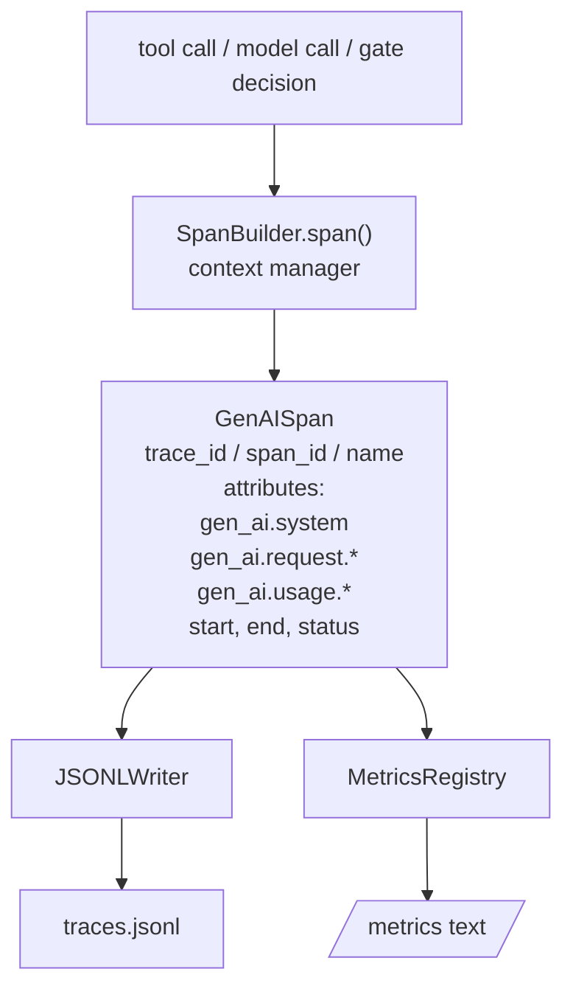
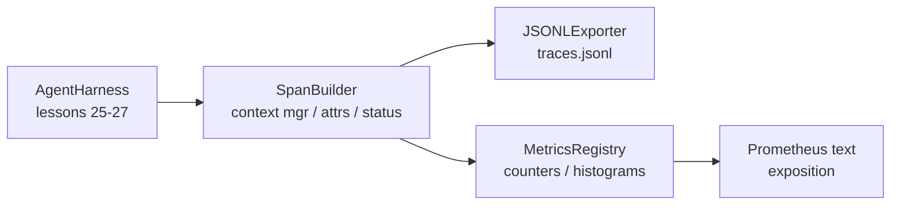

# कैपस्टोन पाठ 28: ओटीएल जेनेआइ स्पैन और प्रोमेथियस मेट्रिक्स के साथ अवलोकन

> एक एजेंट हर्नस बिना अवलोकन के एक काला बॉक्स है जो पैसे खर्च करता है। यह पाठ एक स्पैन बिल्डर को हाथ से रोल करता है जो ओपनटेलीमेट्री जेएनएआई सेमैंटिक सम्मेलनों के अनुरूप रिकॉर्ड जारी करता है, उन्हें एक JSON-Lines फ़ाइल में लिखता है, प्रति पंक्ति एक स्पैन, और प्रोमेथियस पाठ प्रारूप में काउंटर और हिस्टोग्राम को उजागर करता है। पूरी बात stdlib पायथन है और ऑफ़लाइन चलती है।

**Type:** Build
**Languages:** Python (stdlib)
**Prerequisites:** Phase 19 · 25 (verification gates), Phase 19 · 26 (sandbox), Phase 19 · 27 (eval harness), Phase 13 · 20 (OpenTelemetry GenAI), Phase 14 · 23 (OTel GenAI conventions)
**Time:** ~90 minutes

## सीखने के लक्ष्य

- OpenTelemetry GenAI सेमेन्टिक सम्मेलनों के अनुरूप एक स्पैन डेटा वर्ग का निर्माण करें।
- एक JSONL निर्यातक को लागू करें जो प्रति पंक्ति एक स्वतंत्र अवधि लिखता है।
- लेबल और प्रोमेथियस पाठ प्रारूप के साथ काउंटर और हिस्टोग्राम बनाएं।
- किसी भी कॉल को एक स्पैन संदर्भ प्रबंधक में लपेटें जो अवधि, स्थिति और अपवादों को रिकॉर्ड करता है।
- जांचें कि उत्सर्जित स्पैन के माध्यम से घूमने के लिए यात्रा `json.loads`और विनिर्देश के आकार से मेल खाता है।

## समस्या

उत्पादन में एक कोडिंग एजेंट प्रत्येक बारी में तीन वर्गों के कलाकृतियों का उत्पादन करता हैः एक मॉडल कॉल, एक उपकरण निष्पादन और एक सत्यापन गेट निर्णय। इनमें से कोई भी संरचित दूरदर्शन के बिना उपयोगी नहीं है।

पहला विफलता मोड गायब निशान है. कुछ मंगलवार को गलत हो गया लेकिन एकमात्र रिकॉर्ड 500 लाइनों का चैट लॉग है. कोई रिकॉर्ड नहीं है कि किस उपकरण ने चलाया, इसमें कितना समय लगा, कितने टोकन प्रॉम्प्ट में गए, या गेट ने कुछ भी अस्वीकार कर दिया। एजेंट लेखक को अनुमान लगाना होगा।

दूसरा विफलता मोड अदृश्य निशान है। हर्नस ने स्पैन लिखा लेकिन अपने स्वयं के एड-होक फ़ील्ड नामों का उपयोग किया। ग्राफाना, हनीकॉम, जैगर या स्थानीय सीएलआई में कुछ भी उन्हें नहीं पढ़ सकता है। टीम के स्टैक में जो भी उपकरण मौजूद है वह बर्बाद हो जाता है क्योंकि स्पैन गैर-मानक हैं।

तीसरा विफलता मोड असंगठित मीट्रिक है. आप ट्रैक में एक धीमी उपकरण कॉल देख सकते हैं, लेकिन आप जवाब नहीं दे सकते "पिछले घंटे में read_file कॉल की p95 विलंबता क्या है? " क्योंकि कोई मीट्रिक नहीं है, केवल निशान हैं।

OpenTelemetry GenAI सेमेटिक कन्वेंशन इसी के लिए मौजूद हैं। वे मानक गुणों के एक छोटे सेट को परिभाषित करते हैं जो LLM ढांचे के पार उत्सर्जकों को साझा करते हैं। यदि आपका हर्नस उन गुणों को लिखता है, तो प्रत्येक OTel संगत बैकेंड उन्हें पढ़ सकता है।

## अवधारणा



हर्नस में प्रत्येक ऑपरेशन में एक स्पैन उत्पन्न होता है। एक स्पैन में एक ट्रैक आईडी (पूरे एजेंट का आह्वान), एक स्पैन आईडी (यह एक ऑपरेशन), एक नाम (जैसे `gen_ai.chat`,`gen_ai.tool.execution`), गुण जो GenAI सम्मेलनों के बाद आते हैं, एक शुरुआत और अंत समय, और एक स्थिति।

GenAI सम्मेलनों इन विशेषता कुंजी को मानकीकृत करते हैंः `gen_ai.system`(कौनसे प्रदाता, उदाहरण के लिए `anthropic`,`openai`), `gen_ai.request.model`(मॉडल आईडी), `gen_ai.request.max_tokens`,`gen_ai.usage.input_tokens`,`gen_ai.usage.output_tokens`,`gen_ai.response.model`,`gen_ai.response.id`,`gen_ai.operation.name`, और उपकरण विशिष्ट कुंजी `gen_ai.tool.name`और `gen_ai.tool.call.id`. .

निर्यातक JSONL लिखता है। प्रत्येक पंक्ति में एक JSON ऑब्जेक्ट। यह सबसे सरल संभव प्रारूप है जिसे डाउनस्ट्रीम टूलिंग स्ट्रीम, ग्रेप और आयात कर सकता है। एक वास्तविक OTel निर्यातक OTLP gRPC बोलता है; पाठ का JSONL निर्यातक ऑफ़लाइन समकक्ष है और प्रत्येक वर्कस्टेशन पर शून्य से बाहर निकलता है।

प्रत्येक उपकरण कॉल पर एक काउंटर वृद्धिः `tools_called_total{tool="read_file"}`. एक हिस्टोग्राम अवलोकन विलंबता रिकॉर्ड करता हैः `tool_latency_ms{tool="read_file"}`. दोनों को प्रोमेथियस पाठ एक्सपोजिशन प्रारूप में क्रमबद्ध किया जाता है, जो खींचने आधारित माप के लिए वास्तविक मानक है।

```figure
trace-spans
```

## वास्तुकला



एक स्पाइन बिल्डर एक छोटी कक्षा है `span(name, attrs)`संदर्भ प्रबंधक प्रवेश पर प्रारंभ समय रिकॉर्ड करता है, बाहर निकलने पर समाप्ति समय रिकॉर्ड करता है, यदि कोई अपवाद उठाया गया है, तो एक अपवाद संलग्न करता है, और अंतिम अवधि को निर्यातक को धक्का देता है।

मेट्रिक्स रजिस्ट्री दो डिक्ट है।`{(name, frozen_labels): int}`. हिस्टोग्राम कच्चे नमूने को सूची में रखते हैं और प्रदर्शनी के समय प्रोमेथियस हिस्टोग्राम बाल्ट में क्रमबद्ध करते हैं।

## आप क्या बना देंगे

`main.py`जहाजों

1. `GenAISpan`डेटाक्लासः trace_id, span_id, parent_span_id, नाम, गुण, start_unix_nano, end_unix_nano, स्थिति, status_message, घटनाएं।
2. `SpanBuilder`कक्षा के साथ `span(name, attrs, parent=None)`संदर्भ प्रबंधक।
3. `JSONLExporter`कक्षा के साथ `export(span)`जो एक पंक्ति जोड़ता है।
4. `Counter`और `Histogram`वर्ग प्लस `MetricsRegistry`. .
5. `prometheus_exposition(registry)`जो पाठ प्रारूप आउटपुट उत्पन्न करता है।
6. `wrap_tool_call(name)`एक सजावट जो एक अवधि जारी करता है और माप अद्यतन करता है।
7. डेमोः एक पूर्ण एजेंट का संश्लेषण करता है (टूल स्पैन के आसपास gen_ai.chat span), traces.jsonl लिखता है, Prometheus एक्सपोजीशन प्रिंट करता है, शून्य से बाहर निकलता है।

स्पैन आईडी और ट्रैक आईडी 16 बाइट हेक्स स्ट्रिंग हैं, जो  से उत्पन्न होते हैं`os.urandom`. जो ओटीएल के W3C ट्रैक संदर्भ से मेल खाता है. निर्यातक कभी नहीं फेंकता है; IO त्रुटियों को सतह पर रखा जाता है लेकिन हर्नर चल रहा है.

हिस्टोग्राम में एक निश्चित बाल्टी सेट है (मिलीसेकंड में विलंबता के लिए OTel डिफ़ॉल्टः 5, 10, 25, 50, 100, 250, 500, 1000, 2500, 5000, 10000, +Inf) । नमूने सूची के रूप में संग्रहीत किए जाते हैं; मांग पर प्रति बाल्टी गणनाओं की गणना करता है।

## ओपनमेट्रिक-डीडीके के बजाय हाथ से रोल क्यों किया गया

ओटेल पायथन एसडीके एक वास्तविक निर्भरता है। यह कोड की कई हजार पंक्तियों, ओटीएलपी निर्यातक के लिए कई प्रक्रियाएं, और एक रनटाइम लागत है जो एक पाठ बजट को डूबाती है। हाथ से रोल किया गया संस्करण वायर प्रारूप सिखाता है। उत्पादन में आप वास्तविक एसडीके में समान गुणों को तार करते हैं और ओटीएलपी निर्यातक, बैचिंग और संसाधन पता लगाने को मुफ्त में प्राप्त करते हैं।

सम्मेलन स्थिर हैं। पाठ द्वारा जारी किए गए वायर प्रारूप 2030 में भी विश्लेषण जारी रखेगा क्योंकि ओटीएल कभी भी जीएनएआई विशेषता नामों को नहीं तोड़ता है; वे केवल नए जोड़ते हैं।

## यह ट्रैक ए के बाकी के साथ कैसे गठबंधन करता है

पाठ 25 ने गेट चेन का उत्पादन किया। पाठ 26 ने सैंडबॉक्स का उत्पादन किया। पाठ 27 ने मूल्यांकन हर्नस का उत्पादन किया। पाठ 28 ने तीनों को देखा। पाठ 29 अंत से अंत तक डेमो के प्रत्येक चरण को स्पैन में लपेटता है और अंत में प्रोमेथियस पाठ प्रिंट करता है।

## इसे चलाना

```bash
cd phases/19-capstone-projects/28-observability-otel-traces
python3 code/main.py
python3 -m pytest code/tests/ -v
```

डेमो एक `traces.jsonl`पाठ के कामकाजी डीआर में (अंत में साफ किया गया), फिर तीन स्पैन का एक नमूना प्रिंट करता है, फिर काउंटर और हिस्टोग्राम के लिए प्रोमेथियस एक्सपोजीशन प्रिंट करता है। परीक्षणों से पता चलता है कि स्पैन रिंगट्रिप को क्रमबद्ध करते हैं, कि कैनोनिक GenAI विशेषताएं मौजूद हैं, कि सही ढंग से गणना करता है, और कि हिस्टोग्राम एक्सपोजीशन में अपेक्षित बाल्टी गिनती होती है।
