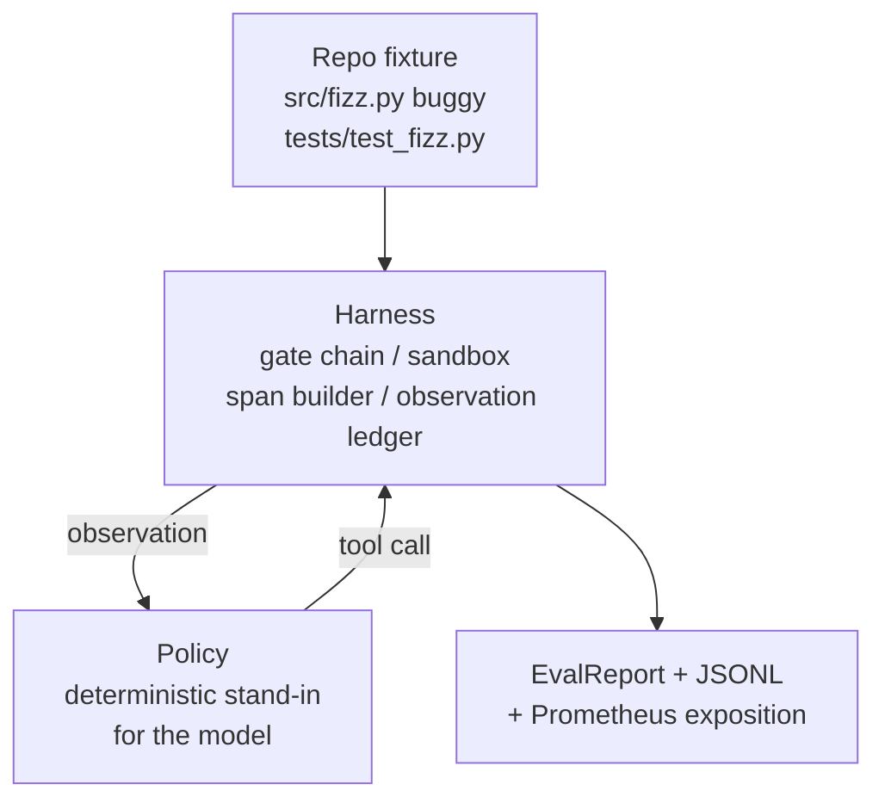
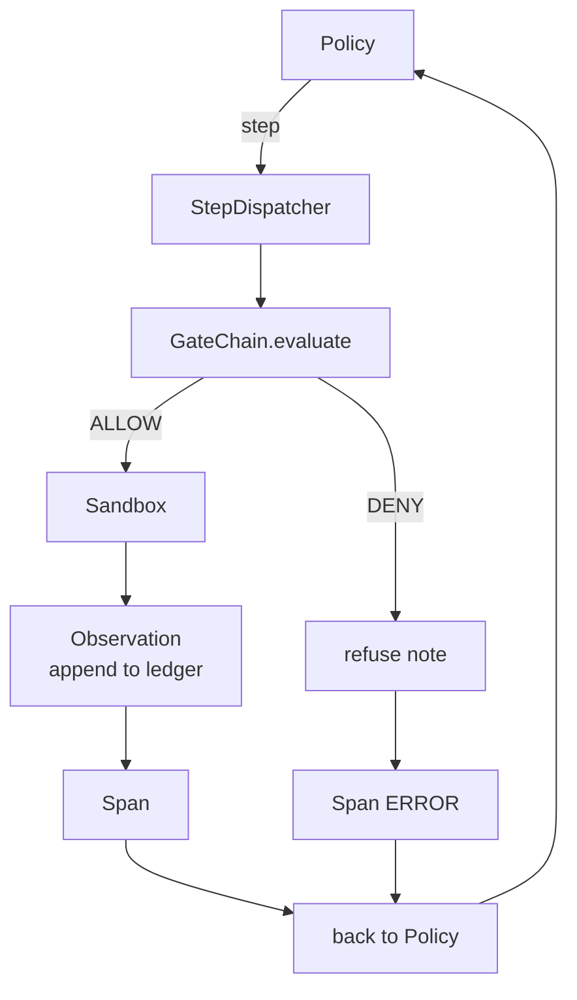

# कैपस्टोन पाठ 29: हर्नस पर अंत-टू-अंत कोडिंग एजेंट

> ट्रैक ए का भुगतान। यह पाठ गेट चेन, सैंडबॉक्स, eval हर्नस को सिलाई करता है, और OTel एक काम कर रहे कोडिंग एजेंट में फैलता है जो बहु-फ़ाइल पायथन प्रोजेक्ट में एक वास्तविक (छोटी, फिक्स्चर-स्केल) बग को ठीक करता है। एजेंट एक निर्धारक नीति है, LLM नहीं; प्रतिस्थापन पाठ को पुनः प्रस्तुत करने योग्य बनाता है और दिखाता है कि हार्नेस हमेशा दिलचस्प हिस्सा था। अनुबंध समान हैः एक वास्तविक मॉडल नीति सीम में प्लग करता है।

**Type:** Build
**Languages:** Python (stdlib)
**Prerequisites:** Phase 19 · 25 (verification gates), Phase 19 · 26 (sandbox), Phase 19 · 27 (eval harness), Phase 19 · 28 (observability), Phase 14 · 38 (verification gates), Phase 14 · 41 (workbench for real repos), Phase 14 · 42 (agent workbench capstone)
**Time:** ~90 minutes

## सीखने के लक्ष्य

- गेट चेन, सैंडबॉक्स, eval हर्नस, और स्पैन बिल्डर को एक एजेंट लूप में मिलाएं।
- एक निश्चित नीति लागू करें जो फिक्स्चर बग को ठीक करने के लिए read_file, run_tests और write_file का उपयोग करता है।
- एक अंत-से-अंत रन के दौरान एक वैश्विक चरण बजट और एक अवलोकन टोकन बजट लागू करें।
- पूर्ण ओटेल जेनएआई निशान और पूर्ण रन के लिए प्रोमेथियस मेट्रिक्स जारी करें।
- सत्यापित एजेंट कानूनी उपकरणों पर शून्य गेट ट्रिप के साथ 12 से कम चरणों में फिक्स्ड हल करता है।

## समस्या

अधिकांश एजेंट डेमो अलग से काम करते हैंः एक रेत बॉक्स अपने आप, एक मूल्यांकन हर्नस अपने आप, एक स्पैन उत्सर्जक अपने आप। वे ठीक लग रहे हैं। उन्हें रचना और सीम दिखाएँ।

गेट चेन में अनुमति है लेकिन सैंडबॉक्स ने किसी कारण से इनकार कर दिया है जो चेन ने पूर्वानुमान नहीं किया था। मूल्यांकन हर्नस एक पास रिकॉर्ड करता है लेकिन ओटीएल स्पैन कहते हैं गेट एक उपकरण से इनकार किया एजेंट का दावा है कि यह इस्तेमाल किया. प्रोमेथियस काउंटर को दो बार बढ़ाया जाता है जब इसे एक बार बढ़ाया जाना चाहिए। अवलोकन बजट से अधिक है लेकिन एजेंट जारी रखा क्योंकि बजट श्रृंखला में ट्रैक किया गया था और रेत बॉक्स नहीं जानता था।

यह सबक पूरे ट्रैक के लिए एकीकरण परीक्षण है। एजेंट को क्रम में चार चीजें करनी हैं: परियोजना को पढ़ें, परीक्षण चलाएं, परीक्षण विफलता से बग की पहचान करें, फिक्स लिखें, परीक्षणों को फिर से चलाएं, और रोकें। प्रत्येक ऑपरेशन गेट श्रृंखला के माध्यम से जाता है। प्रत्येक उपकरण निष्पादन रेत बॉक्स के माध्यम से जाता है। प्रत्येक चरण को एक अवधि में लपेटा जाता है। मूल्यांकन हर्नस अंत में पूरी बात को स्कोर करता है।

## अवधारणा



एजेंट की नीति एक राज्य मशीन है. पांच राज्यों.

`SURVEY`: एजेंट परियोजना सूची पढ़ता है। अगले राज्य RUN_TESTS है।

`RUN_TESTS`यदि परीक्षण पास हो जाते हैं, तो राज्य मशीन सफलतापूर्वक रुक जाती है। अन्यथा अगला राज्य INSPECT है।

`INSPECT`: एजेंट विफल स्रोत फ़ाइल पढ़ता है. अगले राज्य फिक्स है.

`FIX`: एजेंट सही फ़ाइल लिखता है. अगले राज्य VERIFY है.

`VERIFY`यदि परीक्षण सफल हो जाते हैं, तो सफलता को रोकें। अन्यथा विफलता के साथ रोकें।

प्रत्येक राज्य एक उपकरण कॉल के अनुरूप होता है। प्रत्येक उपकरण कॉल गेट चेन से गुजरता है। यदि एक उपकरण कॉल को अस्वीकार कर दिया जाता है, तो एजेंट ट्रैक में अस्वीकार की रिपोर्ट करता है और रुक जाता है।

फिक्स्चर बग एक बंद-एक में है `fizz.py`. निर्धारक नीति परीक्षण विफलता संदेश से बग का पता लगाता है और एक रेजेक्स के माध्यम से सुधारित फ़ाइल जारी करता है। नीति को LLM से बदलना हर्नस अनुबंध को नहीं बदलता है।

```figure
cg-harness-weave
```

## वास्तुकला



प्रत्येक पूर्व-पाठ आदिम को न्यूनतम पैमाने पर पुनः लागू किया जाता है।`main.py`(गेट, सैंडबॉक्स, लेजर, स्पैन) तो सबक भाई-बहनों आयात किए बिना चला जाता है. नाम सबक 25-28 से मेल खाते हैं ठीक इसलिए अवधारणा मानचित्रण स्पष्ट है.

## आप क्या बना देंगे

`main.py`जहाजों

1. न्यूनतम हर्नस आदिम, पाठ 25-28: के समान नामों के साथ कॉपी की।`GateChain`,`Sandbox`,`ObservationLedger`,`SpanBuilder`,`MetricsRegistry`. .
2. `CodingAgentPolicy`वर्गः पांच राज्यों के साथ राज्य मशीन।
3. `Repo`सहायकः बंडल की गई बग फिटिंग के साथ एक खरोंच डियर तैयार करता है।
4. `AgentRun`वर्गः पॉलिसी चलाता है, हर्नस के माध्यम से भेजता है, एक वापस देता है `AgentRunReport`. .
5. एक बंडल फिटिंग (`fixture_repo/`) src/fizz.py, tests/test_fizz.py, और eval harness के लिए एक अपेक्षित/ पेड़ के साथ।
6. डेमोः नीति अंत से अंत तक चलाता है, कदम से कदम निशान प्रिंट करता है, पुष्टि पास, माप प्रिंट करता है।

बंडल फिक्स्चर का आकार पाठ 27 की कार्य संरचना के समान हैः एक बग फ़ाइल और एक परीक्षण फ़ाइल। परीक्षण विफलता संदेश में निर्धारण नीति के लिए फिक्स की पहचान करने के लिए पर्याप्त जानकारी होती है। एक वास्तविक एलएलएम एक ही काम, धीमी और व्यापक रूप से यादगार के साथ करेगा, लेकिन यह हर्न की अपेक्षाओं को नहीं बदलेगा।

## नीति क्यों LLM नहीं है

एक वास्तविक एलएलएम के लिए एपीआई कुंजी, नेटवर्क कॉल और अमान्य स्टोकास्टिकिटी की आवश्यकता होती है। हर्नस वह हिस्सा है जिसके बारे में पाठ पर ध्यान दिया जाता है। निर्धारात्मक नीति में सबबिंग किसी भी डेवलपर लैपटॉप पर निष्पादित करने की अनुमति देता है जिसमें शून्य बाहरी निर्भरताएं होती हैं और परीक्षण सूट को सटीक चरण गणना का दावा करने देता है।

पाठ की नीति LLM एजेंट के काम का एक सख्त उपसमूह है। नीति रेपो पढ़ती है, असफल परीक्षण देखती है, रेखा की पहचान करती है, और एक फिक्स जारी करती है। एक LLM एक ही लूप के माध्यम से चलता है। एक ही हर्नस अनुबंध के साथ; लेखांकन समान है।

## डेमो क्या कहता है

अंत-से-अंत डेमो में बाहर निकलने के समय पांच चीजें पुष्टि होती हैं, और परीक्षण सूट उन्हें प्रोग्राम के अनुसार फिर से पुष्टि करती है।

नीति ने 12 चरणों से कम समय में फिक्स्ड को हल किया।

अवलोकन बजट कभी भी अधिक नहीं किया गया।

शून्य गेट इनकार कानूनी उपकरणों पर फायर किया. (एजेंट कभी भी एक इनकार उपकरण नाम का आविष्कार नहीं किया।)

प्रत्येक चरण में निशानों में एक अनुरूप अवधि है।

प्रोमेथियस प्रदर्शनी में एक `tools_called_total{tool="read_file"}`प्रवेश और एक `tool_latency_ms`हिस्टोग्राम

## यह ट्रैक ए के बाकी के साथ कैसे गठबंधन करता है

यह सबक एकीकरण है. पाठ 25 ने गेट चेन लिखा। पाठ 26 ने सैंडबॉक्स लिखा। पाठ 27 ने eval हर्नस लिखा। पाठ 28 ने अवलोकनशीलता लिखा। पाठ 29 ने साबित किया कि वे एक प्रणाली के रूप में काम करते हैं। एक वास्तविक एजेंट हर्नस यहां से फैलता हैः मॉडल के लिए निर्धारक नीति को स्वैप करें, वास्तविक रिपो कार्य के लिए बंडल फिक्स्चर को स्वैप करें, JSONL निर्यातक को OTLP के लिए स्वैप करें।

## इसे चलाना

```bash
cd phases/19-capstone-projects/29-end-to-end-coding-task-demo
python3 code/main.py
python3 -m pytest code/tests/ -v
```

डेमो एक चरण-दर-चरण ट्रैक, अंतिम मूल्यांकन रिपोर्ट और प्रोमेथियस एक्सपोजीशन प्रिंट करता है। आउटपुट कोड शून्य है। परीक्षण नीति राज्य संक्रमण, सिंथेटिक टूल कॉल पर गेट अस्वीकार, बंडल फिक्स्चर पर अंत-से-अंत रन और चरण-बजट अपरिवर्तित को कवर करते हैं।
