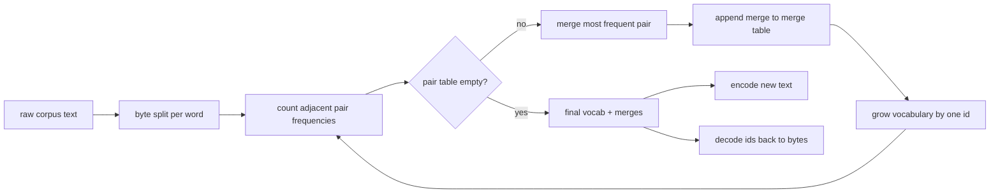
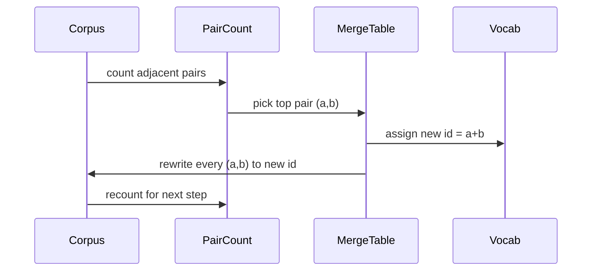

# बीपीई टोकनाइज़र स्क्रैच से

> बाइट्स में, आईडी बाहर, आईडी वापस एक ही बाइट्स में. टोकन बनाने के लिए कि हर आधुनिक पाठ मॉडल अभी भी शुरू होता है.

**Type:** Build
**Languages:** Python
**Prerequisites:** Phase 04 lessons, Phase 07 transformer lessons
**Time:** ~90 minutes

## सीखने के लक्ष्य
- सबसे अधिक बार आने वाले संकेतक जोड़े को बार-बार मिलाकर कच्चे पाठ कॉर्पस से बाइट-पियर एन्कोडिंग शब्दावली को प्रशिक्षित करें।
- एक निर्धारात्मक विलय तालिका को लागू करें और इसे नए पाठ पर लागू करें ताकि उपशब्द आईडी की धारा उत्पन्न हो।
- आईडी और वापस पर बिना सूचना हानि के स्वैच्छिक UTF-8 इनपुट।
- विशेष टोकन को आरक्षित और संरक्षित करें (`<|endoftext|>`,`<|pad|>`) ताकि वे प्रशिक्षण और डिकोडिंग से बच सकें।
- कारण है कि बाइट स्तर का वर्णमाला सामान्य प्रयोजन टोकनराइज़र के लिए सही मंजिल क्यों है।

```figure
cap-bpe-merge
```

## फ्रेम

एक भाषा मॉडल कभी भी पाठ नहीं देखता है। यह पूर्णांक देखता है। एक स्ट्रिंग से पूर्णांक की सूची तक का नक्शा और वापस टोकनराइज़र है। इस परत को गलत करें और प्रशिक्षण रन में हर हानि वक्र गलत चीज को माप रहा है।

सामान्य पाठ मॉडल के लिए उपशब्द टोकन बनाने वाले प्रमुख परिवार बाइट-पियर एन्कोडिंग है। विचार छोटा है। एक ज्ञात वर्णमाला से शुरू करें। प्रशिक्षण कॉर्पस में सबसे अधिक बार दिखाई देने वाले आसन्न प्रतीक जोड़े को खोजें। इसे नए प्रतीक में मिलाएं। जब तक शब्दावली लक्ष्य आकार तक नहीं पहुंचती तब तक दोहराएं। नए पाठ को एन्कोडिंग करने के लिए उसी क्रम में एक ही विलय सूची का उपयोग किया जाता है।

हम बाइट-स्तर के संस्करण का निर्माण करेंगे। वर्णमाला 256 कच्चे बाइट्स है, यूनिकोड कोड बिंदु नहीं। यह विकल्प टोकनराइज़र को किसी भी UTF-8 इनपुट को संभालने की अनुमति देता है।

## पाइपलाइन



प्रशिक्षण पक्ष और निष्कर्ष पक्ष मेर्ज तालिका साझा करते हैं। यह साझाकरण अनुबंध है। यदि आप मेर्ज क्रम में परिवर्तन करते हैं, तो आप आईडी की एक अलग धारा को डिकोड करते हैं।

## बाइट वर्णमाला

पहले 256 आईडी कच्चे बाइट्स 0x00 से 0xFF के लिए आरक्षित हैं। यह गारंटी देता है कि किसी भी विलय होने से पहले प्रत्येक इनपुट स्ट्रिंग को शब्दावली में व्यक्त किया जा सकता है। बाइट ब्लॉक के बाद हम विशेष टोकन के लिए एक छोटी सीमा आरक्षित करते हैं। प्रशिक्षण लूप कभी भी उन आईडी को विलय लक्ष्य के रूप में प्रस्तावित नहीं करता है क्योंकि हम उन्हें पूरी तरह से पूर्व-टोकनीकृत धारा से बाहर रखते हैं।

प्रीटोकनीज़र को प्रशिक्षण से पहले सफेद स्थान और अंकुश सीमाओं पर विभाजित करता है। बिना उस विभाजन के बीपीई विलय चरण खुशी से शब्द सीमाओं को पार करने वाले विलय सीखेंगे और शब्दावली पूरे सामान्य वाक्यांशों से भर जाएगी। विलय के साथ, विलय एक शब्द के अंदर रहते हैं और परिणाम सामान्य हो जाता है।

## प्रशिक्षण लूप

प्रत्येक प्रशिक्षण चरण के लिए लूप तीन चीजें करता है। यह कॉर्पस में प्रत्येक शब्द को चलता है और गणना करता है कि प्रत्येक आसन्न वर्तमान प्रतीकों के जोड़े की कितनी बार दिखाई देती है, शब्द स्वयं की कितनी बार दिखाई देती है, इसके अनुसार वजन। यह उच्चतम संख्या वाले जोड़े को चुनता है। यह उस जोड़े की प्रत्येक घटना को एक नए प्रतीक में फिर से लिखता है जिसका आईडी शब्दावली में अगला मुक्त स्लॉट है। फिर यह विलय को रिकॉर्ड करता है।



प्रत्येक चरण की लागत प्रतीक अनुक्रमों की सूची के रूप में व्यक्त किए गए कॉर्पस के आकार में रैखिक है। एक मिलियन शब्दों और दस हजार आईडी के लक्ष्य शब्दावली के लिए लूप सेकंड में पूरा हो जाता है क्योंकि प्रतीक अनुक्रम भूमि के साथ-साथ सिकुड़ते हैं।

## ताजा पाठ को एन्कोडिंग

इन्फेरेंस मर्ज काउंटर को नहीं बुलाता है। यह उसी क्रम में मर्ज टेबल को लागू करता है जिसे यह सीखा गया था। एक नए शब्द के लिए एन्कोडर बाइट स्प्लिट से शुरू होता है। यह सबसे कम रैंक वाले मर्ज (सबसे पहले लागू होने वाला) के लिए वर्तमान अनुक्रम को स्कैन करता है। यह उस मर्ज को करता है। यह फिर से स्कैन करता है। लूप समाप्त होता है जब तालिका में कोई मर्ज वर्तमान अनुक्रम पर लागू नहीं होता है।

रैंक द्वारा क्रमबद्धता वह गुण है जो एन्कोडिंग को निर्धारक बनाता है और उसी इनपुट पर प्रशिक्षण व्यवहार से मेल खाता है। एक विलय जो पहले सीखा गया था तालिका के शीर्ष पर बैठता है और पहले लागू होता है। यदि दो विलय एक ही स्थिति पर लागू हो सकते हैं, तो निम्न-रैंक वाला एक जीतता है।

## विशेष टोकन

विशेष टोकन आईडी हैं कि बाइट स्ट्रीम कभी नहीं उत्पन्न कर सकते हैं. हम उन्हें हाथ से आरक्षित करते हैं. दो इस सबक के लिए पर्याप्त हैं.

- `<|endoftext|>`यह मॉडल को बताता है "एक नया दस्तावेज़ यहां शुरू होता है, पिछले एक के संदर्भ में लीक नहीं होने दें। "
- `<|pad|>`एक बैच एक आयताकार tensor हो सकता है ताकि एक बैच एक छोटे अनुक्रम भरता है। हानि मुखौटा प्रशिक्षण के दौरान इसे छिपाता है।

एन्कोडर इनपुट में विशेष टोकन की अनुमति देने के लिए एक ध्वज स्वीकार करता है। ध्वज बंद होने के साथ, स्ट्रिंग `<|endoftext|>`और `<|pad|>`ध्वज के साथ, शाब्दिक स्ट्रिंग उनके आरक्षित आईडी के लिए मैप किया जाता है और किसी भी विलय के अधीन नहीं हैं.

## यात्रा व वापसी की गारंटी

फिर एन्कोडिंग को इनपुट बाइट्स को ठीक से वापस करना चाहिए। डिकोडर प्रत्येक आईडी के बाइट विस्तार को क्रम में जोड़ता है। चूंकि प्रत्येक आईडी या तो एक कच्चे बाइट या दो पहले से ज्ञात आईडी का एक साथ जोड़ता है, इसलिए पुनरावर्ती विस्तार हमेशा कच्चे बाइट्स में समाप्त होता है। फिर डिकोडिंग UTF-8 स्ट्रिंग को वापस करता है जो उन बाइट्स को वर्तनी देता है।

इस पाठ में परीक्षण सूट एक अदृश्य वाक्य पर उस गुण की जांच करता है, एक यूनिकोड इमोजी के साथ एक वाक्य पर, और एक वाक्य पर जो एक शाब्दिक शामिल है `<|endoftext|>`टोकन।

## यह सबक क्या नहीं करता

यह सबसे बड़े उत्पादन टोकन बनाने वालों की शैली में रेजेक्स-चालित प्रीटोकनाइज़र नहीं बनाता है। यहाँ प्रीटोकनीज़र एक छोटा सा सफेद स्थान और अंकुश विभाजन है। एक छोटे से प्रशिक्षण पाठ्यक्रम पर समझदार विलय का उत्पादन करना पर्याप्त है और बाकी पाठ श्रृंखला के साथ अनुबंध समान रहता है। अगला पाठ टोकनराइज़र को ब्लैक बॉक्स के रूप में देखता है और इसके ऊपर स्लाइडिंग विंडो डेटासेट बनाता है।

यह जोड़ी काउंट को समानांतर नहीं करता है। पाइथन में कुछ हजार शब्दों के कॉर्पस पर एक लूप एक सेकंड से भी कम समय में समाप्त होता है। बड़े कॉर्पस के लिए स्पष्ट कदम समानांतर में प्रति शब्द जोड़े गिनना और कम करना है।

## कोड कैसे पढ़ें

`main.py`चार वस्तुओं को परिभाषित करता है।`BPETokenizer`शब्दकोश, विलय तालिका और विशेष टोकन तालिका रखता है। `train`प्रशिक्षण लूप है।`encode`यह निष्कर्ष पथ है।`decode`नीचे डेमो एक अंतर्निहित corpus पर एक छोटे टोकनराइज़र को प्रशिक्षित करता है, एक लंबे समय तक चलने वाले वाक्य को एन्कोड करता है, आईडी को वापस डिकोड करता है, और दोनों को प्रिंट करता है।`code/tests/test_bpe.py`वापस-यात्रा संपत्ति, विशेष टोकन आरक्षण, और विलय आदेश चिह्नित करें।

डेमो चलाएं. फिर डेमो में लक्ष्य शब्दावली आकार को 300 से 600 में बदलें और देखें कि कैसे कोडेड लंबाई को पकड़ने के लिए बाहर रखा वाक्य गिरता है. यह वक्र BPE संपीड़न वक्र है.
