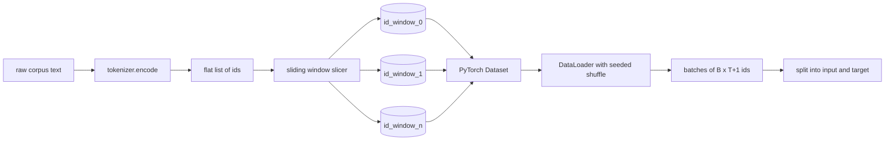
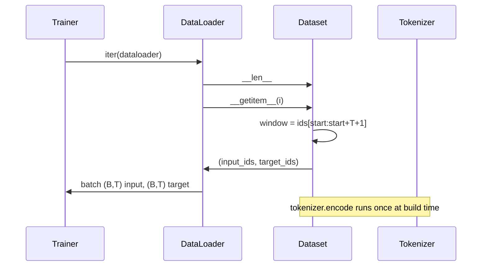

# स्लाइडिंग विंडो के साथ टोकनकृत डेटासेट

> एक पूर्व प्रशिक्षण रन टोकन आईडी से ग्रेडिएंट तक का एक कार्य है। यह पाठ कन्वेयर बनाता है जो आईडी को फ़ीड करता है।

**Type:** Build
**Languages:** Python
**Prerequisites:** Phase 04 lessons, Phase 07 transformer lessons, Lesson 30 of this phase
**Time:** ~90 minutes

## सीखने के लक्ष्य
- एक बार टोकन बनाने वाले को कॉल करके कच्चे कॉर्पस को टोकन आईडी की धारा में परिवर्तित करें।
- एक कॉन्फ़िगरेबल ओवरलैप स्टेड के साथ आईडी स्ट्रीम को फिक्स्ड-लंबाई खिड़कियों में काटें।
- एक PyTorch डेटासेट का निर्माण करें जो अगले टोकन भविष्यवाणी के लिए इनपुट और लक्ष्य टेंसर लौटाता है।
- डेटासेट को एक डेटा लोडर में एक निश्चित मिश्रण के साथ लपेटें जो प्रत्येक युग के अनुसार बीजित है।
- गति, अधिभार और प्रभावी डेटासेट आकार के बीच व्यापार-बदलाव के बारे में तर्क।

```figure
cap-sliding-window
```

## फ्रेम

एक पूर्व-प्रशिक्षण रन एक बार में टोकन आईडी के एक बैच को पढ़ता है और मॉडल को अपडेट करता है। प्रत्येक बैच का आकार प्रशिक्षण अनुबंध द्वारा तय किया जाता है। कारण भाषा मॉडल के लिए, बैच holds `(B, T)`इनपुट आईडी और `(B, T)`लक्ष्य आईडी जहां लक्ष्य एक द्वारा बाएं स्थानांतरित इनपुट है। डेटा पाइपलाइन का काम उस अनुबंध को मांग पर, एक निर्णायक और पुनरुत्पादित करने योग्य तरीके से, कच्चे पाठ के एक कॉर्पस से उत्पन्न करना है जो कई गीगाबाइट हो सकता है।

इस पाठ को पाइपलाइन बनाता है। पिछले पाठ से टोकनराइज़र पाठ को आईडी की एक लंबी सपाट सूची में बदल देता है। एक स्लाइडिंग विंडो उन सूची को प्रशिक्षण उदाहरणों में काटती है। एक कस्टम डेटासेट उदाहरणों को टेन्सर के रूप में उजागर करता है। एक डेटा लोडर उन्हें बैच करता है और उन्हें एक ज्ञात बीज के साथ मिलाता है।

## आकार अनुबंध

एक कारण एलएम आकार के आईडी का उपभोग करता है `(B, T)`कहाँ`B`बैच का आकार है और `T`स्थिति पर लक्ष्य `t`स्थिति पर इनपुट है `t+1`इसका मतलब है कि प्रत्येक प्रशिक्षण उदाहरण को कवर करता है`T+1`कच्चे आईडी. विंडो कदम नियंत्रण करता है कि कैसे एक पंक्ति के उदाहरणों के बीच ओवरलैप मौजूद है.



स्लाइसर कभी भी कॉर्पस की सीमा से ओवरलैप नहीं होता है। यदि अंतिम विंडो में भरने के लिए पर्याप्त आईडी नहीं है।`T+1`स्थिति, स्लिज़र इसे छोड़ देता है।`<|pad|>`यह भी एक वैध विकल्प है लेकिन यह नुकसान मुखौटा जटिल बनाता है. इस सबक के लिए हम छोड़ देते हैं.

## क्यों एक स्लाइडिंग विंडो

एक पूर्व-प्रशिक्षण corpus एक लंबी आईडी की धारा है। यदि मॉडल केवल गैर-ओवरलैपिंग खिड़कियां देखता है, तो प्रत्येक प्रशिक्षण उदाहरण उसे एक ही सिखाएगा `T`सीमाओं. कदम समायोजित करने के आसपास उन सीमाओं को स्थानांतरित करता है ताकि मॉडल को भविष्यवाणी-अगले टोकन कार्यों को अधिक विविध देखता है.

एक कदम `T`एक कदम के साथ एक कदम के साथ एक कदम के साथ एक कदम के साथ एक कदम के साथ एक कदम के साथ एक कदम के साथ एक कदम के साथ एक कदम के साथ एक कदम के साथ एक कदम के साथ एक कदम के साथ एक कदम के साथ एक कदम के साथ एक कदम के साथ एक कदम के साथ एक कदम के साथ एक कदम के साथ एक कदम के साथ एक कदम के साथ एक कदम के साथ एक कदम के साथ एक कदम के साथ एक कदम के साथ एक कदम के साथ एक कदम के साथ एक कदम के साथ एक कदम के साथ एक कदम के साथ एक कदम के साथ एक कदम के साथ एक कदम के साथ एक कदम के साथ एक कदम के साथ एक कदम के साथ एक कदम के साथ एक कदम के साथ एक कदम के साथ एक कदम के साथ एक कदम के साथ एक कदम के साथ एक कदम के साथ एक कदम के साथ एक कदम के साथ एक कदम के साथ एक कदम के साथ एक कदम के साथ एक कदम के साथ एक कदम के साथ एक कदम के साथ एक कदम के साथ एक कदम`T // 2`यह 50% ओवरलैप पैदा करता है और प्रभावी डेटासेट को दोगुना करता है।`1`अधिकतम ओवरलैप पैदा करता है और डेटासेट को बढ़ाता है `T`. लागत प्रति युग अधिक गणना है. लाभ अधिक सीमा विविधता है. अधिकांश पूर्व-प्रशिक्षण रन संदर्भ लंबाई के बराबर एक कदम का उपयोग करते हैं क्योंकि कॉर्पस पहले से ही एक युग में मॉडल को पूरा करने से बहुत बड़ा है, इसलिए सीमा विविधता तर्क कमजोर है।

## डेटासेट वर्ग

PyTorch डेटासेट में दो आवश्यक तरीके होते हैं। `__len__`उदाहरणों की संख्या लौटाता है। `__getitem__`हमारे डेटासेट एन्कोडेड आईडी स्ट्रीम और स्ट्रेड को संग्रहीत करता है। इसमें इंडेक्सिंग विंडो की शुरुआत की गणना करता है ताकि मेमोरी लागत आईडी स्ट्रीम की एक प्रति हो, चाहे स्ट्रेड कितने उदाहरण उत्पन्न करे।



एक-एक करके बदलाव अंदर होता है `__getitem__`. डेटासेट वापस आता है `(input, target)`कहाँ`input = window[:-1]`और `target = window[1:]`दोनों ही PyTorch लंबे tensors हैं प्रशिक्षण लूप उन्हें जमीन सत्य के रूप में व्यवहार करता है।

## निर्धारक मिश्रण

 के साथ एक डेटा लोडर`shuffle=True`एक PyTorch यादृच्छिक जनरेटर से पढ़ता है. एक स्पष्ट पारित करके`torch.Generator`एक बीज के बिना, दो रन डेटा को अलग-अलग क्रम में देखते हैं और हानि वक्र परिवर्तन से संबंधित नहीं कारणों से भिन्न होते हैं।

इस पाठ में बीज अनुबंध सरल है।`epoch_seed = base_seed + epoch_index`. आधार बीज निर्माण में पारित किया जाता है. युग सूचकांक प्रत्येक युग के शीर्ष पर प्रशिक्षक द्वारा बढ़ाया जाता है. एक ही आधार बीज के साथ एक बार फिर से प्रत्येक युग में एक ही क्रम को देखता है।

## बैच नमूना

PyTorch में डिफ़ॉल्ट नमूनाकर्ता प्रतिस्थापन अक्षम के साथ समान रूप से यादृच्छिक रूप से सूचकांक चुनता है। यह हम पूर्व प्रशिक्षण के लिए चाहते हैं। एक छोटे से डेटासेट पर ठीक से ट्यूनिंग के लिए अनुबंध एक ही है। DataLoader कॉल करके एक बैच इकट्ठा करता है `__getitem__` `B`क्योंकि प्रत्येक उदाहरण के निर्माण द्वारा एक ही लंबाई है, कोई पैडिंग तर्क की जरूरत नहीं है.

सबक जारी है `num_workers=0`एक उत्पादन में श्रमिकों को समानांतर रूप से काम करना चाहिए।`__getitem__`हमारे पाइपलाइन के साथ जो ज्यादातर एक नो-ऑप है क्योंकि काम सिर्फ एक स्लाइस है एक स्मृति में tensor, लेकिन एक ही डेटासेट एपीआई साफ रूप से श्रमिकों का समर्थन करता है.

## गिनती के उदाहरण

लंबाई के आईडी धारा के लिए `N`, एक संदर्भ लंबाई `T`, और एक कदम `S`, उदाहरणों की संख्या `max(0, 1 + (N - (T + 1)) // S)`. पाठ उस गणना को डेटासेट पर एक स्थैतिक विधि के रूप में प्रकट करता है ताकि प्रशिक्षक बिना पुनरावृत्ति के प्रत्येक युग के कुल चरणों की गणना कर सके।

## यह सबक क्या नहीं करता

यह डिस्क से स्ट्रीम नहीं करता है। कॉर्पस पूरी तरह से मेमोरी में एन्कोड किया जाता है और एक एकल टेंसर के रूप में रखा जाता है। कुछ मिलियन आईडी के कॉर्पस के लिए जो सौ मेगाबाइट से कम है और पाठ के लिए सही आकार है। डिस्क स्ट्रीमिंग एक अलग चिंता है जो भंडारण को बदलकर प्लग इन करती है लेकिन डेटासेट अनुबंध को बनाए रखती है।

यह कई दस्तावेजों को संभालता नहीं है। कॉर्पस को एक निरंतर आईडी स्ट्रीम के रूप में माना जाता है। अगले दस्तावेज़ की सीमा को डालने से एन्कोड किया जाता है `<|endoftext|>`जब corpus कई दस्तावेजों से बनाया जाता है. मॉडल सीमा के आसपास भविष्यवाणी करना सीखता है.

## कोड कैसे पढ़ें

`main.py`दो वर्गों और एक सहायक को परिभाषित करता है।`SlidingWindowDataset`यह PyTorch डेटासेट है। `make_dataloader`एक बीज जनरेटर के साथ एक कॉन्फ़िगर डेटा लोडर लौटाता है। `_encode_corpus_to_ids`नीचे डेमो एक छोटे से टोकनराइज़र को प्रक्रिया में बनाता है, एक अंतर्निहित कॉर्पस को कोड करता है, डेटासेट और डेटा लोडर का निर्माण करता है, एक बैच प्रिंट करता है, और आकार अनुबंध का दावा करता है।`code/tests/test_dataset.py`खिड़की गिनती सूत्र, shift-by-one गुण, निर्धारक मिश्रण, और कदम-बदला.

डेमो चलाएं. फिर संदर्भ लंबाई को 16 से 32 में बदलें और देखें कि प्रति युग उदाहरणों की संख्या कैसे गिरती है। यह संख्या आपके चरण-प्रति-युग बजट है।
