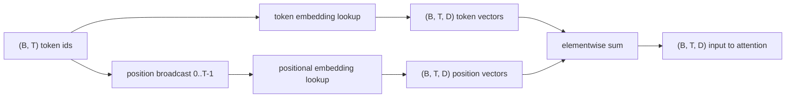
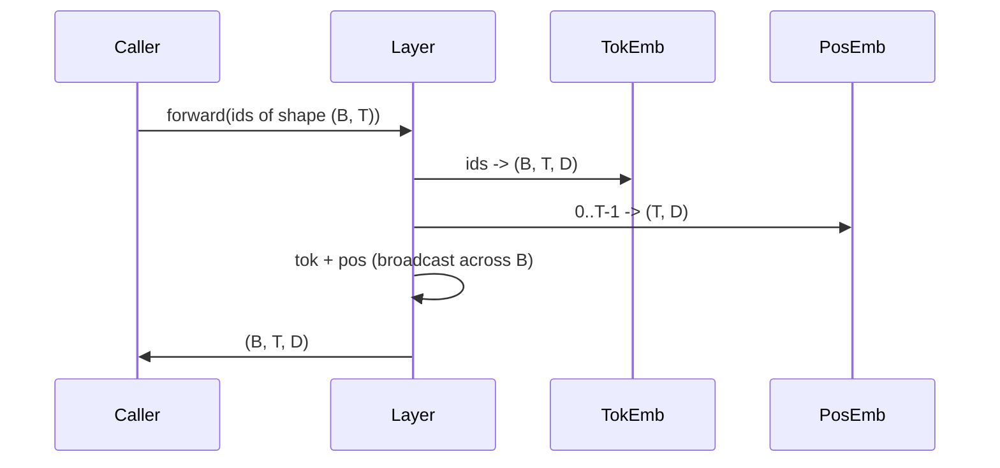

# टोकन और स्थिति सम्मिलित

> आईडी पूर्णांक हैं. मॉडल वेक्टर चाहता है. दो खोज तालिकाओं के बीच बैठते हैं, और स्थिति एक का चयन मॉडल सीख सकते हैं क्या आकार देता है.

**Type:** Build
**Languages:** Python
**Prerequisites:** Phase 04 lessons, Phase 07 transformer lessons, Lessons 30 and 31 of this phase
**Time:** ~90 minutes

## सीखने के लक्ष्य
- एक टोकन एम्बेड खोज तालिका बनाएं जो शब्द संग्रह आईडी को घने वेक्टरों में मानचित्रित करता है।
- एक सीखा गया स्थिति-एम्बेडिंग खोज तालिका निर्माण करें स्थिति द्वारा अनुक्रमित।
- बिना पैरामीटर के स्थिति के अनुक्रमित एक निश्चित सिनोसाइडल स्थिति एम्बेडिंग बनाएं।
- एक ट्रांसफार्मर ब्लॉक के लिए एक एकल इनपुट में टोकन और स्थितित्मक एम्बेड को सम्मिलित करें।
- लंबाई सामान्यीकरण और पैरामीटर गणना पर विपरीत सीखा और सिनोसाइडल एम्बेडेड।

```figure
cc-embedding-lookup
```

## फ्रेम

एक टोकन आईडी के साथ मॉडल का पहला संपर्क टोकन-एम्बेडेड मैट्रिक्स में एक पंक्ति खोज है। मैट्रिक्स में प्रत्येक शब्दावली आईडी और प्रत्येक मॉडल आयाम के लिए एक कॉलम होता है। खोज एक वेक्टर लौटाता है जिसे शेष मॉडल आईडी के अर्थ के रूप में व्यवहार करता है। बैकप्रॉप आगे के पास में उपयोग की गई पंक्तियों को अपडेट करता है। प्रशिक्षण के दौरान उन पंक्तियों की ज्यामिति दिशाओं में समानता को एन्कोड करना सीखती है।

केवल टोकन आईडी में कोई आदेश नहीं है। मॉडल को दूसरे सिग्नल की आवश्यकता है जो उसे बताता है कि स्थिति एक स्थिति से अलग है सत्रह। उस संकेत के लिए दो प्रमुख विकल्प एक सीखे गए स्थितिगत एम्बेडिंग (एक दूसरी खोज तालिका, प्रति स्थिति एक पंक्ति) और एक निश्चित सिनोसाइडल स्थितिगत एम्बेडिंग (परामदियों के बिना एक गणितीय सूत्र) हैं। इस विकल्प के परिणाम हैं। एक सीखी गई तालिका एक पैरामीटर है और मॉडल को प्रशिक्षित किए गए अधिकतम संदर्भ लंबाई द्वारा सीमित है। एक sinusidal तालिका सिद्धांत रूप में पैरामीटर मुक्त है और सूत्र किसी भी स्थिति तक फैलता है, लेकिन इस सबक के `SinusoidalPositionalEmbedding` पर एक निश्चित तालिका पूर्व-गणना करता है`max_context_length`और इसके `forward`इस सीमा से परे बढ़ता है; इसलिए दोनों मॉड्यूल यहां अधिकतम संदर्भ लंबाई को लागू करते हैं। मॉडल अभी भी अपनी प्रशिक्षण लंबाई से परे संघर्ष कर सकता है भले ही तालिका सूचकांक के लिए पर्याप्त बड़ी हो।

यह पाठ दोनों का निर्माण करता है और उन्हें अगले पाठ के ध्यान ब्लॉक के लिए एक एकल इनपुट में चिह्न के साथ शामिल करता है।

## आकार अनुबंध

एम्बेडिंग चरण में इनपुट आकार के टोकन आईडी का एक बैच है `(B, T)`. आउटपुट आकार का एक tensor है `(B, T, D)`कहाँ`D`प्रत्येक बैच तत्व की संदर्भ लंबाई समान है `T`. प्रत्येक स्थिति में एक ही वेक्टर आयाम है .`D`. .



रचना एक योग है, एक संयोजन नहीं। योगण करता रहता है।`D`नेटवर्क के माध्यम से निरंतर और मॉडल को प्रति विशेषता आधार पर यह तय करने देता है कि प्रत्येक परत पर टोकन अर्थ या स्थिति का वर्चस्व है या नहीं।

## टोकन एम्बेडिंग मैट्रिक्स

टोकन एम्बेडिंग आकार के एक पैरामीटर Tensor है `(V, D)`कहाँ`V`PyTorch इसे प्रकट करता है`nn.Embedding(V, D)`. प्रारंभ में प्रविष्टियाँ एक छोटे गौशियन से ली जाती हैं, पारंपरिक रूप से औसत शून्य और मानक विचलन के साथ लगभग `0.02`ट्रांसफार्मर पैमाने के मॉडल के लिए. सटीक init यह रन के माध्यम से लगातार रहता है की तुलना में कम मायने रखता है.

आगे की पार एक एकल सूचकांक ऑपरेशन है।`(B, T)`int64 आईडी `(B, T, D)`पटरियों को पटरियों में जमा करके तैरता है। पीछे की पार केवल उन पटरियों में ग्रेडिएंट जमा करती है जो आगे की पार में छूए गए थे। दो पटरियों जो बैच में कभी दिखाई नहीं दी, उन्हें उस चरण पर शून्य ग्रेडिएंट मिलता है।

एक सूक्ष्म विवरण। मॉडल के अंत में टोकन एम्बेडिंग और आउटपुट प्रोजेक्शन अक्सर वजन साझा करते हैं (वेट टाईंग) । जब ऐसा होता है, तो प्रत्येक पिछड़े पास आउटपुट पक्ष के माध्यम से एम्बेडिंग की प्रत्येक पंक्ति को छूता है। यहां सबक दोनों को अलग मॉड्यूल के रूप में उजागर करता है लेकिन एक ही मैट्रिक्स एक पूर्ण मॉडल में दोनों भूमिकाएं निभा सकती है।

## सीखा गया स्थितिगत सम्मिलन

सीखा स्थितिगत एम्बेडिंग एक दूसरे है `nn.Embedding`आकार का `(max_context_length, D)`. खोज स्थान आईडी द्वारा कुंजीकृत है`0, 1, 2, ..., T-1`. आगे का पास बैच आयाम के पार उस स्थिति वेक्टर को प्रसारित करता है।

सीखे हुए तालिका का नकारात्मक पक्ष यह है कि इसे स्थिति में नहीं पूछा जा सकता है `T`यदि मॉडल को केवल स्थिति तक प्रशिक्षित किया गया था `T-1`. पंक्ति मौजूद नहीं है. केवल उत्पादन डिकोडर मॉडल जो इस योजना का उपयोग करते हैं वास्तुकला में अधिकतम संदर्भ लंबाई पकाएं और लंबे इनपुट को संसाधित करने से इनकार करें।

## सिनोसाइडल पोजिशनिंग एम्बेडिंग

सिनोसाइडल स्थितिगत एम्बेडिंग स्थिति से वेक्टर तक एक फ़ंक्शन है।`p`और विशेषता `i`उत्पाद

```python
angle = p / (10000 ** (2 * (i // 2) / D))
emb[p, 2k]     = sin(angle)
emb[p, 2k + 1] = cos(angle)
```

फ़ंक्शन के कोई पैरामीटर नहीं हैं. प्रत्येक स्थिति में एक अद्वितीय वेक्टर होता है। तरंग लंबाई विशेषता आयामों के बीच ज्यामितीय रूप से भिन्न होती है, इसलिए निचले आयामों में मोटी स्थिति को कोडित किया जाता है और उच्च आयामों में बारीक स्थिति को कोडित किया जाता है।

`sin`और `cos`एक साथ है कि स्थिति में वेक्टर `p + k`स्थिति पर वेक्टर का एक रैखिक फ़ंक्शन है `p`. जो ध्यान परत को सापेक्ष-स्थिति ऑफसेट सीखने के लिए एक आसान मार्ग देता है. मॉडल को "पांच टोकन वापस देखो" को व्यक्त करने के लिए एक अलग पैरामीटर की आवश्यकता नहीं है.

पाठ निर्माण के समय पूर्ण सिनोसाइडल तालिका की गणना करता है और आगे के समय में इसे सूचकांकित करता है।

## संरचना

इनपुट पाइपलाइन तीन चीजें क्रम में करता है. टोकन आईडी पढ़ें. टोकन वेक्टर खोजें. स्थिति वेक्टर जोड़ें. योग लौटाएं.



संक्षेप में प्रसारण `(T, D)`बैच आयाम के साथ स्थिति टेंसर। PyTorch स्वचालित रूप से है कि संभालता है क्योंकि स्थिति टेंसर के आकार है`(1, T, D)`अनस्प्रेस के बाद।

## विपरीत विश्लेषण

पाठ एक ही इनपुट पर दोनों संस्करण चलाता है और दो निदान प्रिंट करता है।

पहला पैरामीटर गिनती है। सीखा संस्करण जोड़ता है `max_context_length * D`टोकन एम्बेडिंग के ऊपर पैरामीटर। sinusidal संस्करण शून्य जोड़ता है।

दूसरा, आस-पास की स्थिति में एम्बेडेड के बीच कॉसिन समानता है। सिनोसाइडल वेरिएंट में एक चिकनी और पूर्वानुमाननीय क्षय होता है क्योंकि कार्य निरंतर होता है। आरंभिकरण पर सीखे गए संस्करण में लगभग यादृच्छिक समानता होती है क्योंकि पंक्तियों को स्वतंत्र रूप से खींचा जाता है। प्रशिक्षण के बाद, सीखे गए संस्करण आमतौर पर एक समान चिकनी संरचना विकसित करते हैं, लेकिन उसे डेटा से उस संरचना का पता लगाना होता है।

## यह सबक क्या नहीं करता

यह घूर्णन स्थिति एन्कोडिंग (RoPE) या AliBi का निर्माण नहीं करता है। ये उत्पादन ट्रांसफार्मर में आधुनिक विकल्प हैं। वे दोनों यहां एम्बेडेड के समान आकार अनुबंध का पालन करते हैं (आकार के वेक्टरों पर स्थिति-निर्भर परिवर्तन लागू करें)`(B, T, D)`) पर ध्यान-प्रक्षेपण चरण में इनपुट के बजाय लागू होते हैं। अगले पाठ ध्यान ब्लॉक का निर्माण करता है, और वैकल्पिक विस्तारों में से एक वहाँ क्वेरी-की प्रोजेक्शन में घूर्णन से गुंडा है।

यह एम्बेडिंग को प्रशिक्षित नहीं करता है। प्रशिक्षण के लिए एक हानि की आवश्यकता होती है, जो एक मॉडल आउटपुट की आवश्यकता होती है, जो ध्यान और एक एलएम सिर की आवश्यकता होती है। यह अगला पाठ है और बाद में एक।

## कोड कैसे पढ़ें

`main.py`तीन मॉड्यूल को परिभाषित करता है। `TokenEmbedding`लपेटें `nn.Embedding(V, D)`. .`LearnedPositionalEmbedding`लपेटें `nn.Embedding(L, D)`. .`SinusoidalPositionalEmbedding`तालिका को पूर्व-गणना करता है और इसे बफर के रूप में प्रकट करता है। `EmbeddingComposer`नीचे डेमो आकारों, पैरामीटर गिनती और पड़ोसी-स्थिति समानता निदान प्रिंट करता है।`code/tests/test_embeddings.py`पिन का आकार, प्रसारण व्यवहार, पैरामीटर गिनती, और sinusidal सूत्र।

डेमो चलाओ. फिर मॉडल आयाम बदलें.`D`64 से 32 तक और देखते हैं कि sinusidal तरंग दैर्ध्य बैंड कैसे बदलते हैं।
