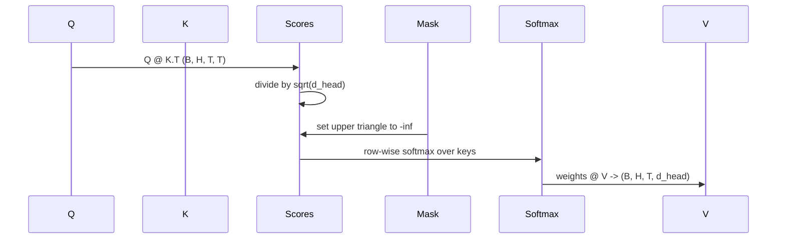

# बहु-उपदेही आत्म-ध्यान

> एक रैखिक प्रक्षेपण, तीन दृश्य, एच समानांतर सिर, एक मुखौटा. ध्यान ब्लॉक जैसा कि मॉडल वास्तव में इसका उपयोग करता है.

**Type:** Build
**Languages:** Python
**Prerequisites:** Phase 04 lessons, Phase 07 transformer lessons, Lessons 30 through 32 of this phase
**Time:** ~90 minutes

## सीखने के लक्ष्य
- एक बैच के रूप में एक एकल रैखिक परत H सिरों में विभाजित एक क्वेरी/की/मूल्य प्रक्षेपण लागू करें।
- सही सामान्यीकरण और dtype हैंडलिंग के साथ स्केल डॉट-प्रोडक्ट ध्यान की गणना करें।
- एक कारणात्मक मुखौटा लगाएं जो किसी स्थिति को भविष्य की स्थिति में आने से रोकता है।
- प्रति सिर ध्यान भारों की जाँच करें कि एक निश्चित इनपुट और प्रत्येक सिर पर क्या देखता है, इसके बारे में तर्क दें।
- खिलौना कार्य पर एक छोटे से ध्यान ब्लॉक को प्रशिक्षित करें और सिरों के विशेषज्ञता के रूप में नुकसान गिरते हुए देखें।

```figure
cap-multihead-attention
```

## फ्रेम

ध्यान वह कार्य है जो किसी टोकन के प्रतिनिधित्व को उसी क्रम में अन्य टोकन से जानकारी खींचने देता है। स्व-विचार का अर्थ है कि क्वेरी, कुंजी और मान सभी एक ही इनपुट से प्राप्त होते हैं। मल्टी-हेड का अर्थ है कि प्रोजेक्शन को H समानांतर ध्यान समस्याओं में विभाजित किया जाता है जिनके आउटपुट को एक साथ जोड़ा जाता है और वापस प्रोजेक्ट किया जाता है।

प्रभावी कार्यान्वयन पैटर्न एक रैखिक परत है जो परियोजनाओं से `D``3 * D`और तीन दृश्यों में काटा जाता है, फिर आकार के H सिर में बदल दिया जाता है`D // H`मत्मुल, सॉफ्टमैक्स और वेटेड योग बैच टेंसर संचालन के रूप में होता है ताकि सिर त्वरक पर समानांतर चल रहे हैं।

यह पाठ उस ब्लॉक को बनाता है। यह कारणात्मक मुखौटा भी जोड़ता है ताकि एक ही कोड केवल डिकोडर भाषा मॉडल में ध्यान परत के रूप में काम करता है। अगला पाठ ब्लॉक को पूर्ण ट्रांसफार्मर में ढेर करता है और पाठ इसे प्रशिक्षित करता है।

## आकार अनुबंध

इनपुट `(B, T, D)`. आउटपुट है `(B, T, D)`मास्क है`(T, T)`ब्लॉक के अंदर मध्यवर्ती टेन्सरों का आकार होता है`(B, H, T, d_head)`कहाँ`d_head = D // H`. . . . . . . . . . . . . . . . . . . . . . . . . . . . . . . . . . . . . . . . . . . . . . . . . . . . . . . . . . . . . . . . . . . . . . . . . . . . . . . . . . . . . . . . . . . . . . . . . . . . . . . . . . . . . . . . . . . . . . . . . . . . . . . . . . . . . . . . . . . . . . . . . . . . . . . . . . . . . . . . . . . . . . . . . . . . . . . . . . . . . . . . . . . . . . . . . . . . . . . . . . . . . . . . . . . . . . . . . . . . . . . . . . . . . . . . . . . . . . . . . . . . . . . . . . . . . . . . . . . . . . . . . . . . . . . . . . . . . . . . . . . . . . . . . . . . . . . . . . . . . . . . . . . . . . . . . . . . . . . . . . . . . . . . . . . . . . . . . . . . . . . . . . . . . . . . . . . . . . . . . . . . . . . . . . . . . . . . . . . . . . . . . . . . . . . . . . . . . . . . . . . . . . . . . . . . . . . . . . . . . . . . . . . . . . . . . . . . . . . . . . . . . . . . . . . . . . . . . . . . . . . . . . . . . . . . . . . . . . . . . . . . . . . . . . . . . . . . . . . . . . . . . . . . . .`D % H == 0`. .

```mermaid
flowchart LR
    A["(B, T, D) input"] --> B[Linear D -> 3D]
    B --> C["split into Q, K, V"]
    C --> D["reshape to (B, H, T, d_head)"]
    D --> E["scores = Q @ K.T / sqrt(d_head)"]
    E --> F[apply causal mask]
    F --> G[softmax over keys]
    G --> H["context = weights @ V"]
    H --> I["reshape to (B, T, D)"]
    I --> J[output Linear D -> D]
    J --> K["(B, T, D) output"]
```



दो रैखिक परतें (क्यूकेवी प्रोजेक्शन और आउटपुट प्रोजेक्शन) ब्लॉक में एकमात्र पैरामीटर हैं। मुखौटा, सॉफ्टमैक्स, मटमूल और रीफॉर्म सभी पैरामीटर मुक्त हैं।

## QKV विभाजन

साफ़ कार्यान्वयन में तीन अलग-अलग रैखिक परतें हैं, प्रत्येक में Q, K और V के लिए एक है। कुशल एक में एक एकल परत है जो आउटपुट करती है `3 * D`दोनों गणितीय रूप से समकक्ष हैं क्योंकि तीन अलग-अलग मैट्रिक्स गुणन द्वारा `(D, D)`भार एक मैट्रिक्स गुणा के साथ एक है `(3D, D)`और उन पर से भारी बोझ उठाया गया

कुशल संस्करण तेज़ है क्योंकि त्वरक तीन के बजाय एक मत्मूल लॉन्च करता है। यह आरंभ करना भी आसान है क्योंकि तीन उप-मैट्रिक्स एक ही पैरामीटर टेंसर में रहते हैं और एक साथ आरंभ किया जा सकता है।

## सिर को फिर से आकार देना

विभाजन के बाद, प्रत्येक Q, K, V है `(B, T, D)`. इसे H समानांतर ध्यान समस्याओं में बदलने के लिए, हम रीफाइम करने के लिए`(B, T, H, d_head)`और `(B, H, T, d_head)`. सिर आयाम अब बैच आयाम के बगल में है तो PyTorch प्रति सिर ध्यान के रूप में एक बैच ऑपरेशन पार मानता है `B * H`स्वतंत्र मामलों में।

d_head आयाम अंतिम रहता है तो स्कोर matmul `Q @ K.transpose(-2, -1)`इसका परिणाम है`(B, H, T, T)`प्रति व्यक्ति ध्यान स्कोर।

## स्केलिंग

स्कोर विभाजित होते हैं `sqrt(d_head)`बिना उस स्केलिंग के, डॉट उत्पादों के रूप में बढ़ते हैं`d_head`एक प्रविष्टि में लगभग सभी द्रव्यमान है और अन्य विलुप्त रूप से छोटे हैं। उस व्यवस्था में तराजू छोटे और सीखने के स्टॉल हैं।`sqrt(d_head)`सिर के आकारों के बीच स्कोर के अंतर को लगभग निरंतर रखता है।

## कारणात्मक मुखौटा

एक केवल डिकोडर भाषा मॉडल केवल अगले टोकन की भविष्यवाणी करते समय अतीत पर शर्त लगा सकता है। मास्क इसे लागू करता है।`(T, T)`स्कोर मैट्रिक्स नकारात्मक अनंत से प्रतिस्थापित किया जाता है. softmax के बाद उन पदों वजन शून्य मिलता है.



हम निर्माण में मास्क को बफर के रूप में पंजीकृत करते हैं ताकि यह मॉडल के समान डिवाइस पर रहता है और ग्रेडिएंट ग्राफ का हिस्सा नहीं है। मास्क अधिकतम संदर्भ लंबाई को कवर करता है जो ब्लॉक कभी भी देखेगा। आगे के समय हम ऊपरी बाएं काटा करते हैं`(T, T)`कोने में.

## आउटपुट प्रोजेक्शन

प्रति सिर संदर्भ वेक्टर के बाद `(B, H, T, d_head)`, हम वापस ट्रांसपोज़ करने के लिए`(B, T, H, d_head)`, फिर से `(B, T, D)`, और एक अंतिम आवेदन करें `(D, D)`रैखिक प्रक्षेपण। आउटपुट प्रक्षेपण मॉडल को सिरों को मिलाता है। इसके बिना, एच सिर केवल बाद की परतों के माध्यम से फिर से मिलाएंगे और ब्लॉक कृत्रिम रूप से प्रतिबंधित होगा।

## ध्यान वजन निरीक्षण

पाठ एक `return_weights=True`आगे की पास पर ध्वज। सेट होने पर, ब्लॉक प्रति सिर ध्यान आकार के वजन वापस करता है `(B, H, T, T)`प्रदर्शन एक छोटे इनपुट पर एक सिर के वजन का एक हीटमैप प्रिंट करता है ताकि आप कारण त्रिभुज संरचना और प्रति स्थिति ध्यान देख सकते हैं।

एक प्रशिक्षित मॉडल में, विभिन्न सिर अलग-अलग पैटर्न सीखते हैं। कुछ सिर तुरंत पहले टोकन की देखभाल करते हैं। कुछ सिर अनुक्रम की शुरुआत की देखभाल करते हैं। कुछ सिर लगभग समान रूप से ध्यान फैलाते हैं। निरीक्षण हुक उस व्याख्यात्मक कार्य के लिए प्रवेश बिंदु है।

## प्रशिक्षण डेमो

नीचे डेमो `main.py`ध्यान ब्लॉक को एक छोटे से LM सिर पर तार करता है और एक दोहराए गए कार्य पर पूरी चीज को प्रशिक्षित करता है। इनपुट की प्रत्येक पंक्ति संदर्भ में दोहराई गई एक एकल यादृच्छिक आईडी है। लक्ष्य एक द्वारा स्थानांतरित इनपुट है, इसलिए मॉडल को सीखना होगा कि अगला टोकन पिछले टोकन के समान है। हानि क्रॉस-एंट्रोपी है। H = 4, D = 32, T = 12, और 64 की शब्दावली के साथ, हानि यादृच्छिक (लगभग ) से गिरती है।`log(64) ~ 4.16`) नीचे से अच्छी तरह से नीचे तक `1.0`सीपीयू पर तीन युगों से अधिक.

डेमो का उद्देश्य एक उपयोगी मॉडल को प्रशिक्षित करना नहीं है, बल्कि यह सुनिश्चित करना है कि प्रवृत्तियां ब्लॉक के प्रत्येक टुकड़े के माध्यम से बहती हैं और सिर एक समस्या पर कुछ सीखते हैं जहां उत्तर स्पष्ट है।

## यह सबक क्या नहीं करता

यह एक फ़ीड-फॉरवर्ड ब्लॉक नहीं जोड़ता है। वास्तविक मॉडल में ट्रांसफार्मर परत ध्यान है जिसके बाद दो परतों के एमएलपी के साथ एक अवशिष्ट कनेक्शन और प्रत्येक परत के आसपास एक मानक है। अगला पाठ उन जोड़ता है।

यह घूर्णन या AliBi स्थिति एन्कोडिंग लागू नहीं करता है। दोनों एक ही ब्लॉक में QKV प्रक्षेपण चरण पर लागू होते हैं, लेकिन वे एक अलग शिक्षण इकाई हैं। यहां निर्मित ब्लॉक मैटमुल से पहले Q और K को परिवर्तित करके या तो के साथ संगत है।

यह अनुमान के लिए KV कैश को लागू नहीं करता है। आगे के पासों पर कैशिंग कुंजी और मान अनुकूलन है जो ऑटोरेग्रेसिव डिकोडिंग को तेज बनाता है। यह K और V टेन्सर पर आकार अनुबंध को बदलता है लेकिन Q पर नहीं। यह अनुमान के पाठ में शामिल है।

## कोड कैसे पढ़ें

`main.py`परिभाषित करता है `MultiHeadSelfAttention`. . कक्षा में दो रैखिक परतें और एक पंजीकृत मुखौटा बफर हैं। आगे के पास परियोजनाओं, पुनर्विकृति, स्कोर, मास्क, सॉफ्टमैक्स, वजन, पुनर्विकृति, और फिर से परियोजनाओं। नीचे डेमो एक छोटा मॉडल बनाता है जो टोकन और स्थिति एम्बेडमेंट और एक एलएम हेड के साथ ध्यान को लपेटता है, इसे तीन युगों के लिए कॉपी कार्य पर प्रशिक्षित करता है, और हानि वक्र और प्रति हेड ध्यान हीटमैप प्रिंट करता है। `code/tests/test_attention.py`आकार अनुबंध, कारणता गुण, softmax गुण, सिर-विभाजित गुण, और gradient प्रवाह को पिन करें।

डेमो चलाओ. फिर वृद्धि.`n_heads`4 से 8 तक (रक्षण `d_model=32`, तो `d_head=4`) और गर्मी के नक्शे को बदलने के लिए देखो।
