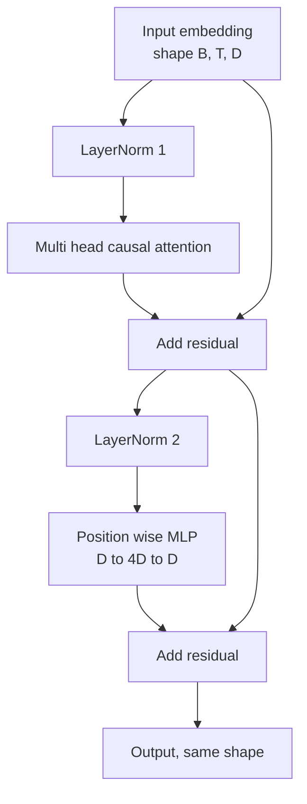
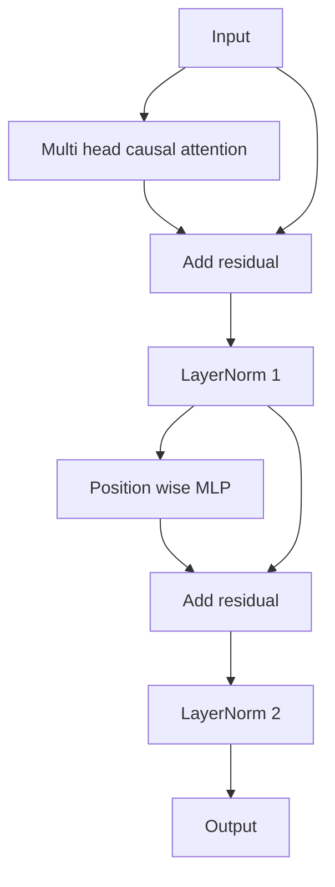

# ट्रान्सफार्मर ब्लॉक स्क्रैच से

> एक ब्लॉक हर आधुनिक डिकोडर एलएलएम की इकाई है। परत मानदंड, बहु-हेड ध्यान, अवशिष्ट, एमएलपी, अवशिष्ट। पूर्व-एलएन संस्करण गर्म होने के बिना स्थिर रूप से ट्रेन करता है। पोस्ट-एलएन संस्करण मूल पेपर द्वारा भेजा गया है। यह पाठ दोनों का निर्माण करता है, साथ-साथ, और दिखाता है कि सामान्य सीखने की दरों पर 12 परतों के ढेर में कौन जीवित रहता है।

**Type:** Build
**Languages:** Python
**Prerequisites:** Phase 19 lessons 30 to 33 (tokenizer, embeddings, attention math, batched data loader)
**Time:** ~90 minutes

## सीखने के लक्ष्य

- PyTorch में चार चलती टुकड़ों से एक ट्रांसफार्मर ब्लॉक का निर्माण करेंः LayerNorm, मल्टी हेड कारण ध्यान, अवशिष्ट कनेक्शन, स्थिति बुद्धिमान MLP।
- लेयरनोम्स को दो कॉन्फ़िगरेशन (प्री-एलएन और पोस्ट-एलएन) में रखें और समझाएं कि बिना वार्मअप के एक ट्रेन स्थिर क्यों है।
- बहु सिर ध्यान के अंदर कारणों का छिपाई लागू करें ताकि प्रतीक `i`टोकन नहीं देख सकते `j > i`. .
- 12 परतों के ढेर पर दोनों प्रकारों के माध्यम से ग्रेडिएंट प्रवाह का ट्रैक करें और बिना हाथ के हिलाने के परिणाम पढ़ें।
- अगले पाठ में 124 मिलियन पैरामीटर GPT को इकट्ठा करने पर ब्लॉक को एक ड्रॉप-इन इकाई के रूप में पुनः उपयोग करें।

## समस्या

एक ट्रांसफार्मर एक ब्लॉक दोहराया जाता है। ब्लॉक एक बार गलत हो जाओ, इसे बारह बार दोहराओ, और आप एक मॉडल भेजने जो पहले युग में विचलित होता है या जो बाकी के लिए वार्मअप हैक की जरूरत है. इस पाठ में आप जो दो असफलता मोड देखेंगे वे विदेशी नहीं हैं। वे पहली बार आते हैं जब कोई छात्र सहज रूप से ब्लॉक ढेर करता है। एक है भविष्य की देखभाल करने वाली ध्यान परत। दूसरा लेयरनॉर्म है जहां यह गहराई पर शेष संकेत को ताड़ नहीं सकता है।

एक बार जब आप इसे देखते हैं तो फिक्स यांत्रिक है। ब्लॉक में ठीक दो शेष पथ और ठीक दो सामान्यीकरण स्थितियां हैं। सही ढंग से स्थितियों का चयन करें और स्टैक का बाकी हिस्सा केवल लेखांकन है।

## अवधारणा

प्रत्येक डिकोडर केवल ट्रांसफार्मर ब्लॉक एक समारोह है कि आकार के एक tensor लेता है `(batch, sequence, embedding)`और एक ही आकार के एक tensor लौटता है. अंदर, दो उपपरक काम करते हैं.



यह पूर्व-एलएन संस्करण है। लेयरनॉर्म अवशिष्ट शाखा के अंदर, उपपरत के पहले स्थित है। अवशिष्ट कनेक्शन अनियमित संकेत को आगे ले जाता है।

पोस्ट-एलएन संस्करण शेष जोड़ के बाद लेयरनॉर्म को स्थानांतरित करता है।



आकार समान है। प्रशिक्षण व्यवहार नहीं है। पोस्ट-एलएन के साथ, शेष पथ के माध्यम से वापस बहने वाला ग्रेडिएंट लेयरनॉर्म से गुजरना चाहिए। गहराई पर बारह और सीखने की दर`3e-4`पूर्व एलएन शेष पथ को अनियमित छोड़ देता है, इसलिए ग्रेडिएंट एम्बेडिंग परत तक साफ फैलता है। पूर्व एलएन इस कारण से जीपीटी -2 आगे जहाजों के साथ विन्यास है।

### बहु-मुख्य ध्यान

ध्यान उपपरत तीन तरीकों से इनपुट को क्वेरी, कुंजी, मूल्य tensors में प्रोजेक्ट करता है। प्रत्येक को फिर से आकार दिया जाता है `(B, T, D)``(B, H, T, D/H)`कहाँ`H`स्केलेड डॉट उत्पाद ध्यान गणना`softmax(Q K^T / sqrt(d_k))`प्रति सिर, नकारात्मक अनंत के लिए ऊपरी त्रिकोण को मास्क, softmax के माध्यम से मास्क लागू, फिर गुणा `V`सिर एक में वापस संरेखित कर रहे हैं`(B, T, D)`मास्क एक ही टुकड़ा है जो मॉडल कारण बनाता है. मास्क भूल जाओ और आप एक मॉडल है कि धोखा प्रशिक्षित.

### एमएलपी

स्थिति बुद्धिमान MLP प्रत्येक टोकन पर एक ही दो परत नेटवर्क को स्वतंत्र रूप से लागू करता है। छिपी चौड़ाई एम्बेडिंग चौड़ाई का चार गुना है, सक्रियण GELU है, और एक ड्रॉपआउट दूसरे रैखिक के बाद होता है। MLP के अंदर कोई टोकन एक दूसरे से बात नहीं करता है। सभी टोकन मिश्रण ध्यान में होता है।

### शेष कनेक्शन दो चीजें करते हैं

वे गहरेपन के माध्यम से ग्रेडिएंट पथ को जोड़ते हैं, जो बारह परतों के माध्यम से ग्रेडिएंट मानदंड को पैमाने में रखता है। वे प्रत्येक ब्लॉक को पूर्ण प्रतिस्थापन के बजाय चल रहे प्रतिनिधित्व में एक अतिरिक्त अद्यतन सीखने देते हैं। दोनों प्रभाव ब्लॉक पैमाने का कारण हैं।

```figure
cc-transformer-block
```

## इसे बनाओ

`code/main.py`कार्य करता हैः

- `class LayerNorm`सीखने योग्य पैमाने और शिफ्ट, पक्षपातपूर्ण ईपीएस के साथ, प्रति टोकन वेक्टर पर लागू किया गया।
- `class MultiHeadAttention`के साथ`num_heads`,`head_dim = d_model // num_heads`, फ्यूज्ड क्यूकेवी प्रोजेक्शन, पंजीकृत कारणात्मक मुखौटा, ध्यान और अवशिष्ट ड्रॉपआउट।
- `class FeedForward`दो रैखिक परतों के साथ, GELU सक्रियण, ड्रॉपआउट.
- `class TransformerBlock`एक के साथ `pre_ln`ध्वज जो दो संस्करणों के बीच स्विच करता है।
- एक डेमो जो एक समान इनपुट और प्रिंट के साथ 6 परत पूर्व-एलएन स्टैक और एक 6 परत पोस्ट-एलएन स्टैक बनाता है (ए) आउटपुट आकार, (बी) एक बैकवर्ड पास के बाद एम्बेडिंग पर ग्रेडिएंट मानदंड।

इसे चलाओः

```bash
python3 code/main.py
```

आउटपुटः दोनों स्टैक पर आकार की जांच, ग्रेडिएंट मानदंडों के साथ-साथ। पूर्व-एलएन स्टैक का एम्बेडिंग ग्रेडिएंट एक ही सीखने की दर पर पोस्ट-एलएन स्टैक से बड़े पैमाने का आदेश है, जो वार्मअप के बिना अनुभवजन्य संकेत पूर्व-एलएन ट्रेनों है।

## स्टैक

- `torch`टेन्सर गणित, ऑटोग्रेड, और `nn.Module`प्लंपिंग।
- नहीं`transformers`ब्लॉक आदिम से लागू किया गया है।

## जंगली में उत्पादन के पैटर्न

तीन पैटर्न पाठ्यपुस्तक ब्लॉक को कुछ ऐसा बनाते हैं जिसे आप भेज सकते हैं।

**Fused QKV projection.**तीन अलग-अलग रैखिक परतों की लागत तीन नाभिक लॉन्च और तीन matmuls. एक रैखिक परत चौड़ाई `3 * d_model`एक ही प्रक्षेपण में एक ही काम करता है, फिर अंतिम अक्ष के साथ आउटपुट को विभाजित करता है। फ्यूज पथ प्रत्येक त्वरक पर तेज़ है और GPT-2, LLaMA और Mistral के संदर्भ कार्यान्वयन के साथ मेल खाता है।

**Registered causal mask buffer.**मास्क केवल अधिकतम संदर्भ लंबाई पर निर्भर करता है।`register_buffer`, आगे जाने के लिए प्रति सक्रिय विंडो काटा, और प्रति कॉल आवंटन छोड़ दें। यह भूलना मास्क को एक आवंटन हॉट स्पॉट में बदल देता है लंबे संदर्भ में।

**Dropout in two places, not three.**ड्रॉपअप ध्यान सॉफ्टमैक्स (अंतर्वार्ता ड्रॉपअप) और एमएलपी (अवशिष्ट ड्रॉपअप) के दूसरे रैखिक के बाद होता है। अवशिष्ट पर एक ड्रॉपअप स्वयं योजक पहचान को तोड़ता है जो ग्रेडिएंट को गहराई में बहने देता है। कुछ शुरुआती कार्यान्वयनों ने इसे गलत समझा और इसके लिए भंगुर प्रशिक्षण के साथ भुगतान किया।

## इसका प्रयोग करें

- इस पाठ में ब्लॉक बिना संशोधन के पाठ 35 में जीपीटी असेंबली में सीधे प्लग करता है।
- पूर्व-एलएन संस्करण वह है जो हर आधुनिक ओपन वेट्स एलएलएम का उपयोग करता है। पोस्ट-एलएन संस्करण वह है जो मूल 2017 ध्यान पेपर ने इस्तेमाल किया था। दोनों को जानना आपके द्वारा सामना किए जाने वाले किसी भी डिकोडर वास्तुकला को पढ़ने के लिए पर्याप्त है।
- GELU को SiLU के लिए बदलें और आपको LLaMA परिवार सक्रियण मिलता है। LayerNorm को RMSNorm के लिए बदलें और आपको LLaMA परिवार सामान्यीकरण मिलता है। एक ही कंकाल।

## व्यायाम

1. एक जोड़ें `bias=False`आधुनिक खुले वजन एलएलएम रैखिक परतों पर पक्षपात के बिना जहाज. आप 12 परतों 768 dim मॉडल में कितना पैरामीटर सहेजने मापने.
2. प्रतिस्थापन`nn.LayerNorm`एक हाथ रोल RMSNorm और जांच आउटपुट आकार अपरिवर्तित है।
3. एक झंडा जो पहले सिर के लिए ध्यान वजन वापस देता है जो जोड़ें `(B, T, T)`थेंसर. ऊपर त्रिकोण को रेखांकित करें यह पुष्टि करने के लिए कि यह शून्य softmax के बाद है.
4. एक मानसिक जांच बनाने जो एक को खिलाता है`(2, 16, 384)` के साथ टेन्सर`H=6`दोनों प्रकार के और दावा के माध्यम से आगे के आउटपुट अलग हैं (उदाहरण के लिए, `not torch.allclose`) जब वजन एक समान रूप से आरंभ किया जाता है और ड्रॉपअप शून्य पर सेट किया जाता है।

## प्रमुख शर्तें

| Term | What people say | What it actually means |
|------|-----------------|------------------------|
| Pre-LN | "Pre norm" | LayerNorm inside the residual branch, before each sublayer; the residual carries the unnormalized signal |
| Post-LN | "Post norm" | LayerNorm after the residual add; what the 2017 paper shipped and what needs warmup |
| Causal mask | "Triangle mask" | The upper triangle of the attention logits set to negative infinity so token i cannot read token j when j is greater than i |
| Fused QKV | "Combined projection" | One linear of width 3D instead of three linears of width D; one kernel, one matmul |
| Residual stream | "Skip connection" | The unnormalized tensor that flows top to bottom through every block; what each block adds to |

## आगे पढ़ना

- चरण 7 पाठ 02 (स्वयं ध्यान से) इस ब्लॉक के नीचे ध्यान गणित के लिए।
- चरण 7 पाठ 05 (पूर्ण ट्रांसफार्मर) उसी कंकाल के एन्कोडर डिकोडर संस्करण के लिए।
- चरण 10 पाठ 04 (प्रारंभिक प्रशिक्षण मिनी जीपीटी) प्रशिक्षण प्रक्रिया के लिए जिसमें यह ब्लॉक प्लग करता है।
- चरण 19 पाठ 35 (इस ट्रैक) जो इन ब्लॉक में से बारह को जीपीटी मॉडल में ढेर करता है।
