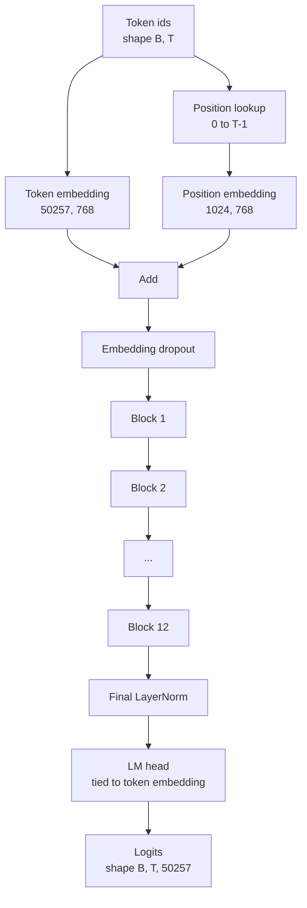
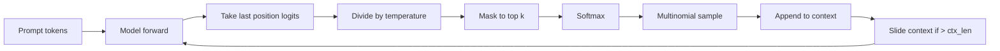

# जीपीटी मॉडल असेंबली

> 12 ब्लॉक स्टैक किए गए, एक टोकन एम्बेडिंग, एक सीखी गई स्थिति एम्बेडिंग, एक अंतिम लेयरनॉर्म, और एक बाध्य भाषा मॉडल हेड। यह पूरे 124 मिलियन पैरामीटर जीपीटी मॉडल है। यह पाठ उन टुकड़ों को एक कार्यकारी वर्ग में इकट्ठा करता है, मॉडल को संदर्भ 124M आकार से मेल खाने की पुष्टि करने के लिए मापदंडों की गिनती करता है, और बहुपद नमूना, तापमान और शीर्ष-के के साथ पाठ उत्पन्न करता है।

**Type:** Build
**Languages:** Python
**Prerequisites:** Phase 19 lessons 30 to 34
**Time:** ~90 minutes

## सीखने के लक्ष्य

- पाठ 34 से ट्रांसफार्मर ब्लॉक को एक पूर्ण जीपीटी मॉडल में इकट्ठा करेंः टोकन एम्बेडिंग, स्थिति एम्बेडिंग, एन ब्लॉक, अंतिम लेयरनोम, भाषा मॉडल हेड।
- 124 मिलियन पैरामीटर कॉन्फ़िगरेशन को पुनः प्रस्तुत करेंः वाक्यांश 50257, संदर्भ 1024, 768, बारह सिर, बारह परतों को एम्बेड करना।
- भाषा मॉडल के सिर के वजन को टोकन एम्बेडिंग से जोड़ें और समझाएं कि यह इस पैमाने पर ~ 38 मिलियन पैरामीटर क्यों बचाता है।
- बहुपद नमूनाकरण, तापमान स्केलिंग और शीर्ष-के ट्रंकिंग के साथ एक प्रॉम्प्ट से पाठ उत्पन्न करें, एक स्लाइडिंग विंडो के साथ संदर्भ लंबाई को पकड़कर।
- 124M लक्ष्य के मुकाबले पैरामीटर की गिनती और आगे की पास लागत को मापें।

## समस्या

एक ट्रांसफार्मर ब्लॉक अपने आप कुछ नहीं करता है। आपको टोकन आईडी को वेक्टर में बदलना होगा, स्थितिगत जानकारी में मिश्रण करना होगा, उन्हें स्टैक के माध्यम से चलाएं, और शब्दावली लॉजिट पर वापस प्रोजेक्ट करें। इन चार चरणों में से किसी एक को भूल जाएं और मॉडल या तो आगे नहीं बढ़ता है, स्थिति जानकारी में बहता है, या बोल नहीं सकता है।

मॉडल का आकार भी मायने रखता है। संदर्भ GPT-2 छोटे 124 मिलियन पैरामीटर है ऊपर के कॉन्फ़िगरेशन में ठीक है। संख्या जादू नहीं है। 50257 शब्द में 768 को सम्मिलित करना प्रतीक तालिका है। स्थिति 1024 गुना 768 स्थिति तालिका है। लगभग 7 मिलियन पैरामीटर पर 12 ब्लॉक 84 मिलियन हैं। अंतिम सिर वजन जोड़कर प्रतीक तालिका का पुनः उपयोग करता है। टुकड़ों को जोड़ें और आप 124 मिलियन पर उतरते हैं। एक मॉडल का निर्माण जिसका पैरामीटर संख्या संदर्भ से मेल नहीं खाती है एक संकेत है कि आपने कुछ गलत किया है।

## अवधारणा



टोकन आईडी टोकन वेक्टर बन जाते हैं। स्थिति आईडी स्थिति वेक्टर बन जाते हैं। दोनों को जोड़कर स्टैक के माध्यम से भेजा जाता है। अंतिम लेयरनॉर्म ब्लॉक के बाहर एक टुकड़ा है जो हर आधुनिक संस्करण में जीवित रहता है। एलएम हेड टोकन एम्बेडिंग मैट्रिक्स का पुनः उपयोग करता है, जिसका अर्थ है वजन बंधन।

### वजन बान्धना

प्रतीक एम्बेडिंग के आकार है `(vocab, d_model)`. भाषा मॉडल प्रमुख को `d_model`वापस `vocab`. ये एक दूसरे के ट्रांसपोज़ हैं. इन दोनों को बांधने का मतलब है शाब्दिक रूप से एक ही पैरामीटर टेंसर, दो बार इस्तेमाल किया. शब्द 50257 और d_model 768 में, मैट्रिक्स 38 मिलियन पैरामीटर है. अनलिंटेड, आप इसके लिए दो बार भुगतान करते हैं। बंधा, आप इसके लिए एक बार भुगतान करते हैं और आपको थोड़ा सा साफ ग्रेडिएंट सिग्नल भी मिलता है क्योंकि एम्बेडिंग और हेड अपडेट एक साथ होते हैं।

### स्थिति सम्मिलन सीखा जाता है, सिनोसाइडल नहीं

GPT-2 एक सीखे स्थिति एम्बेडिंग जहाज है। स्थिति तालिका आकार के एक पैरामीटर tensor है`(1024, 768)`. मॉडल प्रत्येक आगे में स्थिति 0 से T-1 तक देखता है और टोकन एम्बेडिंग में खोज जोड़ता है। यह स्थिति योजनाओं में सबसे सरल है (RoPE, ALiBi, T5 सापेक्ष पूर्वाग्रह विकल्प हैं) और यह वही है जो 124M संदर्भ का उपयोग करता है।

### पीढ़ीः तापमान, शीर्ष-के, बहुपद

पीढ़ी स्व-प्रतिगमन है. प्रत्येक चरण में, मॉडल प्रत्येक स्थिति में पूर्ण शब्दावली पर लॉजिट लौटाता है। आप केवल अंतिम स्थिति लेते हैं, तापमान द्वारा विभाजित करते हैं, वैकल्पिक रूप से नकारात्मक अनंत तक शीर्ष k लॉजिट को छोड़कर सभी को मास्क करते हैं, संभावनाओं को प्राप्त करने के लिए सॉफ्टमैक्स, और परिणाम वितरण से एक टोकन का नमूना लेते हैं।



तीन बटन, तीन अलग-अलग व्यवहार। शून्य के पास तापमान लालच में गिर जाता है। तापमान एक मॉडल के प्राकृतिक वितरण से मेल खाता है। शीर्ष-के एक लालच है। शीर्ष-के चालीस लंबे पूंछ को फ़िल्टर करता है। संयोजन मायने रखते हैं; प्रशिक्षण पर अगले पाठ में गुणवत्ता मूल्यांकन संकेत के रूप में पीढ़ी का उपयोग किया जाता है।

```figure
cc-gpt-assembly
```

## इसे बनाओ

`code/main.py`कार्य करता हैः

- `class GPTConfig`124M डिफ़ॉल्ट के साथ डेटा क्लासः `vocab_size=50257`,`context_length=1024`,`d_model=768`,`num_heads=12`,`num_layers=12`,`mlp_expansion=4`,`dropout=0.1`,`use_bias=True`,`weight_tying=True`. .
- `class GPTModel`टोकन एम्बेडिंग, स्थिति एम्बेडिंग, एम्बेडिंग ड्रोपअप, बारह `TransformerBlock`अंतिम LayerNorm, और एक `lm_head`जो प्रतीक एम्बेडिंग से जुड़ा होता है जब ध्वज सेट होता है।
- ए `count_parameters`सहायक जो अद्वितीय पैरामीटर गिनती लौटाता है (इस प्रकार गिनती में वजन बंधन का सम्मान किया जाता है) ।
- ए `generate`समारोह जो तापमान, शीर्ष-के, बहुपद, और स्लाइडिंग विंडो संदर्भ करता है।
- एक डेमो जो मॉडल बनाता है, संदर्भ 124M के बगल में पैरामीटर गिनती प्रिंट करता है, और पाइपलाइन के अंत को समाप्त करने के लिए एक निश्चित संकेत से एक छोटी अनुक्रम उत्पन्न करता है।

इसे चलाओः

```bash
python3 code/main.py
```

आउटपुटः 124M संदर्भ के साथ पैरामीटर गिनती, एक यादृच्छिक संकेत से उत्पन्न टोकन आईडी, और एक पुष्टि कि LM सिर और टोकन एम्बेडिंग जब बैनिंग चालू है तो भंडारण साझा करते हैं।

डेमो को तेजी से रखने के लिए, स्क्रिप्ट एक छोटी सी कॉन्फ़िग (`d_model=64`,`num_layers=2`124M कॉन्फिग बनाया गया है लेकिन केवल इसके पैरामीटर की गिनती और एक आगे पास का अभ्यास किया जाता है।

## स्टैक

- `torch`टेंसर गणित, ऑटोग्रेड, और मॉड्यूल पाइपलाइन के लिए।
- `code/main.py`पाठ 34 से एक ही ब्लॉक पैटर्न को स्थानीय रूप से पुनः लागू करता है।

## जंगली में उत्पादन के पैटर्न

तीन पैटर्न एक मॉडल के बीच अंतर करते हैं जो चलता है और एक मॉडल जो जहाज करता है।

**Initialize the residual projections small.**ध्यान के आउटपुट प्रोजेक्शन और एमएलपी के दूसरे रैखिक दोनों सीधे अवशिष्ट जोड़ में फ़ीड करते हैं। प्रत्येक अन्य रैखिक के समान मानक विचलन वाले लोगों को आरंभ करना एक अवशिष्ट धारा देता है जो गहराई के साथ बढ़ता है और अंतिम LayerNorm को गर्म शासन में धकेलता है।`1 / sqrt(2 * num_layers)`उन दो प्रक्षेपणों के लिए; शेष धारा बारह परतों के माध्यम से एक स्वस्थ सीमा में रहता है।

**Cache the position id tensor, do not recompute.** `torch.arange(T)`प्रत्येक आगे पर ताजा स्मृति आवंटित करता है. आवंटित एक बार में `__init__`अधिकतम संदर्भ के लिए, प्रति कॉल पहले T प्रविष्टियों को स्लाइड करें, और आवंटनकर्ता यात्रा को छोड़ दें।

**Tie weights at parameter level, not just by copying.**सेट करना`lm_head.weight = token_embedding.weight`ऑप्टिमाइज़र को एक पैरामीटर अपडेट करने की आवश्यकता है और ऑटोग्रेड ग्राफ को एक संचय की आवश्यकता है। यदि आप कॉपी करते हैं, तो सिर एम्बेडिंग से दूर चला जाता है और वजन बंधन आपको कुछ भी नहीं खरीदता है।

## इसका प्रयोग करें

- इस पाठ में मॉडल कक्षा का आकार अगले पाठ में प्रशिक्षित वर्ग के समान है।
- RoPE के साथ सीखे गए स्थान को बदलकर आपको ब्लॉक या सिर को छूने के बिना LLaMA परिवार मिलता है।
- जीएलयू को सीएलयू से बदलना और लेयरनॉर्म को आरएमएसनॉर्म से बदलना आपको एलएएमए परिवार के बाकी परिवर्तनों को प्राप्त करता है।
- पीढ़ी फ़ंक्शन किसी भी लॉजिट स्रोत के साथ काम करता है, न केवल इस मॉडल. आप पाठ 37 में पूर्व प्रशिक्षित GPT-2 फ़ाइल से लॉजिट निकाल सकते हैं और उसी पीढ़ी लूप का पुनः उपयोग कर सकते हैं।

## व्यायाम

1. LM सिर टोकन एम्बेडिंग से हटाएं और पैरामीटर को फिर से गिनें। सत्यापित करें डेल्टा 50257 गुना 768 = 38 मिलियन है।
2. सीखा गया स्थिति एम्बेडिंग को निर्माण के समय गणना की गई एक सिनोसाइडल तालिका के साथ प्रतिस्थापित करें। मॉडल को अभी भी आगे बढ़ाते हुए पुष्टि करें और पैरामीटर की गिनती 786,432 से गिर जाती है।
3. एक जोड़ें `greedy=True`नमूना लेने से बचने और argmax चुनने पीढ़ी के लिए ध्वज। क्रम निर्धारित है की पुष्टि करें पार रन.
4. एक जोड़ें `repetition_penalty`एक निश्चित संकेत पर दिखाएं कि एक से ऊपर के मान आउटपुट में दोहराव गिनती को कम करते हैं।
5. जोड़ें `top_p`(अणु) के बगल में नमूना`top_k`. दो पंक्ति की जांच करें कि रखे गए टोकन की संभावनाओं का योग अधिक है `top_p`. .

## प्रमुख शर्तें

| Term | What people say | What it actually means |
|------|-----------------|------------------------|
| Weight tying | "Tied embeddings" | The LM head and the token embedding share the same parameter tensor; saves vocab times d_model parameters and matches the GPT-2 reference |
| Position embedding | "Learned positions" | A separate table of shape (context length, d_model) added to token vectors; learned end to end |
| Sliding window context | "Context cap" | When the prompt plus generated tokens exceed the context length, drop the oldest tokens so the active window fits |
| Top-k sampling | "K truncation" | Keep the K logits with the highest values, mask the rest to negative infinity, softmax over the remainder |
| Temperature | "Sampling temperature" | Divide logits by T before softmax; T less than 1 sharpens, T equal to 1 keeps the natural distribution, T greater than 1 flattens |

## आगे पढ़ना

- चरण 19 पाठ 34 इस मॉडल स्टैक ब्लॉक के लिए।
- चरण 19 प्रशिक्षण लूप के लिए पाठ 36 जो क्रॉस एंट्रॉपी हानि के साथ इस मॉडल को चलाता है।
- चरण 19 पाठ 37 इस सटीक वास्तुकला में पूर्व प्रशिक्षित GPT-2 वजन लोड करने के लिए।
- चरण 7 पाठ 07 (जीपीटी कारण भाषा मॉडलिंग) अगले टोकन भविष्यवाणी के गणित के लिए।
- चरण 10 पाठ 04 (प्रारंभिक प्रशिक्षण मिनी जीपीटी) उसी वास्तुकला पर मूल प्रशिक्षण प्रक्रिया के लिए।
