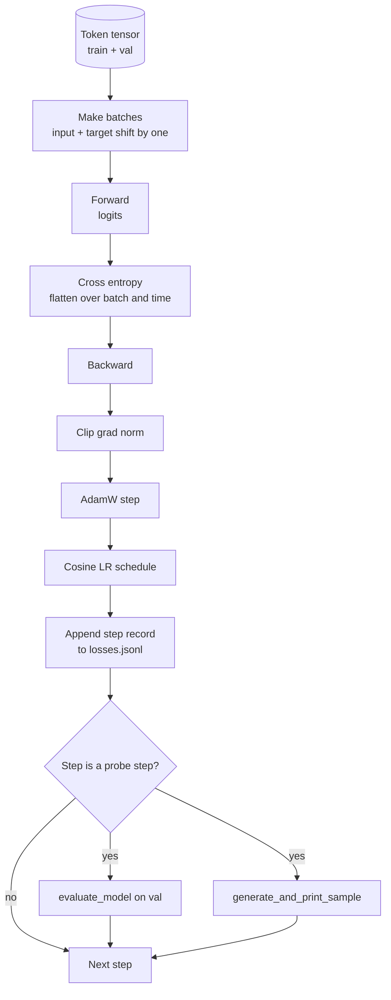

# प्रशिक्षण चक्र और मूल्यांकन

> एक लूप जो माप नहीं करता है वह एक लूप है जो झूठ बोलता है। यह पाठ प्रशिक्षण लूप का निर्माण करता है जो जीपीटी मॉडल को चलाता हैः वजन घटाने के विभाजन के साथ एडमडब्ल्यू, एक वार्मिंग प्लस कॉसिन सीखने की दर कार्यक्रम, एक `calc_loss_batch`सहायक, एक `evaluate_model`संचालित डेटा को पारित करना,`generate_and_print_sample`गुणात्मक जांच प्रत्येक K कदम, और आप के बाद नुकसान का JSONL लॉग पता लगा सकते हैं. एक ही कंकाल हर डिकोडर LLM आप कभी भी बनाने के लिए प्रशिक्षित.

**Type:** Build
**Languages:** Python
**Prerequisites:** Phase 19 lessons 30 to 35
**Time:** ~90 minutes

## सीखने के लक्ष्य

- एक प्रशिक्षण लूप बनाएँ जो अगले टोकन भविष्यवाणी के लिए सही इनपुट और लक्ष्य संरेखण के साथ क्रॉस एंट्रॉपी हानि की गणना करता है।
- वजन टेन्सर पर लागू वजन घटाने के साथ AdamW को कॉन्फ़िगर करें और LayerNorm या bias टेन्सर पर नहीं।
- रैखिक वार्मिंग और कॉसिनस गिरावट के साथ सीखने की दर कार्यक्रम को लागू करें, और समय के साथ परिणाम एलआर पढ़ें।
-  के साथ एक लंबे समय तक विभाजित पर मूल्यांकन`evaluate_model`तो मूल्यांकन हानि पार रन में तुलनात्मक है।
- प्रत्येक K चरण के साथ एक गुणात्मक नमूना उत्पन्न करें `generate_and_print_sample`हानि वक्र से पहले विचलन को पकड़ने के लिए।
- JSONL के लिए प्रति चरण हानि के लिए जारी रखें ताकि आप पुनः लोड कर सकें, ट्रैक करें, और डिलीवरी के रूप में प्रशिक्षण लॉग भेजें।

## समस्या

एक प्रशिक्षण स्क्रिप्ट जो हार को प्रिंट करती है लेकिन कुछ नहीं करती है तीन तरीकों से विफल होती है। यह आपको नहीं बता सकता कि क्या सही कारण से नुकसान कम हो रहा है (मॉडल प्रशिक्षण सेट को ओवरफॉट कर सकता है और कभी नहीं सीख सकता है) । यह आपको नहीं बता सकता कि विसंगति शुरू हो रही है या नहीं (हानि एक कदम के लिए बढ़ सकती है और ठीक हो सकती है, या एक कदम और दुर्घटना हो सकती है) । यह आपको नहीं बता सकता कि मॉडल ने क्या सीखा है (हानि एक स्केलर है; उत्पन्न नमूना एक पैराग्राफ है) । तीनों विफलताएं छिप जाती हैं जब तक लूप माप नहीं जाती।

इस पाठ में लूप तीन तरीकों से मापता है। प्रशिक्षण बैच पर हर कदम पर हानि। हर K चरण पर एक लंबे समय तक चलने वाले बैच पर हानि। प्रत्येक K चरणों पर एक निश्चित प्रॉम्प्ट से उत्पन्न निरंतरता। प्रशिक्षण लॉग JSONL में उतरता है इसलिए कलाकृत्य लूप की गवाही है।

## अवधारणा



दो गैर-स्पष्ट टुकड़े नुकसान संरेखण और एडमडब्ल्यू क्षय विभाजन हैं।

### हानि संरेखण

मॉडल प्रत्येक स्थिति पर अगले टोकन की भविष्यवाणी करता है। यदि इनपुट बैच टोकन हैं `[t0, t1, t2, t3]`, लक्ष्य बैच होना चाहिए `[t1, t2, t3, t4]`क्रॉस एंट्रॉपी को सपाट आकार पर गणना की जाती है`(batch * seq, vocab)`फ्लैट लक्ष्य के विरुद्ध `(batch * seq,)`. . . . . . . . . . . . . . . . . . . . . . . . . . . . . . . . . . . . . . . . . . . . . . . . . . . . . . . . . . . . . . . . . . . . . . . . . . . . . . . . . . . . . . . . . . . . . . . . . . . . . . . . . . . . . . . . . . . . . . . . . . . . . . . . . . . . . . . . . . . . . . . . . . . . . . . . . . . . . . . . . . . . . . . . . . . . . . . . . . . . . . . . . . . . . . . . . . . . . . . . . . . . . . . . . . . . . . . . . . . . . . . . . . . . . . . . . . . . . . . . . . . . . . . . . . . . . . . . . . . . . . . . . . . . . . . . . . . . . . . . . . . . . . . . . . . . . . . . . . . . . . . . . . . . . . . . . . . . . . . . . . . . . . . . . . . . . . . . . . . . . . . . . . . . . . . . . . . . . . . . . . . . . . . . . . . . . . . . . . . . . . . . . . . . . . . . . . . . . . . . . . . . . . . . . . . . . . . . . . . . . . . . . . . . . . . . . . . . . . . . . . . . . . . . . . . . . . . . . . . . . . . . . . . . . . . . . . . . . . . . . . . . . . . . . . . . . . . . . . . . . . . . . . . . . .

### एडमडब्ल्यू क्षय विभाजन

वजन घटाने से वजन के टेन्सर नियमित होते हैं लेकिन सामान्यीकरण पैमाने या पूर्वाग्रह नहीं होते हैं। लेयरनॉर्म पैमाने पर गिरावट को धीरे-धीरे शून्य तक ले जाता है और सामान्यीकरण को तोड़ता है। एक पूर्वाग्रह पर गिरावट डालना गणितीय रूप से हानिरहित है लेकिन चक्रों का एक अपव्यय है। मानक विभाजन हैः मैट्रिक्स के आकार के टेन्सर (रेखीय वजन, एम्बेडिंग टेबल) गिरावट प्राप्त करते हैं, जो भी पैमाने या शिफ्ट की तरह दिखता है वह नहीं करता है।

### वार्मअप प्लस कोसिन शेड्यूल

वार्मअप कुछ सौ चरणों में सीखने की दर को शून्य से लक्ष्य तक बढ़ाता है ताकि अनुकूलक राज्य में आबादी के लिए समय हो। कॉसीन का क्षय शेष चरणों में सीखने की दर को शून्य की ओर वापस ले जाता है इसलिए अंतिम चरण छोटे चरण आकार पर वजन को ठीक करता है। ओपन वेट्स एलएलएम प्रशिक्षण में यह संयोजन सबसे आम कार्यक्रम है क्योंकि यह पहले हजार चरणों और अंतिम हजार चरणों में अधिकांश नाजुक क्षणों को हटा देता है।

### मूल्यांकन किया गया

`evaluate_model`वैधता विभाजन से बैचों की एक निश्चित संख्या चलाता है, नुकसान जमा करता है, बैच गिनती द्वारा विभाजित होता है, और रिटर्न देता है। कोई ग्रेडिएंट नहीं। कोई ड्रॉपआउट नहीं। संख्या एक ही बीज और एक ही विभाजन दिए गए रन में पुनः उत्पन्न होती है। प्रशिक्षण हानि के बगल में आयोजित नुकसान की रिपोर्ट करना यह है कि आप ओवरफिटिंग कैसे देखते हैं।

### प्रारंभिक संकेत के रूप में गुणात्मक नमूनाकरण

एक मॉडल जिसका प्रशिक्षण हानि अच्छी तरह से गिरती है लेकिन जिसके उत्पन्न किए गए नमूने सभी समान हैं तोड़ा जाता है। एक मॉडल जिसका नुकसान वक्र सपाट दिखता है लेकिन जिसका उत्पन्न किए गए नमूने सुसंगत शब्दों में तेज हो रहे हैं सीखना है। गुणात्मक जांच पूर्ण वक्र को पढ़ने से तेज चलती है और स्केलर को याद करने वाले मोड को पकड़ती है।

```figure
cap-training-loop
```

## इसे बनाओ

`code/main.py`कार्य करता हैः

- `make_batches(token_ids, batch_size, context_length)`जो एक लंबे टोकन टेंसर को इनपुट और लक्ष्य जोड़े में काटता है।
- `calc_loss_batch(model, inputs, targets)`जो आगे बढ़ता है, फ्लैट करता है, और वापस स्केलर क्रॉस एंट्रोपी।
- `evaluate_model(model, val_loader, max_batches)`जो बिना ग्रेड के सत्यापन बैचों की एक निश्चित संख्या को दोहराता है और औसत हानि लौटाता है।
- `generate_and_print_sample(model, prompt, max_new_tokens)`जो एक निश्चित प्रॉम्प्ट पर पाठ 35 पीढ़ी फ़ंक्शन चलाता है और परिणाम प्रिंट करता है।
- `build_param_groups(model, weight_decay)`जो दो-समूह AdamW पैरामीटर सूची उत्पन्न करता है।
- `cosine_with_warmup(step, warmup_steps, total_steps, max_lr, min_lr)`जो किसी दिए गए चरण में LR लौटाता है।
- `train(...)`जो लूप चलाता है, निरंतर रहता है `outputs/losses.jsonl`, और मूल्यांकन हानि और एक नमूना प्रत्येक प्रिंट करता है `eval_every`कदम।
- एक डेमो जो सिंथेटिक डेटा पर एक छोटे से मॉडल को एक छोटी संख्या में चरणों के लिए प्रशिक्षित करता है, एक JSONL लॉग लिखता है, और जांच बिंदुओं पर मूल्यांकन हानि और एक नमूना प्रिंट करता है। डेमो सीपीयू पर एक मिनट से भी कम समय में चलता है।

इसे चलाओः

```bash
python3 code/main.py
```

आउटपुटः प्रति चरण हानि रेखा, मूल्यांकन हानि प्रत्येक जांच चरण, उत्पन्न नमूना प्रत्येक जांच चरण, और एक अंतिम `outputs/losses.jsonl`आप लोड कर सकते हैं `json.loads`प्रति पंक्ति।

## स्टैक

- `torch`ऑटोग्रेड, ऑप्टिमाइज़र और मॉड्यूल के लिए।
- `main.py`पाठ 35 को फिर से लागू करता है `GPTModel`और स्थानीय स्तर पर समर्थन मॉड्यूल।

## जंगली में उत्पादन के पैटर्न

तीन पैटर्न पाठ्यपुस्तक लूप को कुछ ऐसा बनाते हैं जिसे आप रातोंरात चलाने छोड़ सकते हैं।

**Gradient norm clipping is non negotiable.**एक खराब बैच (असामान्य डेटा, एक LR स्पाइक, एक संख्यात्मक किनारे मामले) एक विशाल ग्रेडिएंट पैदा करता है जो प्रशिक्षण के घंटों को मिटा देता है। `torch.nn.utils.clip_grad_norm_(params, max_norm=1.0)`के बाद`backward`और पहले `step`एक डिफ़ॉल्ट पैरामीटर है जो अधिकांश सेटअप को जीवित रखता है।

**Resumable JSONL logging, not pickled state.**प्रति चरण हानि रिकॉर्ड के रूप में `{"step": int, "train_loss": float, "lr": float}`JSONL में लाइनें टिकाऊ हैंः किसी भी क्रैश एक पठनीय कलाकृतियों को छोड़ देता है, आप पकड़ सकते हैं, आप पायथन की तीस पंक्तियों के साथ ग्राफ कर सकते हैं, और आप अंतिम चरण को पढ़कर प्रशिक्षण को फिर से शुरू कर सकते हैं। पिकलेड स्टेट आपको फ़ाइल उत्पन्न करने वाले सटीक मॉड्यूल लेआउट से बांधता है, जो रिफैक्टरों के बीच नाजुक है।

**Eval batches drawn from a fixed slice.**सत्यापन टोकन स्क्रिप्ट शुरू होने पर ब्लिच में काट दिए जाते हैं, फ्लाई पर नहीं। पुनरुत्पादन क्षमता रन से रन तक वैल्यू ब्लिच के समान होने पर निर्भर करती है; अन्यथा दो रन के बीच वैल्यू हानि की तुलना बैच मिक्सल को मॉडल के रूप में अधिक मापती है।

## इसका प्रयोग करें

- इस पाठ में लूप वही कंकाल है जो वास्तविक डेटा पर 124M मॉडल को प्रशिक्षित करता है।`datasets`-शैली लोडर और लूप अपरिवर्तित चलता है।
- JSONL लॉग वह डिलीवरी है जो प्रशिक्षण रन को सबूत में बदल देता है। अगले पाठ में एक ताजा प्रशिक्षित चेकपॉइंट की तुलना पूर्व प्रशिक्षित के साथ करने के लिए किया जाता है।
- गुणात्मक नमूना जांच वह सब कुछ है जो स्केलर हानि नहीं बदल सकती है।

## व्यायाम

1. जोड़ें `weight_decay_groups()`इकाई परीक्षण जो पैमाने और पूर्वाग्रह पैरामीटर को बिना क्षय समूह में और रैखिक और एम्बेडिंग वजन को क्षय समूह में लैंड करने की पुष्टि करते हैं।
2. सिंथेटिक यादृच्छिक टोकन को एक छोटी पाठ फ़ाइल से बाइट्स के साथ बदलें ताकि डेमो कुछ पठनीय पर ट्रेन हो। उत्पन्न किए गए नमूने का उपयोग फ़ाइल में मौजूद वर्णों का सत्यापन करें।
3. एक जोड़ें `min_lr``max_lr`कोसिन कार्यक्रम और फिर से प्लॉट.
4. हर बार एक चेकपोस्ट रखें`eval_every`JSONL लॉग के अतिरिक्त कदम। एक जोड़ें `resume_from`ध्वज जो मॉडल राज्य और अनुकूलक राज्य को फिर से लोड करता है।
5. हानि के बगल में प्रति चरण पारगमन (टोकन प्रति सेकंड) लॉग करें और पुष्टि करें कि यह स्थिर बैंड में रहता है।

## प्रमुख शर्तें

| Term | What people say | What it actually means |
|------|-----------------|------------------------|
| Loss alignment | "Shift by one" | Input tokens at positions 0..T-1, target tokens at positions 1..T; cross entropy is computed on flattened shapes |
| Decay split | "Two groups" | AdamW receives matrix shaped tensors with weight decay and scale or bias tensors with none |
| Warmup | "Ramp" | The learning rate climbs from zero to its target over a fixed number of steps so the optimizer state can populate |
| Eval batches | "Held out batches" | A fixed slice of the validation token tensor, sliced once at script start, used identically every probe |
| Qualitative probe | "Sample print" | A short generation from a fixed prompt printed every K steps to catch failure modes loss alone hides |

## आगे पढ़ना

- चरण 19 लूप ड्राइव मॉडल के लिए पाठ 35।
- चरण 19 पाठ 37 एक ही मॉडल में पूर्व-प्रशिक्षित भारों को लोड करने के लिए।
- चरण 10 पाठ 04 (प्रशिक्षण से पहले मिनी जीपीटी) वास्तविक डेटा पर प्रक्रिया के लिए।
- चरण 10 पाठ 10 (मूल्यांकन) क्रॉस एंट्रॉपी हानि के परे व्यापक मूल्यांकन सतह के लिए।
