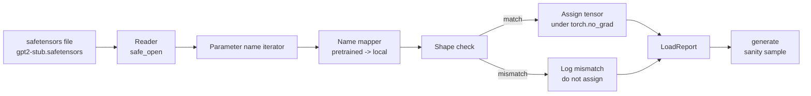

# पहले से प्रशिक्षित भारों को लोड करना

> 124 मिलियन पैरामीटर मॉडल को खरोंच से प्रशिक्षित करना एक बजट निर्णय है; प्रकाशित चेकपॉइंट को लोड करना मंगलवार है। यह पाठ एक सेफेटेंसर फ़ाइल से पूर्व-प्रशिक्षित जीपीटी - 2 शैली के वजन को पाठ 35 से सटीक वास्तुकला में लोड करता है, पैरामीटर नाम मैपिंग टुकड़ा टुकड़ा करके चलता है, और सांडिटी लोड काम किया साबित करने के लिए एक निरंतरता उत्पन्न करता है। कोई नेटवर्क नहीं, कोई तृतीय पक्ष लोडर नहीं, कोई अस्पष्ट जादू नहीं।

**Type:** Build
**Languages:** Python
**Prerequisites:** Phase 19 lessons 30 to 36
**Time:** ~90 minutes

## सीखने के लक्ष्य

-  सेफटेंसर फ़ाइल को पढ़ें`safetensors`पायथन पुस्तकालय और टेन्सर नाम और आकार की जांच करें।
- प्रत्येक पूर्व-प्रशिक्षित पैरामीटर नाम को पाठ 35 जीपीटी मॉडल के भीतर एक पैरामीटर पर मैप करें।
- इस ट्रैक में प्रकाशित GPT-2 वजन और मॉडल के बीच अंतर वाले दो नाम सम्मेलनों को संभालेंः `wte/wpe/h.N.attn.c_attn/c_proj`और `mlp.c_fc/c_proj`स्थानीय नामों के विपरीत `tok_embed/pos_embed/blocks.N.attn.qkv/out_proj`और `mlp.fc1/fc2`. .
- किसी भी वजन असाइनमेंट होने से पहले स्पष्ट त्रुटि के साथ आकार असंगतता का पता लगाएं और अस्वीकार करें।
- लोड वजन के साथ एक छोटा सा निरंतरता उत्पन्न करें और टोकन लोड वितरण से आते हैं की पुष्टि करें, यादृच्छिक रूप से शुरू नहीं है।

## समस्या

प्रकाशित वजन आपके वास्तुकला के लिए पैक नहीं किए जाते हैं। वे मूल कार्यान्वयन का उपयोग किए गए नामों को ले जाते हैं। पूर्व-प्रशिक्षित फ़ाइल में है `transformer.h.0.attn.c_attn.weight`आकार का `(2304, 768)`; आपका मॉडल अपेक्षा करता है `blocks.0.attn.qkv.weight`आकार का `(2304, 768)`(जो एक अलग लेआउट सम्मेलन में एक ही मैट्रिक्स है) या आपके मॉडल का उपयोग करता है `nn.Linear`एक ही पैरामीटर तीन सूक्ष्म रूप से अलग पहचान (नाम, आकार, बाइट लेआउट) के साथ दिखाई देता है और लोडर को उन तीनों को सुसंगत करना होगा।

एक लोडर जो अंधेरे में कॉपी करता है सही टेन्सर को गलत जगह रखता है और आपको एक मॉडल मिलता है जो बकवास उत्पन्न करता है। एक लोडर जो आकार के विपरीत होने पर कॉपी करने से इनकार करता है लेकिन कुछ भी लॉग नहीं करता है, आपको यह अनुमान लगाने देता है कि कौन सा टेन्सर लैंडिंग में विफल रहा है। इस पाठ में लोडर स्पष्ट हैः प्रत्येक असाइनमेंट को लॉग किया जाता है, प्रत्येक आकार की जांच की जाती है, और एक `LoadReport`हिट, मिस और आकार असंगतियों का सारांश देता है ताकि आप पढ़ सकें कि क्या हुआ।

## अवधारणा



नाम मैपर केवल स्ट्रिंग से स्ट्रिंग तक एक फ़ंक्शन है. आकार जांच एक है यदि. असाइनमेंट अंदर होता है `torch.no_grad()`तो ऑटोग्राड लोड को ट्रैक नहीं करता है। रिपोर्ट में प्रत्येक नाम का परिणाम होता है।

### जीपीटी-2 नामकरण सम्मेलन

प्रकाशित जीपीटी-2 वजन इस तरह के नामों के तहत रहते हैंः

| Pretrained name | Shape | Meaning |
|-----------------|-------|---------|
| `wte.weight` | (50257, 768) | Token embedding |
| `wpe.weight` | (1024, 768) | Position embedding |
| `h.N.ln_1.weight` | (768,) | LayerNorm 1 scale at block N |
| `h.N.ln_1.bias` | (768,) | LayerNorm 1 shift at block N |
| `h.N.attn.c_attn.weight` | (768, 2304) | Fused QKV linear weight |
| `h.N.attn.c_attn.bias` | (2304,) | Fused QKV linear bias |
| `h.N.attn.c_proj.weight` | (768, 768) | Attention output projection |
| `h.N.attn.c_proj.bias` | (768,) | Attention output projection bias |
| `h.N.ln_2.weight` | (768,) | LayerNorm 2 scale |
| `h.N.ln_2.bias` | (768,) | LayerNorm 2 shift |
| `h.N.mlp.c_fc.weight` | (768, 3072) | MLP fc1 weight |
| `h.N.mlp.c_fc.bias` | (3072,) | MLP fc1 bias |
| `h.N.mlp.c_proj.weight` | (3072, 768) | MLP fc2 weight |
| `h.N.mlp.c_proj.bias` | (768,) | MLP fc2 bias |
| `ln_f.weight` | (768,) | Final LayerNorm scale |
| `ln_f.bias` | (768,) | Final LayerNorm shift |

दो आश्चर्य के लिए योजना बनाने के लिए।`c_attn`,`c_proj`,`c_fc`रैखिक को मैट्रिक्स के साथ संग्रहीत किया जाता है जो किसके सापेक्ष है `nn.Linear.weight`लोडर को सौंपने के दौरान ट्रांसपॉज़ करता है। एलएम सिर फ़ाइल में बिल्कुल नहीं है; मॉडल वजन के साथ बंधन पर निर्भर करता है।`wte`, तो सिर एक बार उपनाम द्वारा सेट किया जाता है `wte`भूमि।

### स्थानीय नामकरण सम्मेलन

इस ट्रैक में मॉडल में वर्णनात्मक नामों का उपयोग किया जाता हैः

| Local name | Meaning |
|------------|---------|
| `tok_embed.weight` | Token embedding |
| `pos_embed.weight` | Position embedding |
| `blocks.N.ln1.scale` | LayerNorm 1 scale at block N |
| `blocks.N.ln1.shift` | LayerNorm 1 shift |
| `blocks.N.attn.qkv.weight` | Fused QKV |
| `blocks.N.attn.qkv.bias` | Fused QKV bias |
| `blocks.N.attn.out_proj.weight` | Attention output projection |
| `blocks.N.attn.out_proj.bias` | Output projection bias |
| `blocks.N.ln2.scale` | LayerNorm 2 scale |
| `blocks.N.ln2.shift` | LayerNorm 2 shift |
| `blocks.N.mlp.fc1.weight` | MLP fc1 |
| `blocks.N.mlp.fc1.bias` | MLP fc1 bias |
| `blocks.N.mlp.fc2.weight` | MLP fc2 |
| `blocks.N.mlp.fc2.bias` | MLP fc2 bias |
| `final_ln.scale` | Final LayerNorm scale |
| `final_ln.shift` | Final LayerNorm shift |

मैपिंग एक निश्चित फ़ंक्शन है. पाठ इसे एक निर्देश के रूप में भेजता है कि लोडर दोहराता है.

### स्टब फिटिंग

वास्तविक GPT-2 वजन 0.5 GB है। डेमो उन्हें डाउनलोड नहीं करता है; यह पहली बार चलाने पर एक छोटे सेफेटेंसर फिटिंग उत्पन्न करता है, जिसमें सटीक GPT-2 नामकरण सम्मेलन और आकार हैं जो d_model 192 पर एक 12-ब्लॉक मॉडल के लिए उपयुक्त हैं। 768 के बजाय। फिटिंग में लोडर में प्रत्येक कोड पथ का अभ्यास करने के लिए सही संरचना है। वास्तविक फ़ाइल के लिए फिटिंग को स्विच करें और लोडर बिना संशोधन के काम करता है।

```figure
cc-weight-remap
```

## इसे बनाओ

`code/main.py`कार्य करता हैः

- पाठ 35 का एक छोटा सा प्रतिकृति`GPTModel`तो यह सबक आत्म-अवरोधित है।
- `make_pretrained_to_local(num_layers)`जो प्रति परत प्रविष्टियों का विस्तार करता है।
- `load_safetensors(model, path)`जो नामों को दोहराता है, उन्हें मानचित्रित करता है, आकार की जांच करता है, conv1d शैली के वजन को ट्रांसपोज़ करता है, और अनुभाग के तहत असाइन करता है `torch.no_grad()`. एक `LoadReport`. .
- `make_stub_safetensors(path, cfg)`जो एक निश्चित फ़ाइल उत्पन्न करता है जिसमें सटीक पूर्व प्रशिक्षित नामकरण सम्मेलन है।
- एक डेमो जो बनाता है `outputs/gpt2-stub.safetensors`पहली बार, एक नया मॉडल बनाता है, यादृच्छिक init से उत्पन्न एक निरंतरता को कैप्चर करता है, स्टब को लोड करता है, एक और निरंतरता को कैप्चर करता है, दोनों को प्रिंट करता है, और दोनों को अलग है (लोड ने वास्तव में मॉडल को बदल दिया है) ।

इसे चलाओः

```bash
python3 code/main.py
```

आउटपुटः फिक्स्ड पथ, प्रति नाम लोड लॉग, एक `LoadReport`सारांश, लोड से पहले का एक निरंतरता, लोड के बाद का एक निरंतरता, और एक एकल जानबूझकर खराब Tensor पर एक आकार असंगतता जो फिक्स्चर में इंजेक्ट किया गया है ताकि विफलता पथ का अभ्यास किया जाए।

## स्टैक

- `safetensors`डिस्क पर प्रारूप और स्ट्रीमिंग रीडर के लिए।
- `torch`मॉडल और कार्य गणित के लिए।
- नहीं`transformers`नहीं , नहीं`huggingface_hub`, नेटवर्क कॉल नहीं.

## जंगली में उत्पादन के पैटर्न

तीन पैटर्न लोडर को आपके द्वारा नहीं बनाए गए वजन के संपर्क में रहने के लिए बनाते हैं।

**Always validate the file before any assignment.**फ़ाइल खोलें, प्रत्येक टेन्सर नाम को उसके डीटाइप और आकार के साथ सूचीबद्ध करें, आकार जांच के साथ पूर्ण मानचित्रण चलाएं, और केवल सफलता के बाद असाइन करना शुरू करें। आधा लोड मॉडल मूक विफलता मशीनें हैं।

**Log every assignment with the source name and the destination name.**जब कुछ गलत लग रहा है, लॉग आपको बताता है कि कौन सा टेन्सर कहां से उतरा; विकल्प हैक्सडंप्स पढ़ना है।`LoadReport`इस पाठ में डेटा क्लास ट्रैक `loaded`,`missing`,`unexpected`और `shape_mismatch`सूची और अंत में एक सारांश छपता है।

**The LM head is a weight tying alias, not a separate copy.**सेट करना`model.lm_head.weight = model.tok_embed.weight`लोड होने के बाद `tok_embed`एक नए में एम्बेडिंग मैट्रिक्स को कॉपी`lm_head.weight`पैरामीटर बंधन तोड़ता है और चुपचाप अपने पैरामीटर गिनती दोगुना।

## इसका प्रयोग करें

- लोडर किसी भी सेफेटेंसर फ़ाइल के लिए काम करता है जो पूर्व-प्रशिक्षित नामकरण सम्मेलन का उपयोग करता है। वास्तविक GPT-2 फ़ाइलें (छोटी / मध्यम / बड़ी / xl) कोड परिवर्तन के बिना काम करती हैं; केवल मॉडल कॉन्फ़िग अलग है।
- एक ही पैटर्न LLaMA, मिस्ट्रल, Qwen वजन तक फैलता है जब आप नाम नक्शे को अपडेट करते हैं। आकार की जांच और रिपोर्ट समान रहती है।
- लोड के बाद से मानसिकता का उत्पादन एक त्वरित गेट हैः यदि लोड के बाद के नमूने पूर्व लोड के नमूने जैसे दिखते हैं, तो लोड ने मॉडल को नहीं बदला, जिसका अर्थ है कि मैपिंग ने चुपचाप हर टेन्सर को याद किया।

## व्यायाम

1. एक जोड़ें `dtype`लोडर के लिए तर्क जो प्रत्येक टेन्सर को लक्ष्य dtype पर फेंकता है (`bfloat16`,`float16`,`float32`) के दौरान कार्यभार संभालना।`float32`मॉडल को कम किया जा सकता है `bfloat16`और फिर भी पैदा करते हैं।
2. एक जोड़ें `expected_layers`तर्क जो एक चेकपॉइंट को लोड करने से इनकार करता है जिसका `h.N`सूचकांक मॉडल के अनुरूप नहीं हैं `num_layers`. .
3. पाठ 35 पीढ़ी फ़ंक्शन में लोडर को प्लग करें और दो साइड-बाय नमूने उत्पन्न करेंः एक यादृच्छिक init से, एक लोड किए गए फिचर्स से।
4. एक निर्यात पथ जोड़ेंः पूर्व-प्रशिक्षित नामकरण सम्मेलन का उपयोग करके वर्तमान मॉडल राज्य को एक नई सेफेटेंसर फ़ाइल में लिखें। लोडर को फिर से यात्रा करें और पुष्टि करें कि रिपोर्ट में शून्य आकार असंगतता है।
5. विस्तार `NAME_MAP`LLaMA नामकरण सम्मेलन (कोई पूर्वाग्रह, RMSNorm, विलय qkv लेआउट) को संभालने के लिए और लोडर को पुनः चलाने के लिए एक स्टब LLaMA फिक्स्चर आप उत्पन्न करते हैं।

## प्रमुख शर्तें

| Term | What people say | What it actually means |
|------|-----------------|------------------------|
| Name map | "Key remapping" | The function from pretrained tensor names to local parameter names; usually a literal dict with one entry per layer index expanded over a loop |
| Shape mismatch | "Bad shape" | The pretrained tensor exists under the mapped name but its dimensions disagree with the local parameter; the loader refuses to assign and logs the pair |
| Transpose-on-load | "Conv1d layout" | Published GPT-2 stores attention and MLP projections in the transpose of what nn.Linear expects; the loader transposes during assignment |
| Weight tying alias | "Shared LM head" | Setting model.lm_head.weight = model.tok_embed.weight so the head and embedding share storage; the head is not in the file because of this |
| Load report | "Coverage summary" | A small dataclass that tracks loaded, missing, unexpected, and shape_mismatch lists; printing it is how you tell whether the load succeeded |

## आगे पढ़ना

- चरण 19 पाठ 35 वास्तुकला के लिए जो भार प्राप्त करता है।
- चरण 19 प्रशिक्षण लूप के लिए पाठ 36 जो एक ही आकार का एक चेकपॉइंट पैदा करता है।
- चरण 10 पाठ 11 (क्वांटिकेशन) जब स्मृति तंग है तो लोड वजन के साथ क्या करना है के लिए।
- चरण 10 पाठ 13 (पूर्ण LLM पाइपलाइन का निर्माण) लोड और निष्कर्ष के आसपास पूरे जीवन चक्र के लिए।
