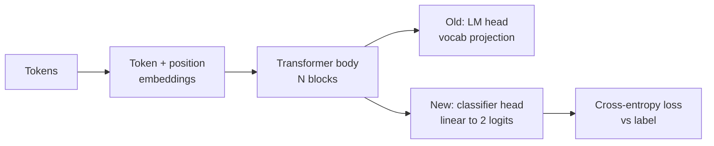
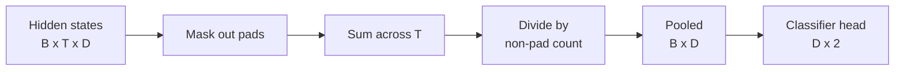
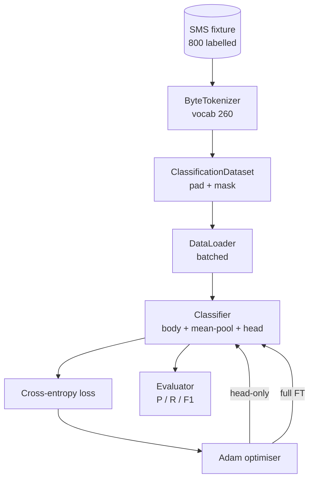

# कैपस्टोन पाठ 38: वर्गीकरणकर्ता सिर स्वैप द्वारा ठीक-ठीक ट्यूनिंग

> ट्रैक बी का पहला कपास्टोन। पूर्व प्रशिक्षित भाषा मॉडल स्व-विचार ब्लॉक का एक ढेर है जो एक टोकन-पूर्वानुमान सिर में समाप्त होता है। जब आप स्पैम बनाम हार्मोन चाहते हैं, तो सिर गलत है लेकिन शरीर ज्यादातर सही है। यह पाठ सिर को तोड़ देता है, दो वर्गों की रैखिक परत को pooled प्रतिनिधित्व पर चिपकाता है, और वर्गीकरणकर्ता को दो अलग-अलग तरीकों से प्रशिक्षित करता हैः केवल अंतिम परत, और पूर्ण ठीक-ठीक। मूल्यांकन सटीकता है, याद, और F1 एक लंबे समय तक विभाजित पर. आप सीखते हैं कि प्रत्येक रणनीति आपको क्या खरीदती है और इसकी लागत क्या होती है।

**Type:** Build
**Languages:** Python (torch, numpy)
**Prerequisites:** Phase 19 lessons 30-37 (NLP LLM track: tokenizer, embedding table, attention block, transformer body, pre-training loop, checkpointing, generation, perplexity)
**Time:** ~90 minutes

## सीखने के लक्ष्य

- शरीर को पुनः आरंभ किए बिना भाषा मॉडल सिर को वर्गीकरण सिर से बदलें।
- दो प्रशिक्षण कार्यक्रम लागू करेंः शरीर को ठंडे (केवल सिर) और पूर्ण ठीक-ठीक, एक प्रशिक्षण लूप साझा करना।
- एक टोकनराइज़र-जागरूक डेटा पाइपलाइन बनाएं जो पैड, मास्क पैडिंग, और ध्यान आउटपुट को पूल करता है।
- सटीकता गणना, याद, F1, और कच्चे लॉजिट से भ्रम मैट्रिक्स।
- पैरामीटर गणना, प्रशिक्षण समय और नेतृत्व के बीच व्यापार के बारे में कारण।

## समस्या

आप एक सामान्य corpus पर एक छोटे से ट्रांसफार्मर पूर्व-प्रशिक्षित किया है. आउटपुट सिर 1000 टोकन की शब्दावली में अंतिम छिपे हुए राज्य को प्रोजेक्ट करता है. अब आपके पास 800 एसएमएस संदेश हैं स्पैम या हैन लेबल और आप एक द्विआधारी वर्गीकरण चाहते हैं. तीन विकल्प हैं।

गलत विकल्प 800 उदाहरणों पर खरोंच से एक नया वर्गीकरण प्रशिक्षित करना है। पूर्व प्रशिक्षित मॉडल का शरीर पहले से ही उपयोगी संरचना को कोड करता हैः शब्द पहचान, स्थिति, सरल सह-अवसर। इसे फेंकने से इसे बनाने वाले कंप्यूटिंग को बर्बाद हो जाता है।

दोनों सही विकल्प हैं सिर स्वैप शरीर के साथ जमे हुए, और सिर स्वैप शरीर के साथ प्रशिक्षित। सिर-केवल प्रशिक्षण तेजी से है, स्मृति में लगभग मुक्त है, और शायद ही कभी इस छोटे से डेटा के साथ ओवरफ्लो। पूर्ण ठीक-ट्यूनिंग धीमी है, छोटे डेटा पर ओवरफॉट कर सकता है, लेकिन उच्च सटीकता तक पहुंचता है जब डाउनस्ट्रीम डोमेन प्री-ट्रेनिंग कॉर्पस से बहता है।

यह सबक दोनों का निर्माण करता है, इसलिए आप उन्हें एक ही फिक्स्चर पर तुलना कर सकते हैं।

## अवधारणा



मॉडल एक फ़ंक्शन है `f_theta(tokens) -> hidden_states`सिर एक कार्य है`g_phi(hidden) -> logits`. सिरों को बदलना मतलब रखो`theta`और प्रतिस्थापन`g_phi`शरीर के पैरामीटर सबसे महंगे भाग हैं सिर एक ही रैखिक परत है।

दो प्रशिक्षित पैरामीटर सेट महत्वपूर्ण हैंः

- `theta`(शरीर): ध्यान प्रति ब्लॉक के लिए हजारों वजन।
- `phi`(सिर): `hidden_dim * num_classes`वजन प्लस एक पूर्वाग्रह।

सिर के प्रशिक्षण में आप गणना gradients के खिलाफ`phi`और उन्हें शून्य के खिलाफ `theta`. PyTorch आप सेटिंग द्वारा यह करने के लिए अनुमति देता है`requires_grad=False`ऑप्टिमाइज़र तब केवल सिर देखता है और शरीर ठंढ रहता है।

पूर्ण सूक्ष्म समायोजन में आप पूरे ढेर में ग्रेडिएंट को वापस बहने देते हैं। शरीर के वजन वर्गीकरण के उद्देश्य के अनुरूप बहते हैं। जोखिम छोटे डेटा पर भूलने के लिए विनाशकारी हैः शरीर की पूर्व-प्रशिक्षण ध्वनि से धोया जाता है।

## एकजुटता का प्रश्न

एक वर्गीकरणकर्ता को प्रति अनुक्रम एक वेक्टर की आवश्यकता होती है, प्रति टोकन एक वेक्टर नहीं। तीन आम विकल्पः

- **Mean pool**: ध्यान मास्क द्वारा वजन के अनुसार अनुक्रम में छिपे हुए राज्यों का औसत।
- **CLS pool**: एक विशेष टोकन को तैयार करें और केवल इसका आउटपुट उपयोग करें।
- **Last-token pool**जीपीटी वर्ग के वर्गीकरणकारों का यही काम होता है।

यह सबक स्पष्ट ध्यान-मास्क वजन के साथ औसत पूलिंग का उपयोग करता है। यह सबसे सरल है, अनुक्रम लंबाई पर एक स्थिर संकेत देता है, और एक CLS टोकन को पूर्व-प्रशिक्षण की आवश्यकता नहीं है।



## आंकड़े

800 एसएमएस संदेश, 400 स्पैम और 400 हार्मोन के संतुलित, निर्धारात्मक रूप से उत्पन्न होते हैं `code/main.py`. जनरेटर एक फिक्स्ड बीज का उपयोग करता है, टेम्पलेट्स का चयन करता है और स्लॉट फिलर की जगह लेता है, और 5 से 25 टोकन के बीच संदेश जारी करता है। वास्तविक डेटासेट में शोर नहीं है। यह फिक्चर का मुद्दा पुनरुत्पादकता है।

डेटा को 80/20: 640 ट्रेन, 160 परीक्षण में विभाजित किया जाता है। विभाजन स्तरीकृत होते हैं ताकि परीक्षण सेट 50/50 संतुलन बनाए रखता है। ज्ञात संतुलन के साथ एक पकड़ सेट सटीकता और याद को ईमानदार संख्याओं के रूप में पढ़ा जा सकता है।

## माप

सकारात्मक वर्ग (स्पैम) के रूप में वर्ग 1 के साथ द्विआधारी वर्गीकरण। गणनाएं हैंः

- `TP`: पूर्वानुमानित स्पैम, स्पैम था।
- `FP`: स्पैम की भविष्यवाणी, हैन था।
- `FN`: पूर्वानुमानित शैंक, स्पैम था।
- `TN`: पूर्वानुमानित शिन, शिन था।

तीन प्रमुख माप:

- `precision = TP / (TP + FP)`. स्पैम चिह्नित संदेशों में से, वास्तव में कितना अंश है?
- `recall = TP / (TP + FN)`. वास्तविक स्पैम, मॉडल ध्वज किस अंश किया?
- `F1 = 2 * P * R / (P + R)`. दोनों के सामंजस्यपूर्ण मध्य.

एक भ्रम मैट्रिक्स चार गणनाओं को 2x2 ग्रिड के रूप में प्रिंट करता है। डेमो दोनों प्रशिक्षण शासन के लिए इसे स्टड आउट के लिए लिखता है।

```figure
cap-classifier-head-swap
```

## वास्तुकला



शरीर एक जानबूझकर छोटा ट्रांसफार्मर हैः वाक्यांश 260, छिपा हुआ 64, 4 सिर, 2 ब्लॉक, अधिकतम अनुक्रम 32. यह सीपीयू पर नब्बे सेकंड के भीतर दोनों शासनों को अभिसरण के लिए प्रशिक्षित करने के लिए पर्याप्त छोटा है। यह पाठ में पूर्व-प्रशिक्षित नहीं है; इसके बजाय, यह `pretrain_quick`सहायक एक ही फिचर्ड के पाठ पर एलएम प्रशिक्षण के पांच युग करता है शरीर को एक गैर-नाशिक प्रारंभिक बिंदु देने के लिए। यह सबक को आत्मनिर्भर रखता है।

## आप क्या बना देंगे

कार्यान्वयन एक है `main.py`एक परीक्षण मॉड्यूल (`code/tests/test_main.py`) ।

1. `ByteTokenizer`: नक्शे आईडी के लिए बाइट्स, एक पैड आईडी आरक्षित.
2. `Block`: बहु-हेड ध्यान और एक फ़ीड-फॉरवर्ड परत के साथ एक ट्रांसफार्मर ब्लॉक। पूर्व-मानक।
3. `LMBody`: टोकन + स्थिति एम्बेडमेंट्स प्लस ब्लॉक का एक ढेर. छिपे हुए राज्यों को लौटता है.
4. `MeanPool`: अनुक्रम अक्ष पर मास्क-वेट औसत।
5. `Classifier`शरीर, पूल, रैखिक सिर। शरीर एक ही उदाहरण है विभिन्न शासनों में।
6. `freeze_body`और `unfreeze_body`: स्विच `requires_grad`शरीर के मापदंडों पर।
7. `train_classifier`: एक साझा लूप। मॉडल और एक अनुकूलक को स्वीकार करता है जो कि पैरामीटर समूह के लिए प्रशिक्षित किया जा सकता है।
8. `evaluate`: परीक्षण सेट चलाता है और लौटाता है `Metrics(precision, recall, f1, confusion)`. .
9. `run_demo`: शरीर को संक्षिप्त रूप से पूर्व-प्रशिक्षित करता है, फिर सिर-केवल को प्रशिक्षित करता है और मूल्यांकन करता है, फिर पूर्ण, दोनों रिपोर्ट प्रिंट करता है, और शून्य से बाहर निकलता है।

## तुलना क्यों महत्वपूर्ण है

सिर-केवल प्रणाली आमतौर पर तेजी से प्रशिक्षण देती है और अधिक सुरुचिपूर्ण रूप से फिट नहीं होती है। इस फिचर्स पर आप आमतौर पर 0.9 के करीब सटीकता देखते हैं और सिर-केवल प्रशिक्षण के बीस युगों के बाद 0.85 के करीब याद करते हैं। पूर्ण ठीक-ठीक करने में लगभग तीन गुना समय लगता है और यादृच्छिक बीज के आधार पर कुछ बिंदुओं के भीतर दोनों तरफ गिर जाता है।

पाठ विजेता का चयन नहीं करता है। यह आपको संख्याओं और लागत को पढ़ने के लिए सिखाता है। 800 उदाहरणों और एक छोटे से शरीर पर, सिर केवल सही कॉल है। 80,000 उदाहरणों और एक बड़े शरीर पर, पूर्ण ठीक-ठीक भुगतान करना शुरू होता है। इस पाठ से आप जो अनुबंध लेते हैं वह एपीआई हैः वही `train_classifier`समारोह दोनों को संभालता है, और टगल एक कॉल है।

## लक्ष्य निर्धारित करें

- एक तीसरा शासन जो केवल अंतिम ब्लॉक को मुक्त करता है जोड़ें। इसे कभी-कभी आंशिक ठीक-ट्यूनिंग कहा जाता है। यह पूर्ण FT से कम लागत है और केवल सिर से अधिक सीखता है।
- एक सीखा दर अनुसूचक जोड़ें. सिर पर एक cosine अनुसूची और शरीर पर एक छोटे से निरंतर दर एक आम उत्पादन सेटअप है।
- औसत पूलिंग को एक सीखे हुए ध्यान पूल के साथ बदलेंः एक छोटे से ध्यान परत को एक सीखे गए क्वेरी के साथ। यह अक्सर लंबे अनुक्रमों पर औसत पूल को हराता है।

कार्यान्वयन आपको हुक देता है, परीक्षण अनुबंध को पिन करता है, संख्याएं आपके लिए हैं।
