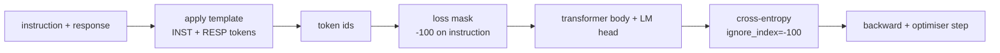
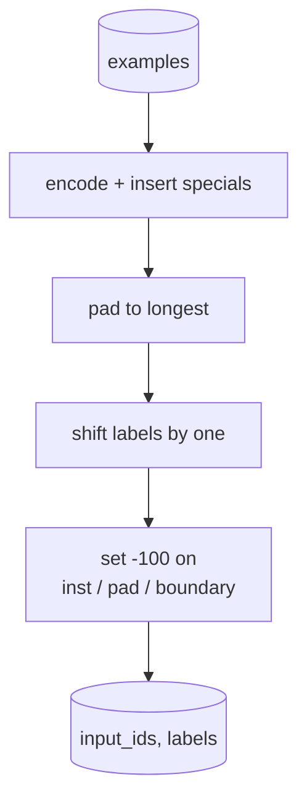
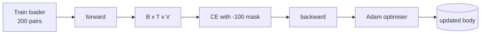

# कैपस्टोन पाठ 39: निर्देश अनुरेखण

> पूर्व प्रशिक्षित आधार मॉडल अनुक्रम का विस्तार कर सकता है लेकिन किसी निर्देश का पालन नहीं कर सकता है। पर्यवेक्षित सूक्ष्म-ट्यूनिंग सबसे छोटा बदलाव है जो इसे ठीक करता हैः मॉडल को निर्देश और वांछित प्रतिक्रिया के जोड़े उदाहरणों को खिलाएं, और प्रतिक्रिया टोकन की भविष्यवाणी करने के लिए शरीर को प्रशिक्षित करें। ट्रिक यह है कि आप केवल प्रतिक्रिया को गिनना चाहते हैं, न कि निर्देश। इस पाठ एक Alpaca शैली SFT लूप के साथ एक कस्टम कोलाट समारोह है कि निर्देश टोकन के साथ छिपा बनाता है `ignore_index=-100`, 200 निर्देश-उत्तर जोड़े पर ट्रेन करता है, और सटीक मैच का उपयोग करके एक लंबे समय तक चलने वाले विभाजन पर मूल्यांकन करता है।

**Type:** Build
**Languages:** Python (torch, numpy)
**Prerequisites:** Phase 19 lessons 30-37 (NLP LLM track: tokenizer, embedding table, attention block, transformer body, pre-training loop, checkpointing, generation, perplexity)
**Time:** ~90 minutes

## सीखने के लक्ष्य

- स्पष्ट सीमा टोकन के साथ एक एकल कारण अनुक्रम में निर्देश-उत्तर डेटा को जोड़ा स्वरूपित करें।
- एक कोलाट फ़ंक्शन बनाएं जो निर्देश टोकन को छिपाता है ताकि क्रॉस-एंट्रोपी केवल प्रतिक्रिया टोकन को गिनती करे।
- SFT उद्देश्य के तहत एक छोटे से ट्रांसफार्मर शरीर को प्रशिक्षित करें और मूल्यांकन मीट्रिक आंदोलन को देखें।
- प्रतिक्रिया-शुरू सीमा का सम्मान करने वाली लोभी और तापमान-सैंपल पीढ़ी को लागू करें।
- उत्पन्न पूर्णताओं पर सटीक मिलान की गणना करें।

## समस्या

अगले टोकन भविष्यवाणी पर प्रशिक्षित एक आधार मॉडल कोई विचार नहीं है कि एक निर्देश क्या है. उसे स्ट्रिंग दिखाओ `"What is the capital of France?"`मॉडल में भाषा है लेकिन प्रारूप अनुबंध नहीं है।

एसएफटी अनुबंध एक स्ट्रिंग टेम्पलेट है। प्रत्येक प्रशिक्षण उदाहरण तीन क्षेत्रों के साथ एक एकल अनुक्रम बन जाता हैः

```text
<INST> What is the capital of France? <RESP> The capital of France is Paris.
```

सीमा टोकन प्रशिक्षण के समय आरक्षित विशेष टोकन हैं। मॉडल सीखता है कि सब कुछ बाद में `<RESP>`मूल मॉडल के अगले टोकन लक्ष्य अभी भी लागू है; यह सिर्फ एक corpus पर प्रशिक्षित किया जाता है जहां प्रत्येक उदाहरण इस आकार है।

लेकिन एक पकड़ है. यदि आप पूरे अनुक्रम को एक वैनिला क्रॉस-एंट्रोपी हानि में खिलाते हैं, तो आप मॉडल को निर्देश टोकन की भविष्यवाणी करने के लिए भी प्रशिक्षित कर रहे हैं। निर्देश दिया जाता है। आप उन पदों पर शून्य ग्रेडिएंट चाहते हैं। फिक्स मास्क है।

## अवधारणा



`ignore_index``torch.nn.functional.cross_entropy`. किसी भी लक्ष्य स्थिति के बराबर `ignore_index`PyTorch में सम्मेलन है`-100`. कोलाट फ़ंक्शन दो टेन्सर बनाता है उदाहरण के लिए: `input_ids`(पूरा क्रम) और `labels`(कपी `input_ids`निर्देश पदों द्वारा ओवरराइट के साथ `-100`) ।

मॉडल आगे के पास के दौरान पूरे अनुक्रम को देखता है; ध्यान निर्देश पर ध्यान दे सकता है। हानि केवल प्रतिक्रिया टोकन गिनती है। यह ठीक यही है जो आप चाहते हैंः निर्देश पर स्थिति, प्रतिक्रिया की भविष्यवाणी करें।

## आंकड़े

दो सौ निर्देश-उत्तर जोड़े निर्णायक रूप से उत्पन्न होते हैं `main.py`वे छह प्रकार के कार्य को कवर करते हैंः

- वास्तविक एकल शॉट (X की राजधानी)
- अंकगणित
- सूची निकासी
- एक वाक्य का सारांश
- कोड (प्रिंट, सॉर्ट)
- परिभाषा

प्रत्येक कार्य में एक टेम्पलेट निर्देश और एक निर्धारात्मक प्रतिक्रिया होती है। यह जानबूझकर सरल है। सटीक-मिलान नाजुक है, और पाठ एक निश्चितता का उपयोग करता है जहां सही उत्तर एक विशिष्ट स्ट्रिंग है। वास्तविक एसएफटी डेटासेट को धुंधली मीट्रिक की आवश्यकता होती है; सिद्धांत समान है।

160 ट्रेन, 40 टेस्ट के बीच विभाजन है। परीक्षण सेट में सभी छह प्रकार के कार्य शामिल हैं ताकि प्रति श्रेणी सटीक मैच की रिपोर्ट की जा सके।

## टोकनकरण और पैडिंग

टोकनराइज़र तीन आरक्षित विशेषताओं के साथ बाइट स्तर हैः

- `INST_ID = 256`: निर्देश क्षेत्र की शुरुआत को चिह्नित करता है।
- `RESP_ID = 257`: निर्देश और प्रतिक्रिया के बीच की सीमा को दर्शाता है।
- `PAD_ID = 258`: चर लंबाई के बैचों के लिए पैडिंग।

क्रम है `[INST] inst_bytes [RESP] resp_bytes [PAD]*`. कोलाट फ़ंक्शनः

1. प्रत्येक उदाहरण को चिह्नित करता है।
2. बैच में सबसे लंबे क्रम में बैच में प्रत्येक उदाहरण को पैड करता है।
3. निर्माण `labels`= `input_ids`एक (कारणात्मक एलएम लक्ष्य) से स्थानांतरित किया गया, जिसमेंः
   - निर्देश क्षेत्र  द्वारा प्रतिस्थापित किया गया`-100`. .
   - पैडिंग क्षेत्र को `-100`. .
   - `RESP_ID`सीमा स्थान स्वयं `-100`(आप मॉडल को सीमा चिह्न की भविष्यवाणी करने के लिए प्रशिक्षित नहीं करते; यह अगले का भविष्यवाणी करता है)



शिफ्ट मानक कारण चाल हैः स्थिति `i``input_ids`स्थिति की भविष्यवाणी करता है `i+1`, तो `labels[i] = input_ids[i+1]`(अंतिम स्थिति इनपुट से गिरने के साथ और पहला लक्ष्य से गिरने के साथ) मास्क को सही स्थिति पर उतरने के लिए स्थानांतरण के बाद लगाया जाता है।

## प्रशिक्षण



लूप मानक PyTorch SFT लूप है। एडम, सीखने की दर 3e-4 से 1e-3, इस फिक्स्चर पर दस से बीस युगों के आसपास है, कोई शेड्यूलर नहीं है। मॉडल काफी छोटा है (छिपे हुए 96, 2 ब्लॉक, अधिकतम लंबाई 64) दो मिनट के भीतर सीपीयू पर अभिसरण के लिए प्रशिक्षित करने के लिए।

हर पांचवें युग में लूप एक छोटे से मूल्यांकन पास चलाता है और एक युग में 0.0 से पंद्रह युग में 0.85 तक सटीक मैच को देखना पाठ का भुगतान हैः आप मॉडल को एक ही समय में प्रारूप और उत्तर सीखने को देख सकते हैं।

## पीढ़ी

मूल्यांकन समय पर मॉडल निर्देश उपसर्ग प्राप्त करता है `[INST] inst_bytes [RESP]`और टोकन उत्पन्न करता है जब तक कि कोई भीः

- क्रम तक पहुँचता है `max_len`या
- मॉडल एक विशेष स्टॉप हेउरिस्टिक जारी करता हैः दो लगातार वाक्य समाप्त बाइट (`.`,`!`,`?`) ।

पाठ लालची डिकोडिंग और एक वैकल्पिक तापमान नमूना भेजता है। सटीक मैच लालची का उपयोग करता है क्योंकि तापमान मीट्रिक स्टोकास्टिक बना देगा। वास्तविक प्रणालियों अक्सर नमूना, फिर धुंधली रूप से न्याय; यह पाइपलाइन पाठ 41 है।

## सटीक मैच मूल्यांकन

सटीक-मिलान सबसे सख्त पाठ मीट्रिक है। अनुमानित प्रतिक्रिया स्ट्रिंग को सामान्यीकृत किया जाता है (कम अक्षर, पट्टी सफेद स्थान, ढहने के दोहरे स्थान) और संदर्भ प्रतिक्रिया की तुलना में, समान रूप से सामान्यीकृत किया जाता है। मीट्रिक या तो 1 या 0 है उदाहरण के लिए। संकलित औसत है।

वास्तविक एसएफटी पाइपलाइनें टोकन-स्तर F1 (पाठ 41) और एक न्यायाधीश मॉडल के साथ सटीक मैच की पूरक हैं। सटीक मैच उपयोगी रहता है क्योंकि यह स्पष्ट है; यदि यह 0.7 कहता है, तो परीक्षण निर्देशों के ठीक 70 प्रतिशत ने चरित्र के लिए स्वर्ण प्रतिक्रिया वर्ण का उत्पादन किया।

```figure
cc-sft-loss-mask
```

## आप क्या बना देंगे

कार्यान्वयन एक है `main.py`और परीक्षण।

1. `InstructionTokenizer`: बाइट-स्तर के एन्कोडर के साथ आरक्षित विशेष। यह या तो एक निर्देश पूर्वावलोकन या एक पूर्ण जोड़ी को एन्कोड करता है।
2. `make_dataset`: एक निश्चित बीज के साथ छह कार्य प्रकारों पर 200 जोड़े उत्पन्न करता है।
3. `SFTDataset`: रिटर्न `(input_ids, labels)`उदाहरण के लिए, पहले से ही मास्क तैयार किया गया है।
4. `sft_collate`: गतिशील पैडिंग, बैच टेंसर का निर्माण, सेट `-100`निर्देश और पैड की स्थिति पर।
5. `TinyGPT`: ट्रांसफार्मर बॉडी प्लस बंधे या अन बंधे एलएम सिर।
6. `train_sft`: एसएफटी लूप, प्रति युग मूल्यांकन हुक के साथ।
7. `generate`: एक पूर्वावचन से कारणात्मक डिकोड, लोभपूर्ण या नमूना, स्टॉप हेउरिस्टिक के साथ।
8. `exact_match`: सामान्य स्ट्रिंग तुलना, रिटर्न फ्लोट में `[0, 1]`. .
9. `run_demo`: डेटा का निर्माण करता है, बीस युगों के लिए ट्रेन करता है, मूल्यांकन करता है, प्रति श्रेणी का विभाजन प्रिंट करता है, सफलता पर शून्य छोड़ता है।

## मास्क क्यों मायने रखता है

मास्क के बिना, हानि निर्देश टोकन के रूप में लक्ष्य के रूप में व्यवहार करता है। मॉडल निर्देशों की भविष्यवाणी करना सीखता है। यह एक अलग उद्देश्य है और दो तरीकों से एक बदतर मॉडल पैदा करता है। सबसे पहले, उपयोगकर्ता द्वारा हमेशा प्रदान किए जाने वाले इनपुट को पुनर्निर्माण करने के लिए मॉडल क्षमता बर्बाद की जाती है। दूसरा, प्रतिक्रिया हानि ग्रेडिएंट योग में कम है क्योंकि निर्देश टोकन अधिकांश बैच में प्रतिक्रिया टोकन से अधिक संख्या में हैं; आपके द्वारा परवाह किए जाने वाले भाग पर अनुकूलक की प्रभावी सीखने की दर आपके द्वारा अपेक्षित से कम है। मास्क पॉलिश नहीं है; यह उद्देश्य है।

## लक्ष्य निर्धारित करें

- सीखाई दर में वार्मिंग जोड़ें और उसके बाद कोसिन का क्षय हो जाए। एसएफटी पूर्व प्रशिक्षण की तुलना में एलआर के प्रति अधिक संवेदनशील है।
- प्रति टोकन हानि लॉगिंग जोड़ें और प्रशिक्षण के दौरान हानि वक्र का ग्राफ करें। ध्यान दें कि प्रारंभिक युगों में टेम्पलेट टोकन (`<RESP>`, सामान्य पूर्वावलोकन) और बाद के युगों पर वास्तविक उत्तर टोकन का वर्चस्व है।
- मूल्यांकन को BLEU-1 या chrF तक बढ़ाएं। सटीक मैच उन मॉडलों को कम आंकता है जो एक ही उत्तर के साथ एक पैराफ्रेज का उत्पादन करते हैं।
- मल्टी-टर्न प्रारूपण के साथ एक चैट टेम्पलेट जोड़ें और अनुवर्ती शामिल एक फिक्स्चर पर प्रशिक्षित करें।

कार्यान्वयन आपको प्रारूप अनुबंध, मुखौटा और लूप देता है। मूल मॉडल से निर्देश अनुयायी के लिए उद्देश्य परिवर्तन एक कोलाट फ़ंक्शन है।
