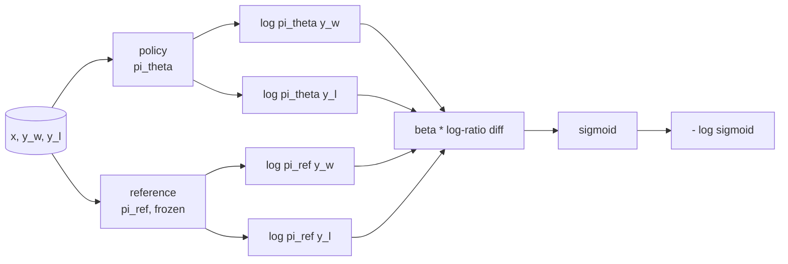
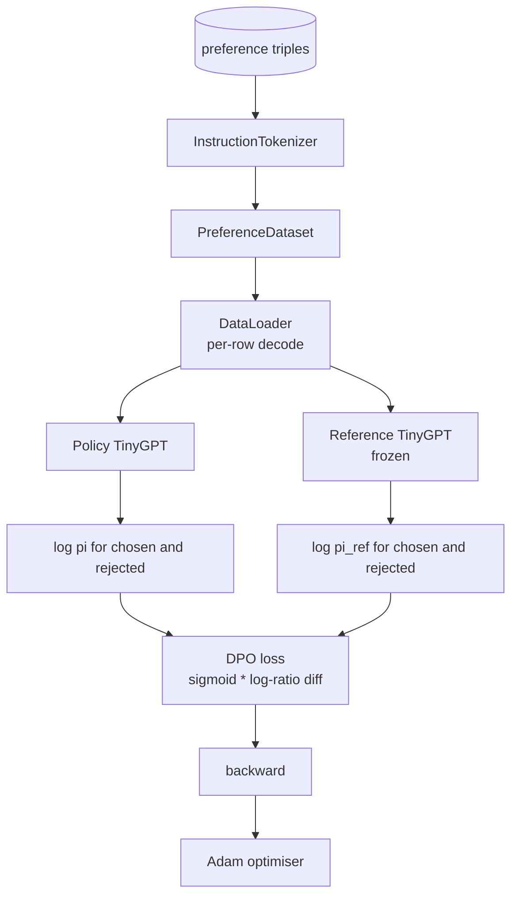

# कैपस्टोन पाठ 40: स्क्रैच से प्रत्यक्ष वरीयता अनुकूलन

> पुरस्कार मॉडल और पीपीओ क्लासिक आरएलएचएफ स्टैक हैं। डीपीओ उस ढेर को एक एकल पर्यवेक्षित हानि में ढहता है जो प्राथमिकता जोड़े के खिलाफ सीधे पॉलिसी के अनुरूप है। यह पाठ पुरस्कार-अंतर पहचान से डीपीओ हानि का निष्कर्ष निकालता है, एक कामकाजी संदर्भ मॉडल और नीति मॉडल भेजता है, प्रति टोकन लॉग-संभाव्यताओं की गणना करता है, और चयनित और अस्वीकृत पूर्णताओं के प्राथमिकता फिक्स्चर पर एक छोटे से ट्रांसफार्मर को प्रशिक्षित करता है। परीक्षण नुकसान गणित और gradient दिशा पिन ताकि आप जानते हैं कार्यान्वयन कागज से मेल खाता है.

**Type:** Build
**Languages:** Python (torch, numpy)
**Prerequisites:** Phase 19 lessons 30-37 (NLP LLM track: tokenizer, embedding table, attention block, transformer body, pre-training loop, checkpointing, generation, perplexity)
**Time:** ~90 minutes

## सीखने के लक्ष्य

- एक स्केल लॉग-अनुपातिक अंतर पर सिग्मोइड के रूप में डीपीओ हानि का व्युत्पन्न करें और इसे संवेदी पुरस्कार से जोड़ें।
- एक जमे हुए संदर्भ और एक प्रशिक्षित नीति के साथ एक संदर्भ मॉडल + नीति मॉडल जोड़ी का निर्माण करें।
- दोनों मॉडल के तहत अनुक्रम स्तर की लॉग-संभाव्यताओं की गणना करें, शीघ्र टोकन को छिपाकर।
- नीति को प्रशिक्षित करें`(prompt, chosen, rejected)`तीन बार और चुना लॉग-प्रोब को अस्वीकार के सापेक्ष वृद्धि देखने के लिए।
- हानि गणित, ग्रेडिएंट संकेत और संदर्भ अपरिवर्तनीयता पर परीक्षणों के साथ पिन व्यवहार।

## समस्या

आपके पास एक एसएफटी मॉडल है। यह निर्देशों का पालन करता है, लेकिन इसके आउटपुट असमान हैं; कुछ पूर्ण स्पष्ट हैं, कुछ शब्दहीन या गलत हैं। आपके पास प्राथमिकता जोड़े का एक छोटा डेटा सेट भी हैः एक ही प्रॉम्प्ट के लिए, एक मानव ने एक पूर्ण को चुना और दूसरा को अस्वीकार कर दिया।

क्लासिक RLHF उत्तर एक दो-चरण पाइपलाइन है। वरीयताओं पर एक पुरस्कार मॉडल का अभ्यास करें। पीपीओ के साथ पुरस्कार के खिलाफ नीति को अनुकूलित करें। यह काम करता है लेकिन महंगा हैः पीपीओ के दौरान स्मृति में दो मॉडल, संदर्भ के पास नीति रखने के लिए केएल नियंत्रण, पुरस्कार हैकिंग जब पुरस्कार मॉडल नाजुक है।

डीपीओ दोनों चरणों को एक एकल पर्यवेक्षित हानि के साथ बदल देता है। इनाम मॉडल कभी भी स्पष्ट रूप से मौजूद नहीं है। नीति को सीधे प्राथमिकता जोड़े पर प्रशिक्षित किया जाता है, जिसमें एसएफटी संदर्भ के लिए स्पष्ट केएल दंड होता है। ब्रैडली-टेरी प्राथमिकता मॉडल के तहत समान इष्टतम समाधान, बहुत कम कोड।

## अवधारणा

ब्रैडली-टेरी मॉडल से शुरू करें.`x`और दो पूर्णता `y_w`(चयनित) और `y_l`(अस्वीकृत), संभावना मानव पसंद करता है `y_w`है

```text
P(y_w > y_l | x) = sigmoid( r(x, y_w) - r(x, y_l) )
```

कहाँ`r`RLHF पहले फिट बैठता है`r`प्राथमिकता से, फिर एक नीति को प्रशिक्षित करता है `pi`अधिकतम करने के लिए `r`KL एंकर के साथः

```text
max_pi   E_{x, y~pi} [ r(x, y) ] - beta * KL(pi || pi_ref)
```

डीपीओ व्युत्पन्न यह देखते हैं कि इष्टतम नीति `pi*`इस उद्देश्य के तहत यह एक बंद रूप में है`r`:

```text
pi*(y | x) = (1/Z(x)) * pi_ref(y | x) * exp( r(x, y) / beta )
```

 के लिए पुनर्गठन`r`:

```text
r(x, y) = beta * ( log pi*(y | x) - log pi_ref(y | x) ) + beta * log Z(x)
```

`log Z(x)`दोनों के लिए शब्द एक ही है `y_w`और `y_l`(यह निर्भर करता है`x`नहीं`y`), इसलिए यह प्राथमिकता अंतर की गणना करते समय रद्द हो जाता हैः

```text
r(x, y_w) - r(x, y_l) = beta * ( log pi_theta(y_w|x) - log pi_ref(y_w|x)
                                - log pi_theta(y_l|x) + log pi_ref(y_l|x) )
```

ब्रैडली-टेरी सिग्मोइड में प्रतिस्थापन करें और प्राथमिकता जोड़े पर नकारात्मक लॉग संभावना लेंः

```text
L_DPO(theta) = - E_{(x, y_w, y_l)} [
  log sigmoid( beta * ( log pi_theta(y_w|x) - log pi_ref(y_w|x)
                       - log pi_theta(y_l|x) + log pi_ref(y_l|x) ) )
]
```

यह हानि है। यह एक एकल स्केलर पर एक सिग्मोइड है उदाहरण के लिए, चार लॉग-संभाव्यताओं से गणना की गई। कोई अलग इनाम मॉडल नहीं है। कोई पीपीओ नहीं है। हानि में कोई KL शब्द नहीं है; KL प्रतिबंध बंद-रूप व्युत्पन्न में बेक किया गया है।



## गिरने का संकेत

किसी भी प्रशिक्षण दौड़ से पहले एक उपयोगी मानसिक जांच।`log pi_theta(y_w | x)`:

```text
d L_DPO / d log pi_theta(y_w | x) = - beta * (1 - sigmoid(z))
```

कहाँ`z`यह सभी के लिए नकारात्मक है`z`, जिसका अर्थ हैः चयनित समापन की नीति की लॉग-प्रभाव्यता को बढ़ाना नुकसान को कम करता है।`log pi_theta(y_l | x)`सकारात्मक है: अस्वीकृत लॉग-प्रभाव्यता को बढ़ाना नुकसान को बढ़ाना है। प्रशिक्षण चुने हुए को ऊपर और अस्वीकृत को नीचे धकेलता है। संदर्भ जमे हुए है; यह नहीं चलता है।

## आंकड़े

12 प्राथमिकताएं सबक के साथ जहाज को तीन गुना.`(prompt, chosen, rejected)`. चयनित समापन संक्षिप्त और सटीक है. अस्वीकृत शब्द, विषय से बाहर, या गलत है। जोड़े पाठ 39 (पूंजी, अंकगणित, सूची) के समान कार्य परिवारों को कवर करते हैं, इसलिए एक नीति जो एसएफटी आधार से शुरू हुई है, एक उचित प्रारंभिक बिंदु है।

यह निश्चित रूप से छोटा है। डीपीओ उत्पादन में दसियों हजार जोड़े पर काम करता है; यहां, मुद्दा यह है कि हानि गणित और लूप एक छोटे से डेटासेट पर अंत-से-अंत चलती है और चयनित बनाम अस्वीकार किए गए लॉग-प्रोब अंतर दिखाई देता है।

## संदर्भ अपरिवर्तनीयता

एक डीपीओ कार्यान्वयन को संदर्भ मॉडल को सावधानीपूर्वक संभालना होगा। संदर्भ मॉडल स्थगित एसएफटी मॉडल है। तीन गुणों को धारण करना होगाः

- संदर्भ मापदंडों को कभी भी ग्रेडिएंट प्राप्त नहीं होता है।
- संदर्भ लॉग-संभाव्यता युगों के बीच कभी नहीं बदलती।
- नीति संदर्भ के समान भार से शुरू होती है।`theta`संदर्भ और एक सीखा अद्यतन है; नीति को संदर्भ की प्रति के रूप में शुरू करना अच्छी तरह से परिभाषित शुरुआत है।

कार्यान्वयन द्वारा इनका पालन किया जाता हैः

- संदर्भ को  में समापन करना`torch.no_grad()`आगे के पार के दौरान।
- सेट करना`requires_grad=False`प्रत्येक संदर्भ पैरामीटर पर।
- नीति का निर्माण `policy.load_state_dict(reference.state_dict())`संदर्भ के निर्माण के बाद।

```figure
cap-dpo-preference
```

## वास्तुकला



मॉडल उसी TinyGPT है जिसका उपयोग पाठ 39 में किया गया है (केवल डिकोडर, कारण, बाइट टोकनइज़र) संदर्भ और नीति वास्तुकला साझा करती है; नीति के वजन प्रशिक्षण में संदर्भ से विचलित होते हैं जबकि संदर्भ तय रहता है।

## आप क्या बना देंगे

कार्यान्वयन एक है `main.py`और परीक्षण।

1. `InstructionTokenizer`: बाइट टोकनराइज़र के साथ `INST`और `RESP`विशेष. पाठ 39 के समान आकार.
2. `TinyGPT`पाठ 39 के समान आकार है, इसलिए पाठ 39 को छोड़ने पर भी आत्मनिर्भर है।
3. `make_preferences`: बारह पर लौटता है `(prompt, chosen, rejected)`तीन गुना।
4. `sequence_log_prob`: मॉडल, एक शीघ्र पूर्वावलोकन और एक समापन को देखते हुए, समापन के बाद अगले टोकन लॉग-संभाव्यताओं का योग लौटाता है (कोई शीघ्र-स्थिति योगदान नहीं) ।
5. `dpo_loss`: चार लॉग-संभाव्यताओं को लेता है और `beta`, प्रति उदाहरण हानि tensor और लॉगिंग के लिए अप्रत्यक्ष इनाम डेल्टा लौटाता है.
6. `train_dpo`: प्रति युग लूप जो नीति और संदर्भ के तहत चुना और अस्वीकार लॉग-प्रोब्स की गणना करता है, हानि लागू करता है, और एडम कदम।
7. `evaluate_margins`: किसी भी बिंदु पर पॉलिसी के अंतर्गत औसत चयनित अस्वीकृत लॉग-संभाव्यता मार्जिन लौटाता है।
8. `run_demo`: एक छोटे से वार्मिंग प्री-ट्रेन से संदर्भ और नीति का निर्माण करता है, वजन को कॉपी करता है, तीस चरणों के लिए ट्रेनें, प्रति चरण हानि और मार्जिन प्रिंट करता है, और सफलता पर शून्य से बाहर निकलता है।

## डीपीओ का काम क्यों होता है

डीपीओ गणितीय रूप से ब्रैडली-टेरी प्राथमिकता मॉडल के तहत आरएलएचएफ के बराबर है, पुरस्कार के पैरामीटर तक।`r(x, y) = beta * (log pi(y|x) - log pi_ref(y|x))` के कार्य के लिए प्राथमिकता से पहचान योग्य है`x`बंद फॉर्म नीति आपको स्पष्ट इनाम मॉडल को छोड़ने की अनुमति देती है। KL प्रतिबंध संरचनात्मक रूप से लागू किया जाता हैः किसी भी विचलन का`pi`से`pi_ref`यह लॉग- अनुपात को बढ़ाता है, और सिग्मोइड संतृप्त होता है, जो पॉलिसी को बहुत दूर ले जाने पर ग्रेडिएंट को dampens करता है। संदर्भ आपके सुरक्षा नेट है।

## लक्ष्य निर्धारित करें

- लॉग-प्रभाव्यता योग में लंबाई सामान्यीकरण जोड़ेंः पूर्णता लंबाई द्वारा विभाजित करें। लंबाई पूर्वाग्रह एक ज्ञात डीपीओ विफलता मोड है जहां मॉडल अधिमानतः कम पूर्णता का चयन करता है क्योंकि उनकी लॉग-प्रभाव्यता पूर्ण शब्दों में अधिक है।
- घाटे के आईपीओ संस्करण को जोड़ेंः सिग्मोइड + लॉग को  से बदलें`(z - 1)^2`. फिक्स्चर पर अभिसरण की तुलना करें.
- एक लेबल-स्लाइडिंग पैरामीटर जो कठिन चुना-बदला लेबल और एक समान 0.5 के बीच इंटरपोलेट करता है जोड़ें।
- संदर्भ को एक छोटे और सस्ते मॉडल (ज्ञान डिस्टिलिशन स्वाद) से प्रतिस्थापित करें।

कार्यान्वयन आपको हानि देता है, संदर्भ अपरिवर्तनीयता, और प्रशिक्षण लूप. गणित सबक है. कोड गणित ठोस बनाता है.
