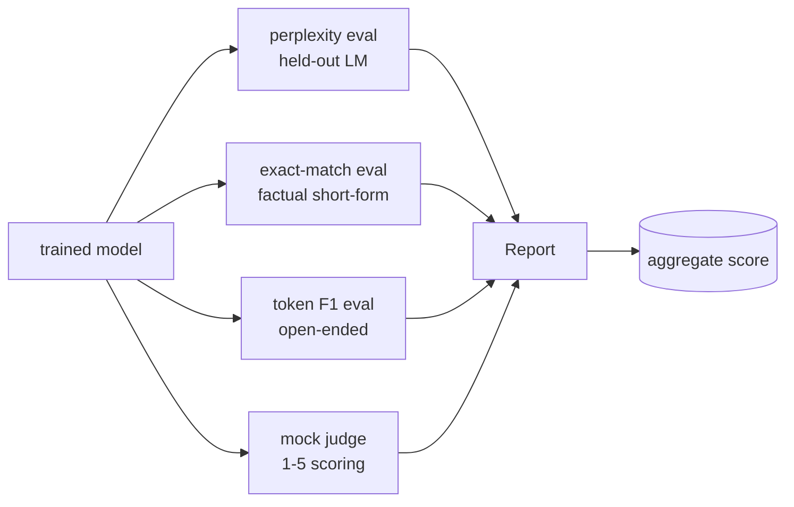
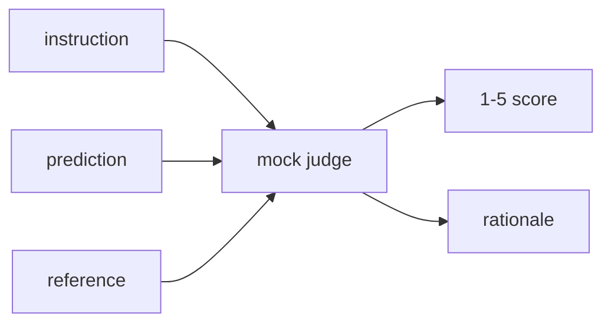
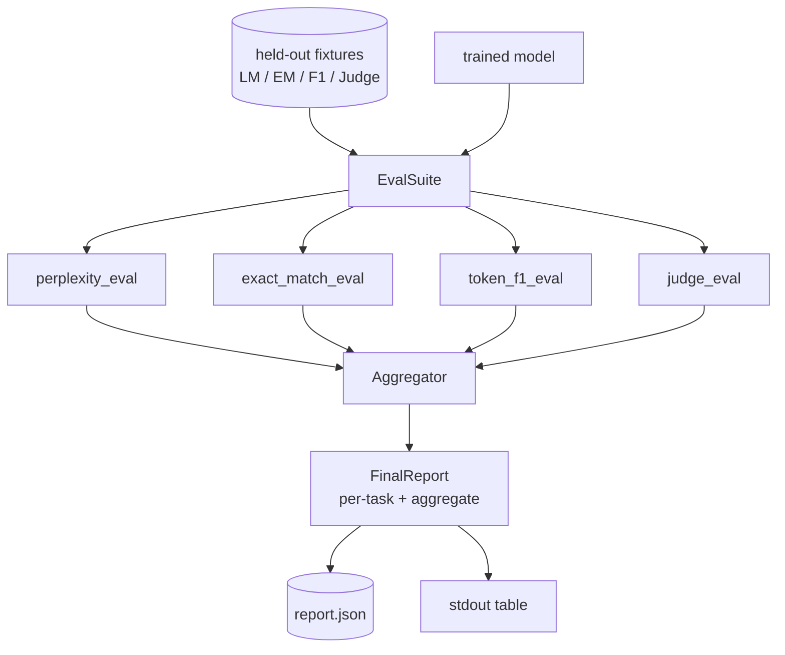

# कैपस्टोन पाठ 41: पूर्ण मूल्यांकन पाइपलाइन

> प्रशिक्षण वह हिस्सा है जिसे आप हानि वक्रों के साथ निगरानी कर सकते हैं। मूल्यांकन वह भाग है जिसे आपको डिजाइन करना है। यह पाठ एक एकीकृत मूल्यांकन पाइपलाइन बनाता है जो किसी भी प्रशिक्षित भाषा मॉडल को लेता है, उस पर चार विषम मूल्यांकन चलाता है, प्रति कार्य रिपोर्ट में परिणामों को एकत्र करता है, और एक स्थानीय नकली एलएलएम-जैसे-जजज भेजता है ताकि लूप नेटवर्क के बिना चलाए। चार मूल्यांकन प्रत्येक शिपिंग मॉडल की आवश्यकताओं के आयामों को कवर करते हैंः भाषा मॉडलिंग (गंभीरता), शॉर्ट-फॉर्म सटीकता (सटीक मैच), ओपन-फॉर्म समानता (टोकन F1) और गुणात्मक स्कोरिंग (आयाजा) ।

**Type:** Build
**Languages:** Python (torch, numpy)
**Prerequisites:** Phase 19 lessons 30-37 (NLP LLM track: tokenizer, embedding table, attention block, transformer body, pre-training loop, checkpointing, generation, perplexity)
**Time:** ~90 minutes

## सीखने के लक्ष्य

- एक छोटे से ट्रांसफार्मर पर छिपे टोकन लेखांकन के साथ उलझन में उलझन गणना करें।
- संक्षिप्त तथ्य संकेतों पर सटीक मैच मूल्यांकन करें।
- सामान्यीकरण के साथ पूर्वानुमानित और संदर्भ स्ट्रिंग के बीच टोकन स्तर F1 की गणना करें।
- एक स्थानीय नकली LLM-जैसे-न्यायाधीश का निर्माण जो 1-5 पैमाने पर मॉडल आउटपुट को स्कोर करता है।
- प्रत्येक कार्य के लिए एक भारित रिपोर्ट में चार मूल्यांकनों को एकत्र करें।

## समस्या

एक भी मीट्रिक कभी भी भाषा मॉडल का वर्णन नहीं करती है। भ्रम यह बताता है कि मॉडल भाषा वितरण के अनुरूप है, लेकिन यह कुछ नहीं कहता है कि यह प्रश्नों के उत्तर देता है या नहीं। सटीक-मिलान बताता है कि क्या मॉडल सोने की स्ट्रिंग का उत्पादन करता है लेकिन सही पैराफ्रेसेस को दंडित करता है। टोकन एफ 1 पैराफ्रेज़ को माफ करता है लेकिन गलत सामग्री के साथ शब्दावली ओवरलैप से धोखा दिया जाता है। LLM-as-judge गुणात्मक आयामों को कैप्चर करता है लेकिन यह महंगा और स्टोकास्टिक है।

आप वास्तव में चाहते हैं पाइपलाइन में सभी चार हैं. प्रत्येक मूल्यांकन एक आयाम को कवर करता है जो दूसरों को याद है. प्रत्येक उस मीट्रिक के लिए आकार में रखे गए डेटा के एक अलग उपसमूह पर चलता है। अंतिम रिपोर्ट प्रत्येक कार्य संख्याओं को एक साथ और एक संश्लेषण दिखाता है, ताकि एक समीक्षक एक नज़र में देख सके कि मॉडल क्या व्यापार कर रहा है।

यह सबक उस पाइपलाइन को एक फाइल में, अंत से अंत तक बनाता है।

## अवधारणा



प्रत्येक मूल्यांकन से एक फ़ंक्शन है `(model, dataset) -> EvalResult`. परिणाम में मेट्रिक मान, निरीक्षण के लिए प्रति उदाहरण विवरण और समग्र के लिए एक नाम होता है। पाइपलाइन उन्हें एक कॉन्फ़िग के साथ बनाती है जिसमें यह बताया जाता है कि कौन से मूल्यांकन चलाने के लिए और उन्हें कैसे वजन किया जाए।

## उलझन, सही ढंग से गिना

उलझन है`exp(mean negative log-likelihood per token)`. कार्यान्वयन में दो जाल हैंः

- औसत वास्तविक टोकन पदों पर होना चाहिए, बैच * अनुक्रम पर नहीं। पैडिंग टोकन को संकेतक से बाहर रखा जाना चाहिए अन्यथा भ्रम उससे बेहतर दिखेगा।
- मॉडल अगले टोकन की भविष्यवाणी करता है, तो स्थिति पर लॉग इन `i`स्थिति पर टोकन की भविष्यवाणी करें `i+1`यहाँ एक-एक से गलतियां चुप हैं: नुकसान अभी भी चलता है, लेकिन मीट्रिक अर्थहीन हो जाता है।

मूल्यांकन प्रति बैच की राशि की गणना करता है `-log p(token)`गैर-पैड स्थितियों और प्रति बैच टोकन गिनती पर, फिर अंत में विभाजित। यह प्रति बैच उलझन (जो छोटे अनुक्रमों का वजन कम करता है) का औसत है और पाठ्यपुस्तक परिभाषा से मेल खाता है।

## सामान्यीकरण के साथ सटीक मेल

हर्नस तुलना करने से पहले भविष्यवाणी और संदर्भ दोनों को सामान्य बनाता हैः

- छोटे अक्षरों में।
- सफेद स्थान के आसपास पट्टी।
- एक ही स्थान पर एक आंतरिक सफेद अंतरिक्ष को ध्वस्त करना।
- ड्रॉप-ट्रेलिंग टर्मिनल अंकन (`.`,`!`,`?`) यदि दोनों पक्ष केवल विराम चिह्न द्वारा भिन्न होते हैं।

सामान्यीकरण सटीक मिलान को व्यावहारिक रूप से उपयोगी बनाता है।`"Paris"`सही है; एक जो कहता है `"Paris."`यह भी सही है; एक जो कहता है `"  paris  "`मैट्रिक अभी भी सामान्यीकरण के बाद जवाब एक ही स्ट्रिंग होना चाहिए।

## टोकन F1, सही रास्ते पर

टोकन F1 टोकन बैग पर गणना की गई सटीकता और याद करने का सामंजस्यपूर्ण औसत है।

1. पूर्वानुमान और संदर्भ को सामान्य बनाएं (एक ही नियम सटीक मैच के रूप में) ।
2. प्रत्येक को टोकन की सूची में विभाजित करें (सफेद स्थान टोकनकरण) ।
3. बहु-सेट चौराहे की गणना करें।
4. सटीकता = `intersection_count / len(pred_tokens)`. याद रखें = `intersection_count / len(ref_tokens)`. F1 = सामंजस्य औसत।

यदि भविष्यवाणी और संदर्भ दोनों ही खाली हैं, तो F1 1 (रिक्त मैच) है। यदि केवल एक खाली है, तो F1 0 है। यह पैटर्न SQuAD मूल्यांकन संदर्भ से मेल खाता है और पैराफ्रेसेस के बीच स्थिर संख्या उत्पन्न करता है।

## स्थानीय नकली LLM-जैसे-जजज

एक असली न्यायाधीश एक एपीआई के पीछे एक सीमा मॉडल है। इस पाठ के लिए न्यायाधीश को ऑफ़लाइन चलाना पड़ता है। नकली न्यायाधीश एक निर्धारक स्कोरर है जो एक निर्देश, मॉडल की भविष्यवाणी और संदर्भ लेता है, और एक स्कोर वापस करता है।`{1, 2, 3, 4, 5}`एक पंक्ति तर्क के साथ। स्कोरिंग नियम स्पष्ट हैंः

- 5 यदि सामान्य भविष्यवाणी सामान्य संदर्भ के बराबर है।
- 4 यदि भविष्यवाणी और संदर्भ के बीच टोकन F1 कम से कम 0.8 है।
- 3 यदि टोकन F1 में है `[0.5, 0.8)`. .
- 2 यदि टोकन F1 में है `[0.2, 0.5)`. .
- अन्यथा 1।

यह एक असली न्यायाधीश नहीं है, लेकिन यह सही इंटरफ़ेस है. एक वास्तविक मॉडल में बाद में एक समारोह को बदलकर स्विच. पाइपलाइन परवाह नहीं है.



## संश्लेषण

कुल सामान्य मूल्यांकन स्कोर का एक भारित औसत है। प्रत्येक मूल्यांकन में अपनी संख्या की रिपोर्ट की जाती है।`[0, 1]`:

- उलझन: सामान्य हो जाए`1 / (1 + log(perplexity))`1 के नक्शे से 1 के नक्शे से 0 के अंतहीन नक्शे की एक जटिलता।
- सटीक मैचः पहले से ही `[0, 1]`. .
- टोकन F1: पहले से ही `[0, 1]`. .
- न्यायाधीशः 5 से विभाजित करें।

वजन विन्यास योग्य हैं। डिफ़ॉल्ट मिश्रण 0.2 भ्रम है, 0.3 सटीक मैच, 0.3 टोकन F1, 0.2 न्यायाधीश। वजन का चयन उत्पाद निर्णय है; पाठ बटन को उजागर करता है ताकि आप प्रयोग कर सकें।

```figure
cg-eval-quadrant
```

## वास्तुकला



`EvalSuite`प्रत्येक व्यक्तिगत मूल्यांकन एक मुक्त समारोह है जो लेता है`(model, tokenizer, dataset, config)`और एक लौटाता है `EvalResult`. . .`Aggregator`परिणामों को इकट्ठा करता है और अंतिम रिपोर्ट का उत्पादन करता है। डेमो तालिका को प्रिंट करता है और एक JSON प्रतिलिपि लिखता है जो डाउनस्ट्रीम CI निगल सकता है।

## आप क्या बना देंगे

कार्यान्वयन एक है `main.py`और परीक्षण।

1. `TinyGPT`: उसी डिकोडर-केवल वास्तुकला का उपयोग पाठ 38-40 में किया गया था, इसलिए पाठ अकेले खड़ा है।
2. `InstructionTokenizer`: INST/RESP/PAD विशेषताओं के साथ बाइट टोकनराइज़र।
3. चार फिचर्सः एक एलएम कॉर्पस, एक एमई सेट, एक एफ 1 सेट, और एक जज सेट. 20 उदाहरण प्रत्येक, निर्धारक।
4. `perplexity_eval`: रिटर्न `EvalResult`विभ्रमता मान और प्रति टोकन हानि हिस्टोग्राम के साथ।
5. `exact_match_eval`: प्रति उदाहरण औसत ईएम और रिकॉर्ड।
6. `token_f1_eval`: प्रति उदाहरण रिकॉर्डों के लिए टोकन F1 औसत देता है।
7. `mock_judge`और `judge_eval`: प्रति उदाहरण स्कोर और तर्क, सेट में औसत स्कोर।
8. `Aggregator.normalise`: प्रति वर्ष सामान्यीकरण नियम।
9. `Aggregator.aggregate`: वजन का औसत और एकत्रित रिपोर्ट।
10. `run_demo`: संक्षिप्त रूप से एक छोटे से मॉडल को प्रशिक्षित करता है, सभी चार मूल्यांकन चलाता है, रिपोर्ट तालिका प्रिंट करता है और JSON लिखता है, सफलता पर शून्य छोड़ता है।

## रिपोर्ट पढ़ना

रिपोर्ट में तीन परतें हैं। शीर्ष पर समग्र स्कोर है। नीचे इसके चार प्रति-वैकल्पिक संख्याएं हैं। नीचे निदान के लिए प्रति-उदाहरण टूटने हैं। एक विफल आईसी रन आमतौर पर समग्र चाहता है, लेकिन एक प्रतिगमन का पीछा करने वाले समीक्षक यह देखने के लिए प्रति-उदाहरण टूटना चाहता है कि मॉडल में कौन से इनपुट गलत हो गए हैं।

JSON डंप में स्थिर कुंजी का उपयोग किया जाता है ताकि एक CI डैशबोर्ड संस्करणों में ट्रेंड लाइनों को रेखांकित कर सके। सुंदर मुद्रित तालिका प्रशिक्षण रन के बाद टर्मिनल को देखने वाले मनुष्यों के लिए है।

## लक्ष्य निर्धारित करें

- एक माप मूल्यांकन जोड़ेंः क्या मॉडल की सॉफ्टमैक्स संभावनाएं इसकी सटीकता से मेल खाती हैं? विश्वास द्वारा बाल्टी भविष्यवाणियां और प्रति बाल्टी अनुभवजन्य सटीकता की रिपोर्ट करें।
- एक मजबूती मूल्यांकन जोड़ेंः प्रत्येक उदाहरण को एक विघटन (प्रकार, पैराफ्रेज, विचलितकर्ता) के साथ टैग करें और प्रति विघटन मेट्रिक ड्रॉप रिपोर्ट करें।
- HTTP कॉल के पीछे वास्तविक मॉडल के साथ नकली न्यायाधीश को प्रतिस्थापित करें। फ़ंक्शन हस्ताक्षर नहीं बदलता है।
- प्रति कार्य वजन सीखने को जोड़ेंः निश्चित वजन के बजाय, मॉडल पर लक्ष्य वरीयता क्रम में वजन फिट करें।

कार्यान्वयन आपको चार मूल्यांकन, एग्रीगेटर और रिपोर्ट देता है। वास्तविक मूल्यांकन पाइपलाइनें ऊपर कई और आयामों को परत करती हैं; पैटर्न समान रहता हैः प्रति मूल्यांकन एक फ़ंक्शन, एक एग्रीगेटर, एक रिपोर्ट।
