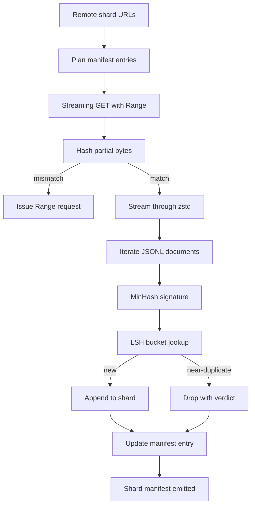

# बड़ा कॉर्पस डाउनलोडर

> भाषा मॉडल का प्रशिक्षण पहले पास से बहुत पहले शुरू होता है। कॉर्पस को डिस्क पर लैंड करना होगा, डिकम्प्रेस्ड, डिडप्लिकेट और एड्रेस करने योग्य, नेटवर्क 4 प्रतिशत तक गिरने से पहले ही रिज्यूमे की कहानी तैयार हो चुकी है। यह पाठ एक स्ट्रीमिंग डाउनलोडर बनाता है जो संपीड़ित टुकड़े खींचता है, Zstandard के साथ उड़ान में decompresses, MinHash के माध्यम से लगभग डुप्लिकेट फिंगरप्रिंट्स प्लस स्थान-संवेदनशील हैशिंग, और एक टुकड़ा प्रकट लिखता है पाइपलाइन के बाकी के भरोसा कर सकते हैं।

**Type:** Build
**Languages:** Python
**Prerequisites:** Phase 19 lessons 30-37
**Time:** ~90 minutes

## सीखने के लक्ष्य

- रिमोट शार्ड के साथ स्ट्रीम करें `urllib`और  के साथ डिसीम्प्रेशन`zstandard`स्मृति में पूरी फ़ाइल बफर के बिना।
- HTTP जारी करके आंशिक डाउनलोड को पुनः प्राप्त करें `Range`सत्यापित बाइट ऑफसेट के खिलाफ अनुरोध।
- प्रति दस्तावेज़ एक MinHash हस्ताक्षर बनाएं और LSH के साथ इसे बाल्ट ताकि दोहरे टुकड़े टकराएं।
- सामग्री हैश, बाइट आकार, दस्तावेज़ संख्या, और dedup निर्णय के साथ एक टुकड़ा मैनिफेस्ट जारी करें।

## समस्या

पहली बार जब आप 200 जीबी कॉर्पस पर प्रशिक्षण नेटवर्क 41 प्रतिशत गिर जाता है और स्क्रिप्ट एक के साथ बाहर निकलता है`urllib`अपवाद. दूसरी बार यह 78.99 प्रतिशत पर गिर जाता है। आप तीन बार लूप को फिर से लिखते हैं। पहली मिनट से आपको दो विफलताओं के लिए डिज़ाइन करना है आंशिक डाउनलोड रिज्यूमे और डुप्लिकेट दस्तावेज़ हटाने। दोनों में अच्छी तरह से ज्ञात समाधान हैं; दोनों को नियमित रूप से छोड़ दिया जाता है क्योंकि पाइपलाइन एक पंक्ति के रूप में शुरू होती है।`requests.get`दांतों को बड़ा करने के लिए कॉल करें।

पुनरुत्थान एक HTTP समस्या है. सर्वर सम्मान करना होगा`Range`यदि ऑफसेट और फ़ाइल एक बाइट से भी अलग होती है तो फिर से डाउनलोड कचरा लिखता है और कॉर्पस को एक तरह से खराब कर दिया जाता है जो केवल टोकनकरण के दौरान दिखाई देता है।

डिडप्लिकेशन एक हस्ताक्षर समस्या है। Exact-hash dedup लगभग डुप्लिकेट को याद करता हैः एक ही विकिपीडिया लेख तीन अलग-अलग बॉयलरप्लेट फुटर्स के साथ दिखाई देता है, एक अलग लाइसेंस हेडर के साथ एक ही कोड फ़ाइल, प्रत्येक लिंक पर ट्रैकिंग पैरामीटर के साथ एक ही ब्लॉग पोस्ट। MinHash प्लस LSH इन सब-लाइनर लागत पर पकड़ता है। लागत प्रति दस्तावेज़ एक हस्ताक्षर और प्रति हस्ताक्षर एक बाल्टी खोज है।

## अवधारणा



### `urllib`

मानक पुस्तकालय `urllib.request.urlopen`फ़ाइल की तरह एक वस्तु वापस करता है. इसे एक में लपेटें `zstandard.ZstdDecompressor().stream_reader`और बाइट्स नेटवर्क से डिकंप्रेसर के माध्यम से दस्तावेज़ पुनरावर्तक में बहते हैं, जो कभी भी संपीड़ित टुकड़ा या स्मृति में डिकंप्रेटेड टुकड़ा को भौतिक रूप से नहीं बनाते हैं। केवल मेमोरी लागत लाइन बफर, वर्तमान दस्तावेज़ के लिए MinHash हस्ताक्षर और LSH सूचकांक है।

###  के साथ फिर से शुरू करें`Range`

डाउनलोडर प्रति टुकड़ा दो फ़ाइलें लिखता हैः खुद टुकड़ा और एक `.partial.json`चेकपॉइंट।`verified_bytes`,`expected_size`,`sha256_prefix`(पहली गणना के बाद)`verified_bytes`बाइट्स) और स्रोत URL. प्रारंभ करने पर डाउनलोडर चेकपॉइंट पढ़ता है, पुनः गणना करता है `sha256_prefix`डिस्क पर बाइट्स पर, और केवल फिर से गणना हैश मेल खाता है यदि. यदि हैश गलत है तो आंशिक को त्याग दिया जाता है और डाउनलोड शून्य बाइट से फिर से शुरू होता है. मौन भ्रष्टाचार असंभव है क्योंकि सत्यापित बाइट्स की जांच की जाती है, नहीं माना जाता है।

### मिनाश प्लस एलएसएच

MinHash ने निश्चित स्थान में दो सेटों की जैकार्ड समानता का अनुमान लगाया। एक दस्तावेज़ के लिए सेट उसके पाठ के छिलके (अपरपरस्पर n-ग्राम) है। हस्ताक्षर है `k`न्यूनतम हैश मान, एक प्रति स्वतंत्र हैश फ़ंक्शन. जैकार्ड समानता के साथ दो दस्तावेजों `s`एक संभावना है `s`हस्ताक्षर के किसी भी घटक पर सहमति बनाने की।

LSH फिर समूहों को `k``b` के बैंड`r`पंक्तियों में से प्रत्येक, जहां `k = b * r`. दो दस्तावेजों को कम से कम एक बैंड में टकराव के साथ संभावना है .`1 - (1 - s^r)^b`, जो कि  के मूल्य के आसपास एक तेज सीमा है`s`आप tune `(b, r)`सामान्य कॉर्पस डिड्यूप के लिए सीमा `s = 0.8`, जो LSH अनुसंधान साहित्य के साथ पहुँचता है `k = 128`,`b = 32`,`r = 4`. .

### अनुबंध के रूप में टुकड़ा प्रपत्र

डाउनलोडर का एकमात्र टिकाऊ आउटपुट मैनिफेस्ट है। मैनिफेस्ट में प्रति शार्ड, यूआरएल, डिकॉम्प्रेस्ड बाइट्स की गिनती, दस्तावेज़ की गिनती, डिडूप के बाद अद्वितीय दस्तावेज़ की गिनती और अंतिम शार्ड फ़ाइल का sha256 होता है। डाउनस्ट्रीम टोकनकरण मैनिफिस को पढ़ता है, डायरेक्टरी लिस्टिंग को नहीं। यदि कोई टुकड़ा गायब है या उसका sha256 गलत है, तो घोषणा पत्र अगले चरण को शुरू करने से इनकार करने के लिए कहता है। मैनिफेस्ट "डेटा डाउनलोड किया गया है" और "डेटा डाउनलोड किया गया है और सत्यापित किया जा सकता है" के बीच निर्णायक किनारा है।

```figure
cap-corpus-downloader
```

## इसे बनाओ

`code/main.py`कार्य करता हैः

- `ShardPlanner`- शार्ट URL की सूची पढ़ता है और योजनाबद्ध मैनिफेस्ट प्रविष्टियों का उत्पादन करता है।
- `StreamingDownloader`- एक खोले`urllib`वैकल्पिक के साथ धारा `Range`, एक अस्थायी फ़ाइल में लिखता है, अद्यतन करता है `.partial.json`हर टुकड़े पर चेकपॉइंट, और फिर से शुरू करने पर Sha256 पूर्वावलोकन की पुष्टि करता है।
- `ZstdDocIterator`- फ़ाइल की तरह धारा में लपेटता है `zstandard.ZstdDecompressor`और प्रति पंक्ति एक दस्तावेज देता है।
- `MinHasher`- एक `k`-हश बीज के एक निश्चित परिवार का उपयोग कर स्ट्रिंग के लिए घटक हस्ताक्षर।
- `LSHIndex`- बैंड द्वारा बाल्ट हस्ताक्षर और टकराव रिपोर्ट।
- `Dedup`- प्रत्येक दस्तावेज़ को लेबल करने के लिए हैशर और इंडेक्स को जोड़ता है `keep`या `near_duplicate`साथ ही संगत टुकड़ा आईडी.
- `ManifestWriter`- प्रति शेयर आंकड़े एकत्र करता है और लिखता है `manifest.json`. .

फ़ाइल के नीचे एक डेमो डिस्क पर एक छोटे से सिंथेटिक कॉर्पस बनाता है, यह संपीड़ित करता है के साथ `zstandard`, इसे एक के माध्यम से डाउनलोड करता है `file://`यूआरएल, डुप्लिकेट, और प्रिंट मैनिफेस्ट.

इसे चलाओः

```bash
python3 code/main.py
```

स्क्रिप्ट शून्य से बाहर निकलता है और एक स्पष्ट सारांश प्रिंट करता है।

## उत्पादन के पैटर्न

चार पैटर्न वास्तविक शरीरों के लिए इस सबक को स्केल.

**Checkpoint before write.**`.partial.json`होना चाहिए`fsync`-ed से पहले बाइट्स को टुकड़े में जोड़ा जाता है। अन्यथा एक बिजली हानि क्रम को उलट देती हैः डिस्क पर टुकड़े बाइट्स, चेकपॉइंट उनके बिना, अगले रिज्यूमे का मानना है कि इसमें इससे कम सत्यापित बाइट्स हैं, दोहराए गए प्रत्यय बाइट्स फ़ाइल को भ्रष्ट करते हैं। पहले चेकपॉइंट, फिर लिखें। यह एक पूर्व-लेखन लॉग के समान अनुशासन है।

**Sharded LSH index.**पूरे कॉर्पस पर एक एकल LSH सूचकांक 200 GB पैमाने पर रैम में फिट नहीं होता है। LSH सूचकांक को पहले बैंड हैश द्वारा विभाजन करें, डिस्क पर विभाजन स्टोर करें, और केवल उस विभाजन से परामर्श करें जिसमें एक नया हस्ताक्षर लैंड होगा। लागत प्रति दस्तावेज़ एक अतिरिक्त डिस्क पढ़ना है; लाभ यह है कि LSH सूचकांक अब हार्ड मेमोरी छत नहीं है।

**Tombstone, not delete.**छोड़ दिया डुप्लिकेट घोषणा पत्र में दर्ज कर रहे हैं साथ में फैसला `near_duplicate`और दस्तावेज के टुकड़े आईडी वे टकराई. उन्हें हटाने के लिए डुप्लिकेट और उसके धारक के बीच संबंध खो देता है. Tombstoning लेखा परीक्षा ट्रेल संरक्षित करता है और एक डाउनस्ट्रीम पास के बारे में अपना विचार बदलने देता है.

**Per-shard sha256 in the manifest, plus a manifest sha256.**मैनिफेस्ट स्वयं को एक सामग्री हैश मिलता है। डाउनस्ट्रीम चरण प्रति-शेड प्रविष्टियों पर भरोसा करने से पहले मैनिफेस्ट हैश की पुष्टि करते हैं। इसके बिना मैनिफेस्ट मूक हमले की सतह हैः एक हमलावर जो एक ही फ़ाइल को संपादित कर सकता है, पूरी पाइपलाइन को भ्रष्ट कर सकता है।

## इसका प्रयोग करें

उत्पादन के पैटर्नः

- **Resume on every CI run.**सीआई रनर अस्थायी हैं. डाउनलोडर को प्रत्येक रन पर एक नया डिस्क लेना होगा और कैश या रिमोट से पुनर्प्राप्त करना होगा। `--cache-dir`एक प्रथम श्रेणी का ध्वज है।
- **Dedup before tokenization.**टोकनकरण महंगा है. एक ही दस्तावेज़ पर इसे दो बार चलाना एक ही हानि वक्र के लिए दो बार अधिक लागत है. डेडअप टोकनकरण के ऊपर है, डाउनस्ट्रीम नहीं है।
- **Manifest as merge gate.**प्रशिक्षण रन एक पिन किए गए कॉम से मैनिफेस्ट sha256 पढ़ता है। एक नए डेटासेट संस्करण के लिए एक नया मैनिफेस्ट कॉम की आवश्यकता होती है। कोड और डेटा के बीच संबंध गिट है, लोक कथा नहीं।

## इसे भेजें

`outputs/skill-corpus-downloader.md`एक वास्तविक परियोजना पर, वर्णन करेंगे कि कौन से URL डाउनलोडर को फ़ीड करते हैं, कैसे चेकपॉइंट निर्देशिका रखी गई है, किस शिंगल चौड़ाई और `(k, b, r)`यह सबक इंजन जहाजों.

## व्यायाम

1. एक जोड़ें `--shingle-width`फ्लैग और मापें कि कैसे dedup फैसले चौड़ाई 3, 5, 9 पर बदलता है।
2. जादुई बाइट्स को स्निफ़िंग करके zstd के बगल में gzip समर्थन जोड़ें। डाउनलोडर को कॉल करने वाले को कोडक निर्दिष्ट करने की आवश्यकता नहीं होनी चाहिए।
3. एक जोड़ें `--resume-only`एक रन को गलती से 200 जीबी को फिर से खींचने से रोकने के लिए उपयोगी है।
4. LSH सूचकांक को शेल्फ या sqlite फ़ाइल में ले जाएं और इन-मेमोरी वेरिएंट के मुकाबले आउटपुट मापें।
5. प्रारंभ पर एक manifest sha256 चेक जोड़ें. डाउनलोडर बंद करने में विफल होना चाहिए यदि डिस्क पर manifest हैश के साथ असहमत है`manifest.lock`. .

## प्रमुख शर्तें

| Term | What people say | What it actually means |
|------|-----------------|------------------------|
| Shard | "A file" | A self-contained slice of the corpus with its own sha256, used as the unit of resume and dedup |
| MinHash signature | "Fingerprint" | A `k`-component sketch of a set, where each component is the minimum of one independent hash over the set |
| LSH band | "Bucket" | A group of `r` signature components used as a single bucket key for collision detection |
| Verified bytes | "Resume offset" | Bytes on disk whose sha256 prefix matches the checkpoint; the only safe offset to resume from |
| Manifest | "The index" | The single durable record of what the downloader produced, including content hashes |

## आगे पढ़ना

- [RFC 7233](https://datatracker.ietf.org/doc/html/rfc7233)- HTTP रेंज अनुरोध, रिज्यूमे प्रोटोकॉल
- [Zstandard format specification](https://datatracker.ietf.org/doc/html/rfc8478)- फ्रेम प्रारूप जो स्ट्रीमिंग डिकॉम्प्रेशन को सुरक्षित बनाता है
- [MinHash](https://en.wikipedia.org/wiki/MinHash)- इस पाठ में हस्ताक्षर परिवार का उपयोग किया जाता है
- [Locality-sensitive hashing](https://en.wikipedia.org/wiki/Locality-sensitive_hashing)- कटौती की सीमा के पीछे बैंडिंग योजना
- चरण 19 · 43 - HDF5 टोकन corpus डाउनलोडर फ़ीड
- चरण 19 · 44 - कॉसिन कार्यक्रम जो कॉर्पस पर ट्रेन करता है
- चरण 19 · 45 - एएमपी लूप जो शेड्यूल को खपत करता है
