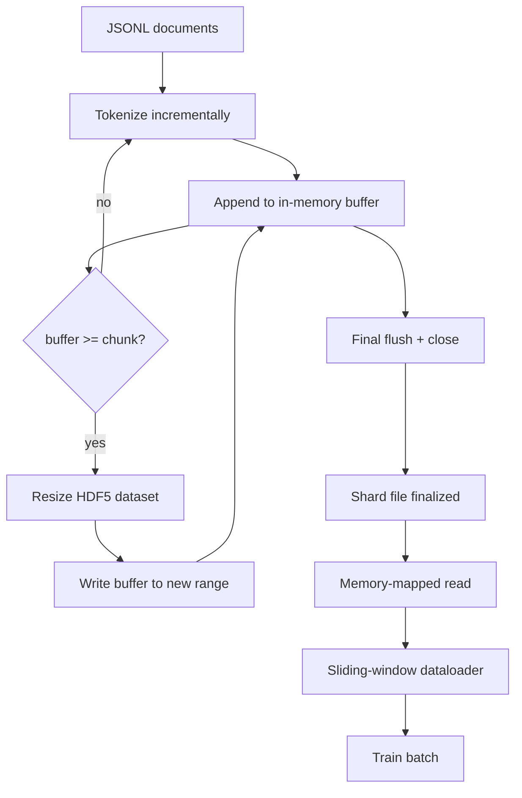

# HDF5 टोकनकृत कॉर्पस

> डाउनलोड किए गए कॉर्पस को एक लेआउट में लैंड करना होगा जिससे ट्रेनर लाइन की गति से स्ट्रीम कर सकता है। डिस्क पर JSONL 16 डेटा लोडर श्रमिकों को जीवित नहीं रखता है। HDF5 के साथ एक आकार, टुकड़ा-टुकड़ा पूर्णांक डेटा सेट करता है। इस पाठ में स्ट्रीमिंग टोकनाइजेशन को एक आकार में बदलने योग्य HDF5 डेटासेट में बनाया गया है, कई फ़ाइलों पर टुकड़े टुकड़े लिखें, प्रशिक्षण के समय मेमोरी-मैप रीडिंग, और एक स्लाइडिंग विंडो डेटा लोडर जो सही पैकिंग के साथ निश्चित लंबाई के अनुक्रम का उत्पादन करता है।

**Type:** Build
**Languages:** Python
**Prerequisites:** Phase 19 lessons 30-37
**Time:** ~90 minutes

## सीखने के लक्ष्य

- निर्धारात्मक टुकड़े टुकड़े के साथ आकार में HDF5 पूर्णांक डेटासेट में दस्तावेजों को स्ट्रीम करें।
- कई HDF5 फ़ाइलों पर लिखना टुकड़े टुकड़े ताकि विफलता सीमा है और समानांतर संभव है।
- HDF5 के पृष्ठ-कैश-समर्थित टुकड़े टुकड़े लेआउट के माध्यम से टोकन वापस पढ़ें ताकि डेटा लोडर बैच बफर में बैच समय पर ही कॉपी करता है।
- स्लाइडिंग विंडो डेटा लोडर को लागू करें जो स्पष्ट पैकिंग नियमों के साथ निश्चित लंबाई के प्रशिक्षण अनुक्रमों को जारी करता है।

## समस्या

आधुनिक भाषा-मॉडल प्रशिक्षण रन दर्जनों श्रमिकों पर प्रति सेकंड सैकड़ों हजारों नमूनों पर टोकन पढ़ता है। डिस्क पर JSONL पहली कोल्ड-कैश पृष्ठ त्रुटि पर मर जाता हैः JSON पार्सर धीमा है, दस्तावेज़ सीमाएं संबोधित नहीं की जा सकती हैं, और "4,217,884" का नमूना लेने के लिए फ़ाइल को स्कैन करना आवश्यक है। यहां तक कि पार्केट, जो अच्छी तरह से संपीड़ित करता है, खराब फिट है क्योंकि प्रशिक्षक कॉलम नहीं चाहता है; वह O(1) यादृच्छिक पहुंच के साथ एक सपाट टोकन धारा चाहता है।

HDF5 उपयुक्त है क्योंकि यह एक टुकड़ा, आकार, केवल पूर्णांक डेटासेट प्रदान करता है जिसका टुकड़ा पढ़ने के समय पृष्ठ कैश के अनुकूल है। प्रशिक्षक एक स्लाइस के लिए कहता है `tokens[3,200,000 : 3,200,8192]`और HDF5 पृष्ठ कैश से अनुरोधित हाइपरलैब को एक ताजा आवंटित NumPy सरणी में कॉपी करता है। लागत एक खुली फ़ाइल हैंडल और प्रति कार्यकर्ता एक टुकड़ा आकार का पृष्ठ कैश पदचिह्न है, जो JSONL को डिकोड करने की लागत की तुलना में तुलनीय है।

निर्माण समस्या लेखन पक्ष को ईमानदार बनाना है। आकार के लिए अनुकूलित डेटासेट का दुरुपयोग करना आसान हैः एक समय में एक दस्तावेज़ लिखें और HDF5 फ़ाइल खंडित हो जाती है ताकि यह उपयोग करने योग्य न हो। एक आकार में सभी दस्तावेजों को लिखें और एक प्रक्रिया मृत्यु पूरे टुकड़े को खो देता है। सही अनुशासन बफर-तो-विस्तार है, बफर आकार के साथ जो टुकड़े के आकार से मेल खाता है, और एक टुकड़ा लिखा है जो फ़ाइलों में कार्यभार को विभाजित करता है ताकि एक दुर्घटना में अधिकतम एक टुकड़ा खो जाता है।

## अवधारणा



### सही किया गया आकार HDF5

टोकन डेटासेट के साथ बनाया गया है `maxshape=(None,)`और एक निश्चित `chunks=(chunk_size,)`. लम्बाई की संख्यापी सरणी में टोकन बफर करके कमाई लिखना `chunk_size`. जब बफर भर जाता है, तो डेटासेट का आकार ठीक से बदल जाता है `chunk_size`और बफर को नई सीमा में लिखा जाता है। टुकड़े के अंत में शेष बफर को अंतिम आंशिक सीमा में लिखा जाता है। प्रत्येक लेखन अंतरिम और टुकड़े-टुकड़े संरेखित है, अंतिम को छोड़कर, जिसे पाठक को रिकॉर्ड पर ट्रंक करने के लिए कहा जाता है।`token_count`टुकड़े के HDF5 गुणों में।

### टुकड़े टुकड़े लिखना

एक एकल HDF5 फ़ाइल एक एकल विफलता बिंदु है। पाइपलाइन समानांतर में टुकड़े लिखती हैः चरण 19 पाठ 42 से प्रत्येक इनपुट टुकड़ा एक HDF5 आउटपुट टुकड़ा उत्पन्न करता है।`shards.json`प्रति टुकड़ा, फ़ाइल पथ, टोकन गिनती, दस्तावेज़ गिनती, और टोकन पर एक sha256। प्रशिक्षक पढ़ता है `shards.json`वैश्विक ऑफसेट की गणना करने और कॉर्पस को मान्य करने के लिए।

### स्मृति-मैप रीडिंग

प्रशिक्षण के समय प्रत्येक कार्यकर्ता अपने हिस्से को खोलता है HDF5 फ़ाइलें `swmr=True`मोड और मांगें`tokens[start:stop]`HDF5 के टुकड़े लेआउट इसे एक पृष्ठ-कैश-बैकड रीडिंग बनाता है जब टुकड़ा गर्म हो जाता है। कार्यकर्ता कभी भी पूरी फ़ाइल को भौतिक नहीं बनाता हैः स्लाइस को डेटा लोडर के बैच बफर में कॉपी किया जाता है, जिसे डेटा लोडर फिर बैच समय पर एक पिंटेड-मेमोरी प्रशिक्षण टेंसर में कॉपी करता है। हॉट पथ में प्रति टुकड़ा संक्रमण में एक सिस्टस कॉल होता है; बाकी सब कुछ रैम एक्सेस है।

### स्लाइडिंग विंडो डेटा लोडर

डेटा लोडर एकमात्र चरण है जो प्रशिक्षण अनुक्रम की लंबाई के बारे में जानता है। यह वैश्विक टोकन स्ट्रीम में एक यादृच्छिक प्रारंभ सूचकांक का चयन करता है, पढ़ता है `window_size + 1`टोकन और रिटर्न `(input, target) = (tokens[:-1], tokens[1:])`. दस्तावेजों की सीमाओं को लागू नहीं किया जाता हैः एक खिड़की दो दस्तावेजों के बीच एक स्पष्ट रूप से `boundary_token_id`यह मानक पैकिंग नियम है; यह एक शुरुआती भूल जाता है नियम है, एक corpus के साथ समाप्त होता है जो 8 प्रतिशत प्रशिक्षण सीमा टोकन और 92 प्रतिशत प्राकृतिक पाठ है।

```figure
cc-hdf5-corpus
```

## इसे बनाओ

`code/main.py`कार्य करता हैः

- `Tokenizer`- एक बाइट स्तर के निर्धारक टोकन के लिए पर्याप्त अच्छा है। इंटरफ़ेस है`encode(text) -> list[int]`और `vocab_size`. .
- `HDF5ShardWriter`- एक आकार योग्य पूर्णांक डेटासेट खोलता है, टुकड़े आकार के लिए टोकन बफर करता है, आकार बदलता है और निश्चित आकार के चरणों में लिखता है, रिकॉर्ड करता है `token_count`और `sha256`HDF5 गुणों के रूप में बंद पर।
- `ShardedTokenizationPipeline`- इनपुट दस्तावेजों को दोहराता है, उन्हें एक लेखक को रूट करता है, और एक `shards.json`सूचकांक।
- `MmapTokenStore`- स्मृति-मैप की गई रीड्स के लिए शार्ड फाइलें खोलता है, वैश्विक ऑफसेट की गणना करता है, एक एकल को उजागर करता है `get_slice(start, stop)`एपीआई।
- `SlidingWindowDataloader`- वैश्विक प्रवाह से यादृच्छिक खिड़कियां चुनता है और उपज देता है `(input_ids, target_ids)`NumPy सरणी.

फ़ाइल के नीचे एक डेमो एक छोटी सी स्मृति कॉर्पस बनाता है, दो टुकड़ों में टोकन बनाता है, उन्हें मेमोरी मैप के माध्यम से खोलता है, 10 बैच के लिए डेटा लोडर चलाता है, और प्रति बैच आकार और एक चेकसम प्रिंट करता है।

इसे चलाओः

```bash
python3 code/main.py
```

स्क्रिप्ट शून्य से बाहर निकलता है और बैच चेकसम प्रिंट करता है।

## उत्पादन के पैटर्न

चार पैटर्न इस पाठ को एक वास्तविक प्रशिक्षण रन के रूप में स्केल करते हैं।

**Chunk size equals the typical read.**प्रशिक्षक पढ़ता है `window_size + 1`प्रति नमूना टोकन। HDF5 टुकड़ा को कई पर सेट करें `window_size`असंगत टुकड़े पारगमन को आधा करते हैं क्योंकि प्रत्येक नमूना दो टुकड़ों को छूता है।

**Token count in attributes, not in the dataset.**डेटासेट का पिछड़ा स्लाइस आंशिक रूप से भरा हो सकता है क्योंकि टुकड़ा आकार दस्तावेज़ सीमा को विभाजित नहीं करता है।`token_count`डेटासेट पर एक HDF5 विशेषता के रूप में और पाठक को उस मूल्य पर ट्रंक करें। इसके बिना पाठक शून्य-पैड टोकन में अंत से बाहर चला जाता है और मॉडल शून्य की भविष्यवाणी करना सीखता है।

**Sharded sha256 with parallel verification.**प्रत्येक टुकड़े के पास टोकन बाइट्स पर अपना sha256 होता है। प्रशिक्षक प्रशिक्षण शुरू होने से पहले सभी टुकड़ों की समानांतर जांच कर सकता है। एक गलत sha256 दौड़ में जल्दी विफल रहता है, न कि सत्रह घंटे के बाद युग तीन पर।

**`swmr=True` on both sides, with `libver="latest"` on the writer.**एकल-लेखक-बहु-पाठक मोड के लिए लेखक के साथ खोलने की आवश्यकता होती है `libver="latest"`, प्रत्येक डेटासेट को अग्रिम में बनाएं, फिर सेट करें `file.swmr_mode = True`इसके बाद लेखक को फोन करना चाहिए`dataset.flush()`प्रत्येक आकार बदलने के बाद तो पाठक श्रमिकों (के साथ खोला गया `swmr=True`) को देखने के लिए लगातार आंकड़े देखें।`libver="latest"`या संरचनात्मक परिवर्तनों के बाद SWMR को सक्षम करना "फाइल लॉक है" विफलताओं का एक आम स्रोत है।

## इसका प्रयोग करें

उत्पादन के पैटर्नः

- **One HDF5 per source shard.**डाउनलोडर (पाठ 42) URL प्रति एक शार्ड जारी करता है; टोकन (यह पाठ) स्रोत शार्ड प्रति एक HDF5 जारी करता है। 1:1 मैपिंग रिज्यूमे और आंशिक विफलता रिकवरी को तुच्छ बनाता है।
- **Boundary token id.**बॉर्डर टोकन टोकनराइज़र वक्कल का हिस्सा है और डेटा लोडर द्वारा इंजेक्ट किया जाने वाला एकमात्र टोकन है। प्रशिक्षण हानि सीमा टोकन को छिपाती है यदि मॉडल को इसे अनदेखा करना है; अन्यथा यह इसे अनुक्रम विभाजक के रूप में उपयोग करना सीखता है।
- **`shards.json` as the source of truth.**एक नया टुकड़ा जोड़ने का मतलब है HDF5 लिखना, इसकी sha256 की गणना करना और एक प्रविष्टि जोड़ना। प्रशिक्षक स्टार्टअप पर एक बार फ़ाइल पढ़ता है और निर्देशिका सूची को कभी नहीं छूता है।

## इसे भेजें

`outputs/skill-hdf5-tokenized-corpus.md`एक वास्तविक परियोजना पर, वर्णन करेगा कि टोकन पाइपलाइन को खिलाता है, किस टुकड़े का आकार ट्रेनर की खिड़की से मेल खाता है, जहां `shards.json`संस्करण नियंत्रण में रहता है, और कैसे डेटा लोडर कामगार फ़ाइलों के बीच विभाजित कर रहे हैं. यह सबक इंजन जहाज.

## व्यायाम

1. एक जोड़ें `--compression gzip`HDF5 लेखक पर चिह्नित करें और डेमो कॉर्पस पर पारगमन लागत को मापें। चयनित डिफ़ॉल्ट का बचाव करें।
2. स्लाइडिंग विंडो डेटा लोडर में एक निर्धारक बीज जोड़ें और एक ही बीज के दो रन के समान बैच उत्पन्न करने की पुष्टि करें।
3. एक जोड़ें `--validate`मोड जो हर टुकड़ा पढ़ता है, उसके टोकन पर sha256 पुनः गणना, और तुलना करता है`shards.json`प्रशिक्षण शुरू होने से पहले आईसी यह जांच करनी चाहिए।
4. खिड़की के आकार के बराबर, आधा और दो बार के टुकड़े के आकार पर डेटा लोडर आउटपुट की तुलना करें। पृष्ठ-कैश प्रभाव रिपोर्ट करें।
5. एक जोड़ें `--max-document-tokens`एक ध्वज जो लेखन के समय बहुत लंबे दस्तावेजों को छोटा करता है।

## प्रमुख शर्तें

| Term | What people say | What it actually means |
|------|-----------------|------------------------|
| Resizable dataset | "Append-only" | An HDF5 dataset with `maxshape=(None,)` that grows via `resize` calls in chunk-sized strides |
| Chunked layout | "How HDF5 stores it" | Fixed-size on-disk pages that the kernel can memory-map and the dataloader can read contiguously |
| `swmr` mode | "Read-while-write" | Single-Writer-Multiple-Reader mode that lets dataloader workers share the file safely |
| Shard index | "shards.json" | The durable index of all token shards with offsets and content hashes |
| Sliding window | "Training sample" | A fixed-length slice of the global token stream that the trainer pairs with its shift-by-one target |

## आगे पढ़ना

- [HDF5 chunking documentation](https://support.hdfgroup.org/documentation/hdf5/latest/hdf5_chunking.html)- इस पाठ में उपयोग किए जाने वाले टुकड़े टुकड़े, आकार के डेटासेट लेआउट
- [h5py user guide](https://docs.h5py.org/en/stable/)- HDF5 के लिए पायथन बंधन
- [NumPy memory mapping](https://numpy.org/doc/stable/reference/generated/numpy.memmap.html)- पठन पक्ष के आदिम HDF5 h5py के माध्यम से उजागर करता है
- चरण 19 · 42 - डाउनलोडर जिसका आउटपुट इस पाठ टोकन
- चरण 19 · 44 - इस डेटा लोडर का उपभोग करने वाला कॉसिन शेड्यूल
- चरण 19 · 45 - एएमपी लूप जो प्रशिक्षण चरण को समाप्त करता है
