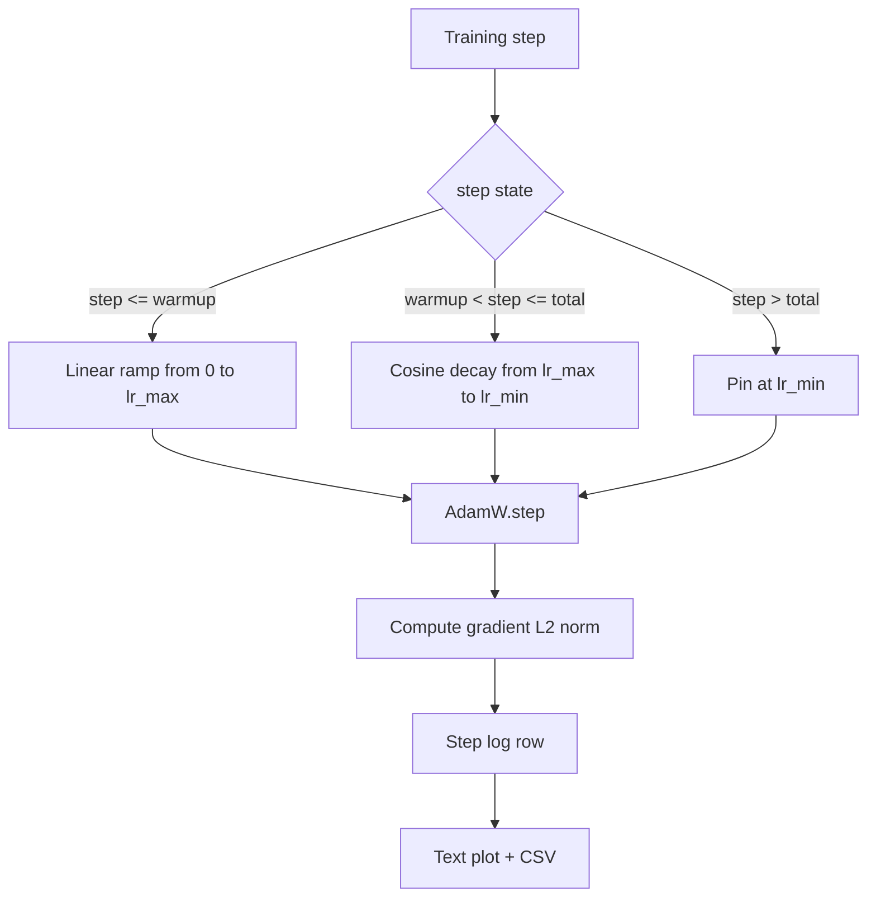

# रैखिक वार्मअप के साथ कॉसीन एलआर

> सीखने की दर का कार्यक्रम हानि फ़ंक्शन के बाद दूसरा सबसे महत्वपूर्ण निर्णय है। कॉसिनस गिरावट और रैखिक वार्मिंग के साथ एडमडब्ल्यू भाषा-मॉडल प्रशिक्षण के लिए आधुनिक डिफ़ॉल्ट है क्योंकि यह मॉडल को नाजुक पहले हजार अपडेट के दौरान एक छोटे प्रभावी चरण आकार को देखने देता है, एक कॉन्फ़िगर किए गए शिखर तक रैंप करता है, और शून्य की ओर सुचारू रूप से गिरावट करता है। यह पाठ उस कार्यक्रम को बनाता है, प्रशिक्षण चरणों पर वक्र का नक्शा बनाता है, कार्यक्रम के बगल में ग्रेडिएंट मानदंडों को लॉग करता है, और यह साबित करता है कि कार्यक्रम वार्मिंग, पीक, और गिरावट सीमाओं का सम्मान करता है।

**Type:** Build
**Languages:** Python
**Prerequisites:** Phase 19 lessons 30-37
**Time:** ~90 minutes

## सीखने के लक्ष्य

- रैखिक वार्मिंग के साथ एक कॉसिन सीखने की दर कार्यक्रम के लिए वायर्ड एक एडमडब्ल्यू अनुकूलक लागू करें।
- किसी भी चरण में रनों के पार फ्लोटिंग-पॉइंट ड्रेफ के बिना कार्यक्रम के सटीक मूल्य की गणना करें।
- लॉग ग्रेडिएंट L2 मानक सीखने की दर के साथ-साथ है इसलिए प्रशिक्षण स्वास्थ्य का अवलोकन किया जा सकता है।
- अनुसूची को एक पाठ अनुभाग में प्रस्तुत करें जिसे आंख पढ़ सकती है और एक सीएसवी जिसे कोई भी उपकरण खा सकता है।

## समस्या

पहले हजार प्रशिक्षण अपडेट सबसे ज्यादा जोरदार हैं। मॉडल के वजन अभी भी आरंभिकरण के करीब हैं। अनुकूलक का चल रहा सेकंड-मॉमेंट अनुमान स्थिर नहीं हुआ है। ग्रेडिएंट मानदंड बड़ा और शोर भरा है। यदि इन अद्यतनों के दौरान सीखने की दर अपने चरम पर है तो मॉडल या तो सीधे विचलित हो जाता है या नुकसान के पठार में बस जाता है, यह कभी नहीं बचता है। दो प्रसिद्ध सुधार ग्रेडिएंट क्लिपिंग हैं, जो चरण 19 पाठ 45 का विषय है, और एक सीखने की दर कार्यक्रम जो छोटा शुरू होता है और रैंप ऊपर जाता है।

कोसिन-से-वेट-अप कार्यक्रम में तीन क्षेत्र हैं।`warmup_steps`सीखने की दर शून्य से कॉन्फ़िगर की गई चोटी तक रैखिक रूप से बढ़ जाती है `lr_max`. कदम से `warmup_steps`कदम `total_steps`सीखने की दर एक कॉसिन वक्र के ऊपरी भाग का अनुसरण करती है, घटती है `lr_max``lr_min`. . उसके बाद`total_steps`सीखने की दर पर अंकित है `lr_min`इसलिए एक गलत कॉन्फ़िगर किए गए ट्रेनर जो ओवरशॉट करता है वह चुपचाप कार्यक्रम से बाहर नहीं निकलता है।

निर्माण समस्या यह है कि समय-सीमाओं को एक से गलत करना आसान है। एक से एक से छह घंटे तक प्रशिक्षण रन में एक सीखने की दर के रूप में दिखाई देता है जो मॉडल ओवरफिटिंग शुरू होने के समय 1 प्रतिशत बहुत अधिक या बहुत कम है, जो अदृश्य है जब तक कि समय-सीमाओं पर पूरी तरह से परीक्षण नहीं किया जाता है।

## अवधारणा



### वार्मअप सूत्र

के लिए`step`में `[0, warmup_steps]`के साथ`warmup_steps > 0`, सीखने की दर है `lr_max * step / warmup_steps`. . . . . . . . . . . . . . . . . . . . . . . . . . . . . . . . . . . . . . . . . . . . . . . . . . . . . . . . . . . . . . . . . . . . . . . . . . . . . . . . . . . . . . . . . . . . . . . . . . . . . . . . . . . . . . . . . . . . . . . . . . . . . . . . . . . . . . . . . . . . . . . . . . . . . . . . . . . . . . . . . . . . . . . . . . . . . . . . . . . . . . . . . . . . . . . . . . . . . . . . . . . . . . . . . . . . . . . . . . . . . . . . . . . . . . . . . . . . . . . . . . . . . . . . . . . . . . . . . . . . . . . . . . . . . . . . . . . . . . . . . . . . . . . . . . . . . . . . . . . . . . . . . . . . . . . . . . . . . . . . . . . . . . . . . . . . . . . . . . . . . . . . . . . . . . . . . . . . . . . . . . . . . . . . . . . . . . . . . . . . . . . . . . . . . . . . . . . . . . . . . . . . . . . . . . . . . . . . . . . . . . . . . . . . . . . . . . . . . . . . . . . . . . . . . . . . . . . . . . . . . . . . . . . . . . . . . . . . . . . . . . . . . . . . . . . . . . . . . . . . . . . . . . . . . .`warmup_steps = 0`मामले को "नहीं वार्मअप" के रूप में माना जाता हैः कार्यक्रम सीधे `lr_max`कुछ परीक्षण हर्नेल पास .`warmup_steps = 0`समय सारिणी की जांच करने के लिए अभी भी एक उपयोगी वक्र उत्पन्न करता है।

### कोसिन सूत्र

के लिए`step`में `(warmup_steps, total_steps]`सीखने की दर `lr_min + 0.5 * (lr_max - lr_min) * (1 + cos(pi * progress))`कहाँ`progress = (step - warmup_steps) / max(1, total_steps - warmup_steps)`.`step = warmup_steps`कोसिन का मूल्यांकन `cos(0) = 1`, जो देता है `lr_max`, गर्म करने के अंत बिंदु से बिल्कुल मेल खाती है।`step = total_steps`कोसिन का मूल्यांकन `cos(pi) = -1`, जो देता है `lr_min`, विघटन के अंत बिंदु से बिल्कुल मेल खाती है।

दोनों अंत बिंदुओं पर निरंतरता कोई दुर्घटना नहीं है। यह कारण है कि कार्यक्रम को एक एकल कार्य के रूप में लागू किया जाता है।`step`एक चिपके हुए कार्यक्रम पहली बार एक सीमा खो देता है`lr_max`बदल गया है।

### कुल चरणों के बाद तल

के लिए`step > total_steps`सीखने की दर `lr_min`. अनुबंध स्पष्ट हैः अनुसूची गलत नहीं होती है और न ही बाहर की ओर जाती है; यह मंजिल पर चिपक जाती है और प्रशिक्षक को चेतावनी दर्ज करने देती है। प्रशिक्षण बढ़ाने के लिए प्रशिक्षकों को अनुसूची में बदलाव करने की आवश्यकता होती है `total_steps`, लूप नहीं.

### दर के साथ ग्रेडिएंट नॉर्म लॉगिंग

प्रशिक्षण चक्र में प्रत्येक चरण के लिए दोनों लॉग होते हैं। एक विचलित प्रशिक्षण रन में नुकसान से पहले ग्रेडिएंट मानदंड की वृद्धि दिखाई देती है; एक अच्छी तरह से समायोजित वार्मिंग दर के साथ रैखिक रूप से मानदंड को बढ़ाती है; एक बहुत आक्रामक शिखर एक मानदंड के रूप में दिखाई देता है जो वार्मिंग के बाद उच्च रहता है। डिस्क पर डेटासेट है`step, lr, grad_l2_norm, loss`सीएसवी एकमात्र स्थायी रिकॉर्ड है।

```figure
cap-cosine-warmup
```

## इसे बनाओ

`code/main.py`कार्य करता हैः

- `CosineWithWarmup`- एक राज्यहीन कार्य `lr(step) -> float`निर्धारित समय सीमा पर।
- `TrainState`- एक मॉडल को लपेटता है, एक `AdamW`अनुकूलक, और एक एकल चरण समारोह में कार्यक्रम.
- `TrainState.step`- एक आगे का पास, एक पीछे का पास, ग्रेडिएंट L2 मानदंड को लॉग करता है, और लागू होता है `lr(step)`अनुकूलक के लिए।
- `plot_schedule_ascii`- अनुसूची को एक पाठ साजिश के रूप में प्रस्तुत करता है जो आंख पढ़ सकती है।
- `write_schedule_csv`- सीखने की दर के साथ प्रत्येक चरण में एक पंक्ति जारी करता है।

फ़ाइल के नीचे एक डेमो एक छोटा सा बनाता है`nn.Linear`मॉडल, एक निश्चित इनपुट बैच पर 20 चरणों के लिए ट्रेनें, और प्रति चरण सीखने की दर, ग्रेडिएंट मानदंड और हानि प्रिंट करता है। कार्यक्रम को दृश्य स्वास्थ्य जांच के लिए एक पाठ ग्राफ के रूप में भी प्रस्तुत किया जाता है।

इसे चलाओः

```bash
python3 code/main.py
```

स्क्रिप्ट शून्य से बाहर निकलता है और प्रति चरण प्रशिक्षण लॉग और कार्यक्रम प्लॉट प्रिंट करता है।

## उत्पादन के पैटर्न

चार पैटर्न कार्यक्रम को उत्पादन कलाकृतियों में ले जाते हैं।

**Schedule lives in a config, not in code.**प्रशिक्षक पढ़ता है `warmup_steps`,`total_steps`,`lr_max`,`lr_min`एक YAML या JSON कॉन्फ़िग से जो git के लिए प्रतिबद्ध है। अनुसूची पुनः प्रस्तुत की जा सकती है क्योंकि कॉन्फ़िग सामग्री-उपदेशित है; अनुसूची ऑडिट योग्य है क्योंकि कॉन्फ़िग PR अंतर का हिस्सा है।

**Step counter is monotonic and decoupled from epochs.**कुछ ढांचे चरण और युग को भ्रमित करते हैं जब डेटासेट को टुकड़ा-टुकड़ा किया जाता है या डेटा लोडर को पुनरारंभ किया जाता है।`global_step`ट्रेनर के चेक-अप बिंदु से, स्थानीय काउंटर से नहीं। एक फिर से शुरू की गई दौड़ सही समय सीमा की स्थिति में जारी है क्योंकि स्टेप काउंटर टिकाऊ अक्ष है।

**Schedule plot in the run directory.**प्रत्येक प्रशिक्षण रन लिखता है`outputs/lr_schedule.png`एक समीक्षक जो निर्देशिका स्किम करता है, वह अनुसूची को फिर से चलाए बिना ठीक से जांच सकता है। यह पीआर समय में बगों के गलत कॉन्फ़िगर किए गए अनुसूची वर्ग को पकड़ता है।

**Log row schema is fixed.** `step, lr, grad_l2_norm, loss`उस क्रम में। एक डाउनस्ट्रीम नोटबुक या डैशबोर्ड स्कीमा पढ़ता है; एक संस्करण को टक्कर दिए बिना एक कॉलम का नाम बदलना सभी मौजूदा डैशबोर्ड को अमान्य करता है।

## इसका प्रयोग करें

उत्पादन के पैटर्नः

- **Sweep peak before sweeping anything else.** `lr_max`सबसे संवेदनशील बटन है। इसे पहले एक छोटे मॉडल पर झाड़ो; इष्टतम `lr_max`मॉडल आकार के साथ कमजोर पैमाने, तो छोटे मॉडल स्वीप एक मजबूत पूर्व है।
- **Warmup is a fraction of total steps, not an absolute count.**एक 200 मिलियन चरणों की दौड़ जिसमें 2,000 वार्मिंग चरण होते हैं, लगभग तुरंत चरम पर शुरू होता है; एक 20,000 चरणों की दौड़ जिसमें एक ही संख्या होती है, 10 प्रतिशत तक गर्म होती है। वार्मिंग को एक अंश के रूप में कॉन्फ़िगर करें (आमतौर परः 1-3 प्रतिशत) ताकि प्रशिक्षण की अवधि के साथ कार्यक्रम का पैमाना।
- **`lr_min` is non-zero on purpose.**एक मंजिल जो 10 प्रतिशत है `lr_max`लंबे समय तक सीखने के दौरान अनुकूलक को सीखता रहता है।`lr_min = 0`कार्यक्रम एक प्रशिक्षण वक्र उत्पन्न करता है जो एक भूखंड पर बहुत अच्छा दिखता है और एक मॉडल जो वास्तव में प्रशिक्षण समाप्त नहीं किया है।

## इसे भेजें

`outputs/skill-cosine-warmup.md`एक वास्तविक परियोजना पर, वर्णन करेगा कि कौन सा कॉन्फ़िगरेशन अनुसूची को ले जाता है, वैश्विक काउंटर किस ट्रेनर चरण से पढ़ा जाता है, और क्या `lr_max`इस सबक इंजन जहाजों।

## व्यायाम

1. अनुसूची में एक उल्टा-वर्ग-रूट संस्करण जोड़ें और इसे 200 चरणों के खेलकूद प्रशिक्षण रन पर तुलना करें। किस वक्र से कम अंतिम नुकसान होता है?
2. एक जोड़ें `--restart`ध्वज जो एक दूसरे वार्मिंग जोड़ता है `total_steps / 2`. खेलौना दौड़ में गर्म रिस्टार्ट में सुधार या चोट का बचाव करें।
3. एक इकाई परीक्षण जोड़ा कि कार्यक्रम निरंतर हैः प्रत्येक चरण के लिए `[0, total_steps]`अंतर`|lr(step+1) - lr(step)|` द्वारा सीमांकित है`lr_max / warmup_steps`. .
4. कार्यक्रम को एक में तार `torch.optim.lr_scheduler.LambdaLR`पाठ एक साधारण चरण समारोह का उपयोग करता है; क्या लपेट बदलता है?
5. एक जोड़ें `--plot-png`ध्वज जो एक वास्तविक साजिश लिखता है via `matplotlib`. यह सुनिश्चित करें कि क्या पाठ का पाठ ग्राफ या PNG सीआई रन के लिए बेहतर डिफ़ॉल्ट है।

## प्रमुख शर्तें

| Term | What people say | What it actually means |
|------|-----------------|------------------------|
| Warmup | "Slow start" | Linear ramp from zero to `lr_max` over the first `warmup_steps` updates |
| Cosine decay | "Smooth drop" | Upper-half cosine curve from `lr_max` to `lr_min` over the remaining steps |
| Floor | "After training" | The fixed `lr_min` value the schedule pins at past `total_steps` |
| Gradient norm | "L2 of grads" | The Euclidean norm of the concatenated gradient vector, logged each step |
| Global step | "Schedule axis" | A monotonic step counter that survives restarts and drives the schedule |

## आगे पढ़ना

- [Loshchilov and Hutter, SGDR: Stochastic Gradient Descent with Warm Restarts (arXiv 1608.03983)](https://arxiv.org/abs/1608.03983)- कोसिन शेड्यूल का संदर्भ कागज
- [Loshchilov and Hutter, Decoupled Weight Decay Regularization (arXiv 1711.05101)](https://arxiv.org/abs/1711.05101)- एडमडब्ल्यू का संदर्भ पत्र
- [PyTorch torch.optim.lr_scheduler](https://docs.pytorch.org/docs/stable/optim.html#how-to-adjust-learning-rate)- चरण कार्य कैसे फ्रेमवर्क शेड्यूलर के साथ गठित होते हैं
- चरण 19 · 42 - डाउनलोड करने वाला जिसका कॉर्पस इस अनुसूची में खपत
- चरण 19 · 43 - डेटा लोडर के साथ शेड्यूल सह-विकास
- चरण 19 · 45 - ग्रेडिएंट क्लिपिंग और एएमपी, लूप में अगली परत
