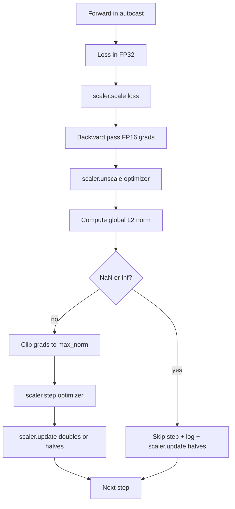

# ग्रेडिएंट कटिंग और मिश्रित सटीकता

> पिछले पाठ से अनुकूलक और कार्यक्रम मान gradients स्वस्थ हैं। वे आमतौर पर नहीं होते हैं। एक ही खराब बैच ग्रेडिएंट मानदंड को तीन आदेशों की मात्रा से बढ़ा सकता है। मिश्रित परिशुद्धता प्रशिक्षण नुकसान पक्ष पर FP16 ओवरफ्लो को लागू करके इसे बढ़ाता है। यह सबक दो सुरक्षा बेल्ट बनाता है कि उत्पादन प्रशिक्षण के बिना जहाज नहीं कर सकतेः एक कॉन्फ़िगर वैश्विक L2 मानक के लिए ग्रेडिएंट क्लिपिंग, और ऑटोकास्ट और GradScaler के साथ मिश्रित परिशुद्धता लूप जो NaN और Inf का पता लगाता है, कदम को साफ छोड़ता है, और फोरेंसिक के लिए स्केलिंग कारक को लॉग करता है।

**Type:** Build
**Languages:** Python
**Prerequisites:** Phase 19 lessons 30-37
**Time:** ~90 minutes

## सीखने के लक्ष्य

- सभी पैरामीटर ग्रेडिएंट और क्लिप पर वैश्विक L2 मानदंड की गणना करें जब यह एक कॉन्फ़िगर किए गए सीमा से अधिक हो।
- ऑटो कास्ट में एक प्रशिक्षण कदम को रैप करें प्लस एक ग्रेडस्केलर ताकि एफपी 16 आगे और पीछे के पास ओवरफ्लो से बचें।
- हानि या ग्रेडिएंट में NaN और Inf का पता लगाएं, अनुकूलक चरण छोड़ें, और स्प्रिप लॉग करें।
- GradScaler के स्केलिंग कारक की रिपोर्ट हर कदम ताकि एक लंबी सीक्वेंस की छलांग तुरंत दिखाई दे।

## समस्या

कल एक प्रशिक्षण रन जो साफ चला गया एक हानि वक्र पैदा करता है जो ऊर्ध्वाधर कदम 8,217 पर चला जाता है। अपराधी एक एकल बैच है जिसका ग्रेडिएंट मानदंड 4,200 है, जो पिछले शिखर से बीस गुना है। बिना कटौती के अनुकूलक एक कदम लागू करता है जो मॉडल पिछले घंटे में किया गया हर सीखने को रीसेट करता है। मानक 1.0 पर वैश्विक L2 क्लिप के साथ, एक ही बैच इकाई-मानक अद्यतन में योगदान देता है; हानि अपनी प्रवृत्ति रेखा पर बनी रहती है; दौड़ जीवित रहती है।

मिश्रित परिशुद्धता प्रशिक्षण एफपी 16 में आगे के पास और पीछे के पास के अधिकांश की गणना करके आउटपुट को 2-3 गुना बढ़ाता है। लागत यह है कि FP16 में संकीर्ण एक्सपोनेंट रेंज है। FP16 में ओवरफ्लो होने वाला एक विशिष्ट ग्रेडिएंट Inf के रूप में मूल्यांकन करता है, जो बाद की परतों के माध्यम से NaN के रूप में फैलता है, जो अगले अनुकूलक चरण में प्रत्येक भार को NaN पर सेट करता है। पायटॉर्च का ग्रेडस्केलर इसे पीछे की ओर जाने से पहले एक बड़े स्केलिंग कारक से नुकसान को गुणा करके और अनुकूलक चरण से पहले समान कारक से ग्रेडिएंट को विभाजित करके हल करता है। यदि किसी भी ग्रेडिएंट को अनस्केल समय में Inf या NaN है, तो स्केलर कदम को छोड़ देता है और स्केलिंग कारक को आधा कर देता है; यदि पिछले N चरण साफ थे, तो स्केलर कारक को दोगुना करता है। प्रशिक्षण के दौरान कारक FP16 श्रेणी द्वारा अनुमति देने वाले उच्चतम मूल्य को पाता है।

निर्माण समस्या दोनों को सही ढंग से वायरिंग है। स्केल से पहले क्लिप और सीमा स्केल ग्रेडिएंट पर है; स्केल के बाद क्लिप और ग्रेडस्केलर पर संचालन के क्रम पर मायने रखता है। सही क्रम हैः `scaler.scale(loss).backward()`, तो `scaler.unscale_(optimizer)`, तो `clip_grad_norm_`, तो `scaler.step(optimizer)`, तो `scaler.update()`. किसी भी अन्य आदेश एक चुपचाप टूट लूप पैदा करता है.

## अवधारणा



### वैश्विक L2 मानक

वैश्विक L2 मानदंड एक संश्लेषित ग्रेडिएंट वेक्टर का यूक्लिडियन मानदंड है, प्रति पैरामीटर मानदंड नहीं। PyTorch इसे इस तरह लागू करता है `torch.nn.utils.clip_grad_norm_(parameters, max_norm)`. फ़ंक्शन प्री-क्लिप मानदंड को लौटाता है ताकि पाठ प्राकृतिक और कटौती मूल्य दोनों को रिकॉर्ड कर सके, जो "हम हर कदम पर कटौती कर रहे हैं" निदान के लिए आवश्यक है।

### ऑटोकास्ट और ग्रेडस्केलर

`torch.amp.autocast(device_type)`वह संदर्भ प्रबंधक है जो प्राथमिक वित्त वर्ष 16 में चुनिंदा रूप से पात्र संचालन (अधिकतर मत्मूल-वर्ग के संचालन) चलाता है। `torch.amp.GradScaler(device_type)`एक सहायक है जो पीछे की ओर और उल्टा-स्केल के नुकसान के लिए अनुकूलन चरण से पहले gradients. दोनों एक साथ डिजाइन कर रहे हैं; एक के बिना दूसरे का उपयोग एक विन्यास त्रुटि है परीक्षण को पकड़ना चाहिए।

पाठ सीपीयू ऑटोकास्ट का उपयोग करता है क्योंकि यह है कि क्या CI में चलाता है; एक ही पैटर्न CUDA में शाब्दिक स्थानांतरित करता है बदलकर `device_type="cpu"``device_type="cuda"`. सीपीयू पर ग्रेडस्केलर एक स्टब है (सीपीयू ऑटोकास्ट पहले से ही डिफ़ॉल्ट रूप से बीएफ 16 में काम करता है और नुकसान स्केलिंग की आवश्यकता नहीं है), लेकिन पाठ में कॉल साइट्स शामिल हैं इसलिए वायरिंग जीपीयू लूप के समान है।

### एनएएन और इन्फ का पता लगाना

पहले, हानि स्वयं के साथ जाँच की जाती है`torch.isfinite`एक Inf या NaN हानि उपयोगी ग्रेडिएंट नहीं पैदा करता है और अनुकूलक में प्रवेश किए बिना छोड़ दिया जाता है।`scaler.unscale_(optimizer)`पाठ स्कैन करता है के साथ unscaled gradients`has_non_finite_grad(...)`दोनों चेक एक साथ आगे-पास और पीछे-पास विफलता मोड दोनों को कवर करते हैं।

### स्केलिंग कारक निदान

स्केलिंग कारक GradScaler की आंतरिक स्थिति है. हर कदम सबक पढ़ता है`scaler.get_scale()`एक स्वस्थ रन स्केलिंग कारक को दो की शक्तियों में चढ़ते हुए दिखाता है जब तक कि यह निकटता से संतृप्त नहीं होता है`2^17`या `2^18`. एक गलत चाल उच्च और निम्न मानों के बीच चरित्राण कारक को दर्शाता है, जो संकेत है कि मॉडल के ग्रेडिएंट कभी-कभी रेंज में होते हैं और कभी-कभी नहीं।

```figure
grad-clip-monitor
```

## इसे बनाओ

`code/main.py`कार्य करता हैः

- `clip_global_l2_norm`- एक लिफाफा चारों ओर `torch.nn.utils.clip_grad_norm_`जो क्लिप से पहले और क्लिप के बाद दोनों मानकों को वापस करता है।
- `has_non_finite_grad`- एक सहायक जो NaN और Inf के लिए gradients स्कैन करता है।
- `AmpTrainState`- एक मॉडल को लपेटता है, एक `AdamW`अनुकूलक, एक GradScaler, और एक ऑटोकास्ट डिवाइस।`step(inputs, targets)`जो पूरी क्लिपिंग, स्केलिंग, और skip-on-NaN पाइपलाइन चलाता है।
- `StepLog`और `SkipLog`- प्रत्येक चरण के लिए संरचित रिकॉर्ड।
- एक डेमो जो एक छोटे से प्रशिक्षित करता है`nn.Linear`20 चरणों के लिए मॉडल, स्किप पथ का अभ्यास करने के लिए चरण 5 पर ग्रेडिएंट में एक इन्फ इंजेक्शन, और परिणाम लॉग प्रिंट करता है।

इसे चलाओः

```bash
python3 code/main.py
```

स्क्रिप्ट शून्य से बाहर निकलता है और प्रत्येक पंक्ति के साथ टैग किया गया एक प्रति चरण लॉग प्रिंट करता है `STEP`या `SKIP`; कम से कम एक पंक्ति एक है `SKIP`. .

## उत्पादन के पैटर्न

चार पैटर्न लूप को उत्पादन प्रशिक्षण चरण तक ले जाते हैं।

**Skip counter as an alert, not a log line.**प्रशिक्षण रन में कुछ कदम छोड़ने से स्वस्थ है। प्रति युग सैकड़ों कूदने एक कठिन चेतावनी हैंः मॉडल एक FP16 शासन में है जो पकड़ नहीं सकता है और लूप चुपचाप विफल हो रहा है। पाठ 1,000 कदम की रलिंग कूद दर को ट्रैक करता है और उत्पादन में 5 प्रतिशत से अधिक की दर पर पृष्ठ होगा।

**Clip threshold lives in the config.** `max_norm = 1.0`भाषा मॉडल प्रशिक्षण के लिए आधुनिक डिफ़ॉल्ट है। इसे पहले एक छोटे मॉडल पर स्वीप करें; बड़े सीमाएं मॉडल को वास्तव में कठिन बैचों से ठीक होने देती हैं; छोटे सीमाएं एक शोरदार हानि वक्र की कीमत पर सबसे खराब मामले को सीमांकित करती हैं। सीमाएं उसी YAML या JSON कॉन्फ़िगरेशन में शामिल हैं जो पाठ 44 से अनुसूची से है।

**Norm log goes to a CSV with the schedule.**सीएसवी स्तंभों में `step, lr, grad_l2_pre_clip, grad_l2_post_clip, loss, skipped, skip_reason, scaler_scale`. एक समीक्षक जो फ़ाइल खोलता है वह एक पंक्ति में शेड्यूल, ग्रेडिएंट कहानी, स्केलिंग कारक और स्पाप परिणाम (इसकी वजह के साथ) देखता है। फ़ाइलों में कॉलम को विभाजित करना गलत संरेखित विश्लेषणों के लिए एक नुस्खा है।

**`scaler.update()` runs every step, even on skip.**एक साफ कदम पर स्केलर अपने नो-इंफ काउंटर को पढ़ता है, इसे बढ़ाता है, और संभवतः कारक को दोगुना करता है। एक स्कीपर कदम पर स्केलर कारक को आधा करता है और काउंटर को रीसेट करता है। भूलना `update()`स्किप पथ पर बग है जो "स्केलिंग कारक कभी नहीं बदला" पैदा करता है।

## इसका प्रयोग करें

उत्पादन के पैटर्नः

- **Autocast device matches optimizer device.** `torch.amp.autocast(device_type="cuda")`GPU प्रशिक्षण के लिए; `torch.amp.autocast(device_type="cpu")`मिक्सिंग डिवाइस एक मौन प्रकार त्रुटि उत्पन्न करता है जो एक हानि वक्र के रूप में दिखाई देता है जो ठीक दिखता है लेकिन एक मॉडल है जो नहीं सीख रहा है।
- **Loss check before backward.** `torch.isfinite(loss).all()`एक टेंसर घटाने के लिए, लागत नगण्य है और एक NaN हानि पर बचत एक प्रशिक्षण कदम है। हमेशा इसे चलाओ।
- **`set_to_none=True` in `zero_grad`.** पर gradients सेट करता है`None`शून्य के बजाय, जो अनुकूलक को प्रभावित पैरामीटर समूहों के लिए गणना छोड़ने की अनुमति देता है। सेटिंग एक मुक्त आउटपुट सुधार और एक मामूली बग-सतह में कमी है।

## इसे भेजें

`outputs/skill-clip-amp.md`एक वास्तविक परियोजना पर, वर्णन करेंगे कि प्रशिक्षण चरण में किस क्लिप सीमा और ऑटोकास्ट डिवाइस का उपयोग किया जाता है, जहां प्रति चरण सीएसवी संस्करण नियंत्रण में रहता है, और उत्पादन स्किप-रेट अलर्ट सीमा क्या है। यह सबक इंजन जहाज।

## व्यायाम

1. सिंथेटिक इंजेक्शन को वास्तविक हानि स्पाइक (एक बैच के लक्ष्य को 1e8 से गुणा करें) से बदलें और स्पाप पथ ट्रिगर की जांच करें।
2. एक जोड़ें `--bf16`मोड जो FP16 के बजाय ऑटोकास्ट को BF16 पर स्विच करता है। BF16 में FP16 की तुलना में अधिक एक्सपोनेंट रेंज होती है और शायद ही कभी नुकसान स्केलिंग की आवश्यकता होती है; उसी डेमो पर स्पिप दर शून्य तक गिरती है।
3. एक इकाई परीक्षण जोड़ें कि ग्रेडिएंट-क्लिप रैपर क्लिप से पहले और क्लिप के बाद के मानदंड को सही ढंग से लौटाता है जब कोई क्लिपिंग नहीं होती है।
4. रोलिंग विंडो स्किप रेट गणना और एक CLI फ्लैग जो रन में विफल रहता है यदि रेट 100 लगातार चरणों के लिए एक कॉन्फ़िगर किए गए सीमा से अधिक है।
5. कैनोनिक CSV लिखने के लिए लूप तार (`step, lr, grad_l2_pre_clip, grad_l2_post_clip, loss, skipped, skip_reason, scaler_scale`) और पुष्टि फ़ाइल एक Ctrl-C से बचता है प्रत्येक पंक्ति के बाद फ्लश करके।

## प्रमुख शर्तें

| Term | What people say | What it actually means |
|------|-----------------|------------------------|
| Global L2 norm | "Clip target" | Euclidean norm of the concatenated gradient vector across all trainable parameters |
| autocast | "Mixed precision" | Selective FP16 (or BF16) execution of eligible operations inside a `with` block |
| GradScaler | "Loss scaler" | Helper that multiplies the loss before backward and inverse-scales gradients before the optimizer step |
| Skip | "Bad step" | An optimizer step refused because the gradient or loss was non-finite; the scaler halves the factor |
| Scaling factor | "Scaler state" | The GradScaler's current multiplier; doubles after clean stretches and halves on every skip |

## आगे पढ़ना

- [Micikevicius et al., Mixed Precision Training (arXiv 1710.03740)](https://arxiv.org/abs/1710.03740)- नुकसान के पैमाने पर मूल प्रस्ताव
- [Pascanu, Mikolov, Bengio, On the difficulty of training recurrent neural networks (arXiv 1211.5063)](https://arxiv.org/abs/1211.5063)- ग्रेडिएंट-कटिंग संदर्भ कागज
- [PyTorch torch.amp.GradScaler](https://docs.pytorch.org/docs/stable/amp.html)- स्केलर एपीआई इस पाठ को समाहित करता है
- [PyTorch torch.nn.utils.clip_grad_norm_](https://docs.pytorch.org/docs/stable/generated/torch.nn.utils.clip_grad_norm_.html)- इस पाठ में उपयोग की जाने वाली आदिम क्लिपिंग
- चरण 19 · 42 - डाउनलोडर जिसका कॉर्पस लूप को खिलाता है
- चरण 19 · 43 - डेटा लोडर लूप खपत
- चरण 19 · 44 - इस लूप के साथ गठित अनुसूची
