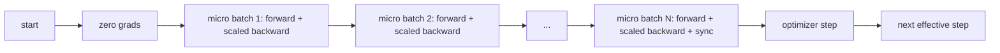
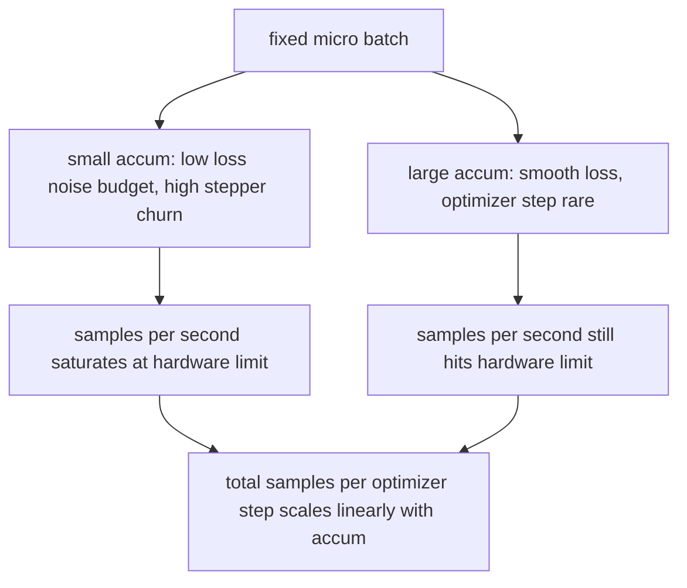

# क्रमिक जमा

> एक बार में एक सूक्ष्म बैच के साथ एक प्रभावी बैच पर प्रशिक्षित करें, नुकसान को मापें, अनुकूलक चरण को पकड़ें, और gradients को ढेर होने दें।

**Type:** Build
**Languages:** Python
**Prerequisites:** Phase 19 lessons 42 to 45
**Time:** ~90 minutes

## सीखने के लक्ष्य

- प्रभावी बैच पहचान प्राप्त करें: `effective_batch = micro_batch * accum_steps`. .
- प्रति सूक्ष्म बैच हानि स्केलिंग को लागू करें ताकि जमा हुआ ग्रेडिएंट एक पूर्ण बैच के पीछे से मेल खाए।
- अंतिम माइक्रो-बैच (सिंक-ऑन-आखिरी-चरण) तक ऑप्टिमाइज़र सिंक्रनाइज़ेशन को छोड़ दें।
- प्रभावी बैच वक्र के खिलाफ एक आउटपुट पढ़ें और घटती वापसी की व्याख्या करें।

## समस्या

आप 512 के प्रभावी बैच पर प्रशिक्षण करना चाहते हैं क्योंकि हानि वक्र अधिक चिकनी है और अनुकूलक कदम उस पैमाने पर अधिक समझ में आता है। मेज पर त्वरक 32 उदाहरणों को रखता है इससे पहले कि स्मृति समाप्त हो जाए। बैच को दोगुना करना कोई विकल्प नहीं है। मॉडल को आधा करना कोई विकल्प नहीं है। 2017 में क्षेत्र का ट्रिक जो कभी भी उपयोग करना बंद नहीं किया गया था वह है 16 पीछे की ओर जाने, पैरामीटर बफर के अंदर ग्रेडिएंट को जमा करने दें, और केवल ऑप्टिमाइज़र को तब ही कदम रखें जब गिनती लक्ष्य तक पहुंच जाती है।

जोखिम यह है कि नुकसान अब वही संख्या नहीं है जो बड़े बैच में था। 16 मिनी बैचों की क्रॉस एंट्रॉपी को नकली रूप से योगित किया गया है जो एक पूर्ण बैच के नुकसान का 16 गुना है। स्केलिंग के बिना, ग्रेडिएंट दिशा सही है लेकिन परिमाण गलत है, और अनुकूलक चरण 16 गुना बड़ा है। फिक्स एक विभाजन है। फिक्स को भूलना भी आसान है।

## अवधारणा



अनुबंध छोटा हैः

- प्रत्येक सूक्ष्म बैच के लिए हानि को विभाजित किया जाता है `accum_steps`पहले`backward()`. पाइटोरच ग्रेडिएंट्स को योग करता है`param.grad`डिफ़ॉल्ट रूप से; विभाजन चल रहे राशि को सही पैमाने में वापस धकेलता है।
- अंतिम सूक्ष्म बैच के पीछे के बाद, अनुकूलक चरण एक बार प्रभावी बैच के लिए फायर करता है। मध्य-संचयित चरण हर पैरामीटर पर निर्भर करता है।
- ऑप्टिमाइज़र की स्थिति (मोमेंटम बफर, एडम मोंट) प्रभावी चरण के अनुसार एक बार आगे बढ़ती है, न कि माइक्रो-बैच के अनुसार एक बार। घातीय चलती औसत अन्यथा गलत आवृत्ति देखती है और समय सारिणी के माध्यम से जलती है।
- एक ही डिवाइस पर यह लेखांकन है। एक बहु-रैंक क्लस्टर पर एक ही पैटर्न गैर-अंतिम माइक्रो-बैच को एक में लपेटता है।`no_sync`संदर्भ जो ग्रेडिएंट को छोड़ता है सभी-कम; अंतिम सूक्ष्म-बैच नेटवर्क लागत N गुना का भुगतान करने के बजाय एक पास में पूर्ण जमा ग्रेडिएंट को कम करता है।

### कोड में समकक्षता प्रमाण

```python
loss = criterion(model(x_full), y_full)
loss.backward()
opt.step()
```

बराबर है

```python
for x, y in chunks(x_full, y_full, n):
    scaled = criterion(model(x), y) / n
    scaled.backward()
opt.step()
```

लूप के अंत में जमा ग्रेडिएंट बफर वही टेंसर है जो एक एकल पूर्ण बैच पीछे की ओर उत्पन्न करेगा। पाठ कोड 1e-4 में अधिकतम-abs अंतर के साथ इस बात की पुष्टि करता है`equivalence_check`. .

### जहां लागत जाती है

प्रत्येक माइक्रो बैच की लागत एक आगे और एक पीछे की ओर है. संचय के साथ आप समय के लिए स्मृति का आदान-प्रदान करते हैं.`outputs/accum-curve.json`यह दिखाता है कि फिक्स्ड माइक्रो-बैच पर प्रभावी बैच बढ़ने के साथ क्या होता हैः



कोई मुफ्त दोपहर का भोजन नहीं है।`accum_steps`अनुकूलक चरण प्रति दीवार समय दोगुना करता है। जो परिवर्तन है ग्रेडिएंट अनुमान की भिन्नता हैः एक ही दीवार बजट पर आपने अनुकूलक चरणों से कम किया है लेकिन प्रत्येक को अधिक नमूनों पर औसत बनाया गया था। साहित्य बड़े बैच और छोटे बैच को विभिन्न अनुकूलन समस्याओं के रूप में व्यवहार करता है; यहाँ सबक यांत्रिक है, सांख्यिकीय नहीं।

```figure
cc-grad-accumulation
```

## इसे बनाओ

`code/main.py`यह तीन चीजें करता है।

### चरण 1: समकक्षता जांच

`equivalence_check()`एक ही बीज के साथ एक ही नेटवर्क की दो प्रतियां बनाता है। एक आगे के एक पास में 16 नमूना बैच देखता है। दूसरा चार 4 नमूना टुकड़े देखता है जिसमें नुकसान चार से विभाजित होता है। फ़ंक्शन अनुकूलक चरण से पहले ग्रेडिएंट बफर और बाद के मापदंडों की तुलना करता है। दावा है`max_abs_diff < 1e-4`. .

### चरण 2: अंतिम चरण पर समक्रमण पैटर्न

`train_one_optimizer_step`प्रत्येक सूक्ष्म बैच के लिए, अंतिम के अलावा जो प्रवेश करता है`no_sync_context(model)`. एक प्रक्रिया पर संदर्भ नो-ऑप है; डीडीपी पर यह वह जगह है जहां ग्रेडिएंट ऑल-रिड्यूस को छोड़ दिया जाता है। लेखांकन एक ही है।`sync_counter`रिकॉर्ड करता है कि कितनी बार हमने no_sync दायरा छोड़ दिया; N माइक्रो-बैच के लिए गणना प्रभावी चरण प्रति एक है, न कि N।

### चरण 3: आउटपुट वक्र

`sweep_effective_batches`एक निश्चित माइक्रो-बैच और संचय चरणों की सूची के साथ एक ही मॉडल चलाता है। प्रत्येक सेटिंग के लिए यह लॉग करता हैः

- `samples_per_sec`: कुल नमूने दीवार समय द्वारा विभाजित देखा
- `median_step_ms`: 50वें प्रतिशत प्रति प्रभावी चरण
- `sync_calls`: सामूहिक अंक
- `avg_loss`: स्वीप के अनुकूलक चरणों के माध्यम से औसत

उत्पादन में उतरता है `outputs/accum-curve.json`और एक नोटबुक से पुनः उपयोग किया जा सकता है।

इसे चलाओः

```bash
python3 code/main.py
```

स्क्रिप्ट समकक्षता अंतर, फिर साफ़ तालिका, फिर JSON पथ प्रिंट करता है.

## इसका प्रयोग करें

उत्पादन प्रशिक्षण में, ग्रेडिएंट जमा एक बटन के पीछे रहता है। PyTorch के पैटर्न है `accumulation_steps = effective_batch // (micro_batch * world_size)`. फ्रेमवर्क जो आपको यहां उपयोग करने की अनुमति नहीं है वे एक ही लूप को लपेटते हैं, लेकिन चरण एक ही हैंः नुकसान को स्केल करें, गैर-अंतिम माइक्रो पर सिंक्रनाइज़ करना छोड़ दें, जमा करें, एक कदम।

जंगली में तीन पैटर्नः

- माइक्रो बैच आकार डिवाइस की मेमोरी संतृप्त करने के लिए चुना जाता है. कुछ भी छोटे त्वरक चक्र बर्बाद करता है. कुछ भी बड़ा दुर्घटनाग्रस्त हो जाता है.
- प्रभावी बैच को सीखने की दर के कार्यक्रम से चुना जाता है। बड़े प्रभावी बैचों को स्केल किए गए सीखने की दर और वार्मिंग की आवश्यकता होती है; यह 2017 से बात की गई रैखिक स्केलिंग नियम है।
- संचय संख्या दो और एकमात्र बटन के बीच पुल है जिसे आप डेटा लोडर को फिर से लिखने के बिना रनटाइम पर समायोजित करने के लिए स्वतंत्र हैं।

## इसे भेजें

`outputs/skill-gradient-accumulation.md`रेसिपी को कैप्चर करता है ताकि एक साथी इसे एक नए रेपो में छोड़ सकता हैः पैमाने की हानि द्वारा `accum_steps`, गैर-अंतिम माइक्रो पर अनुकूलक सिंक्रनाइज़ेशन छोड़, प्रभावी बैच के लिए एक बार अनुकूलक कदम, JSON के रूप में प्रभावी बैच के खिलाफ लॉग आउटपुट ताकि व्यापार दिखाई दे।

## व्यायाम

1.  के साथ फिर से जाली चलाएँ`--num-steps 100`और प्रभावी बैच के खिलाफ प्रति सेकंड ग्राफ नमूने। वक्र कहाँ समतल है?
2. एक गलत स्केलिंग वेरिएंट (कोई विभाजन नहीं) जोड़ें और संदर्भ के खिलाफ चरण 1 में पैरामीटर डिफर दिखाएं।
3. एसजीडी को एडमडब्ल्यू के लिए बदलें और अनुकूलक राज्य प्रगति को एक बार प्रति प्रभावी चरण, एक बार प्रति सूक्ष्म बैच नहीं की पुष्टि करें।
4. एक वास्तविक परिचय `DistributedDataParallel``no_sync_context`इसकी विधि के लिए पुष्टि करें sync_calls प्रति प्रभावी बैच N-1 से गिरता है।
5. दो अलग-अलग माइक्रो स्प्लिट (2 x 8 vs 4 x 4) की तुलना करने के लिए समकक्षता जांच को संशोधित करें और आराम करने के लिए आपको जो भी सहिष्णुता की आवश्यकता है उसे समझाएं।

## प्रमुख शर्तें

| Term | What people say | What it actually means |
|------|-----------------|------------------------|
| Micro batch | The batch you forward | The slice that fits in memory in a single forward pass |
| Accum steps | Backward passes per step | Number of backwards summed before one optimizer step |
| Effective batch | The batch | Micro batch times accum steps times data parallel world size |
| Loss scaling | Divide by N | Per-micro-batch division so summed gradients match full batch |
| Sync on last | Skip the rest | Only run the gradient collective on the last backward in the window |

## आगे पढ़ना

- पीटॉर्च डॉक्स पर `DistributedDataParallel.no_sync`अंतिम चरण पर सिंक्रनाइज़ेशन ट्रिक के उत्पादन संस्करण के लिए।
- गोयल एट अल, 2017, बड़े बैच प्रशिक्षण के लिए रैखिक स्केलिंग पर, प्रभावी बैच के बारे में चिंता करने का एक वैध कारण।
- मिश्रित परिशुद्धता अनस्केलिंग के साथ ग्रेडिएंट जमाव के इंटरैक्शन पर पायटॉर्च समस्या ट्रैकर।
- चरण 19 पाठ 42 से 45 तक मॉडल, डेटा लोडर, ऑप्टिमाइज़र और प्रशिक्षक के ढांचे को कवर करते हैं।
- चरण 19 पाठ 47 चेकपॉइंट और फिर से शुरू करता है ताकि एक लंबे संचय रन वॉलक्लॉक कैप से बच सके।
