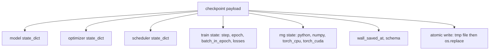
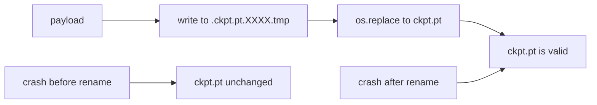
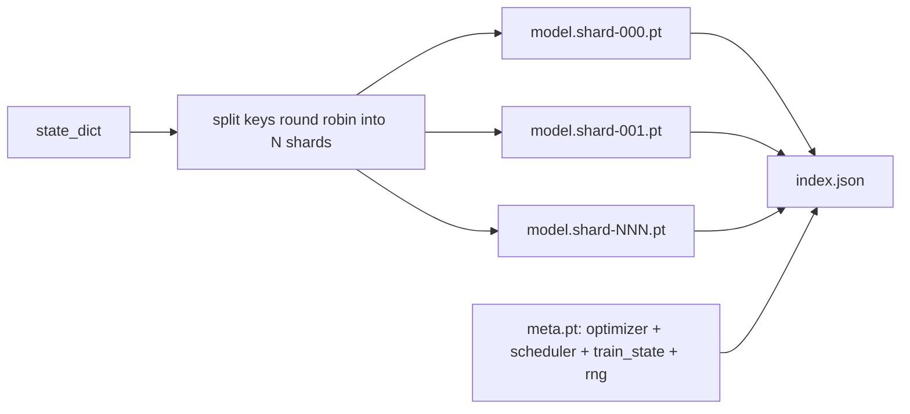

# चेकपॉइंट सहेजें और फिर से शुरू करें

> ट्रेन को काटकर मारें; चेकपॉइंट उन्हें जारी रखने दें। मॉडल, ऑप्टिमाइज़र, शेड्यूलर, लॉस हिस्ट्री, स्टेप काउंटर और आरएनजी स्टेट को परमाणु रूप से सहेजें, इसलिए किसी भी समय मारने से डिस्क पर एक वैध फ़ाइल छोड़ जाती है।

**Type:** Build
**Languages:** Python
**Prerequisites:** Phase 19 lessons 42 to 45
**Time:** ~90 minutes

## सीखने के लक्ष्य

- एक एकल उपयोगिता लोड में पूर्ण प्रशिक्षण स्थिति को पकड़ो जिसे एक नई प्रक्रिया में पुनः लोड किया जा सकता है।
- अणु सहेजें के साथ लागू करें लिख-से-टेम्प फिर नाम बदलने के लिए ताकि एक दुर्घटना कभी भी आधा-लेखन फ़ाइल छोड़ नहीं है।
- पायथन, NumPy, और PyTorch के लिए RNG राज्य को बहाल करें ताकि पुनरावृत्ति के बाद हानि निर्बाध मूल रेखा से मेल खाए।
- एक ही फ़ाइल में फिट नहीं होने वाले मॉडल के लिए एक टुकड़े टुकड़े चेकपॉइंट लेआउट बनाएं, हैश-सत्यापित टुकड़े और एक JSON सूचकांक के साथ।

## समस्या

आपने 18 घंटे के लिए प्रशिक्षण की नौकरी निर्धारित की। दीवार घड़ी कैप 4 घंटे है। क्लस्टर 11 बजे फिर से शुरू होता है क्योंकि आपके वेतन से ऊपर के किसी ने कर्नेल अपग्रेड को मंजूरी दी है। बिना चेकपोस्ट के आप फिर से शुरू करते हैं। बिना फिर से शुरू आप भी अनुकूलन स्थिति खो देते हैं जो सीखने के लिए पहले 11 घंटे लग गए, इसलिए भले ही मॉडल वजन जीवित रहे, एडमडब्ल्यू क्षण चले गए हैं और अगले कदम एक दिशा में लटकता है प्रशिक्षण ट्रैक पहले से ही आगे बढ़ गया था।

सही कलाकृतियाँ एक एकल फ़ाइल है जो जारी रखने के लिए आवश्यक सब कुछ रखता हैः मॉडल मापदंड, अनुकूलक राज्य, अनुसूचक राज्य, प्लॉट के लिए हानि इतिहास, वर्तमान चरण और युग और बैच-इन-एपोक काउंटर, और यादृच्छिकता के प्रत्येक स्रोत के लिए आरएनजी राज्य। आरएनजी राज्य के बिना पुनः आरएनजी खोने की अवस्था एक अलग अवस्था है। एक ही मॉडल, एक ही डेटा, अलग-अलग मिक्स, अलग-अलग ड्रॉपआउट मास्क, डैशबोर्ड पर अलग-अलग नंबर।

परमाणु सहेजने का मतलब है अनुबंध का दूसरा आधा। अंतिम फ़ाइल नाम में लिखना का मतलब है कि क्रैश मिड-रॉइटिंग एक भ्रष्ट फ़ाइल छोड़ देता है; रिज्यूमे कचरा पढ़ता है। उसी निर्देशिका में एक अस्थायी फ़ाइल में लिखना और फिर नामकरण का मतलब है कि क्रैश मिड-रॉइटिंग पिछली अच्छी फ़ाइल को छूए बिना छोड़ देता है। नामकरण POSIX फ़ाइल सिस्टम पर परमाणु है।

## अवधारणा



### पांच राज्य बाल्टी

| Bucket | Why it matters |
|--------|----------------|
| Model | Weights and buffers; what the model is. |
| Optimizer | Momentum and adaptive moments; without these the next step is a different optimization problem. |
| Scheduler | Where the learning rate is on its curve; cosine schedules in particular care. |
| Train counters | Step, epoch, batch-in-epoch, plus the loss history that draws the dashboard. |
| RNG state | Determinism for dropout, data shuffling, and any sampling inside the model. |

### परमाणु बचत



दो नियम. पहला, अस्थायी फ़ाइल लक्ष्य के समान निर्देशिका में रहती है इसलिए नाम परिवर्तन उसी फ़ाइल प्रणाली के भीतर रहता है; क्रॉस-डिवाइस नाम परिवर्तन परमाणु नहीं हैं। दूसरा, अस्थायी नाम प्रत्येक प्रयास के लिए अद्वितीय है ताकि दो लेखक नहीं टक्कर।

### टुकड़े टुकड़े किए गए चेकपोस्ट

जब मॉडल बड़ा हो जाता है तो एकल-फ़ाइल का उपयोग करने का भार तेजी से लोड करने के लिए बहुत बड़ा हो जाता है, निरीक्षण करने के लिए बहुत बड़ा हो जाता है, और जब नेटवर्क मध्य-पढ़ने में हिचकी साझा करता है तो बहुत दर्दनाक हो जाता है। फिक्स पैरामीटर राज्य को टुकड़ों में विभाजित करना है और एक छोटा सूचकांक लिखना है जो उन्हें एक साथ जोड़ता है।



सूचकांक टुकड़े की संख्या, प्रत्येक टुकड़े का sha256 और मेटा फ़ाइल का sha256 रिकॉर्ड करता है। किसी भी हैश असंगत होने पर लोडर जोर से विफल रहता है। टुकड़े विभिन्न भौतिक डिस्क पर उतर सकते हैं; मेटा छोटा है और पहले पढ़ता है।

### जीवनशैली मध्य युग में जारी है

एक रिज्यूमे जो अगले युग की शुरुआत में एक मिनट से एक दिन तक कचरे को समाप्त करता है।`(epoch, batch_in_epoch)`लोड के बाद, प्रशिक्षण लूप वर्तमान युग में पहले से ही खपत बैचों के बाद यादृच्छिक संख्या जनरेटर तेजी से आगे बढ़ता है और जारी रहता है`batch_in_epoch`. पाठ कोड यह ठीक करता है; यह दावा है कि फिर से शुरू करने के बाद हानि की प्रक्षेपवक्र 1e-4 के भीतर निर्बाध आधार रेखा से मेल खाती है।

```figure
cc-atomic-checkpoint
```

## इसे बनाओ

`code/main.py`चार आदिम और एक डेमो ड्राइवर प्रदान करता है।

### चरण 1: आरएनजी की स्थिति को पकड़कर बहाल करें

`capture_rng_state`पायथन के साथ एक वाक्य वापस करता है `random.getstate`, NumPy की `np.random.get_state`, और PyTorch CPU और CUDA RNG बाइट्स। `restore_rng_state`सीपीयू tensor एक Uint8 बाइट बफर है कि PyTorch के RNG कैसे खपत करने के लिए जानता है।

### चरण 2: परमाणु बचत

`atomic_save`लक्ष्य निर्देशिका में एक अस्थायी फ़ाइल में उपयोगिता लोड लिखता है, तो `os.replace`इसे अंतिम नाम में बदल देता है।`atomic_write_json`फटे हुए सूचकांक के लिए भी ऐसा ही करता है।

### चरण 3: पूर्ण चेक-पोस्ट वापसी यात्रा

`save_checkpoint`मॉडल, अनुकूलक, शेड्यूलर, ट्रेन की स्थिति और आरएनजी को एक डिक्ट में पैक करता है। `load_checkpoint`इसे उलट देता है और एक `TrainState`. स्कीमा क्षेत्र उन्नयन हुक हैः भविष्य प्रारूप परिवर्तन संस्करण स्ट्रिंग और लोडर डिस्पैच हिट।

### चरण 4: टुकड़े टुकड़े

`save_sharded_checkpoint`N shards के पार पैरामीटर कुंजी को गोल-रोबिन करता है, प्रत्येक shard को अपने स्वयं के परमाणु सहेज के साथ लिखता है, ऑप्टिमाइज़र और शेड्यूलर और ट्रेन राज्य के साथ एक मेटा फ़ाइल लिखता है, और shard sha256s के साथ JSON सूचकांक लिखता है। `load_sharded_checkpoint`विलय से पहले प्रत्येक टुकड़ा सत्यापित करता है।

### चरण 5: पुनः आरंभ डेमो

`run_resume_demo``total_steps`,  पर एक चेकपोस्ट बचाता है`interrupt_at`, फिर जारी है. एक दूसरी प्रक्रिया चेकपॉइंट को बहाल करती है और शेष चरणों को चलाती है। समारोह अंतराल बिंदु के बाद दो हानि पटरियों के बीच अधिकतम पूर्ण अंतर लौटाता है। आरएनजी बहाल होने के साथ, अंतर शून्य या फ्लोटिंग-पॉइंट शोर है।

इसे चलाओः

```bash
python3 code/main.py
```

एकल फ़ाइल और टुकड़े टुकड़े दोनों 1e-4 के तहत अधिकतम अंतर का दावा करते हैं। सारांश में लैंड्स `outputs/resume-demo.json`. .

## इसका प्रयोग करें

उत्पादन प्रशिक्षण ट्रेनर के हिस्से के रूप में जहाज चेकपोइंटिंग स्टैक करता है। आकार समान हैः मॉडल + अनुकूलक + शेड्यूलर + काउंटर + आरएनजी, परमाणु रूप से लिखा गया, चरण-दर-चरण नामित ताकि नवीनतम खोजना आसान हो। टुकड़े टुकड़े किए गए लेआउट बड़े मॉडल लोडिंग को समानांतर रीड्स के साथ संचालित करते हैं; index.json यह काम करता है।

तीन पैटर्न लागू करने के लिएः

- **Schema is a string in the payload.**इसके बिना आप पुराने रन को तोड़ने के बिना प्रारूप विकसित नहीं कर सकते।
- **Sha256 every shard.**चुपचाप ट्रंक किए गए डाउनलोड सबसे खराब प्रकार की बग है; लोडर तेजी से विफल रहता है या देर से विफल होता है।
- **Keep checkpoint cadence honest.**हर N कदम और हर वॉल क्लॉक मिनट को बचाएं, जो भी छोटा हो। अन्यथा लंबे कदम जो दुर्घटनाग्रस्त होता है, काम की पूरी खिड़की बर्बाद कर देता है।

## इसे भेजें

`outputs/skill-checkpoint-save-resume.md`किसी भी नए प्रशिक्षण स्क्रिप्ट के लिए नुस्खा हैः उपयोगिता लोड आकार, परमाणु लेखन, आरएनजी कैप्चर, टुकड़े सूचकांक। एक रेपो में कौशल ड्रॉप, तार `save_checkpoint`आवधिक बचत स्थल पर, तार `load_checkpoint`स्टार्टअप पर, और दौड़ मरने से बचता है।

## व्यायाम

1. पैरामीटर समूह द्वारा गोल-रोबिन टुकड़े टुकड़े टुकड़े टुकड़े के साथ प्रतिस्थापित करें (परतों में समाप्त होते हैं `.weight`vs `.bias`) प्रत्येक लेआउट कब पसंद किया जाता है?
2. अंतिम K चेकपॉइंट्स को बनाए रखने के लिए सहेज लूप का विस्तार करें और पुराने को काटें। डिस्क छोटा होने पर सही K क्या है?
3. एक जोड़ें `--ckpt-every-seconds`ध्वज जो एक दीवार घड़ी अंतराल पर एक सहेजने को ट्रिगर करता है, न कि सिर्फ कदम गिनती।
4. एक चेकसम सत्यापन पथ जो स्टार्टअप पर चलता है जोड़ें, निर्देशिका में प्रत्येक चेकपॉइंट स्कैन करता है, और रिपोर्ट करता है कि कौन से भ्रष्ट हैं।
5. एक `migrate_v1_to_v2`फ़ंक्शन जो उपयोगिता लोड में एक नया क्षेत्र जोड़ता है और स्कीमा स्ट्रिंग को bumps करता है. लोड दोनों संस्करणों को सहन करने के लिए।

## प्रमुख शर्तें

| Term | What people say | What it actually means |
|------|-----------------|------------------------|
| Atomic save | "Write and pray" | Write to a temp file in the same directory, then os.replace into the target name |
| State dict | "The weights" | Model parameters and buffers, keyed by parameter name |
| Sharded checkpoint | "Big model file" | Multiple files, one per shard, plus a meta file and a JSON index with sha256s |
| RNG state | "Random seed" | Captured state for python random, numpy, torch CPU, torch CUDA; not just the seed |
| Mid-epoch resume | "Restart" | Fast-forward the RNG and continue from the next batch in the same epoch |

## आगे पढ़ना

- POSIX `rename`परमाणुता के लिए अर्थशास्त्र का दावा है कि `os.replace`पर निर्भर करता है।
-  पर PyTorch प्रलेखन`torch.save`और `torch.load`, सहित `map_location`क्रॉस-डिवाइस रिस्टोर के लिए।
- चरण 19 पाठ 46 ग्रेडिएंट जमा को कवर करता है कि इस पाठ के चेकपॉइंट उपयोगिता लोड पार रहता है।
- चरण 19 पाठ 48 उन वितरित लपेटियों को कवर करता है जिनके राज्य के अनुसार इस योजना का प्रारूप अनुकूल है।
- लिनक्स कर्नेल `fsync`परमाणु नामकरण के पीछे स्थायित्व गारंटी के लिए दस्तावेज।
