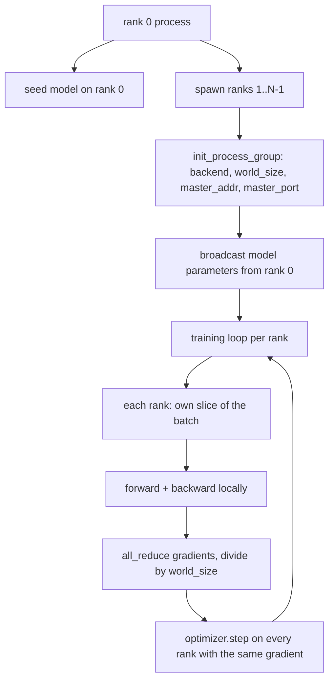
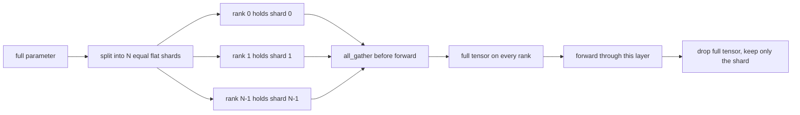

# स्क्रैच से वितरित डेटा समानांतर और FSDP

> मल्टी-रैंक ट्रेनिंग दो सामूहिक और एक नियम है। स्टार्टअप पर पैरामीटर प्रसारित करें, पीछे की ओर gradients औसत, कभी भी रैंक पर असहमति नहीं होने दें कि वे किस चरण पर हैं।

**Type:** Build
**Languages:** Python
**Prerequisites:** Phase 19 lessons 42 to 45
**Time:** ~90 minutes

## सीखने के लक्ष्य

-  के साथ N रैंक के पार एक प्रक्रिया समूह को लाने के लिए`gloo`बैक-एंड, कोई विशेष हार्डवेयर नहीं।
- न्यूनतम डीडीपी रैपर लागू करें जो निर्माण पर मापदंडों को प्रसारित करता है और पीछे की ओर गिरने के बाद सभी को कम करता है।
- यह साबित करें कि प्रति रैंक ग्रेडिएंट का पूर्ण-निम्न संयोजन इनपुट पर एकल प्रक्रिया ग्रेडिएंट से मेल खाता है।
- स्केच FSDP पैरामीटर स्क्रैडिंगः प्रत्येक रैंक में एक स्लाइस होती है, आगे के पास के लिए पूरा टेंसर एकत्र किया जाता है और बाद में गिरा दिया जाता है।

## समस्या

मॉडल एक डिवाइस पर फिट बैठता है। डेटासेट नहीं है। अनुकूलन बजट कहता है कि आप प्रति वॉल क्लॉक सेकंड N गुना उदाहरण देखना चाहते हैं। पहला लीवर डेटा समानांतर हैः प्रत्येक रैंक बैच के एक अलग स्लाइस पर एक ही मॉडल चलाता है, फिर ऑप्टिमाइज़र चरण से पहले औसत ग्रेडिएंट्स करता है। दूसरा लीवर FSDP हैः मॉडल एक डिवाइस पर भी फिट नहीं होता है, इसलिए प्रत्येक रैंक में प्रत्येक पैरामीटर का एक अंश होता है और आगे के पास के दौरान पूरी टेन्सर परत द्वारा परत का पुनर्निर्माण होता है।

यदि आप औसत ग्रेडिएंट्स करते हैं लेकिन नुकसान नहीं करते हैं तो डैशबोर्ड झूठ बोलता है। यदि सामूहिक बैकेंड एक टोपोलॉजी पर सहमत नहीं हो सकता है तो रन हमेशा के लिए लटका रहता है। फिक्स यह है कि सामूहिकों को एक बार हाथ से लिखें और कभी भी एक लपेट पर भरोसा न करें जिसे आप पुनः पेश नहीं कर सकते।

यह सबक सीपीयू पर चलता है. CUDA नहीं माना जाता है.`gloo`प्रत्येक PyTorch निर्माण और स्वीकार के साथ बैक-एंड जहाजों`torch.multiprocessing`श्रमिकों; वही कोड  पर स्विच करता है`nccl`संरचना में परिवर्तन के बिना मल्टी-जीपीयू नोड पर।

## अवधारणा



### दो सामूहिक जो मायने रखते हैं

| Collective | What it does | When |
|------------|--------------|------|
| `broadcast` | Copy a tensor from one rank to all others | Parameter init, scheduler state, any one-to-all sync |
| `all_reduce` | Sum (or mean, or max) a tensor across all ranks, every rank gets the result | Gradient averaging after backward |
| `all_gather` | Each rank contributes a tensor, every rank gets the concatenation | Logits collection, FSDP parameter unshard |

डीडीपी अनुबंध है `broadcast`निर्माण और`all_reduce`FSDP स्केच जोड़ता है `all_gather`प्रत्येक परत के आगे पारित करने से पहले।

### ग्रेडिएंट औसत एकल प्रक्रिया ग्रेडिएंट से मेल खाता है

N रैंक के पार B उदाहरणों के एक बैच पर प्रशिक्षित एक मॉडल को N * B के बैच पर एक एकल प्रक्रिया प्रशिक्षण के समान ग्रेडिएंट का उत्पादन करना चाहिए। ट्रिक यह है कि प्रति रैंक ग्रेडिएंटों का योग करके और N से विभाजित करके औसत हानि ग्रेडिएंट मिलता है, जो कि औसत कमी के साथ क्रॉस एंट्रॉपी पूरे बैच पर क्या उत्पन्न करेगी। पाठ कोड इस बात का दावा करता है`max-abs-diff < 1e-3`मैनुअल सर्व-कम करने वाले ग्रेडिएंट और संदर्भ एकल-प्रक्रिया ग्रेडिएंट के बीच।

### एफएसडीपी स्केच



मेमोरी जीत सटीक हैः पैरामीटर के लिए प्रति रैंक मेमोरी 1/N तक गिर जाती है। लागत एकत्र है, जो प्रत्येक आगे पास का भुगतान किया जाता है। उत्पादन FSDP पिछले परत की गणना के साथ एकत्र को ओवरलैप करता है इसलिए वॉलक्लॉक लागत साफ़ लेखांकन की भविष्यवाणी से बहुत कम है। पाठ प्रत्येक पैरामीटर पर वापस-ट्रिप करता है और यह कहता है कि पुनर्निर्माण मूल के बराबर है।

### सीपीयू और अंधेरे बैकेंड

CUDA उत्पादन लक्ष्य है, लेकिन CPU पर एक ही कोड पथ मौजूद हैं। `gloo`यह CPU के सामूहिक बैक-एंड है. यह धीमी है`nccl`GPU पर परिमाण के आदेश के अनुसार, लेकिन एपीआई सतह समान है। पाठ के प्रक्रिया समूह के साथ शुरू होता है `backend="gloo"`और रैंक पैदा होती है`torch.multiprocessing``torchrun`; दोनों एक ही समय में समाप्त होते हैं `torch.distributed`एक बहु-जीपीयू नोड पर, केवल परिवर्तन `backend="nccl"`, उपकरण टेन्सर, और `torchrun`प्रक्षेपण करने के लिए.

```figure
cg-allreduce-ring
```

## इसे बनाओ

`code/main.py`चलाने योग्य कलाकृतियों है।

### चरण 1: प्रक्रिया समूह को प्रस्तुत करें

```python
os.environ["MASTER_ADDR"] = "127.0.0.1"
os.environ["MASTER_PORT"] = str(port)
dist.init_process_group(backend="gloo", rank=rank, world_size=world_size)
```

`MASTER_ADDR`और `MASTER_PORT`एक ही मेजबान पर एक ही पोर्ट को डायल करता है। पाठ एक ही मशीन को साझा करने वाले कई रन के साथ टकराव से बचने के लिए एक बंधन-और-बंद ट्रिक के माध्यम से एक मुक्त पोर्ट चुनता है।

### चरण 2: निर्माण के दौरान प्रसारण

`MinimalDDP.__init__`हर पैरामीटर और बफर और कॉल पर चलता है `dist.broadcast(tensor, src=0)`. रैंक 0 के मान कैनोनिक init बन जाते हैं. इसके बिना, प्रत्येक रैंक अपने स्वयं के बीज के साथ आरंभ होता है और रैंक चरण एक से भिन्न होते हैं।

### चरण 3: पीछे की ओर जाने के बाद सभी ग्रेडिएंट को कम करें

```python
def all_reduce_grads_(module, world_size):
    for p in module.parameters():
        if p.grad is None:
            p.grad = torch.zeros_like(p.data)
        dist.all_reduce(p.grad.data, op=dist.ReduceOp.SUM)
        p.grad.data.div_(world_size)
```

प्रत्येक रैंक एक ही औसत ग्रेडिएंट के साथ समाप्त होता है। अनुकूलक चरण अब प्रत्येक रैंक पर एक ही इनपुट का कार्य है, यही कारण है कि पैरामीटर रन के दौरान समक्रमण में रहते हैं।

### चरण 4: समतुल्यता का प्रमाण

`manual_all_reduce_matches_single_process`रैंक 0 पर एक ही मॉडल का निर्माण करता है और सभी घटाने के बाद ग्रेडिएंट की तुलना ग्रेडिएंट के साथ करता है जो एक एकल प्रक्रिया एक साथ जुड़े इनपुट पर गणना करेगी। अधिकतम-अब्स-डिफ़र 1e-8 के आसपास है।

### चरण 5: एफएसडीपी की यात्रा

`fsdp_round_trip_sketch`प्रत्येक पैरामीटर को सपाट करता है, कई गुना तक पैड करता है `world_size`प्रत्येक रैंक का पुनर्निर्माण मूल के बराबर है। यह अनखंड चरण है; विपरीत (आगे के बाद फिर से विभाजित) एकत्रित टेंसर से एक स्लाइस है।

इसे चलाओः

```bash
python3 code/main.py
```

डिफ़ॉल्ट दुनिया आकार 2 है। दो सीपीयू प्रक्रियाओं spawn, के माध्यम से एक दूसरे से बात करते हैं `gloo`, और नल से बाहर निकलें।`outputs/ddp-demo.json`प्रत्येक रैंक पर पैरामीटर योग, सभी घटाने के बाद ग्रेडिएंट मानदंड, FSDP राउंड-ट्रिप परिणाम और मैनुअल बनाम संदर्भ ग्रेडिएंट अंतर को कैप्चर करता है।

## इसका प्रयोग करें

उत्पादन प्रशिक्षण ढेरों एक ही आदिम कहते हैं।`DistributedDataParallel`जोड़ता हैः पोस्ट-ब्याकवर्ड ग्रेडिएंट हुक जो ओवरलैप सभी-कम करने के साथ पीछे, बाल्टी सभी-कम करने के लिए जो एक सामूहिक में कई छोटे ग्रेडिएंटों को जोड़ता है, और `no_sync`पाठ 46 का प्रयोग किया गया।

PyTorch के FSDP जोड़ता हैः प्रति परत एक सपाट पैरामीटर दृश्य ताकि प्रत्येक रैंक एक आसन्न बफर रखता है, अगले परत के unshard के ओवरलैप वर्तमान परत की गणना के साथ, और वैकल्पिक सीपीयू ऑफलोड के लिए shards.

आकार वही रहता हैः स्टार्टअप पर प्रसारण, पीछे की ओर घटाने के बाद, पैरामीटर को टुकड़े करते हैं जब वे अब फिट नहीं होते हैं।

## इसे भेजें

`outputs/skill-distributed-fsdp-ddp.md`एक नई प्रशिक्षण स्क्रिप्ट के लिए नुस्खा ले जाता हैः प्रक्रिया समूह को स्पिन करें `gloo`CPU और `nccl`जीपीयू के लिए, मॉडल को एक डीडीपी खोल में लपेटें जो निर्माण के दौरान प्रसारित होता है और पीछे की ओर, वैकल्पिक रूप से FSDP स्केच से ऑल_गather पैटर्न के साथ पैरामीटर को टुकड़े करता है।

## व्यायाम

1. दौड़ो`--world-size 4`और पुष्टि करें कि पैरामीटर प्रसार पूरे रन में 1e-3 से नीचे रहता है।
2. मैनुअल औसत को  से बदलें`dist.all_reduce(op=dist.ReduceOp.AVG)`और समय अंतर.
3. डीडीपी रैपर में एक पोस्ट-ब्याकवर्ड हुक जोड़ें ताकि ऑल-रिड्यूस बाकी के साथ ओवरलैप हो; दीवार घड़ी में सुधार मापें।
4. FSDP पुनः विभाजन चरण को लागू करेंः आगे पारित करने के बाद, स्थानीय विभाजन के साथ पूर्ण Tensor को फिर से बदलें। प्रति रैंक स्मृति ड्रॉप की पुष्टि करें।
5. बैकेंड को  पर स्विच करें`nccl`CUDA बॉक्स पर ध्यान दें कि कौन से पर्यावरण चर बदलते हैं और कौन से समान रहते हैं।

## प्रमुख शर्तें

| Term | What people say | What it actually means |
|------|-----------------|------------------------|
| Backend | "gloo or nccl" | The library that implements the collective ops; gloo is CPU, nccl is GPU |
| World size | "Total ranks" | Number of processes in the group; the group is the unit collectives operate on |
| Rank | "Worker id" | Process identifier within the group, zero indexed |
| All-reduce | "Sum the grads" | Sum a tensor across all ranks, every rank ends with the same result |
| Unshard | "Gather the params" | Reconstruct the full tensor from per-rank slices via all_gather |

## आगे पढ़ना

- पिटोरच `torch.distributed`सामूहिक अर्थशास्त्र के लिए दस्तावेज इस सबक पर निर्भर करता है।
- `gloo`पुस्तकालय की सामूहिक सूची, CUDA द्वारा समर्थित के समान आकार में `nccl`आदिम.
- चरण 19 पाठ 46 के लिए ग्रेडिएंट जमा पैटर्न जो DDP सभी-कम करने में लपेटता है `no_sync`. .
- चरण 19 पाठ 47 के लिए चेकपॉइंट लेआउट जो डीडीपी और एफएसडीपी रन से जीवित है।
- यहां चित्रित पैरामीटर स्क्रैडिंग के उत्पादन कार्यान्वयन के लिए PyTorch FSDP प्रलेखन।
