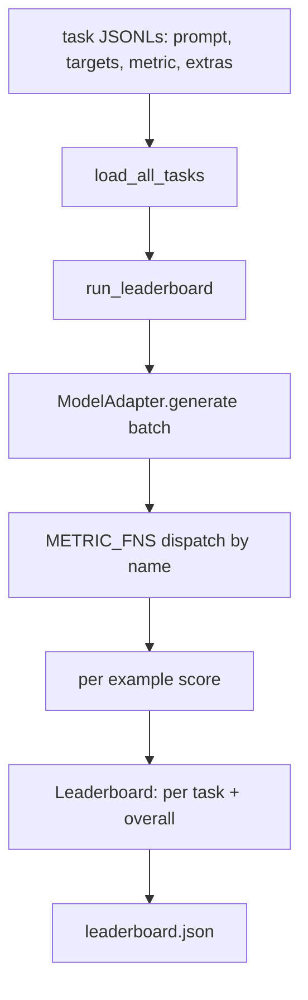
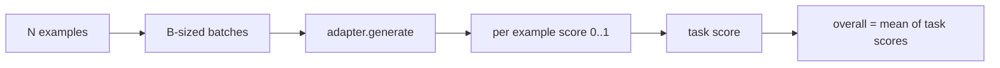

# भाषा मॉडल मूल्यांकन हर्न

> एक मॉडल जो किसी कार्य पर अच्छा प्रदर्शन करता है जिसे आप परिभाषित नहीं कर सकते, वह एक मॉडल है जो दुर्घटना से अच्छा प्रदर्शन करता है। हर्नस एक छोटे, स्वैप करने योग्य आकार में कार्य परिभाषा, मीट्रिक, धावक और रैंकिंग बोर्ड है।

**Type:** Build
**Languages:** Python
**Prerequisites:** Phase 19 lessons 42 to 45
**Time:** ~90 minutes

## सीखने के लक्ष्य

- एक कार्य को JSONL फ़ाइल के रूप में परिभाषित करें `prompt`,`targets`,`metric`, और वैकल्पिक `extras`उदाहरण के लिए।
- पांच माप लागू करेंः सटीक मैच, Rue-l F1, निष्पादित चेक, बहुविकल्पीय, और उपशृंखला शामिल है।
- एक रनर बनाएँ जो प्रत्येक कार्य के उदाहरणों को बैच करता है और एक स्वैप्पेबल मॉडल एडाप्टर को भेजता है।
- प्रति कार्य स्कोर, विलंबता और एक समग्र औसत के साथ एक रैंकिंग बोर्ड JSON जारी करें जो पुनः उत्पन्न हो सकता है।

## समस्या

एक नया भाषा मॉडल हर हफ्ते उतरता है. विपणन का दावा है कि यह अच्छा करता है. ईमानदार सवाल यह हैः ठीक है? ईमानदार जवाब है कि आप खुद ने लिखा है, क्योंकि विक्रेता के रैंकिंग बोर्ड वह है जो वे ट्यून किया है.

अपने रेपो में बिना हर्नस के आप दो मॉडल की तुलना वाइब्स द्वारा करते हैं। एक हर्नस के साथ आप उन्हें एक निश्चित कार्य सेट पर एक निश्चित मीट्रिक के साथ स्कोर के अनुसार तुलना करते हैं, एक JSON आउटपुट पर आप अंतर कर सकते हैं। हर्नस कल के रन और आज के रन के बीच अनुबंध है। इसके बिना, प्रतिगमन जहाज।

जाल एक ही मॉडल के लिए हार्नेस को अधिक फिट कर रहा है। फिक्स रिवर्स में एक ही जाल हैः हर्नस पंद्रह मिनट में पढ़ने के लिए पर्याप्त छोटा है, कार्य रेपो में भेजने के लिए पर्याप्त छोटे हैं, मीट्रिक को खरोंच से लिखा जाता है ताकि एक सहयोगी उन्हें ऑडिट कर सके, और एडाप्टर एकमात्र जगह है जहां मॉडल-विशिष्ट कोड रहता है। एडॉप्टर को स्विच करें, रैंकिंग बोर्ड चलता है; कार्यों को स्विच करें, रैंकिंग बोर्ड चलता है। कुछ भी आगे नहीं बढ़ना चाहिए।

## अवधारणा



### कार्य विनिर्देश

प्रत्येक उदाहरण एक JSONL पंक्ति हैः

```json
{"id": "arith-00", "prompt": "compute: 2 + 2", "targets": ["4"], "metric": "exact_match"}
```

मेट्रिक्स के लिए जो स्कोरिंग सहायक की जरूरत है, `extras`साइड पेलोड ले जाता हैः

```json
{
  "id": "code-00",
  "prompt": "python: write a function f that doubles its input",
  "targets": ["ok"],
  "metric": "code_exec",
  "extras": {"io_pairs": [[1, 2], [3, 6]]}
}
```

एक कार्य एक कार्य है`.jsonl``outputs/tasks/`फ़ाइल का नाम कार्य का नाम है. एक फ़ाइल में सभी उदाहरणों एक मेट्रिक साझा करते हैं.

### पांच फिक्स्ड कार्य

| Task | Metric | What it tests |
|------|--------|---------------|
| arithmetic | exact_match | Token-level correctness on a deterministic answer |
| summary | rouge_l | Longest common subsequence F1 against a one-line reference summary |
| code-exec | code_exec | Executable test: the predicted function must satisfy a list of input-output pairs |
| multiple-choice | multiple_choice | First letter of the prediction must match an allowed letter |
| generation | substring_contains | Free-form text must contain at least one target substring |

### मीट्रिक अनुबंध

प्रत्येक मीट्रिक से एक समारोह है `(prediction, targets, extras) -> float in [0.0, 1.0]`. हर्नस एक कार्य स्कोर प्राप्त करने के लिए प्रति उदाहरण स्कोर का औसत बनाता है, फिर समग्र प्राप्त करने के लिए कार्य स्कोर का औसत करता है। मीट्रिक फ़ंक्शन छोटे हैंः

- `exact_match`: लघु अक्षर, ध्वस्त सफेद स्थान, समानता।
- `substring_contains`: समान सामान्यीकरण, सबस्ट्रिंग परीक्षण।
- `multiple_choice`: पहला वर्ण ऊपर से लपेटा हुआ।
- `rouge_l`: एलसीएस लंबाई भविष्यवाणी और संदर्भ लंबाई, सटीकता और रिकॉल की F1 द्वारा विभाजित।
- `code_exec`: एक प्रतिबंधित नाम स्थान में भविष्यवाणी निष्पादित करें, कॉल `f(x)`प्रत्येक इनपुट-आउटपुट जोड़ी पर, मैचों की गिनती करें।

कोड_exec मेट्रिक एक striped निर्मित नाम स्थान में भविष्यवाणी चलाता है। पाठ का परीक्षण बताता है कि `import os`विस्फोट हो जाता है क्योंकि `os`नाम स्थान में नहीं है; आप एक कोड भविष्यवाणी से फ़ाइल प्रणाली तक नहीं पहुंच सकते हैं।

### मॉडल एडाप्टर

```python
class ModelAdapter(Protocol):
    def generate(self, prompts: Sequence[str]) -> List[str]: ...
    @property
    def name(self) -> str: ...
```

एडॉप्टर सीम है. पाठ जहाजों।`ToyAdapter`एक वास्तविक एडाप्टर मॉडल को कॉल करता है और इसका आउटपुट वापस करता है। हर्नर को कोई फर्क नहीं पड़ता कि कौन सा।

### धावक

`run_task`बैच `batch_size`एक समय में संकेत और मीट्रिक फ़ंक्शन पर भेजता है। `run_leaderboard`हर काम और औसत पर चलता है।`write_leaderboard`एक स्कीमा स्ट्रिंग के साथ JSON जारी करता है ताकि भविष्य के प्रारूप परिवर्तन डैशबोर्ड को चुपचाप नहीं तोड़ते हैं।



```figure
eval-harness-matrix
```

## इसे बनाओ

`code/main.py`चलाने योग्य कलाकृतियों है।

### चरण 1: बीज फिक्स्चर कार्य

`seed_fixture_tasks(target_dir)`पांच लिखता है `.jsonl`फ़ाइलें. पहली रन`main.py`जब निर्देशिका खाली हो जाती है तो उन्हें बीज देता है।

### चरण 2: लोड कार्य

`load_all_tasks(task_dir)`हर बार पढ़ता है `.jsonl`और कार्य नाम से एक डिक्ट को सूची में लौटाता है `Example`रिकॉर्ड। टिप्पणी पंक्तियों से शुरू होता है `#`और रिक्त पंक्तियों को छोड़ दिया जाता है ताकि योगदानकर्ता फ़ाइलों को टिप्पणी कर सकते हैं।

### चरण 3: माप लागू करें

प्रत्येक मीट्रिक इकाई परीक्षण के साथ एक छोटा कार्य है। पाठ के परीक्षण सूट में सामान्यीकरण, आंशिक ओवरलैप, कोड निष्पादन और असुरक्षित कोड अस्वीकृति को कवर करने वाले 13 मामले शामिल हैं।

### चरण 4: धावक लिखें

`run_task`बैच दोहराता है और एक `TaskResult`स्कोर, सही गिनती, कुल गिनती, और विलंबता के साथ। `run_leaderboard`सभी कार्यों को चलाता है और एक `Leaderboard`समग्र औसत के साथ।

### चरण 5: JSON उत्सर्जन

`write_leaderboard`बोर्ड को क्रमबद्ध करता है।`--include-per-example`फ्लैग प्रति उदाहरण रिकॉर्डों को छोड़ देता है ताकि आप पिछले रन के खिलाफ भविष्यवाणियों को अलग कर सकें जब स्कोर आगे बढ़ते हैं।

इसे चलाओः

```bash
python3 code/main.py
```

स्क्रिप्ट पहली बार फिक्स्चर को बीज देती है, उन्हें खिलौना एडाप्टर (जो हर फिक्स्चर को सही बनाता है) के साथ स्कोर करती है, और लिखती है `outputs/leaderboard.json`. खेलौना एडाप्टर के साथ कुल स्कोर 1.0 है; स्टब एडाप्टर परीक्षण में `test_main.py`एक ही हर्नर 0.0 जब एडाप्टर जवाब नहीं दे सकता है।

## इसका प्रयोग करें

एक असली मॉडल को प्लग करने के लिए, एक एडाप्टर लिखें।

```python
class HttpAdapter:
    name = "vendor.v1"

    def __init__(self, endpoint, api_key):
        self.endpoint = endpoint
        self.api_key = api_key

    def generate(self, prompts):
        out = []
        for prompt in prompts:
            response = http_post(self.endpoint, prompt, self.api_key)
            out.append(response["text"])
        return out
```

स्वैप `ToyAdapter`के लिए`HttpAdapter`शीर्ष पर `main()`. हर्न, कार्य, माप, और रैंकिंग बोर्ड एक ही रहते हैं.

वास्तविक परियोजना में हार्नेस को शिपिंग करते समय लागू करने के लिए तीन पैटर्नः

- **Pin the task files.**leaderboard.json में हैश-पिन किए गए कार्य सामग्री या यह साथ में JSONLs है; अन्यथा स्कोर तब चलता है जब कार्य फ़ाइल करता है, और आप नहीं बता सकते कि कौन सा।
- **Diff predictions, not just scores.**`--include-per-example`ध्वज आपको यह देखने देता है कि मॉडल ने जिस दिन स्कोर गिर गया उस दिन क्या कहा।
- **Cap the batch size.**वास्तविक एडाप्टरों में दर सीमाएं होती हैं। एक छोटे बैच आकार के कारण आपूर्तिकर्ताओं के बीच हार्नेस संगत रहता है।

## इसे भेजें

`outputs/skill-lm-eval-harness.md`इस प्रकार के कार्य के लिए एक विशिष्ट प्रकार के साथ एक विशिष्ट प्रकार के कार्य के लिए एक विशिष्ट प्रकार के कार्य के लिए एक विशिष्ट प्रकार के कार्य के लिए एक विशिष्ट प्रकार के कार्य के लिए एक विशिष्ट प्रकार के कार्य के लिए एक विशिष्ट प्रकार के कार्य के लिए एक विशिष्ट प्रकार के कार्य के लिए एक विशिष्ट प्रकार के कार्य के लिए एक विशिष्ट प्रकार के कार्य के लिए एक विशिष्ट प्रकार के कार्य के लिए एक विशिष्ट प्रकार के कार्य के लिए एक विशिष्ट प्रकार के कार्य के लिए एक विशिष्ट प्रकार के लिए एक विशिष्ट प्रकार के कार्य के लिए एक विशिष्ट प्रकार के लिए एक विशिष्ट प्रकार के लिए एक विशिष्ट प्रकार के लिए एक विशिष्ट प्रकार के लिए एक विशिष्ट प्रकार के लिए एक विशिष्ट प्रकार के लिए एक विशिष्ट प्रकार के लिए एक विशिष्ट प्रकार के लिए एक विशिष्ट प्रकार के लिए एक विशिष्ट प्रकार के लिए एक विशिष्ट प्रकार के लिए एक विशिष्ट प्रकार के लिए एक विशिष्ट प्रकार के लिए एक विशिष्ट प्रकार के लिए एक विशिष्ट प्रकार के लिए एक विशिष्ट प्रकार के लिए एक विशिष्ट प्रकार के रूप में एक विशिष्ट प्रकार के साथ एक विशिष्ट प्रकार के रूप में एक विशिष्ट प्रकार के रूप में एक विशिष्ट प्रकार के रूप में एक विशिष्ट प्रकार के रूप में एक विशिष्ट प्रकार के रूप में एक विशिष्ट प्रकार के रूप में एक कार्य फ़ाइलों के साथ एक प्रकार के रूप में एक कार्य फ़ाइलों को शामिल किया गया है।`outputs/tasks/`वे एक वास्तविक परियोजना में कॉपी करने के लिए शुरू करने के लिए हैं।

## व्यायाम

1. एक कस्टम मीट्रिक के साथ एक छठा कार्य जोड़ें जिसे आप खरोंच से लिखते हैं (BLEU-जैसे ओवरलैप, BLEURT-जैसे संदर्भ स्कोरिंग, स्पष्ट अनुबंध के साथ कुछ भी) ।
2. विस्तार `code_exec`स्टडआउट को पकड़ने और अपेक्षित स्टडआउट की सूची को लक्ष्य के रूप में स्वीकार करने के लिए।
3. एक रैंकिंग बोर्ड अंतर कमांड जोड़ेंः दो दिया `leaderboard.json`फ़ाइलें, प्रिंट कौन से कार्यों स्थानांतरित किया और कितना द्वारा।
4. उदाहरण के लिए कैप लेटेंसी। एक टाइमआउट में एडाप्टर कॉल को लपेटें; एक अलग सतह `timeouts`रैंकिंग बोर्ड में स्तंभ।
5. रैंकिंग बोर्ड में sha256 के साथ कार्य सामग्री को पिन करें ताकि भविष्य के पाठक यह सत्यापित कर सकें कि उन्होंने एक ही कार्य को स्कोर किया है।

## प्रमुख शर्तें

| Term | What people say | What it actually means |
|------|-----------------|------------------------|
| Task spec | "The eval format" | JSONL file with prompt, targets, metric, optional extras per example |
| Metric | "How you score" | Function from (prediction, targets, extras) to a float in [0, 1] |
| Adapter | "The model client" | Object with a generate(prompts) -> list[str] method; the only model-specific code |
| Leaderboard | "The scoreboard" | JSON with per-task scores, total counts, latency, and an overall average |
| Code exec metric | "Run it and check" | Execute the prediction in a restricted namespace, compare against input-output pairs |

## आगे पढ़ना

- उत्पादन संदर्भ के लिए मूल आईएम-मूल्यांकन-हार्नेस, बहुत बड़ा लेकिन समान आकार।
- उसी अनुबंध के वैकल्पिक कार्यान्वयन के लिए HuggingFace की लाइटटेवल।
- चरण 19 पाठ 46 प्रशिक्षण स्टैक में उपयोग किए जाने वाले ग्रेडिएंट जमा पैटर्न को कवर करता है।
- चरण 19 पाठ 47 आप के खिलाफ अंक अंक अंक प्रारूप को कवर; रैंकिंग बोर्ड में अंक अंक हैश पिन।
- चरण 19 पाठ 48 में परीक्षण के तहत मॉडल का उत्पादन करने वाले वितरित प्रशिक्षण ढेर को कवर किया गया है।
