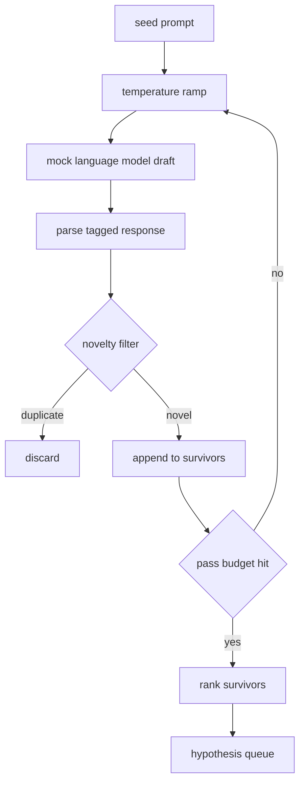

# परिकल्पना जनरेटर

> एक शोध एजेंट जो एक ही प्रश्न दो बार पूछता है वह टोकन बर्बाद कर रहा है। ट्रिक प्रत्येक ड्राफ्ट को किसी नए स्थान पर लैंड करने के लिए मजबूर करना है।

**Type:** Build
**Languages:** Python
**Prerequisites:** Phase 19 Track A lessons 20-29
**Time:** ~90 minutes

## सीखने के लक्ष्य
- बीज संकेत से नमूना लेनेवाला चलाएं और उसके आउटपुट को टाइप किए गए परिकल्पना रिकॉर्ड में बदल दें।
- प्रत्येक पास पर नमूना तापमान को रैंप करें ताकि अगला ड्राफ्ट पिछले से आगे बढ़े।
- एक छोटे से एम्बेडिंग मॉडल और एक कॉसिन दूरी सीमा के साथ डुप्लिकेट के पास फ़िल्टर करें।
- जीवित बचे लोगों को एक स्कोरिंग फ़ंक्शन के साथ रैंक करें जो नवीनता, विशिष्टता और परीक्षण करने योग्यता को मिलाता है।
- प्रत्येक कदम निर्धारक बनाए रखें ताकि एक ही बीज हमेशा एक ही कतार पैदा करता है।

## क्यों उत्पन्न, फिर फ़िल्टर

एक योजनाकार जो एक मॉडल से एक बार पूछता है, उसे एक परिकल्पना मिलती है। यह एक काम किए गए उदाहरण के लिए ठीक है। एक शोध लूप के लिए यह गलत आकार है। लूप गहराई के साथ एक रैंक की कतार चाहता है, इसलिए जब पहला परिकल्पना विफल हो जाता है तो धावक को एक और पूर्ण नमूना पास के लिए भुगतान किए बिना अगले पास तैयार हो जाता है।

दो विचार उस कतार को बनाने के लिए संयुक्त होते हैं। पहला तापमान रैंपिंग हैः नमूना के माध्यम से प्रत्येक पास तापमान को एक गड्ढा बढ़ाता है, इसलिए बाद के ड्राफ्ट को भटकने के लिए प्रोत्साहित किया जाता है। दूसरा उपन्यास फ़िल्टरिंग हैः प्रत्येक ड्राफ्ट के बाद, जनरेटर प्रत्येक पिछले जीवित से एम्बेडिंग दूरी को मापता है और क्लस्टर के अंदर कुछ भी अस्वीकार करता है।

पाठ एक नकली भाषा मॉडल भेजता है जो निश्चित संकेतों के लिए स्क्रिप्टेड टोकन अनुक्रमों को लौटाता है। नकली पूरे पथ का अभ्यास करने के लिए पर्याप्त हैः बीज संकेत, तापमान रैंप लागू, उम्मीदवारों का विश्लेषण, नवीनता फ़िल्टर चलाएं, रैंक कतार बाहर।

## परिकल्पना का आकार

```text
Hypothesis
  id             : int           (monotonic within a run)
  text           : str           (the claim)
  variables      : list[str]     (what changes between conditions)
  metric         : str           (what the runner will measure)
  baseline_ref   : str | None    (which paper or run the comparison cites)
  draft_pass     : int           (which sampler pass produced this)
  temperature    : float         (the sampler setting at draft time)
  novelty_score  : float         (distance from prior survivors, 0..1)
  rank_score     : float         (weighted sum used for ordering)
```

`variables`और `metric`पाठ 52 में धावक इन क्षेत्रों को सीधे पढ़ता है जब वह प्रयोग विन्यास बनाता है।

`baseline_ref`यदि कोई व्यक्ति एक परिकल्पना छोड़ देता है तो वह उसी मेट्रिक पर पिछले रन पर वापस आ जाता है।

```figure
cg-novelty-ramp
```

## वास्तुकला



लूप सीधे आगे है. दिलचस्प हिस्सा यह है कि प्रत्येक बॉक्स में एक कठिन अनुबंध है.

## तापमान रैंप

`t_min`, अंत में `t_max`, कदम `(t_max - t_min) / (n_passes - 1)`. प्रत्येक पास वर्तमान तापमान पर नमूना ले ले जाता है, उत्पादन `n_passes` से समान रूप से अंतरित मान`GeneratorConfig.schedule()`. नकली मॉडल एक छोटे सेट के बीच स्विच करके तापमान का सम्मान करता है स्क्रिप्ट प्रतिक्रियाओं की एक किट पर `(prompt, temp_bucket)`. बाल्टी खुली अंतराल हैं इसलिए तापमान में एक छोटा बदलाव एक अलग बाल्टी का चयन करता है और एक अलग ड्राफ्ट का उत्पादन करता है। उत्पादन में नमूना लेने वाला एक वास्तविक मॉडल होगा`temperature=t`गुजर गया।

डिफ़ॉल्ट कार्यक्रम से 6 पास है `0.2``1.2`. छह के लिए पर्याप्त है कि लाइन भरने के लिए बिना नमूने के भुगतान है कि नवाचार फिल्टर वैसे भी अस्वीकार कर देगा. नीचे.`0.2`मॉडल के पास बीज वापस आता है। ऊपर।`1.2`उत्तर विषय से बहकर जाने और विश्लेषक को विफल करने की प्रवृत्ति है।

## नवजात फ़िल्टर

प्रत्येक ड्राफ्ट को पार्स करने के बाद, जनरेटर पाठ को एम्बेड करता है और प्रत्येक स्वीकृत परिकल्पना के साथ तुलना करता है। एम्बेडिंग शब्द टोकन का एक छोटा हैश बैग है, इकाई लंबाई के लिए सामान्यीकृत है। दो इकाई वेक्टरों के बीच कॉसिन दूरी है `1 - dot(a, b)`. एक ड्राफ्ट पास होता है यदि किसी पूर्व जीवित व्यक्ति से इसकी न्यूनतम दूरी से अधिक हो`novelty_threshold`. डिफ़ॉल्ट रूप से है`0.25`. .

हैश किए गए एम्बेडिंग फैंसी नहीं है। यह निर्धारक है, इसमें शून्य निर्भरताएं हैं, और स्पष्ट मामले को पकड़ने के लिए पर्याप्त हैः दो मसौदे जो अपने अधिकांश संज्ञाओं को साझा करते हैं। एक उत्पादन तैनाती एक छोटे से वाक्य मॉडल में आदान-प्रदान करेगी। इंटरफ़ेस समान रहता है।

## रैंक स्कोर

```text
rank_score = w_novelty * novelty_score
           + w_specificity * specificity_score
           + w_testability * testability_score
```

तीन उप स्कोर.`novelty_score`पूर्व जीवितों से न्यूनतम एम्बेडिंग दूरी है। `specificity_score`यह एक लक्ष्य संख्या से विभाजित परिकल्पना में ठोस चर की संख्या है। `testability_score`एक है यदि परिकल्पना एक मीट्रिक और एक बेसलाइन दोनों को निर्दिष्ट करती है, आधा है अगर इसमें केवल एक मीट्रिक है, अन्यथा शून्य।

डिफ़ॉल्ट वजन हैं `0.4`,`0.3`,`0.3`वजन जनरेटर कॉन्फ़िग में रहते हैं ताकि एक डाउनस्ट्रीम पाठ उन्हें कोड फोर्क किए बिना स्थानांतरित कर सकता है।

## नकली भाषा मॉडल

```python
class MockLLM:
    def sample(self, prompt: str, temperature: float, seed: int) -> str:
        ...
```

नमूना लेने वाला निर्धारक है `(prompt, temperature, seed)`तीन. नकली एक स्क्रिप्ट प्रतिक्रिया तालिका पर रखा है।`(prompt_signature, temperature_bucket)`यदि तालिका में किसी कुंजी के लिए कोई प्रविष्टि नहीं है, तो नमूना लेने वाला एक फॉलबैक लौटाता है जो पार्सर में विफल रहता है। फॉलबैक पथ का अभ्यास परीक्षणों में से एक द्वारा किया जाता है।

बीज प्रतिक्रिया में मिश्रित है तो एक ही `(prompt, temperature)`एक अलग बीज के साथ जोड़ी अलग-अलग ड्राफ्ट उत्पन्न करती है। परीक्षणों में हम परिणामों को पुनः उत्पन्न करने योग्य रखने के लिए बीज को पिन करते हैं। एक वास्तविक तैनाती में बीज सिस्टम घड़ी या काउंटर से आएगा।

## आउटपुट कतार

आउटपुट  की सूची है`Hypothesis` द्वारा क्रमबद्ध रिकॉर्ड`rank_score`पाठ 52 में धावक सिर को मारता है, प्रयोग चलाता है, और पाठ 53 में मूल्यांकनकर्ता एक फैसला वापस लिखता है। अगर फैसला कहता है कि परिकल्पना गलत थी, धावक अगले को मारता है।

जब यह खाली हो जाता है तो ऑर्केस्ट्रेटर या तो बीज का विस्तार कर सकता है और जनरेटर को फिर से चला सकता है या रोक सकता है और बजट समाप्त होने की सूचना दे सकता है।

## कोड कैसे पढ़ें

`code/main.py`परिभाषित करता है `Hypothesis`,`MockLLM`,`HypothesisGenerator`जनरेटर एक एकल उजागर करता है`run(seed_prompt)`विधि जो एक क्रमबद्ध कतार लौटाता है; पास गिनती से पढ़ा जाता है `GeneratorConfig.n_passes`यह एक तर्क के रूप में पारित करने के बजाय. एम्बेडिंग टोकन के एक हैश बैग है. नवाचार फ़िल्टर एक एकल समारोह है. रैंक स्कोर एक एकल समारोह है. कुछ भी निर्भर करता है`numpy`; गणित को एम्बेड करना शुद्ध स्टडीलिब है इसलिए पाठ पोर्टेबल रहता है।

`code/tests/test_generator.py`रैखिक पथ, दोहराई अस्वीकृति पथ, पार्सर विफलता पथ, तापमान रैंप सीमाओं और रैंक क्रम को कवर करता है।

## जहां यह स्लॉट में

पाठ पचास पंक्ति का उत्पादन करता है। पाठ पचास एक पंक्ति का सिर लेता है और इसे पुष्टि या खंडन करने के लिए साहित्य खोज करता है। पाठ पचास दो उसी सिर को लेता है और एक वास्तविक प्रयोग चलाता है। पाठ पचास तीन दोनों आउटपुट को पढ़ता है और एक फैसला लिखता है। चार पाठ एक शोध लूप में शामिल होते हैं जिसमें कोई भी इंसान नहीं है; एक इंसान किसी भी सीमा पर कदम रख सकता है।
