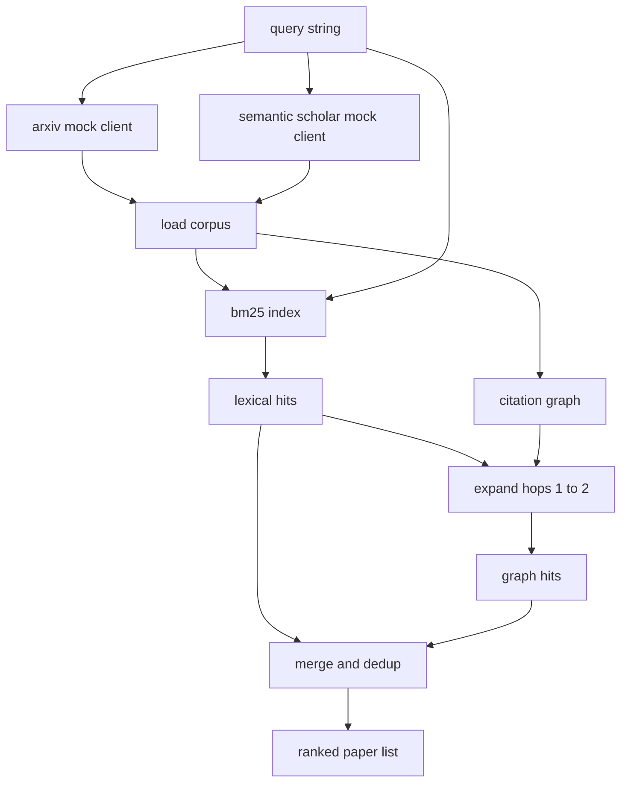

# साहित्य प्राप्त करना

> एक परिकल्पना सस्ती है. यह जानना कि क्या किसी ने पहले ही इसे साबित कर दिया है, वह महंगा हिस्सा है. उस प्रश्न का उत्तर देने वाली पुनर्प्राप्ति परत का निर्माण करें इससे पहले कि धावक एक रेत बॉक्स को घुमाए।

**Type:** Build
**Languages:** Python
**Prerequisites:** Phase 19 Track A lessons 20-29
**Time:** ~90 minutes

## सीखने के लक्ष्य
- लूप नीचे धारा में पढ़ेंगे क्षेत्रों के साथ एक छोटे कागज रिकॉर्ड मॉडल।
- केवल stdlib डेटा संरचनाओं के साथ सारों पर BM25 सूचकांक का निर्माण करें।
- संदर्भ ग्राफ के साथ पृष्ठ पर कागजातों के लिए चलें शब्दकोश खोज चूक गया।
- ड्यूप्लिकेट शब्दकोश और ग्राफ के पार स्थिर कागज आईडी से गुजरता है।
- एक ही क्लाइंट के पीछे दो नकली बाहरी एपीआई को लपेटें ताकि वास्तविक एंडपॉइंट्स लैंड होने पर अपस्ट्रीम कॉल साइट समान रहे।

## दो रिकवरी पास क्यों

सार में कीवर्ड खोज से पेपर वापस आते हैं जो क्वेरी के साथ शब्दावली साझा करते हैं। यह सतह का अधिकांश भाग कवर करता है। यह दो मामलों को याद करता है। पहला है जब आधारभूत पेपर अलग-अलग शब्दावली का उपयोग करता है; उदाहरण के लिए "छोटे ध्यान" के लिए एक क्वेरी "ट्रांसफॉर्मर रूटिंग में ब्लॉक चयन" शीर्षक से एक पेपर को याद करती है। दूसरा है जब प्रासंगिक पेपर एक ज्ञात एंकर का हवाला देते हुए एक अनुवर्ती है; यह एंकर को खोजने और आगे बढ़ने के लिए अधिक कुशल है।

पाठ दोनों पास बनाता है। abstract पर BM25 लेक्सिकल हिट पकड़ता है। एक उद्धरण ग्राफ क्रॉसिंग एक या दो हॉप द्वारा आगे और पीछे रखा बीज का विस्तार करता है। संघ कागज आईडी द्वारा दोहराया जाता है और एक छोटे संयुक्त स्कोर द्वारा रैंक किया जाता है।

## कागज का आकार

```text
Paper
  id          : str           (stable identifier, "p001" for the mock corpus)
  title       : str
  abstract    : str
  year        : int
  authors     : list[str]
  references  : list[str]     (paper ids this paper cites)
  citations   : list[str]     (paper ids that cite this paper)
  source      : str           (which mock api supplied it, "arxiv" or "s2")
```

संदर्भ और उद्धरण फ़ील्ड निर्देशित उद्धरण ग्राफ बनाते हैं। दो नकली एपीआई ओवरलैपिंग लेकिन समान फ़ील्ड नहीं लौटते हैं, इसलिए कॉर्पस लोडर उन्हें पर `id`. .

```figure
cg-citation-hops
```

## वास्तुकला



प्राप्त क्लाइंट पास और विलय दोनों का मालिक है। कॉल करने वाले उसे एक क्वेरी देता है और एक रैंक सूची वापस प्राप्त करता है जहां प्रत्येक प्रविष्टि में प्रति पेपर स्कोर फ़ील्ड होते हैं (`bm25_score`,`graph_distance`,`recency_score`,`final_score`) जो रैंकिंग की व्याख्या करते हैं।

## BM25 खरोंच से

कार्यान्वयन मानक Okapi BM25 है डिफ़ॉल्ट पैरामीटर के साथ `k1=1.5`,`b=0.75`. सूचकांक दो शब्दकोशों से बना हैः`term -> doc_frequency`और `term -> list of (doc_id, term_count)`. दस्तावेज़ लंबाई सार की टोकन गिनती है. औसत दस्तावेज़ लंबाई इंडेक्स निर्माण समय पर एक बार गणना की जाती है. एक क्वेरी स्कोर क्वेरी शब्दों पर एक योग है `idf * tf_norm`कहाँ`tf_norm`मानक BM25 लंबाई सामान्यीकृत अवधि आवृत्ति है।

टोकनइज़र है`lower`एक उत्पादन प्रणाली एक छोटे से voter में आदान-प्रदान किया जाएगा। इंटरफ़ेस एक ही रहता है।

```text
idf(t)      = log((N - df + 0.5) / (df + 0.5) + 1.0)
tf_norm(t)  = (f * (k1 + 1)) / (f + k1 * (1 - b + b * dl / avgdl))
score(d, q) = sum over t in q of idf(t) * tf_norm(t)
```

## उद्धरण ग्राफ पार करना

ग्राफ को एक बार कॉर्पस से बनाया जाता है। आगे के किनारे एक कागज से उसके संदर्भ तक जाते हैं। पीछे के किनारे एक कागज से उसके उद्धरण तक जाते हैं। पार करना शीर्ष BM25 हिट द्वारा बीज की गई एक चौड़ाई पहली खोज है, दो कूद पर बंद है।

दो हॉप्स एक जानबूझकर छत है। एक हॉप बहुत कम है; एजेंट अक्सर तत्काल पूर्वज या वंशज चाहता है। तीन हॉप्स एक जुड़े ग्राफ पर परिणाम आकार को उड़ा देता है और विषय से बह जाता है। पाठ हॉप सीमा को एक कॉन्फ़िग बटन के रूप में उजागर करता है ताकि डाउनस्ट्रीम लूप इसे कस सके।

## डिडूप और रैंकिंग

दो पास ओवरलैप सेट लौटते हैं। कागज आईडी पर मर्ज कुंजी। प्रत्येक कागज के लिए अंतिम स्कोर एक भारित मिश्रण है।

```text
final_score = w_bm25 * bm25_score_norm
            + w_graph * graph_score
            + w_recency * recency_score
```

`bm25_score_norm`है BM25 स्कोर विलय सेट में अधिकतम BM25 स्कोर से विभाजित (तो क्षेत्र शून्य से एक में रहता है) । `graph_score`सीधे शब्दकोश हिट के लिए एक है, तो `0.6`एक कूद के लिए, `0.3`दो कूदने के लिए, शून्य अन्यथा। `recency_score`एक रैखिक रैंप है जो कम से कम वर्ष पर शून्य से अधिकतम वर्ष पर एक तक है।

डिफ़ॉल्ट वजन हैं `0.5`,`0.3`,`0.2`. वजन संरेखित होते हैं; एक पुराने विषय हालिया को कम कर सकता है जबकि एक तेजी से चल रहे विषय इसे ऊपर उठा सकता है।

## नकली शरीर

कॉर्पस में सौ पेपर हैं, जो `build_corpus()`. प्रत्येक पेपर में पांच विषयों में से एक पर एक हाथ से लिखित शीर्षक और सारांश हैः ध्यान की कमी, पुनर्प्राप्ति वृद्धि, निम्न रैंक एडाप्टर, डेटासेट डिस्टिलैशन और मूल्यांकन हर्नर्स। संदर्भ और उद्धरण तारबद्ध हैं ताकि प्रत्येक विषय कुछ क्रॉस-टॉपिक किनारों के साथ एक जुड़े उप-ग्राफ का गठन करे।

दो नकली एपीआई क्लाइंट (`ArxivMockClient`,`SemanticScholarMockClient`) एक ही कॉर्पस से पढ़ा जाता है लेकिन अलग-अलग क्षेत्रों को उजागर करता है। आर्किव शीर्षक, सार, वर्ष, लेखकों को लौटाता है। अर्थशास्त्र विद्वान संदर्भ और उद्धरण जोड़ता है। आईडी पर ग्राहक संघों को पुनर्प्राप्त करता है; क्रॉस-क्लाइंट फ़ील्ड असहमति के निपटान को एक अनुवर्ती पाठ पर स्थगित किया जाता है।

## क्या पाठ 52 और 53 पढ़ते हैं

पाठ 52 में धावक पढ़ता है `paper.id`,`paper.title`, और प्रयोग के लिए परिवेश के रूप में सार के शीर्ष तीन वाक्य। पाठ 53 में मूल्यांकनकर्ता पढ़ता है`paper.year`और `paper.references`एक विशिष्ट पेपर को एक आधार रेखा से जोड़ने के लिए।

पुनर्प्राप्ति क्लाइंट एक `RetrievalResult`रैंक सूची और प्रति क्वेरी मीट्रिक दोनों के साथः हिट काउंट, औसत स्कोर, शीर्ष स्कोर, कुल दीवार समय। धावक इन लॉग करता है ताकि डाउनस्ट्रीम अवलोकन योग्य पास समय के साथ गुणवत्ता का पता लगा सके।

## कोड कैसे पढ़ें

`code/main.py`परिभाषित करता है `Paper`,`ArxivMockClient`,`SemanticScholarMockClient`,`BM25Index`,`CitationGraph`,`RetrievalClient`, और एक निर्धारात्मक डेमो. नकली क्लाइंट और कॉर्पस एक ही फ़ाइल में हैं इसलिए पाठ पोर्टेबल रहता है. BM25 कार्यान्वयन एक वर्ग है, साठ पंक्तियों. ग्राफ क्रॉसलिंग एक विधि है.

`code/tests/test_retrieval.py`शब्दकोश पथ, ग्राफ पथ, विलय, dedup और खाली क्वेरी को कवर करता है।

## जहां यह स्लॉट में

पाठ पचास एक परिकल्पना का उत्पादन करता है। पाठ पचास एक साहित्य में यह देखने के लिए खोज करता है कि क्या यह परिकल्पना पहले से ही तय की गई है। पाठ पचास दो प्रयोग चलाता है यदि यह नहीं है। पाठ पचास तीन दोनों को पढ़ता है पुनर्प्राप्ति परिणाम और परीक्षण मीट्रिक फैसला लिखने के लिए। पुनर्प्राप्ति ग्राहक चार चरणों में सबसे सस्ता है और ऑर्केस्ट्रेटर में पहले चलता है।
