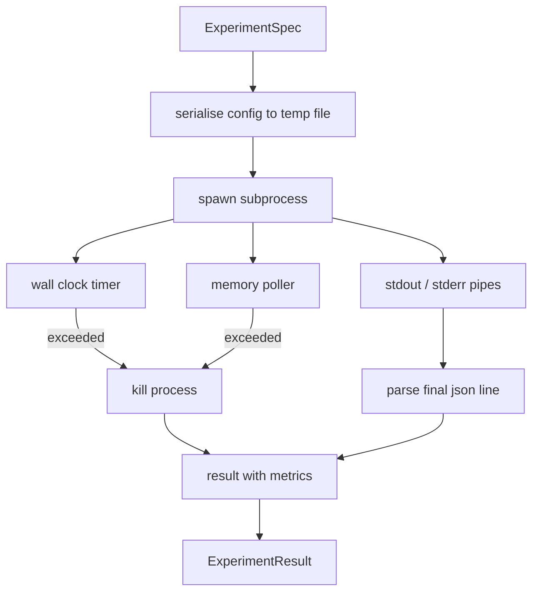

# प्रयोग धावक

> लूप केवल अपने माप के रूप में ईमानदार है। एक रनर का निर्माण जो एक विनिर्देश लेता है, इसे एक सैंडबॉक्स में निष्पादित करता है, और एक json मीट्रिक ब्लाब जारी करता है जो मूल्यांकनकर्ता भरोसा कर सकता है।

**Type:** Build
**Languages:** Python
**Prerequisites:** Phase 19 Track A lessons 20-29
**Time:** ~90 minutes

## सीखने के लक्ष्य
- एक प्रयोग को एक टाइप किए गए विनिर्देश के रूप में एन्कोड करें जो धावक एक उपप्रक्रिया में क्रमबद्ध कर सकता है।
- एक हार्ड दीवार घड़ी समय और एक नरम स्मृति कैप के साथ एक उपप्रक्रिया शुरू, और दोनों टर्मिनल स्थितियों के रूप में सतह.
- एक एकल परिणाम रिकॉर्ड में स्टडआउट, स्टडरर और संरचित मीट्रिक ब्लाब को कैप्चर करें।
- एक निश्चित आधार विनिर्देश पर एक समय में एक विन्यास बटन को फ़्रेश करने वाली एक अपघटन तालिका बनाएं।
- प्रत्येक परिणाम एक बीज दिए गए निर्धारक बनाए रखें ताकि मूल्यांकनकर्ता रन के पार समान संख्याओं को देखे।

## उपप्रक्रिया क्यों

एक शोध लूप अविश्वसनीय कोड चलाता है। परिकल्पना एक नमूना लेने वाले से आई, प्रयोग स्क्रिप्ट एक ही पथ से आया; प्रक्रिया में सुरक्षित के रूप में या तो इलाज करने के लिए एक दुर्घटना का अनुरोध है जो ऑर्केस्ट्रेटर को नीचे ले जाता है। उपप्रक्रियाएं सबसे सरल अलगाव भाषा जहाज हैंः एक अलग प्रक्रिया, एक स्वतंत्र पता स्थान, माता-पिता के पक्ष पर एक संकेत हैंडल।

यहां धावक पूर्ण सैंडबॉक्सिंग लागू नहीं करता है। कोई cgroup नहीं है, कोई seccomp फ़िल्टर नहीं है, कोई नामस्थान रीमैपिंग नहीं है। इसके पास एक दीवार घड़ी टाइमआउट, स्मृति वृद्धि के लिए एक मतदान लूप और एक मार पथ है जो प्रक्रिया को किसी भी सीमा पर समाप्त करता है। यह रनटाइम अनुबंध है हर बार जब अधिक परिष्कृत सैंडबॉक्स विस्तारित होता है। पाठ अनुबंध को एक बैठने में पढ़ने के लिए पर्याप्त छोटा रखता है।

## प्रयोगशैली का आकार

```text
ExperimentSpec
  spec_id        : str            (stable id, "exp_001")
  hypothesis_id  : int            (link back to the queue from lesson 50)
  script_path    : str            (path to the python script to run)
  config         : dict           (passed to the script as one json arg)
  seed           : int            (deterministic seed for the experiment)
  wall_timeout_s : float          (hard timeout, killed on exceed)
  memory_cap_mb  : int            (soft cap, polled; killed on exceed)
  metric_keys    : list[str]      (which fields the evaluator will read)
```

स्क्रिप्ट डिस्क पर रहता है; रनर एक टेम्प फ़ाइल पथ पर कॉन्फ़िग लिखता है जिसे स्क्रिप्ट पढ़ता है। स्क्रिप्ट से स्टडआउट पर एक एकल json लाइन प्रिंट करने की उम्मीद है जिसकी कुंजी `metric_keys`स्टडआउट पर कुछ और भी कैप्चर किया जाता है लेकिन मेट्रिक्स पार्सर द्वारा अनदेखा किया जाता है।

```figure
cg-runner-limits
```

## वास्तुकला



धावक एक वर्ग है जिसमें एक मुख्य विधि है। पोलर एक छोटा सा धागा है जो प्रत्येक मतदान अंतराल में एक बार जागता है और उपप्रक्रिया को पढ़ता है।`psutil`जब उपलब्ध हो तो प्रो फाइल सिस्टम से समकक्ष, जब प्लेटफॉर्म इसे उजागर नहीं करता है तो वापस कोई ऑपरेशन नहीं हो जाता है।

## क्यों एक नरम स्मृति कैप

हार्ड मेमोरी कैप की आवश्यकता है `resource.setrlimit`और केवल POSIX पर काम करें। पाठ एक पोर्टेबल दृष्टिकोण भेजता हैः मंच से निवासी सेट आकार का सर्वेक्षण करें और उपप्रक्रिया को मार दें यदि यह कैप से अधिक हो। कैप नरम है क्योंकि पोलर में गैर-शून्य अंतराल है; एक प्रक्रिया सर्वेक्षणों के बीच कैप से ऊपर बढ़ सकती है और फिर पीछे गिर सकती है। धावक अधिकतम अवलोकन आरएसएस रिकॉर्ड करता है ताकि मूल्यांकनकर्ता देख सके कि दौड़ सीमा के करीब कितनी करीब आई।

प्रक्रिया निरीक्षण समर्थन के बिना प्रणालियों पर, सर्वेक्षणकर्ता एक बार चेतावनी लॉग करता है और खुद को निष्क्रिय करता है। दीवार घड़ी समय सीमा अभी भी लागू होती है। पाठ परीक्षण दोनों पथों को कवर करते हैं।

## स्टड और स्टडर को पकड़ना

धावक दोनों पाइपों को पूरा करने पर खारिज करता है। स्टडआउट को लाइन द्वारा लाइन स्कैन किया जाता है; अंतिम पंक्ति जो सभी आवश्यक के साथ json के रूप में पार्स करती है।`metric_keys`पहले के json रेखाओं के परिणाम में रखा जाता है`intermediate_metrics`; मूल्यांकनकर्ता इनका उपयोग सीखने के वक्रों के लिए कर सकता है।

स्ट्रेडर को परिणाम में शाब्दिक रूप से कैप्चर किया जाता है। धावक कभी भी गैर-शून्य प्रस्थान कोड पर नहीं उठता है; इसके बजाय यह परिणाम में कोड रिकॉर्ड करता है। कोई भी गैर-शून्य प्रस्थान लेबल किया जाता है `"crash"`यहां तक कि जब स्क्रिप्ट माप प्रिंट किया, तो मूल्यांकनकर्ता डिफ़ॉल्ट रूप से आंशिक रन के रूप में विफलताओं का इलाज करता है।

## क्षरण तालिका

```python
def ablate(base: ExperimentSpec, knob: str, values: list[Any]) -> list[ExperimentSpec]:
    ...
```

एक आधार विनिर्देश और एक बटन नाम दिया गया है, सहायक प्रति मूल्य एक विनिर्देश वापस करता है `config[knob]`प्रत्येक विनिर्देश एक व्युत्पन्न प्राप्त होता है`spec_id`(`f"{base.spec_id}_{knob}_{value}"`) धावक एक जहाज चलाता है `AblationRunner`जो उन्हें क्रम में चलाता है और एक वापस देता है `AblationTable`बटन मूल्य द्वारा कुंजीकृत।

एक समय में एक बटन क्यों। पूर्ण कारक स्वीप तेजी से विस्फोट करते हैं और परिणाम उत्पन्न करते हैं जो मूल्यांकनकर्ता व्याख्या नहीं कर सकता है। एक बटन एक समय में एक साफ अक्ष का उत्पादन करता है जो मूल्यांकनकर्ता खींच सकता है। पाठ केवल कॉल करने वाले द्वारा बनाई गई दोहराए गए एकल बटन अपवर्तन के रूप में मल्टी-बंद स्वीप का समर्थन करता है।

## निर्धार

प्रत्येक स्पेसिफिकेशन में एक बीज होता है। धावक बीज को कॉन्फिग डिटेक्ट के माध्यम से स्क्रिप्ट को अग्रेषित करता है (`config["__seed"] = spec.seed`                                            `code/experiments/`सीड का सम्मान करें और रन में समान मीट्रिक उत्पन्न करें। पाठ 53 में मूल्यांकनकर्ता इस पर निर्भर करता है; निर्धारकतावाद के बिना एक "पतन" एक अलग यादृच्छिक प्रारूपण हो सकता है।

## नकली प्रयोग की स्क्रिप्ट

पाठ एक प्रयोग स्क्रिप्ट जहाजः `code/experiments/sparsity_experiment.py`यह एक वास्तविक स्क्रिप्ट है जो अपनी कॉन्फ़िग फ़ाइल को पढ़ता है, एक नंबरी यादृच्छिक पास के साथ एक छोटे से प्रशिक्षण रन का अनुकरण करता है, और एक json मीट्रिक्स ब्लाब प्रिंट करता है। स्क्रिप्ट एक सम्मान करता है`sleep_s`परीक्षण समय और एक `allocate_mb`स्मृति पोलर का परीक्षण करने के लिए बटन।

सिमुलेशन कुछ भी वास्तविक नहीं है। यह एक संख्यात्मक गणना है जो प्रशिक्षण लूप के आकार की नकल करती हैः एक हानि वक्र, अंतिम भ्रम, दीवार समय। पाठ का बिंदु धावक है, सिमुलेशन नहीं। एक वास्तविक प्रयोग स्क्रिप्ट एक मॉडल आयात करेगा।

## परिणाम आकार

```text
ExperimentResult
  spec_id              : str
  hypothesis_id        : int
  exit_code            : int
  terminal             : "ok" | "timeout" | "oom" | "crash"
  wall_time_s          : float
  peak_rss_mb          : float | None
  metrics              : dict
  intermediate_metrics : list[dict]
  stdout_tail          : str
  stderr_tail          : str
```

मूल्यांकनकर्ता पढ़ता है `metrics`और `terminal`पहले. अगर टर्मिनल कुछ और है`"ok"`प्रयोग विफल रन के रूप में गिना जाता है और मूल्यांकनकर्ता का फैसला स्वचालित है। अन्यथा माप महत्वपूर्णता परीक्षण से गुजरते हैं।

## कोड कैसे पढ़ें

`code/main.py`परिभाषित करता है `ExperimentSpec`,`ExperimentResult`,`ExperimentRunner`,`AblationRunner`, और एक निर्धारात्मक डेमो. उपप्रक्रिया प्रबंधन एक वर्ग है. स्मृति पोलर एक छोटा सा धागा है. विघटन सहायक एक एकल समारोह है.

`code/experiments/sparsity_experiment.py`यह आरजीवी से अपनी कॉन्फ़िग फ़ाइल पथ को पढ़ता है और पूरा होने पर एक एकल जेसन मेट्रिक्स लाइन लिखता है।

`code/tests/test_runner.py`सफलता पथ, समय सीमा पथ, दुर्घटना पथ, अपघटन तालिका, और दो रन पर निर्धारिता जांच को कवर करता है।

## जहां यह स्लॉट में

पाठ पचास परिकल्पना उत्पन्न करता है। पाठ पचास एक साहित्य पहले से ही तय कुछ भी बाहर फिल्टर करता है। पाठ पचास दो जो कुछ भी बचा है के लिए प्रयोग चलाता है। पाठ पचास तीन परिणाम पढ़ता है, महत्व परीक्षण चलाता है, और परिकल्पना आईडी के खिलाफ ऑर्केस्ट्रेटर के स्टोर फैसले लिखता है।
