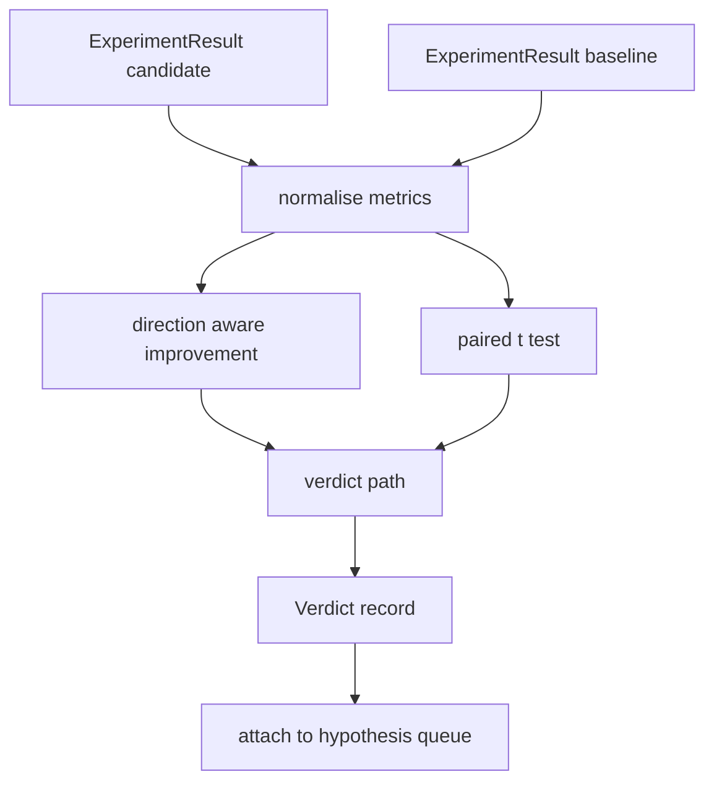

# परिणाम मूल्यांकनकर्ता

> धावक ने संख्याएँ उत्पन्न कीं। मूल्यांकनकर्ता तय करता है कि क्या ये संख्याएँ सुधार, प्रतिगमन या शोर हैं। निर्णय पथ का निर्माण करें जो मेट्रिक्स को एक पंक्ति के निष्कर्ष में बदल देता है।

**Type:** Build
**Languages:** Python
**Prerequisites:** Phase 19 Track A lessons 20-29
**Time:** ~90 minutes

## सीखने के लक्ष्य
- दिशा जागरूक सुधार और एक निश्चित सीमा का उपयोग करके एक उम्मीदवार की दौड़ की तुलना एक आधार रेखा के साथ करें।
- प्रति बीज मेट्रिक्स पर खरोंच से एक जोड़ी t परीक्षण चलाएं और परिणाम p मान पढ़ें।
- लॉग स्केल मेट्रिक्स को सामान्य बनाएं ताकि डाउनस्ट्रीम रिपोर्ट उन्हें रैखिक मेट्रिक्स के साथ मिला सके।
- एक परिकल्पना पर फैसला जारी करें कि संगीतकार पाठ 50 से कतार में संलग्न कर सकते हैं।
- हर कदम को शुद्ध रखें ताकि एक ही इनपुट हमेशा एक ही फैसला लाए।

## क्यों एक जोड़ी परीक्षण

धावक से एक भी संख्या यह नहीं बताती कि परिवर्तन वास्तविक है या नहीं। एक ही संयोजन से एक अलग बीज एक अलग जटिलता पैदा करता है। परिवर्तन शोर हो सकता है। सही तुलना जोड़ी हैः एक ही बीज एक ही डेटा के साथ, एक बार उम्मीदवार के साथ और एक बार बेसलाइन के साथ चलाया गया। प्रत्येक बीज एक अंतर में योगदान देता है। इन अंतरों का औसत प्रभाव है। इन अंतरों की मानक त्रुटि शोर तल है।

पाठ परीक्षण को खरोंच से लागू करता है।`scipy.stats`गणित एक स्क्रीन पर पढ़ने के लिए पर्याप्त छोटा है।

```text
diffs    = [a_i - b_i for i in seeds]
mean     = sum(diffs) / n
variance = sum((d - mean) ** 2 for d in diffs) / (n - 1)
t_stat   = mean / sqrt(variance / n)
df       = n - 1
p_value  = two_sided_p(t_stat, df)
```

दो पक्षीय p मान एक नियमित अधूरा बीटा फ़ंक्शन का उपयोग करता है। पाठ एक छोटा सा कार्यान्वयन भेजता है जो लेंट्ज़ निरंतर अंश का उपयोग करता है। पूरी बात stdlib गणित की साठ पंक्तियों है।

## दिशा जागरूक सुधार

कुछ मीट्रिक में वृद्धि के साथ सुधार होता है (सटीकता, आउटपुट) जबकि अन्य में गिरावट के साथ सुधार होता है (हानि, उलझन, दीवार समय) । मूल्यांकनकर्ता एक `direction`प्रत्येक मेट्रिक पर क्षेत्र।

```text
if direction == "higher_is_better":
    improvement = (candidate - baseline) / abs(baseline)
elif direction == "lower_is_better":
    improvement = (baseline - candidate) / abs(baseline)
```

सुधार पर हस्ताक्षर किए गए हैं एक उच्च पर नकारात्मक सुधार बेहतर मीट्रिक का मतलब है उम्मीदवार बदतर है। फैसले पथ संकेत और परिमाण को एक साथ पढ़ता है।

एक समतल सीमा (`improvement_threshold=0.02`, दो प्रतिशत) तय करता है कि क्या परिवर्तन कॉल करने के लिए पर्याप्त बड़ा है। इसके नीचे निर्णय p मान के बावजूद "गर्जना" है; लूप उपयोगकर्ता माप नहीं सकता परिवर्तनों में रुचि नहीं रखता है।

```figure
cg-paired-verdict
```

## वास्तुकला



मूल्यांकनकर्ता तीन स्वतंत्र गणना करता है और उन्हें निर्णय पथ में जोड़ता है। प्रत्येक गणना एक शुद्ध फ़ंक्शन है जिसमें कोई साझा स्थिति नहीं है।

## लॉग सामान्यीकरण

गुमनामता हानि में तेजी से होती है। 0.1 हानि में गिरावट गुमनामता में बहुत अधिक गिरावट है। सीधे दो कॉन्फ़िगरेशनों के बीच गुमनामता की तुलना करना ठीक है, लेकिन इसे एक ही रिपोर्ट में रैखिक माप के साथ मिलाकर सामान्यीकरण की आवश्यकता होती है।

पाठ किसी भी मीट्रिक को सामान्य बनाता है जिसका `scale`क्षेत्र है `"log"`सुधार की गणना करने से पहले प्राकृतिक लॉग को ले जाकर। तब लॉग स्थान में सीमा लागू की जाती है। 32 से 28 तक एक जटिलता गिरावट है`log(28) - log(32) = -0.133`एक कम पर बेहतर मीट्रिक है, जो दो प्रतिशत की सीमा से बहुत ऊपर है।

```text
if scale == "log":
    a = log(candidate)
    b = log(baseline)
else:
    a = candidate
    b = baseline
```

 के साथ मेट्रिक्स`scale="linear"`(पूर्वनिर्धारित) परिवर्तन छोड़ दें. एक ही कोड पथ दोनों को संभालता है.

## प्रति बीज जोड़ी परीक्षण

पाठ 52 के धावक को प्रति रन एक अंतिम मीट्रिक ब्लाब जारी किया जाता है। जोड़े परीक्षण के लिए मूल्यांकनकर्ता को उम्मीदवार के लिए प्रति बीज और बेसलाइन के लिए प्रति बीज एक ब्लाब की आवश्यकता होती है। ऑर्केस्ट्रेटर दोनों कॉन्फ़िगरेशन के तहत एक ही प्रयोग चलाता है और मूल्यांकनकर्ता को बीज की एक सूची पर दो सूची देता है।`ExperimentResult`रिकॉर्ड।

मूल्यांकनकर्ता उन्हें बीज के अनुसार जोड़ता है (बीज में रहता है)`result.metrics["seed"]`यदि दोनों सूचियों में बीज मेल नहीं खाते हैं, तो मूल्यांकनकर्ता एक `PairingError`. . संगीतकार को फिर से दौड़ना चाहिए.

## फैसले का आकार

```text
Verdict
  hypothesis_id          : int
  metric                 : str
  direction              : "higher_is_better" | "lower_is_better"
  scale                  : "linear" | "log"
  candidate_mean         : float
  baseline_mean          : float
  improvement            : float       (signed, fraction; see direction rules)
  p_value                : float | None  (None if n < 2)
  significance_threshold : float
  improvement_threshold  : float
  verdict                : "improved" | "regressed" | "noise" | "failed"
  rationale              : str
```

निर्णय पथ एक छोटी सी निर्णय तालिका हैः

```text
1. If any candidate result has terminal != "ok": verdict = "failed"
2. else if |improvement| < improvement_threshold:  verdict = "noise"
3. else if p_value is None or p_value > significance: verdict = "noise"
4. else if improvement > 0:                          verdict = "improved"
5. else:                                             verdict = "regressed"
```

तर्क एक पंक्ति मानव पठनीय वाक्य है जो संगीतकार परिकल्पना आईडी के खिलाफ लॉग कर सकता है।

## कोड कैसे पढ़ें

`code/main.py`परिभाषित करता है `MetricSpec`,`Verdict`,`Evaluator`t परीक्षण शुद्ध stdlib गणित में लागू किया जाता है; numpy का उपयोग केवल मीट्रिक सूची और गणना साधनों और भिन्नताओं को पढ़ने के लिए किया जाता है।

`code/tests/test_evaluator.py`सुधारित पथ, पीछे हटने वाला पथ, शोर पथ (छोटा सुधार), शोर पथ (कम n), विफल टर्मिनल पथ, लॉग सामान्यीकृत पथ, ज्ञात संदर्भ मूल्य के खिलाफ t परीक्षण और जोड़ी त्रुटि को कवर करता है।

## जहां यह स्लॉट में

पाठ पचास ने परिकल्पना कतार का उत्पादन किया। पाठ पचास-एक ने साहित्य द्वारा तय किए गए किसी भी मामले को फ़िल्टर किया। पाठ पचास-दो ने बीज के बीच उम्मीदवार और बेसलाइन कॉन्फ़िगरेशन के तहत प्रयोग चलाया। पाठ पचास-तीन उन रन को पढ़ता है और फैसला लिखता है। ऑर्केस्ट्रेटर चार को एक साथ जोड़ता हैः

```text
for hypothesis in queue:
    literature = retrieval.search(hypothesis.text)
    if literature_settles(hypothesis, literature):
        attach(hypothesis, verdict="settled")
        continue
    candidates = runner.run_all(specs_for(hypothesis))
    baselines  = runner.run_all(baseline_specs_for(hypothesis))
    metric_spec = MetricSpec("perplexity", direction=LOWER, scale=LOG)
    verdict = evaluator.evaluate(hypothesis.id, metric_spec, candidates, baselines)
    attach(hypothesis, verdict)
```

यह ऑर्केस्ट्रेटर इस पाठ में नहीं है; चार पाठ इसमें प्रत्येक डेटाक्लास से परे किसी भी चिपकने के बिना बनाते हैं।
