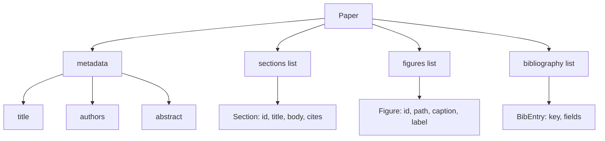
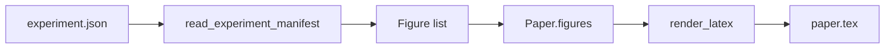
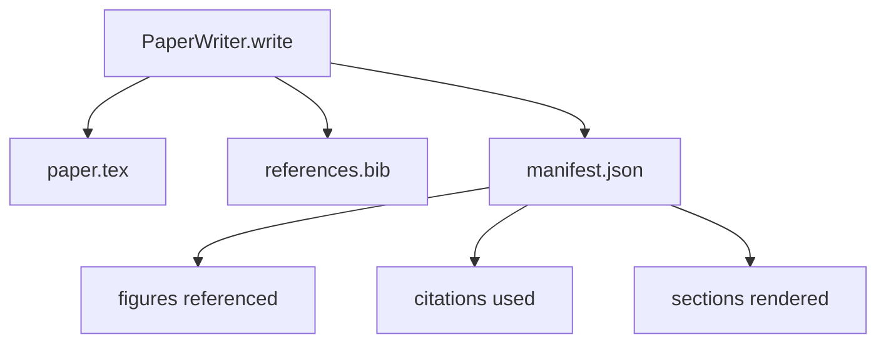

# पेपर लेखक

> एक LaTeX कंकाल एक अनुबंध है जो शोधकर्ता और टाइपसेटर के बीच होता है। यदि अनुबंध टूट जाता है तो दस्तावेज़ संकलित नहीं होता है, और विफलता जोर से होती है। पहले कंकाल बनाएं, फिर इसे भरें।

**Type:** Build
**Languages:** Python
**Prerequisites:** Phase 19 lessons 50-53
**Time:** ~90 minutes

## सीखने के लक्ष्य

- एक शोध पत्र को एक संरचित कलाकृत्य के रूप में ज्ञात अनुभाग ग्राफ के साथ व्यवहार करें, मुक्त रूप के दस्तावेज़ के रूप में नहीं।
- एक लाटेक्स कंकाल उत्पन्न करें जो किसी भी गद्य लिखने से पहले अपने सार, खंड, आकृति स्लॉट और ग्रंथ सूची की घोषणा करता है।
- एक निर्धारक स्लॉट तंत्र के माध्यम से प्रयोग आउटपुट (पथ और कैप्शन) से आंकड़े कंकाल में इंजेक्ट करें।
- एक व्यंग्य प्रोजोजेंटर को तार करें जो एक संरचित रूपरेखा से प्रत्येक खंड को भरता है ताकि बिना मॉडल के हार्नेस का परीक्षण किया जा सके।
- एक एकल जारी करें `paper.tex`एक प्लस `references.bib`और एक मैनिफेस्ट जो संदर्भित प्रत्येक आंकड़े और उपयोग किए गए प्रत्येक उद्धरण को सूचीबद्ध करता है।

```figure
ch-paper-skeleton
```

## पहले एक कंकाल क्यों

एक मसौदा जो प्रोसा के रूप में शुरू होता है, संरचनात्मक ऋण जमा करता है। परिचय में तीन पैराग्राफ होते हैं जो संबंधित काम में होने चाहिए। एक आंकड़ा परिभाषित होने से पहले संदर्भित किया जाता है। ग्रंथ संग्रह एक ही पेपर के लिए तीन कुंजी के साथ समाप्त होता है। जब लेखक नोटिस करता है, तब पुनर्लेखन लागत लेखन लागत से अधिक होती है।

एक कंकाल इसे उल्टा करता है। संरचना को डेटा के रूप में अग्रिम में घोषित किया जाता है। अनुभाग नाम और क्रम के साथ स्लॉट हैं। आंकड़े पहचान पत्र और कैप्शन के साथ स्लॉट हैं। शीर्ष पर उन प्रविष्टियों के साथ पुस्तकालय कुंजी घोषित की जाती है जिनकी ओर वे संकेत करते हैं। गद्य एक-एक करके उन स्लॉट में उत्पन्न होता है। हर गद्य लिखने से पहले यह पुष्टि कर सकता है कि प्रत्येक आकृति में एक स्लॉट है, प्रत्येक उद्धरण में एक प्रविष्टि है, और प्रत्येक खंड सामग्री तालिका में दिखाई देता है।

यह वही अनुशासन है जो पहले के पाठ योजनाओं, उपकरण कॉल और निशान पर लागू किया गया था। संरचना अनुबंध है।

## कागज का आकार



प्रत्येक क्षेत्र सादे पायथन डेटा है. रेंडरर एक शुद्ध समारोह है `Paper`हर्नस रेंडर करने से पहले कागज को आत्मनिरीक्षण कर सकता हैः अनुभागों की गिनती, यादृच्छिक आंकड़े फ़ाइलों की सूची, जांचें कि हर `\cite{key}`एक मेल खाता है `BibEntry`. .

## रिटर्न अनुबंध

रेंडरर तीन गुणों की गारंटी देता है। पहले, कंकाल में प्रत्येक आकृति स्लॉट एक उत्सर्जन करता है`\begin{figure}`फॉर्म के स्थिर लेबल वाली ब्लॉक `fig:<id>`दूसरा, प्रत्येक खंड एक उत्सर्जन करता है`\section{}`फॉर्म के स्थिर लेबल के साथ `sec:<id>`इसलिए क्रॉस-रेफरेंस काम करते हैं। तीसरा, ग्रंथ संग्रह एक`\bibliography`ब्लॉक जिसका `references.bib`कागज पर घोषित प्रविष्टियों में से कोई अधिक या कम नहीं है।

इन में से किसी एक का उल्लंघन करना एक रेंडर त्रुटि है, चेतावनी नहीं। कंकाल अनुबंध है; एक रेंडर जो चुपचाप एक आंकड़ा गिराता है अनुबंध टूटता है।

## प्रयोगों से आंकड़ा इंजेक्शन

इस ट्रैक में पहले के पाठों ने JSON प्रकट के रूप में प्रयोग के आउटपुट उत्पन्न किए। प्रत्येक प्रकट में पथ और लघु कैप्शन के साथ कलाकृतियों की एक सूची है। पेपर लेखक पढ़ता है जो प्रकट और उत्पन्न करता है `Figure`रिकॉर्ड।



इंजेक्शन निर्धारक है। आकृति आईडी प्रयोग के नाम और एक एकांत काउंटर से प्राप्त होते हैं। कैप्शन मैनिफिस से आते हैं। पथ पेपर की आउटपुट निर्देशिका के सापेक्ष सामान्य होते हैं ताकि लैटेक्स तब भी संकलन करता है जब प्रयोग आउटपुट डिस्क पर कहीं और बैठते हैं।

## व्यंग्य गद्य जनरेटर

पाठ एक मॉडल नहीं बुलाता है।`MockProseGenerator`एक संक्षिप्त वाक्य में एक संक्षिप्त वाक्य है जो एक संक्षिप्त वाक्य में एक संक्षिप्त वाक्य में एक संक्षिप्त वाक्य में एक संक्षिप्त वाक्य में एक संक्षिप्त वाक्य में एक संक्षिप्त वाक्य में एक संक्षिप्त वाक्य में एक संक्षिप्त वाक्य में एक संक्षिप्त वाक्य में एक संक्षिप्त वाक्य में एक संक्षिप्त वाक्य में एक संक्षिप्त वाक्य में एक संक्षिप्त वाक्य में एक संक्षिप्त वाक्य में एक संक्षिप्त वाक्य में एक संक्षिप्त वाक्य में एक संक्षिप्त वाक्य में एक संक्षिप्त वाक्य में एक संक्षिप्त वाक्य में एक संक्षिप्त वाक्य में एक संक्षिप्त वाक्य में एक संक्षिप्त वाक्य में एक संक्षिप्त वाक्य में एक संक्षिप्त वाक्य में एक संक्षिप्त वाक्य में एक संक्षिप्त वाक्य में एक संक्षिप्त वाक्य में एक संक्षिप्त वाक्य में एक संक्षिप्त वाक्य में एक संक्षिप्त वाक्य में एक संक्षिप्त वाक्य में एक संक्षिप्त वाक्य में एक संक्षिप्त वाक्य में एक संक्षिप्त वाक्य में एक संक्षिप्त वाक्य में एक संक्षिप्त वाक्य में एक संक्षिप्त वाक्य में एक संक्षिप्त वाक्य में एक संक्षिप्त वाक्य में एक संक्षिप्त वाक्य में एक संक्षिप्त वाक्य में एक संक्षिप्त वाक्य में एक संक्षिप्त वाक्य में एक संक्षिप्त वाक्य में एक संक्षिप्त वाक्य में एक संक्षिप्त वाक्य में एक वाक्य में एक वाक्य में एक वाक्य में एक वाक्य में एक वाक्य में एक वाक्य में एक वाक्य में एक वाक्य में एक वाक्य में एक वाक्य में एक वाक्य में एक वाक्य में एक वाक्य में एक वाक्य में एक वाक्य में एक वाक्य में एक वाक्य में एक वाक्य में एक वाक्य में एक वाक्य में एक वाक्य में एक वाक्य में एक वाक्य में एक वाक्य में एक वाक्य में एक वाक्य में एक वाक्य में एक वाक्य में एक वाक्य में एक वाक्य में एक वाक्य में एक वाक्य में एक वाक्य में एक वाक्य में एक वाक्य में एक वाक्य में एक वाक्य में वाक्य में वाक्य में वाक्य में वाक्य में वाक्य में वाक्य में वाक्य में वाक्य में वाक्य में वाक्य में वाक्य में वाक्य में वाक्य में वाक्य में वाक्य में वाक्य में वाक्य में वाक्य में वाक्य में वाक्य में वाक्य में वाक्य में वाक्य में वाक्य में वाक्य में वाक्य में वाक्य में वाक्य में वाक्य में वाक्य में वाक्य में वाक्य में वाक्य में वाक्य में वाक्य में वाक्य में वाक्य में वाक्य में वाक्य में वाक्य में वाक्य में वाक्य में वाक्य में वाक्य में वाक्य में वाक्य में वाक्य में वाक्य में वाक्य में वाक्य में वाक्य में वाक्य में वाक्य में वाक्य में वाक्य में

यह लेखक के हर व्यवहार का परीक्षण करने के लिए पर्याप्त है। एक वास्तविक कार्यान्वयन जनरेटर को मॉडल कॉल के लिए बदल देगा। इसके आसपास का हर्नल नहीं बदलता है। यह प्रोसा जनरेटर को कॉल करने योग्य घोषित करने का मूल्य हैः परीक्षण एक निर्धारक को बदल देता है, उत्पादन एक मॉडल को बदल देता है, बाकी पाइपलाइन समान है।

## प्रकट आउटपुट

लेखक आउटपुट निर्देशिका में तीन फ़ाइलें जारी करता है।



मैनिफिस वह है जो डाउनस्ट्रीम मूल्यांकनकर्ता या आलोचक लूप पढ़ता है। यह लाटेक्स को नहीं पढ़ता है; यह मैनिफिस पढ़ता है। अगला पाठ, आलोचक लूप, इस मैनिफिस को इनपुट के रूप में लेता है और एक प्रतिक्रिया सूची बनाता है। यही कारण है कि मैनिफिस अनुबंध का हिस्सा है और लाटेक्स नहीं है।

## सत्यापन गेट

लेखक किसी भी फाइल को लिखने से पहले चार गेट चलाता है।

1. प्रत्येक अंक आईडी कागज के भीतर अद्वितीय है।
2. हर खंड के `cites`क्षेत्र में एक bibliography key का संदर्भ दिया जाता है जो कागज पर घोषित किया जाता है।
3. सार खाली नहीं है।
4. शीर्षक खाली नहीं है।

एक विफल गेट उठता है `PaperValidationError`एक सटीक कारण के साथ. हर्नस विफलता मोड के रूप में कारण को सतह पर लाता है. कोई आंशिक लेखन नहीं हैः या तो सभी तीन फ़ाइलें जारी की जाती हैं, या कोई भी नहीं।

## कोड कैसे पढ़ें

`code/main.py`परिभाषित करता है `Paper`,`Section`,`Figure`,`BibEntry`,`PaperValidationError`,`MockProseGenerator`,`PaperWriter`, और एक `render_latex`कार्य।`write`विधि एक आउटपुट निर्देशिका लेता है और जारी करता है `paper.tex`,`references.bib`और `manifest.json`. . .`read_experiment_manifest`सहायक प्रयोगों की सूची को प्रकट करता है में परिवर्तित करता है `Figure`रिकॉर्ड।

`code/tests/test_paper_writer.py`कवरः बिना खंडों के कंकाल रेंडर, दो खंडों और दो आंकड़ों के साथ पूर्ण रेंडर, गायब उद्धरण गेट, डुप्लिकेट-आंकड़े-आईडी गेट, प्रकट सामग्री, और LaTeX स्ट्रिंग अनुबंध (प्रत्येक खंड एक `\section{}`, प्रत्येक आंकड़ा एक उत्सर्जन करता है`\begin{figure}`) ।

## आगे बढ़ना

दो विस्तार एक वास्तविक कार्यान्वयन की आवश्यकता होगी. पहला, बहु स्वरूप प्रस्तुतः एक ही `Paper`ब्लॉग पोस्ट के लिए मार्कडाउन और पूर्वावलोकन के लिए HTML में रूप संकलित करता है। रेंडरर पर एक रणनीति बन जाता है `Paper`. दूसरा, उद्धरण संवर्धनः लेखक एक उद्धरण कुंजी से BibTeX प्रविष्टियों को प्राप्त करता है, जो DOI के स्थानीय कैश को देखते हैं। दोनों जोड़ मूल्य, दोनों को कंकाल अनुबंध को छूने के बिना जोड़ा जा सकता है।

स्केलेटन है दांव. खंड, आंकड़े, और उद्धरण डेटा के रूप में घोषित, स्लॉट में उत्पन्न गद्य, लाटेक्स के साथ जारी किया गया घोषणा। हर अन्य सुधार शीर्ष पर बना है।
