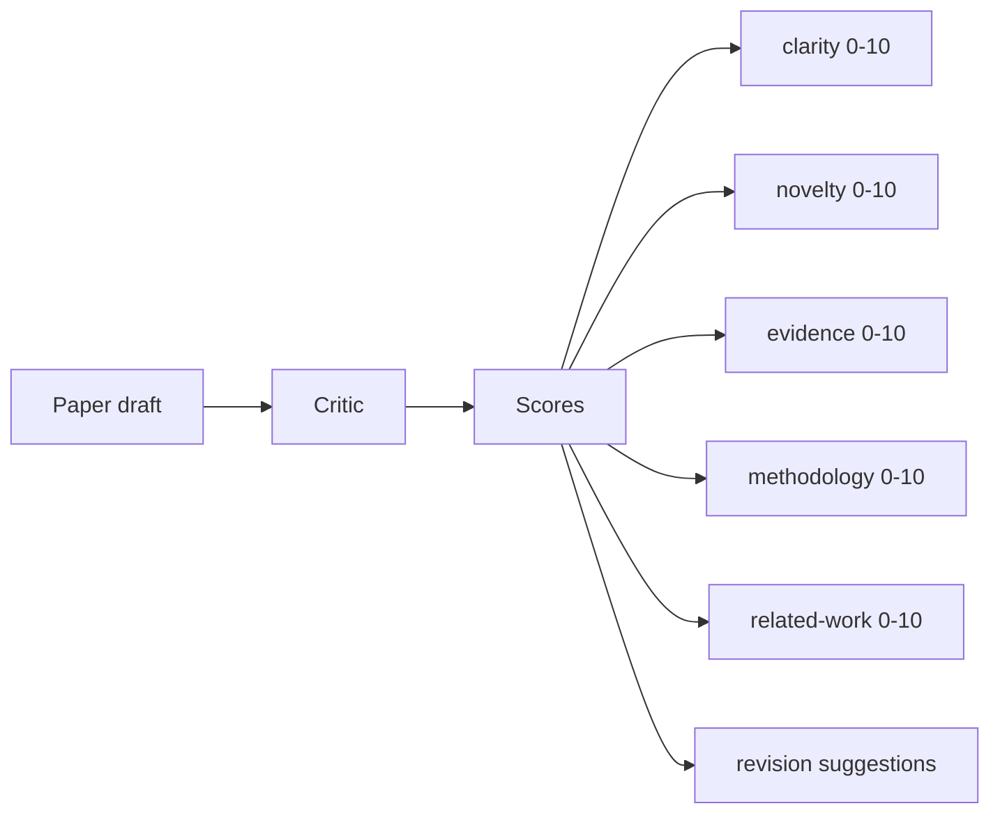
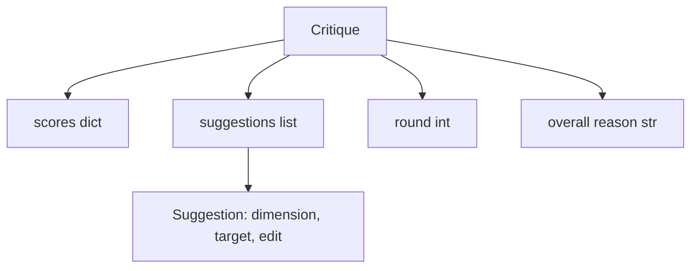
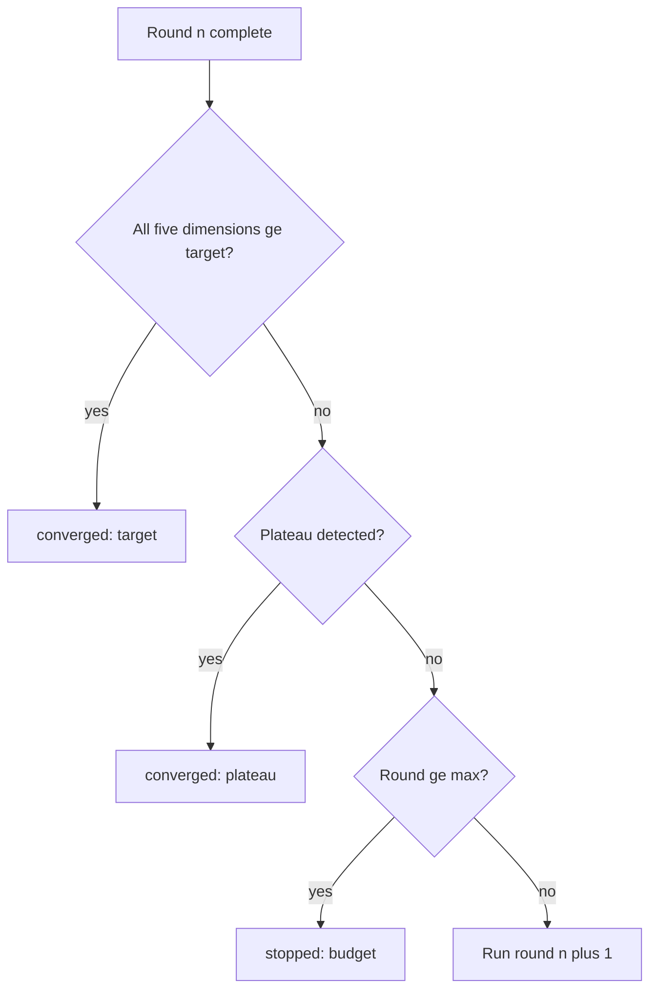
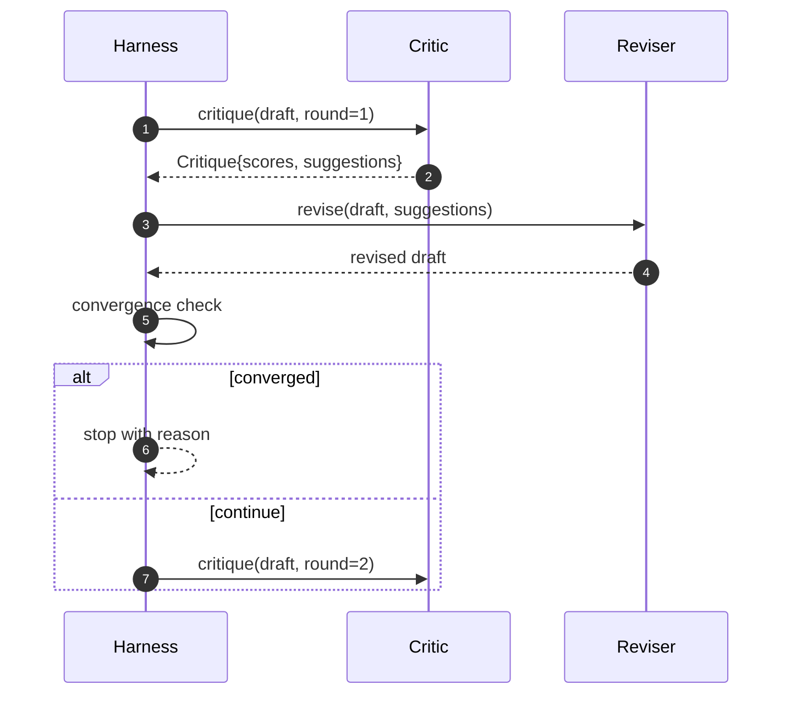

# आलोचनात्मक लूप

> एक आलोचक जो पहली बार "अच्छा लगता है" लौटता है टूट जाता है। एक आलोचक जो हमेशा "काम की जरूरत है" लौटता है टूट जाता है। दिलचस्प आलोचक वह है जो अभिसरण करता है, और आपको अभिसरण को इंजीनियर करना होगा।

**Type:** Build
**Languages:** Python
**Prerequisites:** Phase 19 lessons 50-53
**Time:** ~90 minutes

## सीखने के लक्ष्य

- पांच निश्चित आयामों के आधार पर पेपर ड्राफ्ट को स्कोर करेंः स्पष्टता, नवीनता, साक्ष्य, पद्धति, संबंधित कार्य।
- प्रत्येक दौर की आलोचना को एक मुक्त रूप के पुनर्लेखन के बजाय एक संरचित संशोधन अंतर के रूप में लागू करें।
- राउंड के बीच स्कोर की तुलना करके अभिसरण का पता लगाएं; पठार पर रोकें, लक्ष्य पूरा करें, या बजट समाप्त हो जाए।
- कैप राउंड्स के साथ अधिकतम आवर्तन बजट है इसलिए एक गैर-मौजूद आलोचक हमेशा के लिए नहीं चलता है।
- प्रति राउंड एक निशान जारी करें ताकि डैशबोर्ड या अगले चरण स्कोर की प्रक्षेपवक्र प्रस्तुत कर सकते हैं।

```figure
ch-critic-converge
```

## पांच निश्चित आयाम क्यों

एक मुक्त रूप आलोचक एक ऐसा मॉडल है जो सुझावों के एक पैराग्राफ को लौटाता है। अगले दौर की समीक्षा पैराग्राफ को परिवेश संदर्भ के रूप में व्यवहार करती है। क्या पुनर्वचन आलोचना को संबोधित करता है यह सत्यापित नहीं किया जा सकता है क्योंकि आलोचना का कभी संरचना नहीं थी।

पांच आयामों से हर्नस को एक अनुबंध मिलता है।



स्कोर एक वेक्टर है। हर्नस राउंड के माध्यम से प्रत्येक आयाम को देखता है। एक संशोधन जो स्पष्टता बढ़ाता है लेकिन सबूतों को टैंक करता है, सबूतों पर एक प्रतिगमन है, और अभिसरण जांच इसे देखता है। केवल मॉडल आलोचक उस गारंटी की पेशकश नहीं कर सकता है।

## आलोचना का आकार



प्रत्येक सुझाव में वह आयाम होता है जो यह सुधारता है, वह खंड जिसे यह लक्षित करता है, और एक `edit`अनुपालन निर्देश संशोधक लागू कर सकता है। संशोधक एक कॉल करने योग्य भी है। पाठ एक निर्धारात्मक संशोधक भेजता है जो संपादन निर्देश को एक अनुभाग से अनुलग्नक के रूप में व्याख्या करता है। एक मॉडल-चालित संशोधक एक ही क्षेत्र की व्याख्या करेगा। अनुबंध नहीं बदलता है।

## अभिसरण नियम, क्रमशः

तीनों स्थितियों में से किसी एक में आग लगने पर आलोचनात्मक लूप समाप्त हो जाता है।



लक्ष्य सबसे सख्त मामला हैः पांच आयामों (स्पष्टता, नवीनता, सबूत, पद्धति, संबंधित_काम) में से प्रत्येक को पूरा करना चाहिए `>= target_score`(पूर्वनिर्धारित `8.0`) लूप सफलता से पहले लौटता है। एक कमजोर आयाम के साथ एक उच्च औसत पर्याप्त नहीं है। पठार का पता लगाने वर्तमान दौर के औसत की तुलना पिछले दौर के औसत से करता है। यदि सुधार से नीचे है `plateau_epsilon`(पूर्वनिर्धारित `0.1`) दो लगातार राउंड के लिए, लूप से बाहर निकलता है `plateau`बजट राउंड पर एक कठिन सीमा है (डिफ़ॉल्ट रूप से)`5`) और  के साथ बाहर निकलता है`budget`. .

आदेश मायने रखता है। लक्ष्य प्लेटो से जीतता है बजट से जीतता है। यदि तीसरा दौर उसी पुनरावृत्ति पर लक्ष्य को हिट करता है जो एक प्लेटो को भी ट्रिगर करेगा, तो परिणाम है`target`नहीं`plateau`. .

## क्यों पठार का पता लगाने दो राउंड पर चलता है

एक गोल प्लेटो शोर है। एक वास्तविक आलोचक एक निश्चित मसौदा पर भी प्रत्येक पुनरावृत्ति पर थोड़ा अलग स्कोर देता है, क्योंकि निर्धारात्मक स्कोरिंग अभी भी इस बात पर निर्भर करती है कि किस सुझाव को लागू किया गया था और किस क्रम में। दो लगातार प्लेटो राउंड की आवश्यकता होती है जो शोर को फ़िल्टर करती है। यदि हर्नस एक प्लेटो की रिपोर्ट करता है, तो मसौदा वास्तव में सुधार करना बंद कर दिया है।

## इस पाठ में निर्धारक आलोचक

पाठ एक मॉडल नहीं कहता है। शिप किए गए आलोचक एक कॉलबल है जो तीन संकेतों के आधार पर एक ड्राफ्ट को स्कोर करता हैः औसत अनुभाग शरीर की लंबाई (स्पष्टता), आंकड़ा गिनती और उद्धरण गिनती (सबूत) और एक`originality_tag`पेपर मेटाडेटा (नवीनता) पर क्षेत्र। संशोधक जानता है कि प्रत्येक स्कोर को ऊपर कैसे धकेलें।

```text
clarity      grows when the average section body length increases
novelty      grows when originality_tag is set to "high"
evidence     grows when a section's figure_refs is non-empty
methodology  grows when a section titled "Method" exists with body
related-work grows when a section titled "Related Work" exists with body
```

रिवाइजर प्रत्येक सुझाव को एक लक्षित अनुलग्नक के रूप में व्याख्या करता है। पहले दौर के बाद, हर्नस स्कोर को बढ़ते हुए देख सकता है। परीक्षण इस गुण का उपयोग लूप को कम करने के लिए करते हैं।

## पूर्ण लूप अनुबंध



हर्नस गोल काउंटर, ट्रैक और अभिसरण जांच का मालिक है। आलोचक स्कोर का मालिक है। संशोधक अंतर का मालिक है। तीनों में से कोई भी अन्य की स्थिति को छूता नहीं है।

## ट्रैक आउटपुट

प्रत्येक राउंड में एक ट्रैक घटना होती है जिसमें गोल संख्या, स्कोर वेक्टर, सुझाव गिनती और अभिसरण निर्णय होता है। पूर्ण ट्रैक अंतिम ड्राफ्ट के साथ वापस किया जाता है। एक डाउनस्ट्रीम डैशबोर्ड प्रति राउंड चार्ट को प्रस्तुत कर सकता है। अगला पाठ, पुनरावृत्ति अनुसूचक, यह तय करने के लिए ट्रैक पढ़ता है कि क्या शाखा रखने लायक है।

## खराब आलोचकों से रक्षा करने वाले बजट

एक आलोचक जो सुझाव देता है जो स्कोर को कभी बेहतर नहीं करता है वह लूप को अधिकतम-विवाद की छत में बंद कर देगा। निशान इसे दिखाई देता हैः पांच राउंड, स्कोर फ्लैट, फैसला `budget`उपयोगकर्ता यह पढ़ता है कि एक आलोचक बग के रूप में, एक ड्राफ्ट बग नहीं। विकल्प, केवल अंतिम ड्राफ्ट के सतह पर, निदान छिपाता है। ट्रैक-प्रथम डिजाइन इसे सतह पर डालता है।

## कोड कैसे पढ़ें

`code/main.py`परिभाषित करता है `Critique`,`Suggestion`,`Critic`प्रोटोकॉल,`Reviser`प्रोटोकॉल,`CriticLoop`, और एक `make_deterministic_critic_pair`एक न्यूनतम `Paper`आकार शामिल है ताकि पाठ अकेले खड़ा हो।

`code/tests/test_critic_loop.py`कवरः एक राउंड के बाद एकतरफा सुधार, एक ट्यूनेटेड ड्राफ्ट पर लक्ष्य अभिसरण, दो फ्लैट राउंड के बाद पठार का पता लगाना, बजट में सुधार नहीं होने पर बजट की समाप्ति, संशोधितकर्ता द्वारा सुझावों का आवेदन, और निशान आकार।

## आगे बढ़ना

एक वास्तविक कार्यान्वयन के लिए दो विस्तार की आवश्यकता होगी। पहला, आयाम वजनः एक कार्यशाला के लिए एक पेपर में कार्यशाला के लिए उच्चतर नवाचार वजन होता है; एक पत्रिका में इसके विपरीत वजन होता है। अभिसरण जांच एक भारित औसत बन जाती है। दूसरा, जोड़े आलोचकः एक आलोचक स्कोर करता है, दूसरा आलोचक सुझावों का फैसला करता है, रिवीजनर उन्हें देखता है। दोनों मूल्य जोड़ते हैं, दोनों एक ही पर आधारित होते हैं `Critique`आकार।

एक बार जब आलोचना को संरचित किया जाता है, तो प्रत्येक अन्य सुधार, अभिसरण नियम, डैशबोर्ड, जोड़ी आलोचक, लूप को बदलने के बिना गिर जाता है।
