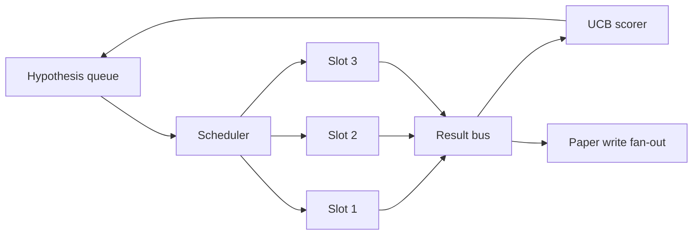
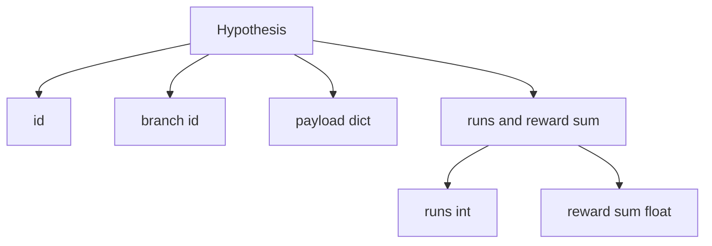
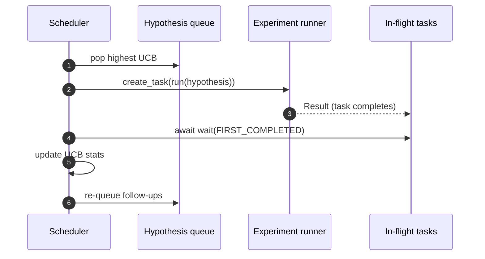

# पुनरावृत्ति अनुसूचक

> एक अनुसूचक के बिना एक शोध लूप भ्रमों के साथ एक कतार है। अनुसूचक वह है जहां लूप तय करता है कि क्या खोज करना बंद करना है, और यह निर्णय पूरे खेल है।

**Type:** Build
**Languages:** Python
**Prerequisites:** Phase 19 lessons 50-53
**Time:** ~90 minutes

## सीखने के लक्ष्य

- एक शोध कार्यप्रवाह को एक परिकल्पना कतार के रूप में मॉडल करें जो समानांतर प्रयोग स्लॉट को खिलाता है जिसका परिणाम वापस फैन में आता है।
- असिनसियो के साथ एक साथ कई प्रयोग चलाएं ताकि शेड्यूलर सभी स्लॉट को व्यस्त रख सके।
- यूसीबी के साथ प्रत्येक परिकल्पना शाखा को स्कोर करें ताकि अनुसूचक अन्वेषण को छोड़ने के बिना कम उपज वाली शाखाओं को काट सके।
- तैयार परिणामों को कागज-लेखन चरण और पुनः कतार चरण में फैलाएं ताकि उच्च उपज वाली शाखा अनुवर्ती परिकल्पनाएं उत्पन्न करे।
- शाखा स्कोर, स्लॉट कब्जा, और कटौती निर्णयों के साथ एक पुनरावृत्ति निशान सतह।

```figure
ch-ucb-scheduler
```

## कार्यसूची नहीं, बल्कि एक शेड्यूलर क्यों

एक फ्लैट वर्कलिस्ट में प्रस्तुतियों के क्रम में कार्य चलते हैं। यह ठीक है जब प्रत्येक कार्य स्वतंत्र होता है। अनुसंधान स्वतंत्र नहीं हैः प्रयोग तीन से एक निष्कर्ष प्रयोग चार और पांच की प्राथमिकता को बदल देता है। एक शेड्यूलर जो परिणाम फैन-इन पढ़ता है और कतार को फिर से क्रमबद्ध करता है, प्रति गणना इकाई अधिक उपयोगी काम करता है।

एक स्वार्थी स्कोरर हमेशा वर्तमान नेता को चुनता है और कभी भी खोज नहीं करता है। एक समान स्कोरर कभी भी शोषण नहीं करता है। यूसीबी (ऊपरी आत्मविश्वास बंधन) मध्य मार्ग हैः उन शाखाओं के लिए क्षमता को आरक्षित करते हुए नेता का शोषण करें जो कम कोशिश की गई हैं।

## प्रणाली का आकार



लाइन में परिकल्पनाएं होती हैं। स्लॉट मुक्त होने पर शेड्यूलर उच्चतम UCB परिकल्पना चुनता है। प्रत्येक स्लॉट एक प्रयोग असिनक्रोनस तरीके से चलाता है। समाप्त प्रयोग अपने परिणाम को बस पर फैलाते हैं। बस मूल शाखा पर UCB आंकड़ों को अपडेट करती है और फैन पेपर-लेखन चरण तक जाती है जब एक शाखा की उपज एक सीमा पार करती है।

## परिकल्पना का आकार



`branch`कई परिकल्पनाएं एक शाखा साझा कर सकती हैं (शाखा अनुसंधान दिशा है; परिकल्पना इसके भीतर एक परीक्षण है) ।`runs`उस शाखा के लिए पूर्ण प्रयोगों की संख्या है,`reward_sum`UCB दोनों को पढ़ता है।

## यूसीबी स्कोरिंग

इस पाठ में इस्तेमाल किया गया UCB सूत्र क्लासिक UCB1 है।

```text
ucb(branch) = mean_reward(branch) + c * sqrt( ln(total_runs) / runs(branch) )
```

`total_runs`सभी शाखाओं में किए गए सभी प्रयोगों की गिनती है।`c`यह खोज भार है; पाठ डिफ़ॉल्ट है `sqrt(2)`. शून्य रन वाली शाखा प्राप्त होती है`+inf`इसलिए, जो शाखाएँ पहले नहीं की जाती हैं, उन्हें हमेशा पहले निर्धारित किया जाता है। उच्च औसत पुरस्कार वाली शाखाएँ उच्च अंक रखती हैं जब तक अन्य शाखाएँ उन्हें पकड़ नहीं लेती हैं; जो शाखाएँ कई बार बिना बहुत अधिक पुरस्कार के चलती हैं, उन्हें कम रन वाले विकल्पों द्वारा अदृश्य कर दिया जाता है।

कटाई गेट पिकर से अलग है। कटाई एक शाखा को भविष्य की शेड्यूलिंग से हटा देती है जब इसका औसत पुरस्कार पूर्ण तल से नीचे गिर जाता है (डिफ़ॉल्ट रूप से)`0.2`) के बाद कम से कम `prune_after_runs`परीक्षण (डिफ़ॉल्ट)`3`) यह कतार को सीमित रखता है।

## असिनसियो के साथ समानांतर स्लॉट

अनुसूचक प्रयोग चलाता है `asyncio.create_task`. प्रत्येक कार्य प्रयोग धावक (एक) को चलाता है`async def`कॉलर) जो एक `Result`. मुख्य लूप उड़ान में कार्यों के सेट पर प्रतीक्षा करता है `asyncio.wait(..., return_when=asyncio.FIRST_COMPLETED)`और प्रत्येक पूरा करने पर स्कोर अद्यतन चलाता है।



तीन स्लॉट एक साथ चल रहे हैं। मुख्य लूप कभी भी एक भी प्रयोग पर ब्लॉक नहीं करता है। शेड्यूलर नए कार्यों को शुरू करता रहता है जैसे ही स्लॉट मुक्त हो जाता है, जब तक कि दोनों कतार खाली नहीं होती है और कोई कार्य उड़ान में नहीं होते हैं।

## फैलावः कागज ट्रिगर

जब एक शाखा का औसत पुरस्कार पार होता है `paper_threshold`(पूर्वनिर्धारित `0.7`) और उस शाखा ने अभी तक एक पेपर नहीं बनाया है, अनुसूचक एक `paper.trigger`इस पाठ में ट्रिगर को एक सूची के रूप में कैप्चर किया जाता है ताकि परीक्षण इसे साबित कर सकें।

## फैलावः अनुवर्ती परिकल्पनाएं

जब एक उच्च-उत्पाद परिणाम लैंडिंग, अनुसूचक उपयोगकर्ता द्वारा प्रदान की कॉल कर सकते हैं `expander`एक ही शाखा पर एक या अधिक अनुवर्ती परिकल्पनाएं उत्पन्न करने के लिए। विस्तारक एक शुद्ध कार्य है`Result``list[Hypothesis]`. पाठ एक निर्धारक विस्तारक भेजता है जो किसी भी परिणाम के लिए दो अनुवर्ती उत्पन्न करता है जिसका पुरस्कार कागजी सीमा से अधिक है।

## बजट

दो बजट नियोजनकर्ता को भागने वाले लूप से बचाता है।

```text
max_experiments    : total count of experiments run across all branches
max_seconds        : wall-clock cap (asyncio time)
```

जब कोई भी आग लगती है, तो अनुसूचक नए कार्यों को शेड्यूल करना बंद कर देता है, उड़ान में उन लोगों की प्रतीक्षा करता है, और अंतिम निशान वापस करता है।`stop_reason`. .

## ट्रैक और अंतिम रिपोर्ट

प्रत्येक शेड्यूलिंग निर्णय (पिक, डिस्पैच, रिजल्ट, प्लून, फैन-आउट) एक घटना जारी करता है। अंतिम रिपोर्ट प्रत्येक शाखा के आंकड़ों, कुल रन, कुल वॉल-क्लॉक और पेपर ट्रिगर को संक्षेप में प्रस्तुत करती है। अगला पाठ, अंत से अंत डेमो, पेपर लेखक को ड्राइव करने के लिए इस रिपोर्ट को पढ़ता है।

## कोड कैसे पढ़ें

`code/main.py`परिभाषित करता है `Hypothesis`,`Result`,`BranchStats`,`IterationScheduler`, और एक `make_deterministic_runner`एक कारखाने जो एक असyncio प्रयोग धावक के लिए पूर्वानुमानित पुरस्कार के साथ लौटता है। धावक एक निश्चित समय के लिए सोता है`delay_ms`(पूर्वनिर्धारित `5ms`) इसलिए समवर्तीता का अवलोकन किया जा सकता है।

`code/tests/test_scheduler.py`कवरः यूसीबी पहले अप्रचलित शाखाओं का चयन करता है, समानांतर स्लॉट का कब्जा, सीमा पार होने पर पेपर ट्रिगर, कम-उत्पाद परीक्षणों के बाद शाखाओं की कटाई, फैन-आउट अनुवर्ती परिकल्पनाएं और बजट से बाहर निकलना (प्रयोग गणना और दीवार घड़ी दोनों) ।

## आगे बढ़ना

वास्तविक कार्यान्वयन के लिए तीन विस्तार की आवश्यकता होगी। पहले, सत्रों के दौरान निरंतर UCB आँकड़ेः वर्तमान आँकड़े स्मृति में रहते हैं; एक वास्तविक अनुसूचक उन्हें चेकपोइंट करेगा ताकि एक पुनरारंभ पहले से ही खर्च किए गए अन्वेषण बजट को संरक्षित करता है। दूसरा, बहु-उद्देश्यीय स्कोरिंगः स्केलर इनाम के बजाय, प्रत्येक परिणाम एक वेक्टर उत्सर्जित करता है और यूसीबी एक पारटो शैली का चयनकर्ता बन जाता है। तीसरा, संदर्भवादी डाकूः परिकल्पना सुविधाओं (लंबाई, जटिलता) पर चयनकर्ता की स्थिति, इसलिए समान परिकल्पनाएं खोज साझा करती हैं।

एक बार जब UCB के तारों को संचालित किया जाता है और स्लॉट समानांतर चलते हैं, तो प्रत्येक अन्य सुधार शीर्ष पर होता है।
