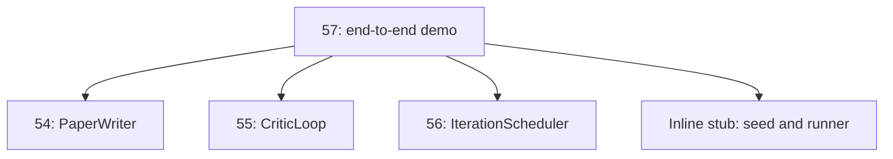
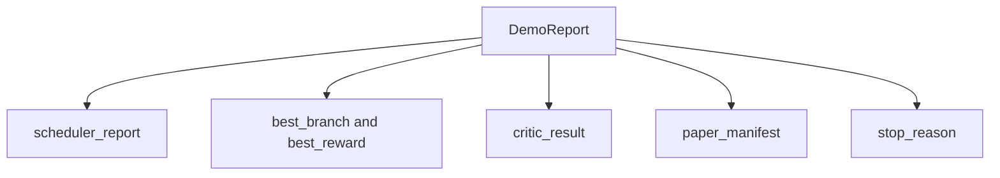

# अंत-से-अंत अनुसंधान डेमो

> डेमो वह जगह है जहां आपके द्वारा पहले लिखे गए हर अनुबंध को लिखना होता है। यदि उनमें से कोई भी लीक हो जाता है, तो डेमो वह सबक है जो इसे पकड़ता है।

**Type:** Build
**Languages:** Python
**Prerequisites:** Phase 19 lessons 50-53
**Time:** ~90 minutes

## सीखने के लक्ष्य

- ऑटो-अनुसंधान लूप अंत से अंत तक वायर करेंः परिकल्पना बीज, प्रयोग धावक, अनुसूचक, आलोचक लूप, पेपर लेखक।
- एक ढांचे के बजाय सादे पायथन आयात के माध्यम से चार पहले ट्रैक डी पाठों से आदिम रचनाएं बनाएं।
- एक स्वयं समाप्त अंत के लिए लूप चलाएं और एक एकल डेमो रिपोर्ट जारी करें जो प्रत्येक चरण के आउटपुट की सूची देता है।
- डेमो निर्धारक बनाए रखें ताकि परीक्षण सूट अंतिम आकार का दावा कर सके।
- किसी भी चरण के अनुबंध टूटने पर स्पष्ट विफलता मोड को सतह पर रखें, ताकि अगले चरण में टूटे हुए इनपुट के साथ नहीं चल सके।

```figure
ch-research-pipeline
```

## यहाँ क्या है


बीज तीन परिकल्पनाओं की एक सूची है। अनुसूचक तीन समानांतर स्लॉट के साथ छह प्रयोग करता है। बस एक या अधिक पेपर ट्रिगर रिपोर्ट करता है। पिकर एकल सर्वश्रेष्ठ परिणाम का चयन करता है। आलोचक लूप उस परिणाम से निर्मित एक मसौदा पर पुनरावृत्ति करता है। पेपर लेखक अंतिम लाटेक्स, बिबेक्स और मैनिफेस्ट जारी करता है।

## कॉपी क्यों नहीं आयात क्यों करें

प्रत्येक प्रारंभिक पाठ एक जहाज `main.py`डेमो में सार्वजनिक डेटा कक्षाओं और कार्यों के साथ आयात किया जाता है।`sys.path`यह फ्रेमवर्क के तार नहीं है; यह पहले के पाठों में पहले से ही उपयोग किए गए परीक्षण फ़ाइलों का आयात है।



इनलाइन स्टब पाठ पचास से पचास-तीन के लिए खड़ा हैः बीज परिकल्पनाओं का एक छोटा जनरेटर और एक सिंक्रोनस इनाम फ़ंक्शन। उपयोगकर्ता दो आयातों को समायोजित करके उन पाठों से वास्तविक आदिमों के लिए इनलाइन स्टब को आदान-प्रदान कर सकता है।

## निर्धारिता की गारंटी

डेमो निर्माण द्वारा निर्धारक है। प्रयोग रनर को नम्पी बीज दिया जाता है। आलोचक लूप का रिवाइज़र निश्चित क्रम में निश्चित आयामों पर चलता है। पेपर लेखक का प्रोसा जनरेटर पाठ पचास-चार से मजाकिया है। अनुसूचक का यूसीबी पिकर पुनरावृत्ति क्रम पर बंधन तोड़ता है, यादृच्छिक विकल्प नहीं।

एक ही बीज दिए जाने पर, डेमो एक ही रिपोर्ट जारी करता है। परीक्षण डेमो को दो बार चलाकर और मैनिफेस्ट की तुलना करके इस गुण का दावा करता है।

## डेमो रिपोर्ट का आकार



प्रत्येक क्षेत्र शब्दशः अपस्ट्रीम स्टेज से आता है। डेमो किसी भी आउटपुट को परिवर्तित नहीं करता है; यह उन्हें बनाता है। यह डेमो का परीक्षण है।

## विफलता मोड संभाल

प्रत्येक चरण या तो सफल होता है या टाइप त्रुटि उत्पन्न करता है।

```text
Scheduler ........ returns SchedulerReport with stop_reason
                   in {queue_empty, max_experiments, deadline}
Best-result pick . raises NoTriggerError if no paper trigger fired
Critic loop ...... returns LoopResult with status converged or stopped
Paper writer ..... raises PaperValidationError on contract break
```

किसी भी चरण में विफलता एक टाइप किए गए अपवाद के साथ डेमो को शॉर्ट सर्किट करती है। परीक्षण इस अनुबंध को पिन करते हैंः `test_no_triggers_raises_typed_error`और `test_best_picker_raises_when_no_triggers`पिकर उठता है`NoTriggerError`/`BestResultError`जब कोई शाखा ट्रिगर नहीं चलाती और लेखक को कभी बुलाया नहीं जाता

## सबसे अच्छा परिणाम लेने वाला

अनुसूचक प्रत्येक शाखा के लिए पेपर ट्रिगर जारी करता है। पिकर सभी ट्रिगरों में उच्चतम औसत पुरस्कार के साथ शाखा का चयन करता है। शाखा आईडी द्वारा सापेक्षता को तोड़ता है इसलिए डेमो निर्धारक है। पिकर एक छोटा सा शुद्ध फ़ंक्शन है; परीक्षण इसे एक निश्चित अनुसूचक रिपोर्ट पर पिन करता है।

## क्रिटिकल लूप को वायरिंग करना

पाठ 55 में आलोचनात्मक लूप एक पर काम करता है `MiniPaper`. डेमो एक बनाता है `MiniPaper`चयनित शाखा से सार को शाखा आईडी से भरकर, दो खंड (प्रस्ताव और परिणाम) को बीज करके, और सेट करके `originality_tag`शाखा के औसत पुरस्कार से (उच्च यदि `>= 0.8`, मध्यम यदि `>= 0.6`, अन्यथा कम) ।

फिर रिवाइजर ड्राफ्ट को अभिसरण में दोहराता है। आउटपुट पेपर लेखक में जाता है।

## पेपर लेखक के लिए तार

पाठ 54 में पेपर लेखक पूर्ण रूप से काम करता है`Paper`आंकड़ों और साहित्य के साथ आकार। डेमो अभिसरण को उन्नत करता है`MiniPaper`द्वारा `mini_to_full_paper`, जो चयनित शाखा के लिए एक आंकड़ा और आलोचक द्वारा सुझाव दिए गए उद्धरण कुंजी के संघ से निर्मित एक छोटी सिंथेटिक ग्रंथ संग्रह को संलग्न करता है। प्रत्येक उद्धरण जोड़ा गया है, वह ग्रंथ संग्रह सूची में भी जोड़ा जाता है, इसलिए सत्यापन पारित होता है।

## कोड कैसे पढ़ें

`code/main.py`परिभाषित करता है `BestResultError`,`NoTriggerError`,`DemoReport`,`pick_best_branch`,`build_mini_paper`,`mini_to_full_paper`और `run_demo`. शीर्ष पर आयात समायोजित `sys.path`एक बार और खींच `PaperWriter`,`CriticLoop`और `IterationScheduler`उनके पाठों से।

`code/tests/test_e2e.py`कवरः डेमो अंत से अंत तक चलता है और सभी पांच क्षेत्रों के साथ एक रिपोर्ट जारी करता है, दो रन में निर्धारित्रता, जब कोई शाखा सीमा पार नहीं करती है, तो कोई शाखा नहीं, पेपर वैलिडेशनError जब लेखक का अनुबंध टूट जाता है, कागज मैनिफेस्ट में चुनी गई शाखा का आंकड़ा होता है, और शेड्यूलर स्टॉप कारण अपेक्षित मानों में से एक है।

## आगे बढ़ना

डेमो हरे रंग में होने के बाद तीन एक्सटेंशन वायर करने लायक हैं। पहला, निरंतर स्थितिः प्रत्येक चरण का परिणाम एक छोटे से JSON स्टोर में लिखता है ताकि सस्ते चरणों को फिर से चलाए बिना पुनरारंभ किया जा सके। दूसरा, एक डैशबोर्डः अनुसूचक और आलोचक लूप से घटनाओं का पता लगाने एक एकल समय रेखा के रूप में प्रस्तुत किया जाता है। तीसरा, वास्तविक मॉडल कॉलः मॉडल-चालित के लिए मजाकिया प्रोसा जनरेटर और निर्धारक आलोचक को बदलें; तार परिवर्तन नहीं करते हैं।

डेमो का काम यह साबित करना है कि रचना वास्तुकला है पांच पाठ, चार आयात, एक रिपोर्ट. अगली बार जब आप एक चरण जोड़ते हैं, तारिंग एक लाइन से बढ़ता है।
