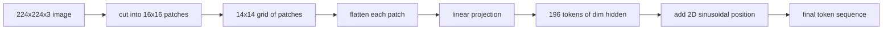

# दृष्टि एन्कोडर पैच

> एक विजन मॉडल जो पिक्सल पढ़ता है, उसे पिक्सल के लिए टोकनाइज़र की आवश्यकता होती है। पैच एम्बेडिंग उस टोकनाइज़र है। छवि को वर्गों के ग्रिड में काटें, प्रत्येक वर्ग को सपाट करें, इसे एक रैखिक परत के माध्यम से प्रोजेक्ट करें, फिर 2D स्थिति संकेत जोड़ें ताकि ट्रांसफार्मर जानता हो कि मूल छवि में प्रत्येक वर्ग कहां बैठा था।

**Type:** Build
**Languages:** Python
**Prerequisites:** Phase 19 lessons 30-37 (Track B foundations)
**Time:** ~90 minutes

## सीखने के लक्ष्य

- पैच एम्बेडमेंट के एक निश्चित लंबाई अनुक्रम में एक छवि को टोकन बनाएं।
- एक `Conv2d`-आधारित पैच प्रोजेक्शन जो कि फॉल्ट-तो-लाइनर के गणित से मेल खाता है।
- एक निर्धारात्मक 2D sinusoidal स्थिति का निर्माण इतना प्रतीकात्मक क्रम अंतरिक्ष स्थिति को कोड एम्बेड।
- पैच की संख्या, एम्बेडिंग आकार की जांच करें, और `Conv2d`/कृत्रिम फिटिंग पर समतुल्यता का विस्तार।

## समस्या

एक ट्रांसफार्मर वेक्टरों के एक अनुक्रम को खाता है। एक छवि एक 3-चैनल ग्रिड है। प्रत्येक पिक्सेल को टोकन के रूप में पढ़ना अनुक्रम की लंबाई को विस्फोट करता हैः एक 224x224 आरजीबी छवि 150,528 टोकन है, जो एक 12-परत ट्रांसफार्मर ध्यान देने के लिए बर्दाश्त नहीं कर सकता है। एक विशाल समतल वेक्टर के रूप में छवि को पढ़ना स्थान को फेंक देता है, जिससे ध्यान परत ठीक नहीं हो सकती है। एन्कोडर फ्रंट एंड का काम पिक्सेल ग्रिड को कुछ सौ टोकन में संपीड़ित करना है जो प्रत्येक वर्ग क्षेत्र का सारांश देते हैं।

पैच एम्बेडिंग एक रैखिक प्रोजेक्शन के साथ इसे हल करता है। 16x16 पैचों में काटा गया 224x224 छवि 196 पैचों की 14x14 ग्रिड का उत्पादन करती है। प्रत्येक पैच को सपाट किया जाता है।`(3, 16, 16) = 768`पिक्सेल एक वेक्टर में मान, तो एक रैखिक परत इसे मॉडल के छिपे आयाम के लिए मैप करता है। ट्रांसफार्मर आयाम के 196 टोकन देखता है `hidden`(आमतौर पर 768) प्लस एक CLS टोकन. यह एक अनुक्रम है कि नेटवर्क के बाकी के चबा सकते हैं।

## अवधारणा



### पिक्सेल क्यों नहीं, पैच क्यों

ध्यान अनुक्रम की लंबाई में चतुर्भुज है। 196 टोकन अनुक्रम लागत `196 * 196 = 38,416`प्रति सिर प्रति परत ध्यान स्कोर; 150,528 टोकन अनुक्रम लागत `150,528 * 150,528 = 22.6 billion`. पैच ध्यान गणना में 590,000 गुना कमी खरीदते हैं, और एक एकल 16x16 क्षेत्र उच्च-स्तरीय दृष्टि कार्यों के लिए पर्याप्त संकेत ले जाता है। लागत एक पैच के अंदर बारीक-खरेदार स्थानिक विवरण का नुकसान है, यही कारण है कि डाउनस्ट्रीम मल्टीमोडल स्टैक अक्सर एक उच्च-रिज़ॉल्यूशन शाखा चलाते हैं जब बारीक स्थानिकरण मायने रखता है।

### एक रैखिक प्रक्षेपण क्यों पर्याप्त है

प्रत्येक पैच को एक स्वतंत्र वेक्टर के रूप में माना जाता है। प्रोजेक्शन एक आधार सीखता हैः किनारे डिटेक्टर, रंग फ़िल्टर, सरल बनावट। एक एकल रैखिक परत छोटी है (`768 * 768 = 589,824`गहरे घुमावदार तख्ता ( "हाइब्रिड" ViT) मौजूद हैं, लेकिन एक सपाट रैखिक प्रक्षेपण मानक है, और अधिकांश आधुनिक खुला-वजन एन्कोडर इस सटीक आकार के साथ जहाज करते हैं।

### `Conv2d`चाल

ए `Conv2d(in_channels=3, out_channels=hidden, kernel_size=patch_size, stride=patch_size)`बिना पैडिंग के समान संख्यात्मक परिणाम देता है जैसे कि फ्लाई-तो-लाइनर, क्योंकि प्रत्येक आउटपुट स्थिति एक फ़िल्टर के खिलाफ पैच पिक्सल को डॉट-प्रोडक्ट करती है। संभलना पैच प्रोजेक्शन है, और अधिकांश उत्पादन कोडबेस इसे इस तरह से भेजते हैं क्योंकि यह GPU पर तेज़ है और एक से कम रीफॉर्म का उपयोग करता है।

### स्थिति सम्मिलित

टोकन प्रोजेक्शन से कोई क्रम नहीं है। 2D sinusidal एम्बेडिंग प्रत्येक टोकन को एक निश्चित संकेत देता है जो उसके कोड करता है।`(row, col)`स्थिति. अर्ध-इम्बेडिंग आयाम कई आवृत्तियों पर sin/cos के साथ पंक्ति स्थिति को कोड करता है; दूसरा आधा कॉलम स्थिति को कोड करता है। एन्कोडिंग निर्धारक है ताकि आप पुनर्व्यवस्थापन के बिना संकल्पों को आदान-प्रदान कर सकें, और यह प्रशिक्षण के समय कभी नहीं देखा गया मॉडल के ग्रिड के लिए साफ-सुथरा इंटरपोलेट करता है।

| Component | Shape | Parameters |
|-----------|-------|------------|
| Patch projection (`Conv2d`) | `(hidden, 3, patch, patch)` | `3 * P * P * hidden + hidden` |
| Position embedding (fixed) | `(num_patches, hidden)` | 0 (computed, not learned) |
| CLS token (learned) | `(1, hidden)` | `hidden` |

224 रिज़ॉल्यूशन पर ViT-Base/16 के लिएः प्रोजेक्शन में 590,592 पैरामीटर, CLS टोकन में 768 और sinusidal स्थिति के लिए शून्य। अगला पाठ (59) इस फ्रंट एंड के ऊपर एक 12-परत ट्रांसफार्मर को ढेर करता है।

### मानसिक स्वास्थ्य जांच के रूप में समतुल्यता

पैच चरण में दो वर्तनी हैः एक `Conv2d`यदि वे नहीं करते हैं, तो अनfold गणित गलत है, और बाकी एन्कोडर रेत पर बनाया गया है। इस पाठ में परीक्षणों का प्रयोग है कि समतुल्यता।

```figure
ch-patch-tokenizer
```

## इसे बनाओ

`code/main.py`कार्य करता हैः

- `PatchEmbed`, एक `nn.Module`पैकिंग `Conv2d`पैच प्रोजेक्शन के लिए।
- `sinusoidal_2d(grid_h, grid_w, dim)`, एक राज्यहीन फ़ंक्शन जो 2D स्थिति तालिका बनाता है।
- `VisionFrontEnd`, जिसमें पैच एम्बेडिंग, CLS प्रीपेन्ड और एक आगे के पास में स्थिति जोड़ शामिल है।
- ए `synthesize_image(seed)`सहायक जो निर्धारक 224x224x3 फिचर्स का निर्माण करता है`numpy.random`. .
- एक डेमो जो सामने के अंत के माध्यम से एक फिक्स्चर छवि चलाता है और आउटपुट आकार, CLS टोकन मानदंड, और स्थिति एम्बेडिंग की एक पंक्ति प्रिंट करता है।

इसे चलाओः

```bash
python3 code/main.py
```

आउटपुटः 224x224 फिक्स्चर को आकार की अनुक्रम में टोकन किया जाता है `(1, 197, 768)`. पहला टोकन CLS है; अगले 196 पैच टोकन हैं। स्थिति एम्बेडिंग मानदंड एक पंक्ति के भीतर समान हैं, जो सिनोसाइडल हस्ताक्षर है।

## इसका प्रयोग करें

एक ही पैच फ्रंट एंड हर आधुनिक दृष्टि-भाषा मॉडल में दिखाई देता हैः क्लिप ViT-L/14, SigLIP, DINOv2, Qwen-VL परिवार, और InternVL स्टैक सभी एक से शुरू होते हैं `Conv2d`पैच प्रोजेक्शन प्लस एक स्थिति संकेत। परिवारों के बीच मतभेद डाउनस्ट्रीम रहते हैं (सीएलएस बनाम कोई सीएलएस पूलिंग, रजिस्टर टोकन, अंतरित स्थितियों के माध्यम से विभिन्न पैच आकार 14 बनाम 16, गतिशील संकल्प) । इस पाठ में फ्रंटेंड सब्सट्रेट है उन मॉडल में से प्रत्येक पर खड़ा है।

## परीक्षण

`code/test_main.py`कवरः

- पैच गिनती मैच `(image_size / patch_size) ** 2`
- आउटपुट आकार मैच `(batch, num_patches + 1, hidden)`
- `Conv2d`प्रोजेक्शन एक छोटे से फिक्स्चर पर मैनुअल-फॉल्ड-तो-रेखीय के बराबर है
- सिनोसाइडल स्थिति तालिका कॉल के बीच निर्धारक है
- सीएलएस टोकन प्रसारण बैच में लीक के बिना धुंधला

उन्हें चलाओः

```bash
python3 -m unittest code/test_main.py
```

## व्यायाम

1. एक शिक्षित के साथ sinusidal स्थिति को बदल `nn.Parameter`और एक छोटे से सिंथेटिक वर्गीकरण कार्य पर पहले युग के नुकसान की तुलना करें। सीखे गए पदों को निश्चित संकल्प पर जीतते हैं; जब आप प्रशिक्षण के बाद संकल्प बदलते हैं तो sinusidal जीतता है।

2. `Conv2d`स्पष्ट रूप से`nn.Unfold`और `nn.Linear`और निष्कर्षों के भीतर फ्लोट सहिष्णुता के अनुरूप होने का दावा. एक ही गणित, दो तरीके इसे वर्तनी करने के लिए.

3. गैर-वर्ग पैच आकारों के लिए समर्थन जोड़ें (उदाहरण के लिए व्यापक-आकार के इनपुट के लिए 32x16) और स्थिति तालिका गैर-वर्ग ग्रिड को संभालती है की पुष्टि करें।

4. पैच चरण को बैच आकार 1, 8, 64 पर प्रोफाइल करें। पैच प्रोजेक्शन शायद ही कभी बोतल की गर्दन है; ध्यान की परतें धारा के नीचे हावी होती हैं।

5. 4 वर्गों के सिंथेटिक आकार डेटासेट (चक्र, वर्ग, त्रिकोण, सितारे) पर फ्रंट एंड को फ्रीज फीचर एक्सट्रैक्टर के रूप में प्रशिक्षित करें। CLS टोकन आउटपुट को रैखिक रूप से अलग करना चाहिए।

## प्रमुख शर्तें

| Term | What it means |
|------|---------------|
| Patch | A square sub-region of the image, typically 14x14 or 16x16 |
| Patch embedding | Linear projection of one flattened patch to the hidden dim |
| Sequence length | Number of tokens after patch tokenization, usually plus CLS |
| Sinusoidal position | Fixed sin/cos signal that encodes 2D grid coordinates |
| CLS token | Learned vector prepended to the sequence as the pooling head |

## आगे पढ़ना

- एक छवि मूल पैच-एम्बेड फ्रेमिंग के लिए 16x16 शब्दों (ViT, 2021) के लायक है।
- ध्यान आपको सिनोसाइडल स्थिति सूत्र के लिए ध्यान देने की जरूरत है (2017) यहाँ 2D के लिए अनुकूलित।
- रजिस्टर टोकन के लिए DINOv2 पेपर, एक विस्तार जिसे आप व्यायाम 6 के रूप में जोड़ सकते हैं।
