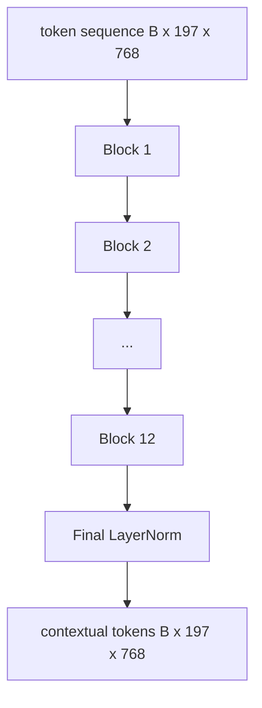
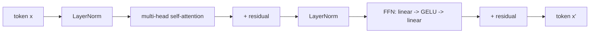

# दृष्टि ट्रांसफार्मर एन्कोडर

> पैच अकेले नहीं देखते हैं। 12 ध्यान सिरों के साथ एक 12-परत प्री-एलएन ट्रांसफार्मर पैच टोकन के अनुक्रम को संदर्भ टोकन के अनुक्रम में बदल देता है, जिसमें सीएलएस टोकन अपनी अंतिम छिपी हुई स्थिति में पूरी छवि सुविधाओं को एक साथ रखता है। यह सबक हर आधुनिक दृष्टि-भाषा मॉडल का इंजन रूम है।

**Type:** Build
**Languages:** Python
**Prerequisites:** Phase 19 lessons 30-37 (Track B foundations)
**Time:** ~90 minutes

## सीखने के लक्ष्य

- एक पूर्व-एलएन ट्रांसफार्मर ब्लॉक को लागू करें जिसमें बहु-हेड स्व-विचार और एक फीड-फॉरवर्ड उप-परत हो।
- 12 सिरों के साथ 12 ब्लॉक को ढेर करके एक वीटी-बेस एन्कोडर बनें।
- पाठ 58 से पैच के सामने के अंत को एन्कोडर में तार और आगे की पास चलाएं।
- सत्यापित करें कि CLS टोकन प्रत्येक पैच से जानकारी एकत्र करता है।

## समस्या

पैच एम्बेडिंग 197 टोकन का एक अनुक्रम उत्पन्न करता है, प्रत्येक एक वेक्टर किसी अन्य पैच के बारे में जागरूक नहीं है। किसी बिल्ली की तस्वीर को यह जानने के लिए कि किस पैच में दाढ़ी है, किसमे पृष्ठभूमि है और किसमे आंख है, हर पैच की जरूरत होती है। ट्रांसफार्मर वह तंत्र है जो उस जागरूकता को बनाता है, एक समय में एक ध्यान परत। इसके बिना, पैच फ्रंट एंड एक समझदार टोकनराइज़र है।

मानक नुस्खा 12 ब्लॉक गहराई, 12 सिर चौड़ाई है, पूर्व-परतमान प्लेसमेंट, GELU सक्रियण, और 4x फ़ीड-फॉरवर्ड विस्तार के साथ। यह नुस्खा क्लिप विटी-एल, सिगलिप, डिनोव2, क्यूवेन-वीएल परिवार, इंटरवीएल और 2025-2026 के अन्य सभी खुले-वजन दृष्टि एन्कोडर का हड्डी है। यह नुस्खा इतना स्थिर है कि आप उन कागजातों में से किसी को भी पढ़ सकते हैं और इस ब्लॉक के आकार को मान सकते हैं जब तक कि वे स्पष्ट रूप से अन्यथा न कहें।

## अवधारणा





### पूर्व-एलएन बनाम पीएलएन

मूल ट्रांसफार्मर ने अवशिष्ट के बाद LayerNorm रखा। प्री-एलएन (प्रत्येक उप-परत के पहले LayerNorm) प्रत्येक आधुनिक दृष्टि-भाषा मॉडल का उपयोग करता है, क्योंकि यह सीखने की दर के वार्मिंग-अप ट्रिक्स के बिना स्थिर रूप से प्रशिक्षित करता है। अंतर आगे के पास में एक रेखा है, और गहराई 12+ पर ग्रेडिएंट प्रवाह रात और दिन है।

### बहु-मुख्य आत्म-विचार

प्रत्येक सिर अपने स्वयं के लिए प्रतीक वेक्टर को प्रक्षेपित करता है `(query, key, value)`आयाम के साथ तीन`head_dim = hidden / num_heads`. के साथ `hidden = 768`और `heads = 12`, प्रत्येक सिर है`dim = 64`. 12 सिर समानांतर में उपस्थित होते हैं, फिर उनके आउटपुट आयाम 768 पर वापस आते हैं और आउटपुट प्रोजेक्शन के माध्यम से गुजरते हैं। मल्टी-हेड का मुद्दा यह है कि एक सिर बिना हस्तक्षेप के "सड़क की आंख की देखभाल करना" सीख सकता है जबकि दूसरा "पृष्ठभूमि ग्रेडिएंट की देखभाल करना" सीख सकता है।

### 4 गुना फ़ीड-फॉरवर्ड विस्तार क्यों

एफएफएन चला जाता है`hidden -> 4 * hidden -> hidden`4. कारक 4 अनुभवजन्य है और 2017 से भाषा और दृष्टि परिवर्तनकों में आयोजित किया गया है। छोटे (2x) कम फिट; बड़े (8x) स्थिर डेटा बजट पर ओवरफिट। एमएलपी वह जगह है जहां मॉडल अपने अधिकांश सीखे गए तथ्यों को संग्रहीत करता है, और व्यापक मध्य वह जगह है जहां वे बैठते हैं।

| Component | Parameters at ViT-Base scale |
|-----------|------------------------------|
| qkv projection per block | `3 * 768 * 768 = 1.77M` |
| output projection per block | `768 * 768 = 590K` |
| FFN per block (4x expansion) | `2 * 768 * 4 * 768 = 4.72M` |
| LayerNorm per block | `4 * 768 = 3K` |
| Total per block | about 7.1M |
| 12 blocks | about 85M |
| Plus front end | about 86M total |

ViT-Base एक 86M पैरामीटर एन्कोडर है। यह 2026 के मानकों द्वारा छोटा है (SigLIP-So400M 400M है, Qwen-VL ViT 675M है), लेकिन चौड़ाई और गहराई तक वास्तुकला समान है।

### कारण मास्क या नहीं?

दृष्टि ट्रांसफार्मर केवल एन्कोडर और द्वि-दिशात्मक हैंः टोकन `i`टोकन में भाग ले सकते हैं `j`पाठ 61 में डिकोडर-साइड क्रॉस-अटेंशन एक कारणात्मक मास्क का उपयोग करेगा, लेकिन दृष्टि कोडर के अंदर, ध्यान पूरी तरह से जुड़ा हुआ है.

### CLS टोकन क्या सीखता है

CLS टोकन एक सीखे गए पैरामीटर के रूप में शुरू होता है, इसमें अपना कोई पैच सामग्री नहीं होती है, और प्रत्येक ब्लॉक पर ध्यान के माध्यम से जानकारी जमा होती है। अंतिम परत द्वारा, CLS पंक्ति पूरी छवि का वेक्टर सारांश है; डाउनस्ट्रीम हेड टेक्स्ट डिकोडर के लिए वर्ग लॉजिट, विपरीत एम्बेडिंग या क्रॉस-अटेंशन कुंजी में इस एकल वेक्टर को प्रोजेक्ट करते हैं।

```figure
ch-cls-funnel
```

## इसे बनाओ

`code/main.py`कार्य करता हैः

- `MultiHeadSelfAttention`, के साथ `qkv`और आउटपुट अनुमान, स्केल-डॉट-उत्पाद ध्यान गणित, और आकार के दावा.
- `FeedForward`, 4x विस्तार GELU MLP.
- `Block`, एक पूर्व-एलएन ब्लॉक जिसमें अवशेषों के साथ ध्यान और फ़ीड-फॉरवर्ड उप-परत शामिल हैं।
- `ViT`, एक अंतिम LayerNorm के साथ 12 ब्लॉक का एक ढेर.
- `VisionEncoder`, कौन सी तार `VisionFrontEnd`पाठ 58 से `ViT`एक `forward()`संदर्भ अनुक्रम और pooled CLS वेक्टर को लौटाकर।
- एक डेमो जो पूर्ण एन्कोडर के माध्यम से संश्लेषित 224x224 फिक्चर छवि चलाता है और प्रत्येक अन्य परत पर इनपुट आकार, आउटपुट आकार, पैरामीटर गिनती और CLS मानदंड प्रिंट करता है।

इसे चलाओः

```bash
python3 code/main.py
```

आउटपुटः फिक्स्चर को ए कोड किया गया है `(1, 197, 768)`CLS मानदंड ऊपर की ओर बढ़ता है के रूप में परतों के निर्माण, फिर स्थिर अंतिम परत मानदंड पर. कुल मापदंडों के बारे में 86M पर रिपोर्ट.

## इसका प्रयोग करें

यहां परिभाषित एन्कोडर चौड़ाई और गहराई तक, वही ब्लॉक स्टैक है जो 2025-2026 में हर ओपन-वेट VLM के अंदर जहाज करता है। अंतर में रहते हैंः

- **Width and depth.**वीआईटी-लार्ज है `hidden=1024, depth=24, heads=16`; सिगलिप सो400एम `hidden=1152, depth=27, heads=16`- एक ही ब्लॉक.
- **Pooling head.**सीएलएस पूलिंग (इस पाठ) बनाम औसत पूलिंग (सिगलिप) बनाम ध्यान पूलिंग (बाद में वीएलएम) ।
- **Position handling.**फिक्स्ड सिनोसोइडल (पाठ 58) बनाम सीखा 1D बनाम ALiBi बनाम 2D RoPE। ब्लॉक गणित अपरिवर्तित है।
- **Register tokens.**DINOv2 4 अतिरिक्त सीखे टोकन प्रीपेन्ड करता है.

इस ब्लॉक स्टैक में सब्सट्रेट है और इसके ऊपर अगले पाठ (60-63) खड़े हैं।

## परीक्षण

`code/test_main.py`कवरः

- एक एकल ब्लॉक आकार को बनाए रखता है और इनपुट बैच आकार के लिए अपरिवर्तनीय है
- ध्यान अंक कुंजी अक्ष के साथ एक के लिए योग (मॉफ्टमैक्स सेनेटरी)
- शेष पथ तारबद्ध हैं (शून्य इनपुट अभी भी CLS टोकन के माध्यम से गैर-शून्य आउटपुट उत्पन्न करता है)
- एक 4-परत आगे ढेर पास सही आकार का उत्पादन करता है
- CLS आउटपुट से पैच प्रोजेक्शन के लिए ग्रेडिएंट प्रवाह

उन्हें चलाओः

```bash
python3 -m unittest code/test_main.py
```

## व्यायाम

1. रजिस्टर टोकन (4 सीएलएस के बाद पूर्वनिर्धारित सीखे गए वेक्टर) जोड़ें और फिर से चलाएं। अंतिम परत पर सॉफ्टमैक्स वितरण की एंट्रॉपी के माध्यम से ध्यान मानचित्र की चिकनाई की तुलना करें।

2. एक सिंथेटिक आकार वर्गीकरणकर्ता पर एक युग के लिए पूर्व-एलएन को पोस्ट-एलएन के लिए बदलें। देखें कि एलआर वार्मिंग के बिना कौन सी ट्रेन स्थिर रूप से चलती है।

3. कारणों से छिपाई को लागू करें `attn_mask`तर्क के रूप में एक ही ब्लॉक को फिर से उपयोग किया जा सकता है एक डिकोडर ब्लॉक.`(seq, seq)`, निचले त्रिकोण।

4.  के साथ बैच आकार 1, 8, 64 पर आगे की पास प्रोफाइल करें`torch.profiler`MLP परत दीवार समय पर हावी है, ध्यान नहीं।

5. एक ध्यान सिर के क्यू-के-वी प्रोजेक्शन को एक निम्न श्रेणी के लोरा एडाप्टर से बदलें, शेष को फ्रीज करें, और सत्यापित करें कि ग्रेडिएंट केवल आपके अपेक्षित स्थान पर बहता है।

## प्रमुख शर्तें

| Term | What it means |
|------|---------------|
| Pre-LN | LayerNorm applied before each sub-layer instead of after |
| Self-attention | Each token attends to every other token in the same sequence |
| Multi-head | The hidden dim is split across `H` independent attention heads |
| FFN expansion | The feed-forward layer widens to `4 * hidden` before contracting |
| CLS pooling | Use the first token's final hidden state as the image summary |

## आगे पढ़ना

- एक छवि को 16x16 शब्दों (ViT, 2021) के लायक है एन्कोडर नुस्खा के लिए।
- रजिस्टर टोकन और स्व-निरीक्षण पूर्व प्रशिक्षण उद्देश्य के लिए DINOv2 (2023)
- सीजीएलआईपी (2023) के लिए औसत-पूलिंग संस्करण और सिग्मोइड कंट्रास्टिव हानि पाठ 62 में उपयोग किया गया।
